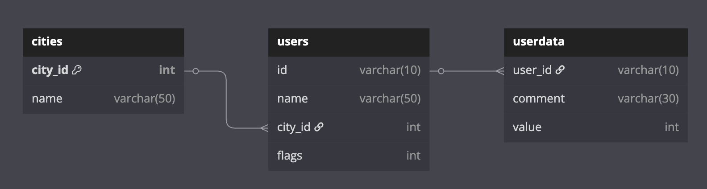
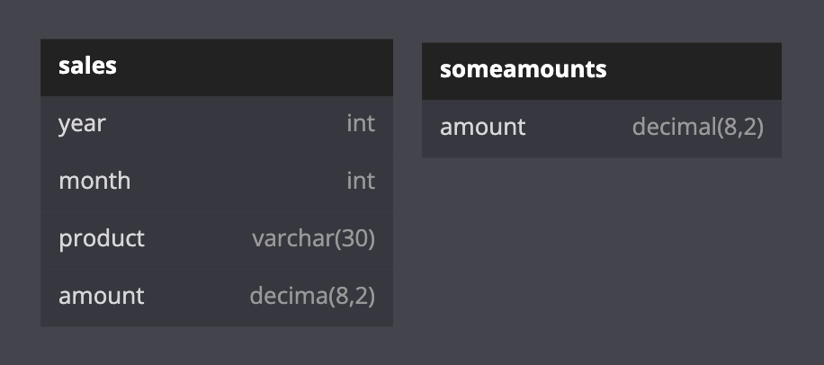
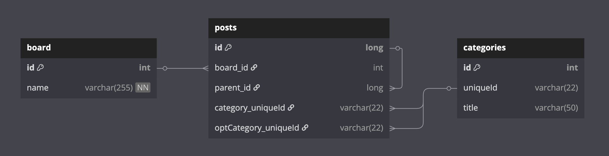
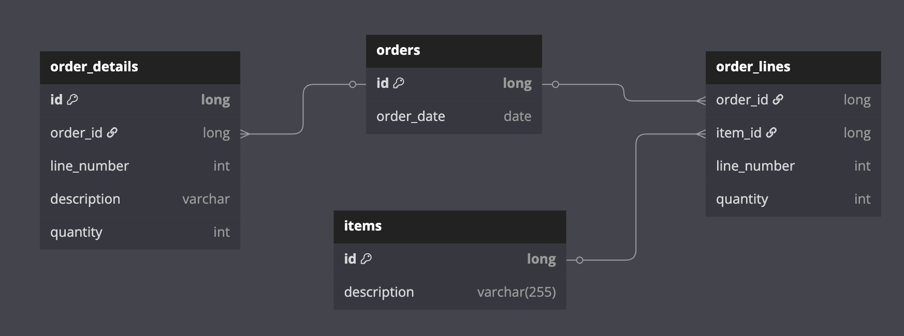
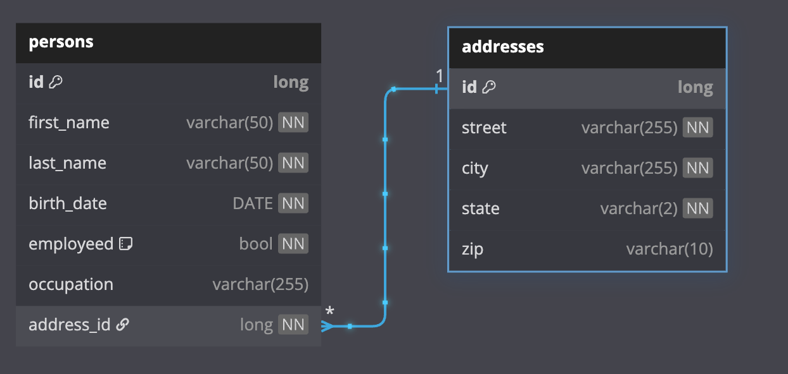
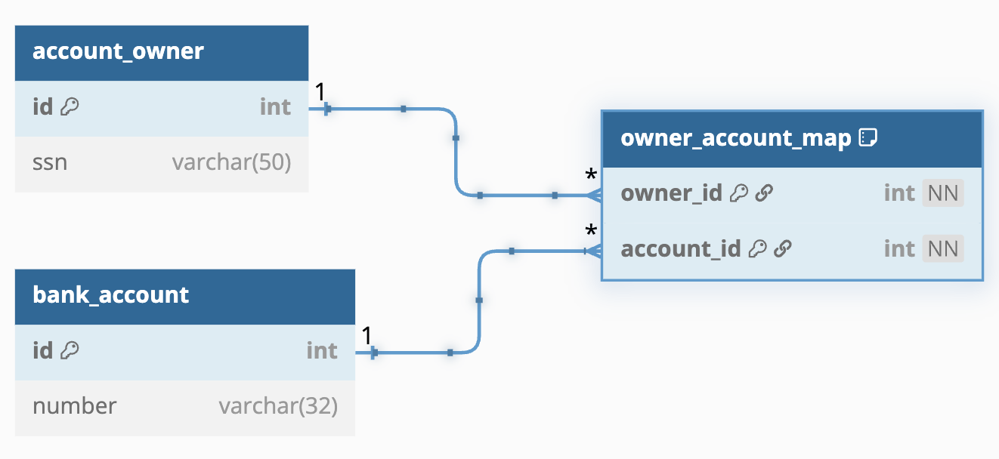
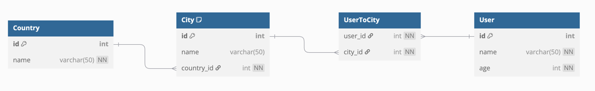

# 00 Shared: Exposed Shared for Tests

This module (`exposed-shared-tests`) serves as a foundational library within the
`exposed-workshop` project, providing a comprehensive suite of shared utilities and resources specifically designed for testing Exposed-based applications and examples. It encapsulates common test infrastructure, making it easier to set up, execute, and verify database interactions across various modules in the workshop.

## Key Components and Functionality:

### 1. Miscellaneous Table Definition (`MiscTable.kt`)

- Defines a versatile `MiscTable` schema with a wide array of column types (e.g., `byte`, `short`, `integer`,
  `enumeration`, `varchar`, `decimal`, `float`, `double`, `char`), including both nullable and non-nullable variations.
- Includes helper functions (`checkRow`,
  `checkInsert`) to facilitate robust testing and verification of data against expected values. This table is ideal for testing diverse data type handling in Exposed.

### 2. Shared Test Utilities (`exposed.shared.tests` package)

- **Base Test Classes**: Provides abstract test classes like `AbstractExposedTest.kt` and
  `JdbcExposedTestBase.kt` to standardize test setup, database connection management, and transaction handling.
- **Database Configuration**:
  `TestDB.kt` defines configurations for various database dialects, enabling tests to run consistently across different RDBMS (e.g., PostgreSQL, H2, MySQL).
- **Test Helpers**: Includes `TestUtils.kt` for general testing utilities and
  `Assert.kt` for custom assertion functions.
- **Resource Management**: Utilities such as `withAutoCommit.kt`, `WithDb.kt`, `WithSchemas.kt`, and
  `WithTables.kt` simplify the management of database sessions, schema creation/dropping, and table setup/teardown within test contexts.
- **Container Integration**: Potentially integrates with Docker containers via
  `Containers.kt` for isolated and reproducible database environments.

### 3. DML Test Data (`exposed.shared.dml` package)

- **Common Data Models**: `DMLTestData.kt` defines standardized table schemas and initial data sets (e.g., `Cities`,
  `Users`, `Sales`, `SomeAmounts`) that are frequently used in DML examples and tests throughout the workshop.
- **Entity-Relationship Diagrams (ERDs)**: Visual representations (e.g., `CityUsersErd.png`,
  `SalesErd.png`) accompanying the data models to provide a clear understanding of the database structure.

**City Users ERD**

**Sales ERD**

### 4. Shared Entity Schemas (`exposed.shared.entities` package)

- **Generic Entity Definitions**: `BoardSchema.kt` defines common entity schemas (e.g., `Boards`, `Posts`,
  `Categories`) that can be reused across different modules, promoting consistency and reducing redundancy.
- **Entity-Relationship Diagrams (ERDs)**: Visual aids (e.g.,
  `BoardSchema.png`) to illustrate the relationships between these entities.

**Board ERD**

### 5. Shared Mapping Schema (`exposed.shared.mapping` package)

**Order Schema ERD**

**Person Schema ERD**

### 6. Shared Repository Schema (`exposed.shared.repository` package)

**Movie Schema ERD**

### 7. Shared Sample Schema (`exposed.shared.samples` package)

**Bank Schema ERD**

**User & Cities Schema ERD**

By centralizing these components, `exposed-shared-tests` ensures that all examples and tests within the
`exposed-workshop` project benefit from a consistent, robust, and easily manageable testing environment.
