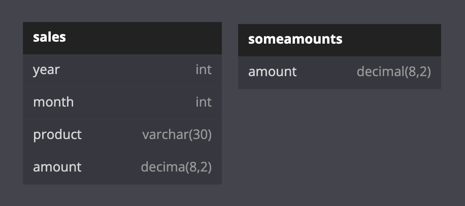
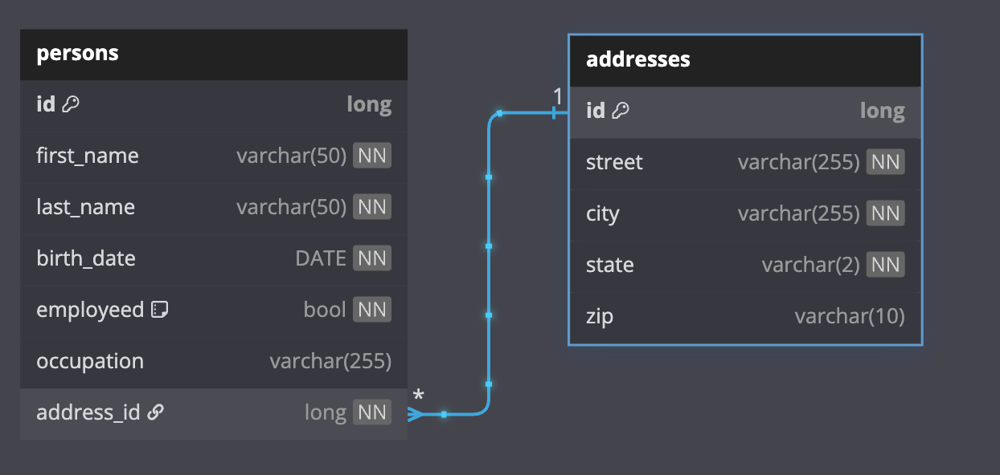
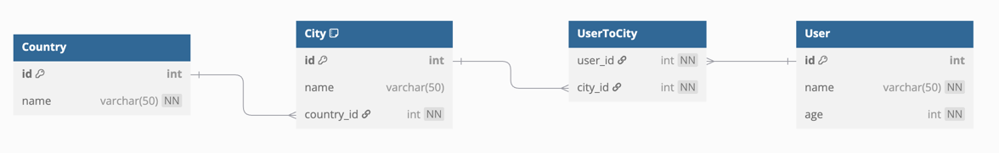

# 00 Shared: Exposed R2DBC Shared for Tests

이 모듈(`exposed-r2dbc-shared`)은
`exposed-r2dbc-workshop` 프로젝트 전반에서 사용되는 공통 테스트 유틸리티와 리소스를 제공합니다. 다양한 데이터베이스 환경에서 일관된 테스트를 수행할 수 있도록 지원합니다.

## 주요 구성 요소

### 1. Miscellaneous 테이블 정의 (`MiscTable.kt`)

- 다양한 컬럼 타입(`byte`, `short`, `integer`, `enumeration`, `varchar`, `decimal`, `float`, `double`, `char`)을 포함한
  `MiscTable` 스키마를 정의합니다.
- nullable과 non-nullable 변형을 모두 지원합니다.
- `checkRow`, `checkInsert` 헬퍼 함수를 제공하여 데이터 검증을 용이하게 합니다.

### 2. 공유 테스트 유틸리티 (`exposed.shared.tests` 패키지)

- **기본 테스트 클래스**: `AbstractExposedTest.kt`, `JdbcExposedTestBase.kt`,
  `R2dbcExposedTestBase.kt` 등 추상 테스트 클래스를 제공하여 테스트 설정, 데이터베이스 연결 관리, 트랜잭션 처리를 표준화합니다.
- **데이터베이스 설정**: `TestDB.kt`에서 다양한 데이터베이스 방언(PostgreSQL, H2, MySQL, MariaDB)에 대한 설정을 정의합니다.
- **테스트 헬퍼**: `TestUtils.kt`, `Assert.kt` 등 일반적인 테스트 유틸리티와 커스텀 assertion 함수를 제공합니다.
- **리소스 관리**: `withAutoCommit.kt`, `WithDb.kt`, `WithSchemas.kt`,
  `WithTables.kt` 등 데이터베이스 세션, 스키마 생성/삭제, 테이블 설정/해제를 간편하게 관리하는 유틸리티를 제공합니다.
- **컨테이너 통합**: `Containers.kt`를 통해 Docker 컨테이너와 통합하여 격리되고 재현 가능한 데이터베이스 환경을 제공합니다.

### 3. DML 테스트 데이터 (`exposed.shared.dml` 패키지)

- **공통 데이터 모델**: `DMLTestData.kt`에서 워크샵 전반에서 자주 사용되는 표준화된 테이블 스키마와 초기 데이터 세트(`Cities`, `Users`, `Sales`,
  `SomeAmounts`)를 정의합니다.
- **ERD 다이어그램**: 데이터 모델의 구조를 명확히 이해할 수 있도록 시각적 표현을 제공합니다.

**City Users ERD**


**Sales ERD**



### 4. 공유 엔티티 스키마 (`exposed.shared.entities` 패키지)

- **범용 엔티티 정의**: `BoardSchema.kt`에서 여러 모듈에서 재사용할 수 있는 공통 엔티티 스키마(`Boards`, `Posts`, `Categories`)를 정의합니다.
- **ERD 다이어그램**: 엔티티 간의 관계를 시각화합니다.

**Board ERD**


### 5. 공유 매핑 스키마 (`exposed.shared.mapping` 패키지)

**Order Schema ERD**


**Person Schema ERD**



### 6. 공유 리포지토리 스키마 (`exposed.shared.repository` 패키지)

**Movie Schema ERD**


### 7. 공유 샘플 스키마 (`exposed.shared.samples` 패키지)

**Bank Schema ERD**


**User & Cities Schema ERD**



---

이러한 구성 요소를 중앙 집중화함으로써 `exposed-r2dbc-shared`는
`exposed-r2dbc-workshop` 프로젝트의 모든 예제와 테스트가 일관되고 견고하며 관리하기 쉬운 테스트 환경을 제공받을 수 있습니다.

---

## AbstractR2dbcExposedTest 사용 예제

```kotlin
class Ex01_Select : AbstractR2dbcExposedTest() {

    companion object : KLoggingChannel()

    @ParameterizedTest
    @MethodSource(ENABLE_DIALECTS_METHOD)
    fun `도시 목록 조회`(testDB: TestDB) = runTest {
        withTables(testDB, DMLTestData.Cities) {
            DMLTestData.Cities.insert { it[name] = "Seoul" }
            DMLTestData.Cities.insert { it[name] = "Busan" }

            val cities = DMLTestData.Cities.selectAll().toList()
            cities shouldHaveSize 2
        }
    }
}
```

---

## withDb vs withTables

| 함수 | 테이블 생성/정리 | 용도 |
|------|----------------|------|
| `withDb(testDB) { }` | 하지 않음 | 이미 존재하는 테이블 또는 스키마 수준 테스트 |
| `withTables(testDB, *tables) { }` | 자동 생성 + 자동 정리 | 격리된 테이블 단위 테스트 (권장) |

`withTables`는 실행 전 `SchemaUtils.create()`로 테이블을 생성하고,
`finally` 블록에서 `SchemaUtils.drop()`으로 정리하여 테스트 간 격리를 보장합니다.

```kotlin
// withDb: 테이블 없이 연결만 열기
withDb(testDB) { testDB ->
    SchemaUtils.create(MyTable)
    // 테이블 생성/정리를 직접 관리해야 함
}

// withTables: 자동 생성 + 자동 정리 (권장)
withTables(testDB, MyTable) {
    MyTable.insert { it[name] = "test" }
    // 테스트 종료 후 MyTable 자동 drop
}
```

---

## 테스트 실행

```bash
# 기본값으로 실행 (H2 + PostgreSQL + MySQL V8)
./gradlew :exposed-r2dbc-00-shared-exposed-r2dbc-shared:test

# H2 계열만 테스트 (빠른 로컬 개발용)
./gradlew :exposed-r2dbc-00-shared-exposed-r2dbc-shared:test -PuseFastDB=true

# 특정 DB 지정
./gradlew :exposed-r2dbc-00-shared-exposed-r2dbc-shared:test -PuseDB=H2,POSTGRESQL
```

### 테스트 대상 DB 선택 옵션

| Gradle 프로퍼티              | 설명                                              |
|----------------------------|--------------------------------------------------|
| `-PuseFastDB=true`         | H2 계열 인메모리 DB만 테스트 (빠른 피드백)           |
| `-PuseDB=<이름,...>`        | 쉼표로 구분하여 테스트할 DB를 직접 지정              |

`-PuseDB`에 사용 가능한 값:

| 값            | 설명                          |
|--------------|------------------------------|
| `H2`         | H2 (인메모리, 기본 모드)         |
| `H2_MYSQL`   | H2 (MySQL 호환 모드)           |
| `H2_MARIADB` | H2 (MariaDB 호환 모드)         |
| `H2_PSQL`    | H2 (PostgreSQL 호환 모드)      |
| `MARIADB`    | MariaDB (Testcontainers)     |
| `MYSQL_V5`   | MySQL 5.x (Testcontainers)   |
| `MYSQL_V8`   | MySQL 8.x (Testcontainers)   |
| `POSTGRESQL` | PostgreSQL (Testcontainers)  |

> [!NOTE]
> 우선순위: `-PuseDB` > `-PuseFastDB` > 기본값 (H2, POSTGRESQL, MYSQL_V8)
