> 한국어 버전: [README.ko.md](README.ko.md)

# 00 Shared: Exposed R2DBC Shared for Tests

The `exposed-r2dbc-shared` module provides common test utilities and resources used across the entire `exposed-r2dbc-workshop` project. It enables consistent testing across various database environments.

## Key Components

### 1. Miscellaneous Table Definitions (`MiscTable.kt`)

- Defines the `MiscTable` schema containing various column types (`byte`, `short`, `integer`, `enumeration`, `varchar`, `decimal`, `float`, `double`, `char`).
- Supports both nullable and non-nullable variants.
- Provides `checkRow` and `checkInsert` helper functions to simplify data validation.

### 2. Shared Test Utilities (`exposed.shared.tests` package)

- **Base Test Classes**: Provides abstract test classes such as `AbstractExposedTest.kt`, `JdbcExposedTestBase.kt`, and `R2dbcExposedTestBase.kt` to standardize test setup, database connection management, and transaction handling.
- **Database Configuration**: `TestDB.kt` defines configurations for various database dialects (PostgreSQL, H2, MySQL, MariaDB).
- **Test Helpers**: Provides general test utilities and custom assertion functions in `TestUtils.kt`, `Assert.kt`, etc.
- **Resource Management**: Utilities such as `withAutoCommit.kt`, `WithDb.kt`, `WithSchemas.kt`, and `WithTables.kt` simplify management of database sessions, schema creation/deletion, and table setup/teardown.
- **Container Integration**: `Containers.kt` integrates with Docker containers via Testcontainers to provide isolated and reproducible database environments.

### 3. DML Test Data (`exposed.shared.dml` package)

- **Common Data Models**: `DMLTestData.kt` defines standardized table schemas and seed data sets (`Cities`, `Users`, `Sales`, `SomeAmounts`) frequently used throughout the workshop.
- **ERD Diagrams**: Provides visual representations of the data model structure for clarity.

**City Users ERD**

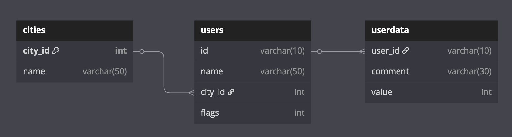

**Sales ERD**

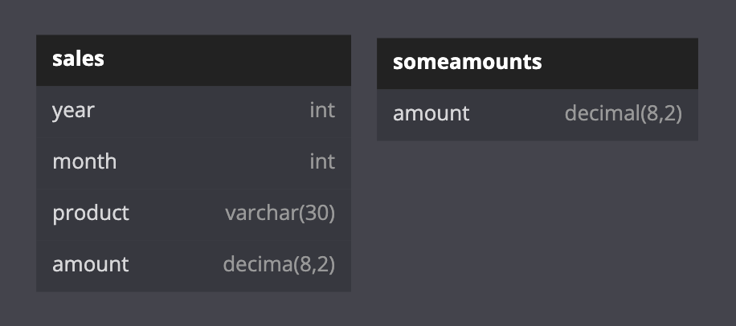

### 4. Shared Entity Schemas (`exposed.shared.entities` package)

- **Reusable Entity Definitions**: `BoardSchema.kt` defines common entity schemas (`Boards`, `Posts`, `Categories`) reusable across multiple modules.
- **ERD Diagrams**: Visualizes the relationships between entities.

**Board ERD**

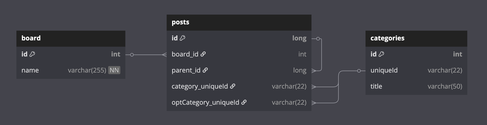

### 5. Shared Mapping Schemas (`exposed.shared.mapping` package)

**Order Schema ERD**

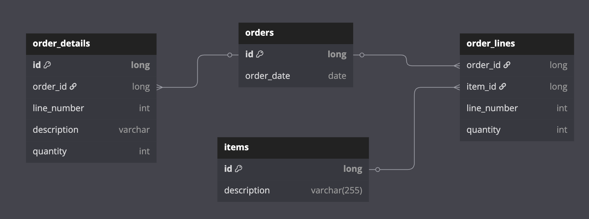

**Person Schema ERD**

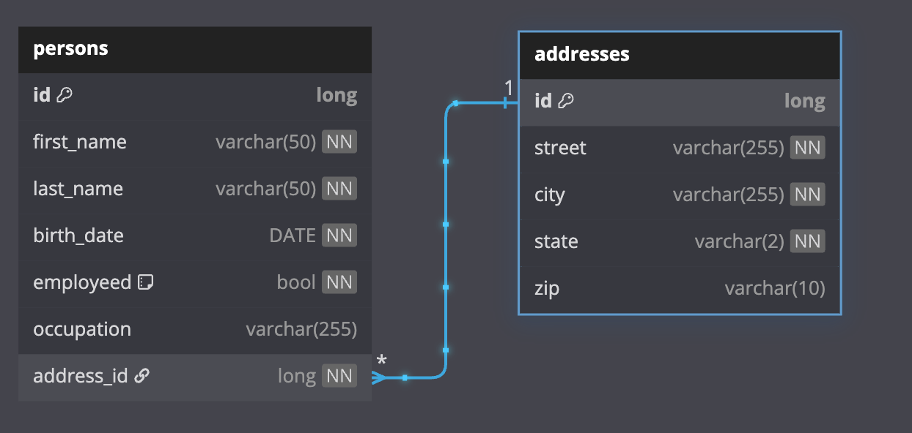

### 6. Shared Repository Schemas (`exposed.shared.repository` package)

**Movie Schema ERD**

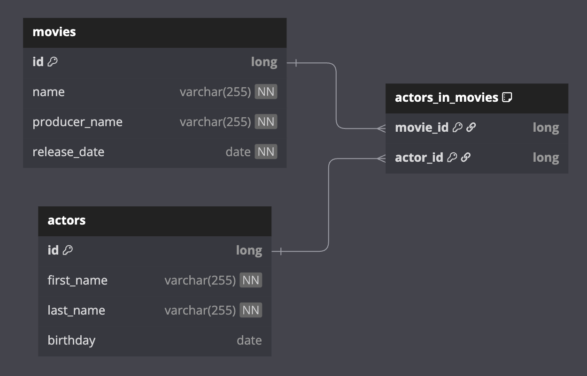

### 7. Shared Sample Schemas (`exposed.shared.samples` package)

**Bank Schema ERD**

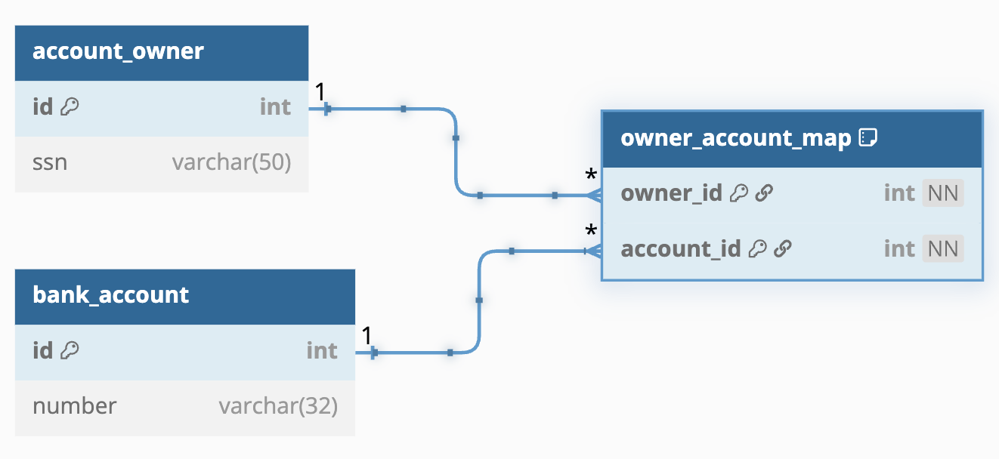

**User & Cities Schema ERD**

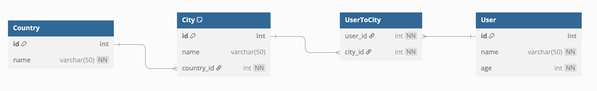

---

By centralizing these components, `exposed-r2dbc-shared` ensures that all examples and tests in the `exposed-r2dbc-workshop` project have a consistent, robust, and easy-to-maintain test environment.

---

## DML Test Data Schema (ERD)

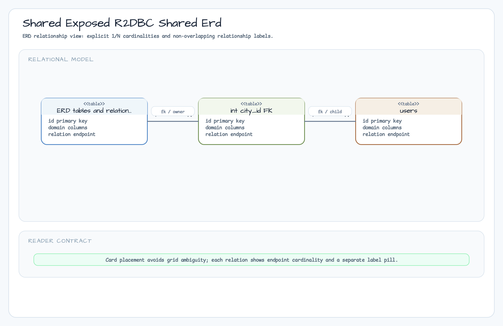

---

## Core Component Structure

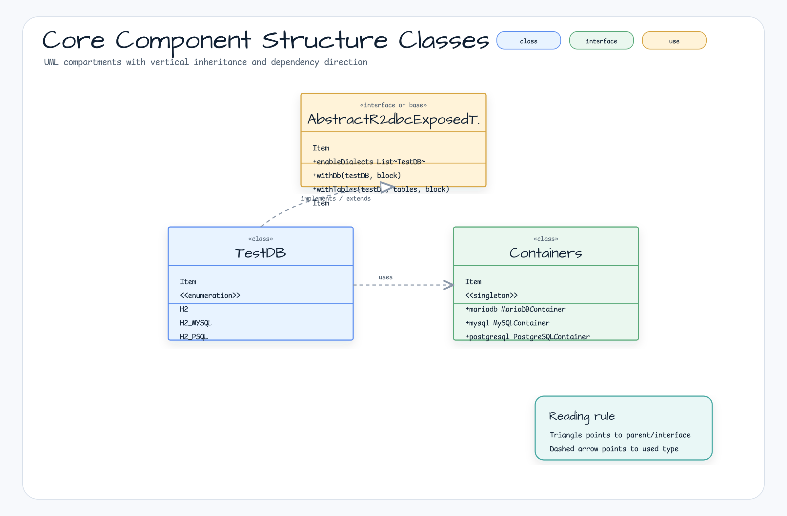

## withTables() Execution Flow

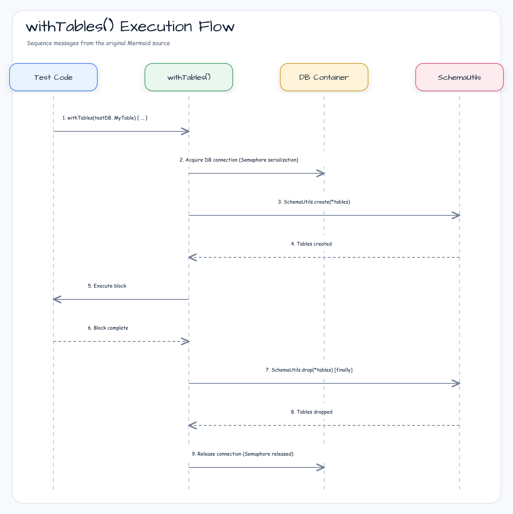

---

## AbstractR2dbcExposedTest Usage Example

```kotlin
class Ex01_Select : AbstractR2dbcExposedTest() {

    companion object : KLoggingChannel()

    @ParameterizedTest
    @MethodSource(ENABLE_DIALECTS_METHOD)
    fun `query list of cities`(testDB: TestDB) = runTest {
        withTables(testDB, DMLTestData.Cities) {
            DMLTestData.Cities.insert { it[name] = "Seoul" }
            DMLTestData.Cities.insert { it[name] = "Busan" }

            val cities = DMLTestData.Cities.selectAll().toList()
            cities shouldHaveSize 2
        }
    }
}
```

---

## withDb vs withTables

| Function | Table Create/Drop | Use Case |
|----------|-------------------|----------|
| `withDb(testDB) { }` | No | Tests against already-existing tables or schema-level tests |
| `withTables(testDB, *tables) { }` | Auto create + auto drop | Isolated per-table tests (recommended) |

`withTables` creates tables via `SchemaUtils.create()` before execution and cleans them up via `SchemaUtils.drop()` in the `finally` block, guaranteeing isolation between tests.

```kotlin
// withDb: open a connection without creating tables
withDb(testDB) { testDB ->
    SchemaUtils.create(MyTable)
    // You must manage table creation/cleanup manually
}

// withTables: auto create + auto drop (recommended)
withTables(testDB, MyTable) {
    MyTable.insert { it[name] = "test" }
    // MyTable is automatically dropped after the test
}
```

---

## Running Tests

```bash
# Run with defaults (H2 + PostgreSQL + MySQL V8)
./gradlew :exposed-r2dbc-00-shared-exposed-r2dbc-shared:test

# Test H2 variants only (for fast local development)
./gradlew :exposed-r2dbc-00-shared-exposed-r2dbc-shared:test -PuseFastDB=true

# Specify a particular DB
./gradlew :exposed-r2dbc-00-shared-exposed-r2dbc-shared:test -PuseDB=H2,POSTGRESQL
```

### DB Selection Options

| Gradle Property          | Description                                          |
|--------------------------|------------------------------------------------------|
| `-PuseFastDB=true`       | Test with H2 in-memory DB only (fast feedback)       |
| `-PuseDB=<name,...>`     | Specify one or more DBs to test (comma-separated)    |

Available values for `-PuseDB`:

| Value        | Description                   |
|--------------|-------------------------------|
| `H2`         | H2 (in-memory, default mode)  |
| `H2_MYSQL`   | H2 (MySQL compatibility mode) |
| `H2_MARIADB` | H2 (MariaDB compatibility mode) |
| `H2_PSQL`    | H2 (PostgreSQL compatibility mode) |
| `MARIADB`    | MariaDB (Testcontainers)      |
| `MYSQL_V5`   | MySQL 5.x (Testcontainers)    |
| `MYSQL_V8`   | MySQL 8.x (Testcontainers)    |
| `POSTGRESQL` | PostgreSQL (Testcontainers)   |

> [!NOTE]
> Priority: `-PuseDB` > `-PuseFastDB` > default (H2, POSTGRESQL, MYSQL_V8)
