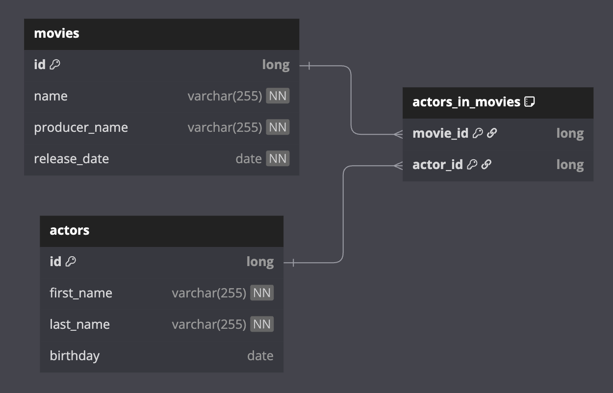

# 00 Shared: Exposed R2DBC Shared for Tests

이 모듈(`exposed-r2dbc-shared`)은
`exposed-r2dbc-workshop` 프로젝트 전반에서 사용되는 공통 테스트 유틸리티와 리소스를 제공합니다. 다양한 데이터베이스 환경에서 일관된 테스트를 수행할 수 있도록 지원합니다.

## 주요 구성 요소

### 1. Miscellaneous 테이블 정의 (`MiscTable.kt`)

- 다양한 컬럼 타입(`byte`, `short`, `integer`, `enumeration`, `varchar`, `decimal`, `float`, `double`, `char`)을 포함한
  `MiscTable` 스키마를 정의합니다.
- nullable과 non-nullable 변형을 모두 지원합니다.
- `checkRow`, `checkInsert` 헬퍼 함수를 제공하여 데이터 검증을 용이하게 합니다.

### 2. 공유 테스트 유틸리티 (`exposed.shared.tests` 패키지)

- **기본 테스트 클래스**: `AbstractExposedTest.kt`, `JdbcExposedTestBase.kt`,
  `R2dbcExposedTestBase.kt` 등 추상 테스트 클래스를 제공하여 테스트 설정, 데이터베이스 연결 관리, 트랜잭션 처리를 표준화합니다.
- **데이터베이스 설정**: `TestDB.kt`에서 다양한 데이터베이스 방언(PostgreSQL, H2, MySQL, MariaDB)에 대한 설정을 정의합니다.
- **테스트 헬퍼**: `TestUtils.kt`, `Assert.kt` 등 일반적인 테스트 유틸리티와 커스텀 assertion 함수를 제공합니다.
- **리소스 관리**: `withAutoCommit.kt`, `WithDb.kt`, `WithSchemas.kt`,
  `WithTables.kt` 등 데이터베이스 세션, 스키마 생성/삭제, 테이블 설정/해제를 간편하게 관리하는 유틸리티를 제공합니다.
- **컨테이너 통합**: `Containers.kt`를 통해 Docker 컨테이너와 통합하여 격리되고 재현 가능한 데이터베이스 환경을 제공합니다.

### 3. DML 테스트 데이터 (`exposed.shared.dml` 패키지)

- **공통 데이터 모델**: `DMLTestData.kt`에서 워크샵 전반에서 자주 사용되는 표준화된 테이블 스키마와 초기 데이터 세트(`Cities`, `Users`, `Sales`,
  `SomeAmounts`)를 정의합니다.
- **ERD 다이어그램**: 데이터 모델의 구조를 명확히 이해할 수 있도록 시각적 표현을 제공합니다.

**City Users ERD**

**Sales ERD**

### 4. 공유 엔티티 스키마 (`exposed.shared.entities` 패키지)

- **범용 엔티티 정의**: `BoardSchema.kt`에서 여러 모듈에서 재사용할 수 있는 공통 엔티티 스키마(`Boards`, `Posts`, `Categories`)를 정의합니다.
- **ERD 다이어그램**: 엔티티 간의 관계를 시각화합니다.

**Board ERD**

### 5. 공유 매핑 스키마 (`exposed.shared.mapping` 패키지)

**Order Schema ERD**

**Person Schema ERD**

### 6. 공유 리포지토리 스키마 (`exposed.shared.repository` 패키지)

**Movie Schema ERD**

### 7. 공유 샘플 스키마 (`exposed.shared.samples` 패키지)

**Bank Schema ERD**

**User & Cities Schema ERD**

---

이러한 구성 요소를 중앙 집중화함으로써 `exposed-r2dbc-shared`는
`exposed-r2dbc-workshop` 프로젝트의 모든 예제와 테스트가 일관되고 견고하며 관리하기 쉬운 테스트 환경을 제공받을 수 있습니다.
