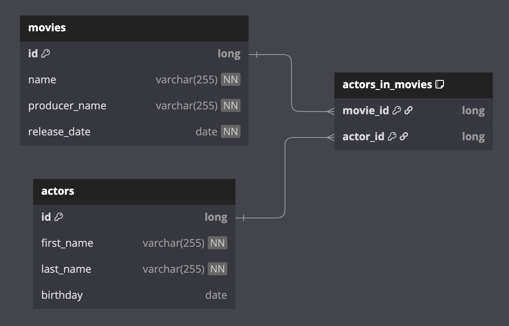

# 01 Spring Boot: Spring WebFlux with Exposed R2DBC

이 모듈(`spring-webflux-exposed`)은 초보자를 위한 **Spring WebFlux + Exposed R2DBC** 예제입니다. 영화와 배우 데이터를 다루며, **비동기 REST API
**를 만드는 흐름을 쉽게 따라갈 수 있도록 구성되어 있습니다.

## 이 모듈에서 배우는 것

- WebFlux 기반의 비동기 API 구조
- Exposed R2DBC로 데이터 저장/조회
- 영화와 배우 **다대다 관계** 모델링
- R2DBC Repository → Controller로 이어지는 기본 구조

## Movie 스키마 (이미지 + 테이블 정의)



아래는 이 모듈에서 사용하는 테이블 정의입니다. 영화/배우는 다대다 관계이며, `actors_in_movies`가 조인 테이블입니다.

```kotlin
object MovieTable: LongIdTable("movies") {
    val name = varchar("name", 255).index()
    val producerName = varchar("producer_name", 255).index()
    val releaseDate = datetime("release_date")
}

object ActorTable: LongIdTable("actors") {
    val firstName = varchar("first_name", 255).index()
    val lastName = varchar("last_name", 255).index()
    val birthday = date("birthday").nullable()
}

object ActorInMovieTable: Table("actors_in_movies") {
    val movieId = reference("movie_id", MovieTable, onDelete = ReferenceOption.CASCADE)
    val actorId = reference("actor_id", ActorTable, onDelete = ReferenceOption.CASCADE)

    override val primaryKey = PrimaryKey(movieId, actorId)
}
```

## 프로젝트 구성 (쉽게 보기)

### 1) 시작점

- `SpringWebfluxApplication.kt`
    - Spring Boot 실행 클래스
    - WebFlux(REACTIVE) 앱으로 설정

### 2) 도메인 모델 (테이블/엔티티)

- `MovieSchema.kt`
    - `MovieTable`, `ActorTable`, `ActorInMovieTable` 정의
    - 영화-배우 다대다 관계를 조인 테이블로 표현
- `MovieEntity`, `ActorEntity`
    - Exposed DAO 엔티티
    - 테이블을 객체로 다루기 위한 클래스
- `MovieRecords.kt`
    - API 응답용 DTO (예: `MovieWithActorRecord`)
- `MovieMappers.kt`
    - `ResultRow`를 DTO로 변환하는 함수 모음

### 3) Repository (비동기 데이터 접근)

- `MovieRepository.kt`
- `ActorRepository.kt`

Exposed 쿼리를 실행하고, `Mono`/`Flux`로 결과를 반환합니다.

### 4) Controller (REST API)

- `MovieController.kt` : 영화 API
- `ActorController.kt` : 배우 API
- `MovieActorsController.kt` : 영화-배우 관계 API
- `IndexController.kt` : 기본 페이지

### 5) 기타 유틸

- `exposed.workshop.springwebflux.utils` 패키지에 보조 함수들이 있습니다.

## 실행 방법 (처음 보는 사람 기준)

1. `src/main/resources/application.yml`에 DB 연결 정보를 설정합니다.
2. Gradle로 빌드합니다.
3. `SpringWebfluxApplication.kt`를 실행합니다.

이 모듈은 **Spring WebFlux에서 Exposed R2DBC 를 어떻게 쓰는지**를 빠르게 감 잡기 위한 예제입니다.
