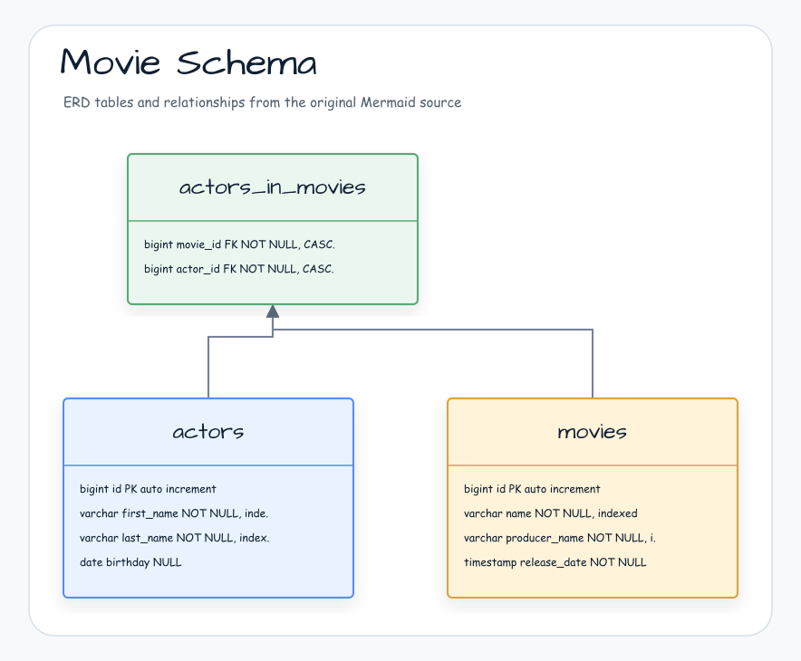
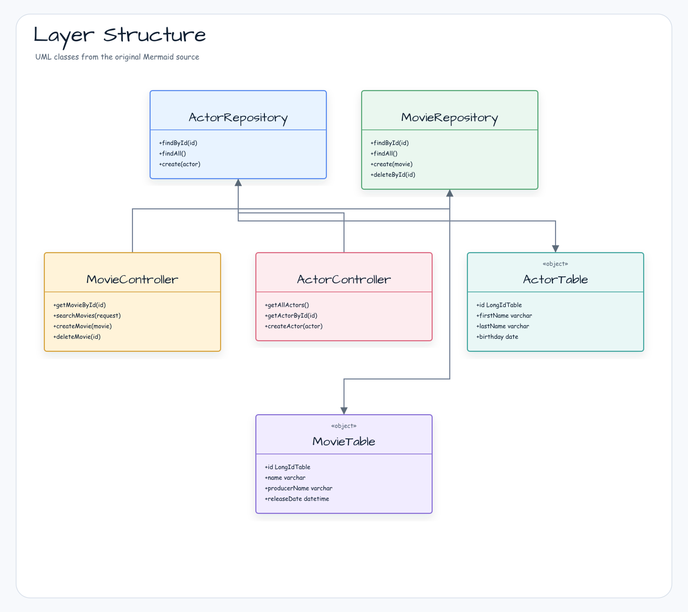
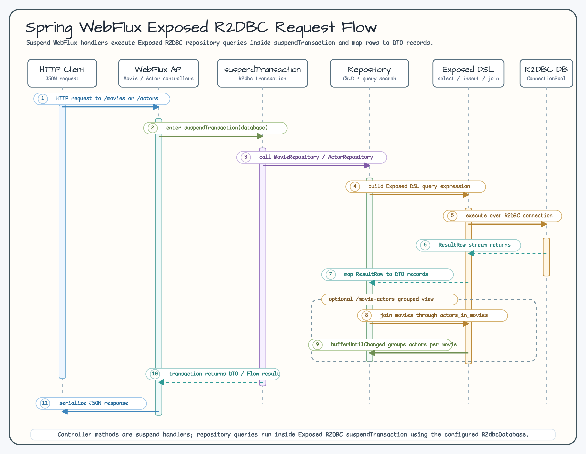

> 한국어 버전: [README.ko.md](README.ko.md)

# 01 Spring Boot: Spring WebFlux with Exposed R2DBC

A beginner-friendly **Spring WebFlux + Exposed R2DBC** example.
Using a Movie and Actor domain, this module teaches you how to build an **asynchronous REST API** with Kotlin Coroutines + Exposed R2DBC.

---

## What You Will Learn

- Asynchronous REST API architecture with Spring WebFlux + Coroutines
- Storing and querying data with the Exposed R2DBC DSL (`suspend` functions, `Flow`)
- Modeling a **many-to-many relationship** between movies and actors with JOIN queries
- Grouping JOIN results with `bufferUntilChanged`
- Switching between multiple databases using Spring Profiles (`h2`, `mysql`, `postgres`)
- Load testing with Gatling

---

## Movie Schema




```kotlin
object MovieSchema {

    object MovieTable: LongIdTable("movies") {
        val name         = varchar("name", 255).index()
        val producerName = varchar("producer_name", 255).index()
        val releaseDate  = datetime("release_date")
    }

    object ActorTable: LongIdTable("actors") {
        val firstName = varchar("first_name", 255).index()
        val lastName  = varchar("last_name", 255).index()
        val birthday  = date("birthday").nullable()
    }

    // Many-to-many join table for movies and actors
    object ActorInMovieTable: Table("actors_in_movies") {
        val movieId = reference("movie_id", MovieTable, onDelete = ReferenceOption.CASCADE)
        val actorId = reference("actor_id", ActorTable, onDelete = ReferenceOption.CASCADE)
        override val primaryKey = PrimaryKey(movieId, actorId)
    }
}
```

---

## Project Structure

```
src/main/kotlin/exposed/r2dbc/workshop/springwebflux/
├── SpringWebfluxApplication.kt                     # Spring Boot application entry point
├── config/
│   ├── ExposedR2dbcConfig.kt                       # R2DBC Database and ConnectionPool configuration
│   ├── NettyConfig.kt                              # Netty server tuning
│   └── SwaggerConfig.kt                            # OpenAPI (Swagger) documentation setup
├── controller/
│   ├── IndexController.kt                          # Build info endpoint (/)
│   ├── MovieController.kt                          # Movie CRUD API (/movies)
│   ├── ActorController.kt                          # Actor CRUD API (/actors)
│   └── MovieActorsController.kt                    # Movie-Actor relationship API (/movie-actors)
├── domain/
│   ├── model/
│   │   ├── MovieSchema.kt                          # Exposed table definitions
│   │   ├── MovieDtos.kt                            # DTOs (MovieRecord, ActorRecord, etc.)
│   │   └── Mappers.kt                              # ResultRow -> DTO extension functions
│   └── repository/
│       ├── MovieRepository.kt                      # Movie repository (suspend + Flow)
│       └── ActorRepository.kt                      # Actor repository (suspend + Flow)
└── utils/
    └── DataInitializer.kt                          # Insert sample data on application startup

src/gatling/kotlin/
├── MovieSimulation.kt                              # Load test for Movie API
├── ActorSimulation.kt                              # Load test for Actor API
└── MovieActorsSimulation.kt                        # Load test for Movie-Actor relationship API
```

---

## Layer Structure



## Spring WebFlux + Exposed R2DBC Integration Flow



1. WebFlux executes `suspend` handlers as coroutines.
2. The Controller wraps repository calls inside `suspendTransaction { }`.
3. The Repository builds queries using the Exposed DSL (`selectAll`, `insert`, `deleteWhere`, etc.).
4. `R2dbcDatabase` manages asynchronous DB connections via `ConnectionPool`.

---

## R2DBC Configuration (`application.yml` + `ExposedR2dbcConfig`)

### application.yml

```yaml
spring:
  profiles:
    default: "h2"    # Choose from: h2 | mysql | postgres

  exposed:
    generate-ddl: true   # Auto-generate DDL on application startup
    show-sql: true       # Enable SQL logging

server:
  port: 8080
  shutdown: graceful     # Enable graceful shutdown

app:
  virtualthread:
    enabled: true        # Enable Java 21 virtual threads
```

### ExposedR2dbcConfig (ConnectionFactory per Profile)

```kotlin
@Configuration
class ExposedR2dbcConfig {

    // H2 in-memory DB (default profile)
    @Bean @Profile("h2")
    fun h2ConnectionFactoryOptions(): ConnectionFactoryOptions =
        ConnectionFactoryOptions.builder()
            .option(ConnectionFactoryOptions.DRIVER, "h2")
            .option(ConnectionFactoryOptions.PROTOCOL, "mem")
            .option(ConnectionFactoryOptions.DATABASE, "test")
            .option(Option.valueOf("DB_CLOSE_DELAY"), "-1")
            .build()

    // PostgreSQL (auto-started via Testcontainers)
    @Bean @Profile("postgres")
    fun postgresConnectionFactoryOptions(): ConnectionFactoryOptions {
        val postgres = PostgreSQLServer.Launcher.postgres
        return ConnectionFactoryOptions.builder()
            .option(ConnectionFactoryOptions.DRIVER, "postgresql")
            .option(ConnectionFactoryOptions.HOST, postgres.host)
            .option(ConnectionFactoryOptions.PORT, postgres.port)
            .option(ConnectionFactoryOptions.USER, postgres.username ?: "test")
            .option(ConnectionFactoryOptions.PASSWORD, postgres.password ?: "test")
            .option(PostgresqlConnectionFactoryProvider.PREPARED_STATEMENT_CACHE_QUERIES, 256)
            .build()
    }

    // MySQL (auto-started via Testcontainers)
    @Bean @Profile("mysql")
    fun mysqlConnectionFactoryOptions(): ConnectionFactoryOptions { ... }

    // ConnectionPool: shared by all profiles
    @Bean @Primary
    fun connectionPool(options: ConnectionFactoryOptions): ConnectionPool =
        ConnectionPool(
            ConnectionPoolConfiguration.builder(ConnectionFactories.get(options))
                .maxIdleTime(Duration.ofMinutes(30))
                .initialSize(5)
                .maxSize(max(availableProcessors * 8, 100))
                .validationQuery("SELECT 1")
                .build()
        )

    // Register Exposed R2dbcDatabase bean
    @Bean
    fun r2dbcDatabase(
        connectionPool: ConnectionPool,
        connectionFactoryOptions: ConnectionFactoryOptions,
        databaseCoroutineDispatcher: CoroutineDispatcher,
    ): R2dbcDatabase {
        val config = R2dbcDatabaseConfig {
            this.dispatcher = databaseCoroutineDispatcher
            this.connectionFactoryOptions = connectionFactoryOptions
        }
        return R2dbcDatabase.connect(connectionPool, config)
    }
}
```

> **Key point**: Each `@Profile` bean (H2/MySQL/PostgreSQL) provides its own `ConnectionFactoryOptions`,
> and the `connectionPool` + `r2dbcDatabase` beans consume them in a shared way.

---

## Core Implementation Patterns

### 1. Repository Based on `suspend` Functions

Exposed R2DBC returns `suspend` functions and `Flow` directly — no need to wrap them in `Mono`/`Flux`.

```kotlin
@Repository
class MovieRepository {

    // Single lookup - suspend
    suspend fun findById(movieId: Long): MovieRecord? =
        MovieTable.selectAll()
            .where { MovieTable.id eq movieId }
            .firstOrNull()
            ?.toMovieRecord()

    // List all - Flow (streaming)
    fun findAll(): Flow<MovieRecord> =
        MovieTable.selectAll().map { it.toMovieRecord() }

    // Create - suspend, returns auto-generated ID via insertAndGetId
    suspend fun create(movie: MovieRecord): MovieRecord {
        val id = MovieTable.insertAndGetId {
            it[name] = movie.name
            it[producerName] = movie.producerName
            if (movie.releaseDate.isNotBlank()) {
                it[releaseDate] = LocalDateTime.parse(movie.releaseDate)
            }
        }
        return movie.copy(id = id.value)
    }

    // Delete - suspend, returns number of affected rows
    suspend fun deleteById(movieId: Long): Int =
        MovieTable.deleteWhere { MovieTable.id eq movieId }
}
```

### 2. Controller Using `suspendTransaction`

All DB access must be performed inside a `suspendTransaction { }` block.
This integrates naturally with WebFlux `suspend` handlers.

```kotlin
@RestController
@RequestMapping("/movies")
class MovieController(
    private val movieRepository: MovieRepository,
) {

    companion object: KLoggingChannel()

    @GetMapping("/{id}")
    suspend fun getMovieById(@PathVariable("id") movieId: Long): MovieRecord? =
        suspendTransaction {
            movieRepository.findById(movieId)
        }

    @GetMapping
    suspend fun searchMovies(request: ServerHttpRequest): List<MovieRecord> {
        val params = request.queryParams.map { it.key to it.value.first() }.toMap()
        return suspendTransaction {
            if (params.isEmpty()) movieRepository.findAll().toList()
            else movieRepository.searchMovie(params).toList()
        }
    }

    @PostMapping
    suspend fun createMovie(@RequestBody movie: MovieRecord): MovieRecord =
        suspendTransaction { movieRepository.create(movie) }

    @DeleteMapping("/{id}")
    suspend fun deleteMovie(@PathVariable("id") movieId: Long): Int =
        suspendTransaction { movieRepository.deleteById(movieId) }
}
```

### 3. Grouping JOIN Results with `bufferUntilChanged`

Groups many-to-many JOIN results by movie. Receives sorted results as a stream and emits a group each time the key changes.

```kotlin
fun getAllMoviesWithActors(): Flow<MovieWithActorRecord> =
    MovieActorJoin
        .select(MovieTable.id, MovieTable.name, ..., ActorTable.id, ...)
        .map { row -> row.toMovieRecord() to row.toActorRecord() }
        .bufferUntilChanged { it.first.id }  // emit when movieId changes
        .mapNotNull { pairs ->
            val movie = pairs.first().first
            val actors = pairs.map { it.second }
            movie.toMovieWithActorRecord(actors)
        }
```

Generated SQL:

```sql
SELECT movies.id, movies."name", movies.producer_name, movies.release_date,
       actors.id, actors.first_name, actors.last_name, actors.birthday
  FROM movies
         INNER JOIN actors_in_movies ON movies.id = actors_in_movies.movie_id
         INNER JOIN actors ON actors.id = actors_in_movies.actor_id
```

### 4. JOIN with Producer-Actor Co-appearance Condition

Pattern for specifying an additional custom condition in the `ON` clause:

```kotlin
private val moviesWithActingProducersJoin: Join by lazy {
    MovieTable
        .innerJoin(ActorInMovieTable)
        .innerJoin(
            ActorTable,
            onColumn = { ActorTable.id },
            otherColumn = { ActorInMovieTable.actorId }
        ) {
            // Additional ON condition: producer name equals actor first name
            MovieTable.producerName eq ActorTable.firstName
        }
}
```

Generated SQL:

```sql
SELECT movies."name", actors.first_name, actors.last_name
  FROM movies
         INNER JOIN actors_in_movies ON movies.id = actors_in_movies.movie_id
         INNER JOIN actors ON actors.id = actors_in_movies.actor_id
                          AND (movies.producer_name = actors.first_name)
```

---

## API Endpoints

### Movies (`/movies`)

| Method   | Path            | Description                              |
|----------|-----------------|------------------------------------------|
| `GET`    | `/movies`       | List all movies (supports query params)  |
| `GET`    | `/movies/{id}`  | Get a single movie by ID                 |
| `POST`   | `/movies`       | Create a movie                           |
| `DELETE` | `/movies/{id}`  | Delete a movie                           |

Query parameter example: `GET /movies?name=Inception&producerName=Nolan`

### Actors (`/actors`)

| Method   | Path            | Description                              |
|----------|-----------------|------------------------------------------|
| `GET`    | `/actors`       | List all actors (supports query params)  |
| `GET`    | `/actors/{id}`  | Get a single actor by ID                 |
| `POST`   | `/actors`       | Create an actor                          |
| `DELETE` | `/actors/{id}`  | Delete an actor                          |

### Movie-Actors (`/movie-actors`)

| Method | Path                             | Description                                    |
|--------|----------------------------------|------------------------------------------------|
| `GET`  | `/movie-actors/{movieId}`        | List actors for a specific movie               |
| `GET`  | `/movie-actors/count`            | Count actors per movie                         |
| `GET`  | `/movie-actors/acting-producers` | List movies where the producer also acts       |

---

## Running the Application

### Default (H2 in-memory)

```bash
./gradlew :spring-webflux-exposed:bootRun
```

### With a Specific Profile

```bash
# PostgreSQL (auto-started via Testcontainers)
./gradlew :spring-webflux-exposed:bootRun --args='--spring.profiles.active=postgres'

# MySQL (auto-started via Testcontainers)
./gradlew :spring-webflux-exposed:bootRun --args='--spring.profiles.active=mysql'
```

### Swagger UI

After starting the application, visit http://localhost:8080/webjars/swagger-ui/index.html to view the API documentation.

---

## Tests

```bash
./gradlew :spring-webflux-exposed:test
```

### Test Structure

```kotlin
// Integration test base class: loads full Spring context with H2 profile
@ActiveProfiles("h2")
@SpringBootTest(
    classes = [SpringWebfluxApplication::class],
    webEnvironment = SpringBootTest.WebEnvironment.RANDOM_PORT,
)
abstract class AbstractSpringWebfluxTest {
    companion object: KLoggingChannel() {
        @JvmStatic
        val faker = Fakers.faker
    }
}
```

### Test List

- **MovieControllerTest** — Integration tests for Movie CRUD API (using `WebTestClient`)
- **ActorControllerTest** — Integration tests for Actor CRUD API
- **MovieActorsControllerTest** — Integration tests for Movie-Actor relationship API
- **MovieRepositoryTest** — Unit tests for Movie repository
- **ActorRepositoryTest** — Unit tests for Actor repository
- **DomainSQLTest** — Domain SQL query validation
- **ConfigurationTest** — Spring configuration load validation

### Load Tests (Gatling)

```bash
# Load test for Movie API
./gradlew :spring-webflux-exposed:gatlingRun-MovieSimulation

# Load test for Actor API
./gradlew :spring-webflux-exposed:gatlingRun-ActorSimulation

# Load test for Movie-Actor relationship API
./gradlew :spring-webflux-exposed:gatlingRun-MovieActorsSimulation
```

---

## References

- [Spring WebFlux](https://docs.spring.io/spring-framework/docs/current/reference/html/web-reactive.html)
- [Kotlin Coroutines Guide](https://kotlinlang.org/docs/coroutines-guide.html)
- [Exposed R2DBC](https://github.com/JetBrains/Exposed)
- [Kotlin Exposed Book](https://debop.notion.site/Kotlin-Exposed-Book-1ad2744526b080428173e9c907abdae2)
