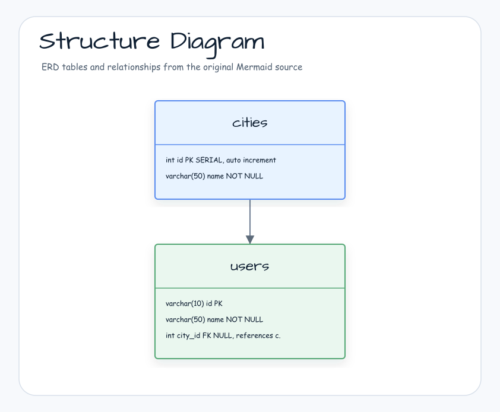
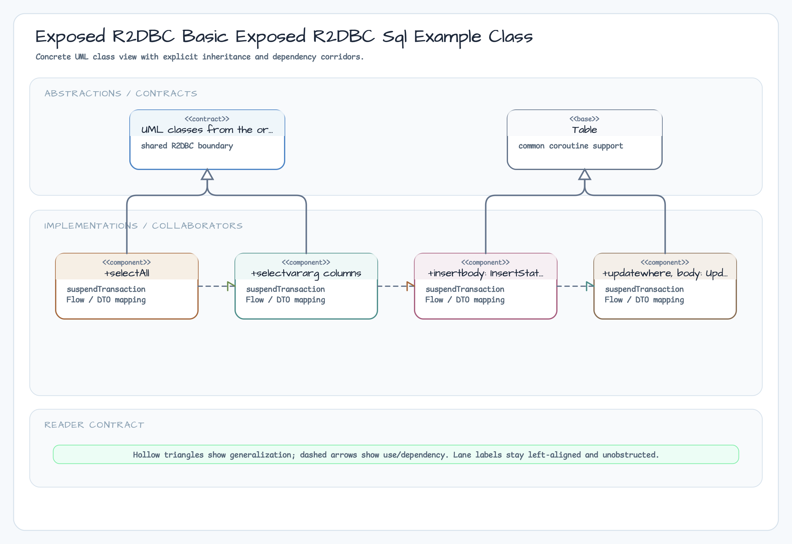
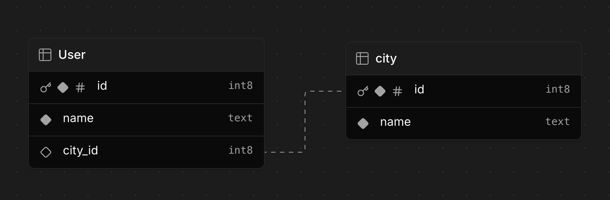
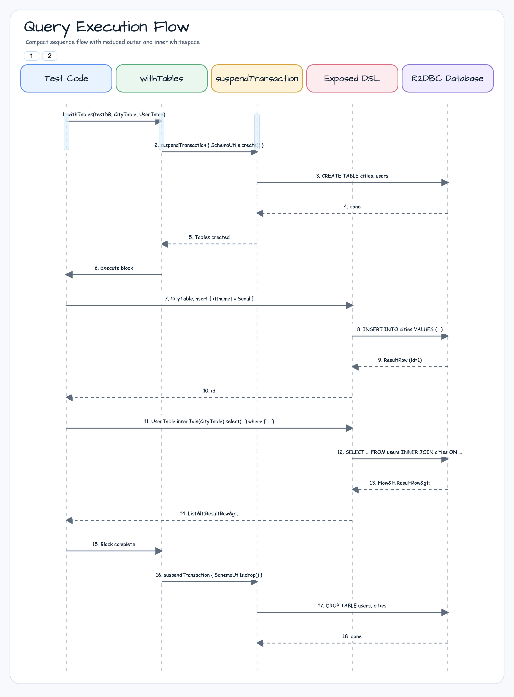

> Korean version: [README.ko.md](README.ko.md)

# 03 Exposed R2DBC SQL Example (SQL DSL Basics)

Learn how to write type-safe queries using the Exposed R2DBC SQL DSL (Domain Specific Language).
Perform SELECT, INSERT, UPDATE, and DELETE asynchronously in an R2DBC environment.

---

## Structure Diagram





---

## Learning Objectives

- Understand how to define tables with the Exposed DSL
- Write type-safe SQL queries (`selectAll`, `insert`, `update`, `deleteWhere`)
- Use different JOIN types (INNER JOIN, LEFT JOIN, etc.)
- Combine multiple conditions with `andWhere` / `orWhere`
- Use `GROUP BY` with aggregate functions
- Understand async query execution patterns in R2DBC (`Flow`, `single`, `toList`)

---

## Example ERD

The ERD used here represents users living in cities. `cities` and `users` have a 1:N relationship.



---

## Table Definitions

### CityTable

`CityTable` defines the `cities` table. The `id` column is auto-incremented and set as the primary key.

```kotlin
object CityTable: Table("cities") {
    val id = integer("id").autoIncrement()
    val name = varchar("name", length = 50)

    override val primaryKey = PrimaryKey(id, name = "PK_Cities_ID")
}
```

Generated DDL:

```sql
-- PostgreSQL
CREATE TABLE IF NOT EXISTS cities (
    id   SERIAL,
    "name" VARCHAR(50) NOT NULL,
    CONSTRAINT PK_Cities_ID PRIMARY KEY (id)
)
```

### UserTable

`UserTable` defines the `users` table. The `id` is a varchar primary key and `cityId` is a nullable foreign key referencing `CityTable.id`.

```kotlin
object UserTable: Table("users") {
    val id = varchar("id", length = 10)
    val name = varchar("name", length = 50)
    val cityId = optReference("city_id", CityTable.id)   // nullable foreign key

    override val primaryKey = PrimaryKey(id, name = "PK_User_ID")
}
```

Generated DDL:

```sql
CREATE TABLE IF NOT EXISTS users (
    id        VARCHAR(10),
    "name"    VARCHAR(50) NOT NULL,
    city_id   INT NULL,
    CONSTRAINT PK_User_ID PRIMARY KEY (id),
    CONSTRAINT fk_users_city_id__id FOREIGN KEY (city_id)
        REFERENCES cities(id) ON DELETE RESTRICT ON UPDATE RESTRICT
)
```

---

## Query Patterns

### INSERT — Using Functional Column Expressions

In addition to plain values, you can use SQL functions as column values.

```kotlin
// Plain INSERT
val seoulId = CityTable.insert {
    it[name] = "Seoul"
} get CityTable.id

// Using a SQL function as a value: INSERT INTO cities ("name") VALUES (SUBSTRING(TRIM('   Daegu   '), 1, 2))
val daeguId = CityTable.insert {
    it.update(name, stringLiteral("   Daegu   ").trim().substring(1, 2))
}[CityTable.id]
```

### UPDATE — Conditional Update

```kotlin
// UPDATE users SET "name" = 'Alexey' WHERE users.id = 'alex'
UserTable.update({ UserTable.id eq "alex" }) {
    it[name] = "Alexey"
}

// Verify the update
UserTable
    .selectAll()
    .where { UserTable.id eq "alex" }
    .single()[UserTable.name] shouldBeEqualTo "Alexey"
```

### DELETE — Conditional Delete

```kotlin
// DELETE FROM users WHERE users."name" LIKE '%thing'
val affectedCount = UserTable.deleteWhere { UserTable.name like "%thing" }
affectedCount shouldBeEqualTo 1
```

---

## JOIN Examples by Type

### INNER JOIN — Auto JOIN via Foreign Key

When a foreign key is declared with `optReference`, Exposed automatically generates the ON clause.

```kotlin
// SELECT users."name", users.city_id, cities."name"
//   FROM users INNER JOIN cities ON cities.id = users.city_id
//  WHERE (cities."name" = 'Busan') OR (users.city_id IS NULL)
UserTable
    .innerJoin(CityTable)
    .select(UserTable.name, UserTable.cityId, CityTable.name)
    .where { CityTable.name eq "Busan" }
    .orWhere { UserTable.cityId.isNull() }
    .collect {
        if (it[UserTable.cityId] != null) {
            log.info { "${it[UserTable.name]} lives in ${it[CityTable.name]}" }
        } else {
            log.info { "${it[UserTable.name]} lives nowhere" }
        }
    }
```

### INNER JOIN — Adding Manual Join Conditions

You can specify additional WHERE conditions beyond the foreign key ON clause using `andWhere`.

```kotlin
// SELECT users."name", cities."name"
//   FROM users INNER JOIN cities ON cities.id = users.city_id
//  WHERE ((users.id = 'debop') OR (users."name" = 'Jane.Doe'))
//    AND (users.id = 'jane')
//    AND (users.city_id = cities.id)
UserTable
    .innerJoin(CityTable)
    .select(UserTable.name, CityTable.name)
    .where { (UserTable.id eq "debop") or (UserTable.name eq "Jane.Doe") }
    .andWhere { UserTable.id eq "jane" }
    .andWhere { UserTable.cityId eq CityTable.id }   // manual join condition
    .collect { ... }
```

### GROUP BY + Aggregate Functions

Combine `count()` aggregation with `groupBy` + `orderBy` to count users per city.

```kotlin
// SELECT cities."name", COUNT(users.id)
//   FROM cities INNER JOIN users ON cities.id = users.city_id
//  GROUP BY cities."name"
//  ORDER BY cities."name"
val query = CityTable.innerJoin(UserTable)
    .select(CityTable.name, UserTable.id.count())
    .groupBy(CityTable.name)
    .orderBy(CityTable.name)

query.collect {
    val cityName = it[CityTable.name]
    val userCount = it[UserTable.id.count()]
    log.info { "$cityName has $userCount users" }
}
```

### `andWhere` — Multiple AND Conditions

```kotlin
// SELECT users."name", cities."name"
//   FROM users INNER JOIN cities ON cities.id = users.city_id
//  WHERE cities."name" = 'Busan'
//    AND users."name" LIKE 'J%.Doe'
//  ORDER BY users."name"
val names = UserTable
    .innerJoin(CityTable)
    .select(UserTable.name, CityTable.name)
    .where { CityTable.name eq "Busan" }
    .andWhere { UserTable.name like "J%.Doe" }
    .orderBy(UserTable.name)
    .map { it[UserTable.name] }
    .toList()

names shouldBeEqualTo listOf("Jane.Doe", "John.Doe")
```

---

## Query Execution Flow



---

## Running Tests

```bash
# Run all tests in this module
./gradlew :exposed-r2dbc-sql-example:test

# Use H2 only (fast development iteration)
USE_FAST_DB=true ./gradlew :exposed-r2dbc-sql-example:test

# Run a specific test class
./gradlew :exposed-r2dbc-sql-example:test --tests "exposed.r2dbc.sql.example.R2dbcExposedSQLExample"
```

### Test Pattern

All tests extend `AbstractR2dbcExposedTest` and run across multiple databases via `@ParameterizedTest`.

```kotlin
class R2dbcExposedSQLExample: AbstractR2dbcExposedTest() {

    companion object: KLoggingChannel()

    @ParameterizedTest
    @MethodSource(ENABLE_DIALECTS_METHOD)
    fun `query with multiple AND conditions using andWhere`(testDB: TestDB) = runSuspendIO {
        withCityUsers(testDB) {
            // Execute Exposed DSL inside a transaction context
            val names = UserTable
                .innerJoin(CityTable)
                .select(UserTable.name, CityTable.name)
                .where { CityTable.name eq "Busan" }
                .andWhere { UserTable.name like "J%.Doe" }
                .map { it[UserTable.name] }
                .toList()

            names shouldBeEqualTo listOf("Jane.Doe", "John.Doe")
        }
    }
}
```

Default active DBs: H2, PostgreSQL, MySQL V8, MariaDB (`USE_FAST_DB=false`)
When `USE_FAST_DB=true`, only H2 in-memory is used (for fast iteration during development).

---

## References

- [Exposed DSL Guide](https://github.com/JetBrains/Exposed/wiki/DSL)
- [Kotlin Exposed Book](https://debop.notion.site/Kotlin-Exposed-Book-1ad2744526b080428173e9c907abdae2)
