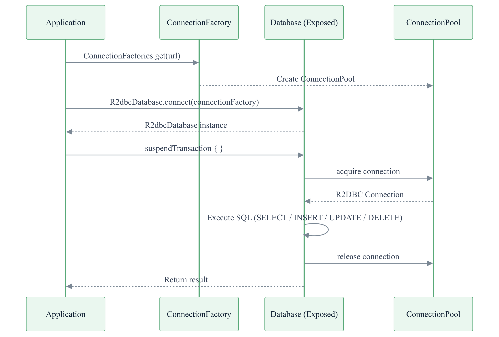
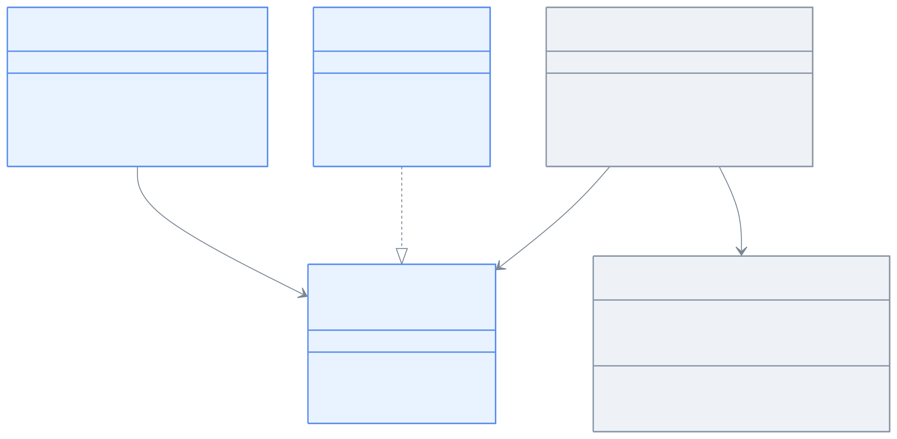

> 한국어 버전: [README.ko.md](README.ko.md)

# 01 Connection Management

Learn how to configure database connections, query connection metadata, and use connection pooling with Exposed R2DBC.

---

## Learning Objectives

- Configure an R2DBC database connection with `R2dbcDatabase.connect(url)`
- Query column metadata and table constraints via the `connection().metadata { }` API
- Activate the built-in connection pool using the `r2dbc:pool:` URL scheme
- Verify connection reuse behavior when concurrent `suspendTransaction` calls exceed pool size

---

## Technology Stack

| Category  | Technology                                              |
|-----------|---------------------------------------------------------|
| ORM       | Exposed R2DBC DSL                                       |
| Async     | Kotlin Coroutines                                       |
| DB        | H2 (default), MariaDB, MySQL 8, PostgreSQL              |
| Container | Testcontainers                                          |
| Testing   | JUnit 5 + bluetape4k-assertions + ParameterizedTest (multi-DB support) |

---

## Execution Flow



> Using the `r2dbc:pool:h2:mem:///poolDB?maxSize=10` URL scheme automatically activates `ConnectionPool`.
> Concurrent `suspendTransaction` requests that exceed the pool size wait until a connection is returned and then reuse it.

---

## Project Structure

```
src/test/kotlin/exposed/r2dbc/examples/connection/
├── Ex01_Connection.kt            # Column metadata and table constraint queries
└── h2/
    ├── Ex01_H2_ConnectionPool.kt # H2 R2DBC connection pool behavior verification
    └── Ex02_H2_MultiDatabase.kt  # H2 multi-database connections
```

---

## Connection Class Hierarchy



---

## Example Details

### `Ex01_Connection` — Metadata Queries

Read table column and constraint information from an R2DBC connection via the `connection().metadata { }` API.

#### Table Definition

```kotlin
object People: LongIdTable() {
    val firstName: Column<String?> = varchar("firstname", 80).nullable()
    val lastName: Column<String>   = varchar("lastname", 42).default("Doe")
    val age: Column<Int>           = integer("age").default(18)
}
```

#### Column Metadata Query

```kotlin
withTables(TestDB.H2, People) {
    val columnMetadata = connection().metadata {
        columns(People)[People]!!
    }.toSet()

    // Expected ColumnMetadata: id(BIGINT), firstName(VARCHAR 80, nullable),
    //                          lastName(VARCHAR 42, default="Doe"), age(INT, default=18)
    columnMetadata shouldContainSame expected
}
```

#### Table Constraint Query

```kotlin
withTables(testDB, parent, child) {
    val constraints = connection().metadata {
        tableConstraints(listOf(child))
    }
    // Returns 2 keys: parent(unique), child(FK -> parent.scale)
    constraints.keys shouldHaveSize 2
}
```

---

### `Ex01_H2_ConnectionPool` — H2 Connection Pool

Using the `r2dbc:pool:h2:mem:///` URL scheme automatically activates the R2DBC built-in connection pool.

```kotlin
private val h2PoolDB1 by lazy {
    R2dbcDatabase.connect("r2dbc:pool:h2:mem:///poolDB1?maxSize=10")
}
```

#### Verifying Connection Reuse When Pool Size Is Exceeded

```kotlin
@Test
fun `suspend transactions exceeding pool size`() = runSuspendIO {
    suspendTransaction(db = h2PoolDB1) {
        SchemaUtils.create(TestTable)
    }

    val exceedsPoolSize = (maximumPoolSize * 2 + 1).coerceAtMost(50)

    val jobs = List(exceedsPoolSize) { index ->
        launch {
            suspendTransaction(db = h2PoolDB1) {
                delay(100)
                TestTable.insertAndGetId { it[TestTable.testValue] = "test$index" }
            }
        }
    }
    jobs.joinAll()

    // Even when pool size (10) is exceeded, connections are reused and all inserts complete
    suspendTransaction(db = h2PoolDB1) {
        TestTable.selectAll().count() shouldBeEqualTo exceedsPoolSize.toLong()
        SchemaUtils.drop(TestTable)
    }
}
```

---

## Supported DBs and R2DBC URL Formats

| Database       | R2DBC URL Format                         | Pool Support                  |
|----------------|------------------------------------------|-------------------------------|
| H2 in-memory   | `r2dbc:h2:mem:///dbname`                 | `r2dbc:pool:h2:...`           |
| PostgreSQL     | `r2dbc:postgresql://host/dbname`         | `r2dbc:pool:postgresql:...`   |
| MySQL          | `r2dbc:mysql://host/dbname`              | `r2dbc:pool:mysql:...`        |
| MariaDB        | `r2dbc:mariadb://host/dbname`            | `r2dbc:pool:mariadb:...`      |

---

## Running Tests

```bash
# Run all tests in this module
./gradlew :01-connection:test

# Fast test with H2 only
./gradlew :01-connection:test -PuseFastDB=true

# Run specific tests
./gradlew :01-connection:test --tests "exposed.r2dbc.examples.connection.Ex01_Connection"
./gradlew :01-connection:test --tests "exposed.r2dbc.examples.connection.h2.Ex01_H2_ConnectionPool"
```

---

## H2 In-Memory vs File DB Connection Differences

| Aspect          | In-Memory (mem)                  | File (file)                      |
|-----------------|----------------------------------|----------------------------------|
| URL Format      | `r2dbc:h2:mem:///dbname`         | `r2dbc:h2:file:///path/to/db`    |
| Data Persistence | Lost when JVM exits             | Permanently stored on disk       |
| `DB_CLOSE_DELAY` | `-1` (keep connection alive)   | Not needed                       |
| Test Isolation  | High (independent per name)      | Low (file can be shared)         |
| Recommended For | Unit tests, examples             | Temporary integration tests      |

```kotlin
// In-memory (recommended for tests)
R2dbcDatabase.connect("r2dbc:h2:mem:///mydb;DB_CLOSE_DELAY=-1;")

// Connection pool + in-memory
R2dbcDatabase.connect("r2dbc:pool:h2:mem:///mydb?maxSize=10")

// File DB (persistent storage)
R2dbcDatabase.connect("r2dbc:h2:file:///tmp/mydb")
```

---

## References

- [R2DBC Specification](https://r2dbc.io/)
- [Exposed R2DBC Guide](https://github.com/JetBrains/Exposed)
- [Kotlin Exposed Book](https://debop.notion.site/Kotlin-Exposed-Book-1ad2744526b080428173e9c907abdae2)
