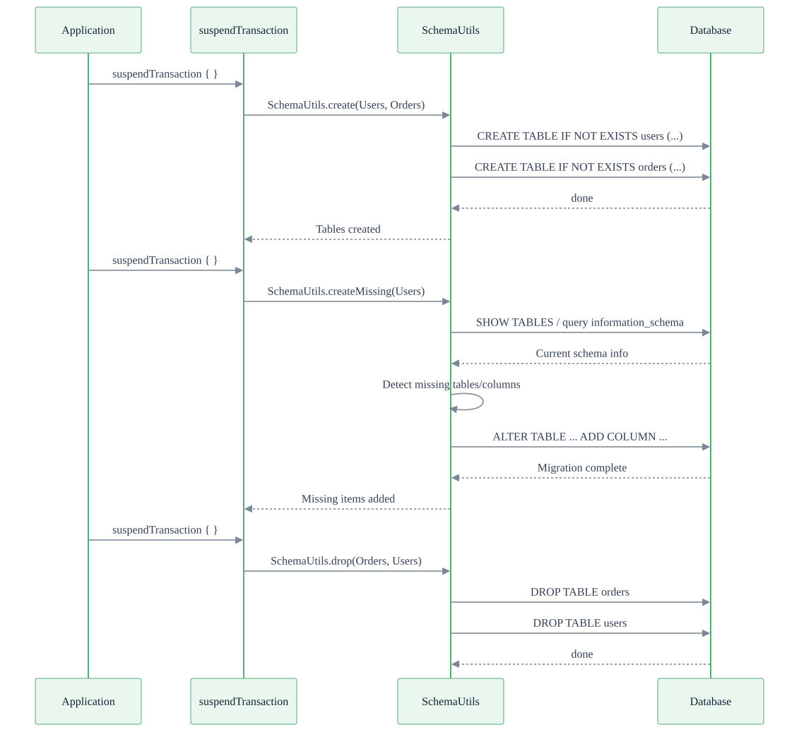

> 한국어 버전: [README.ko.md](README.ko.md)

# 02 Schema Definition Language (DDL)

Learn how to define and manage database schemas with Exposed R2DBC. Perform DDL operations such as table creation, modification, and deletion asynchronously.

---

## Learning Objectives

- Understand how to define tables with the Exposed DSL
- Define various column types and constraints
- Index strategies and sequence creation
- Schema migration strategies (`MigrationUtils.statementsRequiredForDatabaseMigration`, `execInBatch`)
- DDL execution patterns in an R2DBC environment

---

## Technology Stack

| Category  | Technology                                              |
|-----------|---------------------------------------------------------|
| ORM       | Exposed R2DBC DSL                                       |
| Async     | Kotlin Coroutines                                       |
| DB        | H2 (default), MariaDB, MySQL 8, PostgreSQL              |
| Container | Testcontainers                                          |
| Testing   | JUnit 5 + bluetape4k-assertions + ParameterizedTest (multi-DB support) |

---

## Structure Diagram





---

## Sample Table ERD (Users / Orders / Products)



---

## Schema Migration Flow



---

## Project Structure

```
src/test/kotlin/exposed/r2dbc/examples/ddl/
├── Ex01_CreateDatabase.kt             # Database connection and creation
├── Ex02_CreateTable.kt                # Table creation (SchemaUtils.create)
├── Ex03_CreateMissingTableAndColumns.kt # Auto-add missing tables and columns (MigrationUtils)
├── Ex04_ColumnDefinition.kt           # Various column type definitions
├── Ex05_CreateIndex.kt                # Index creation strategies
├── Ex06_Sequence.kt                   # Sequence creation and usage
├── Ex07_CustomEnumeration.kt          # Custom enumeration columns
└── Ex10_DDL_Examples.kt               # Comprehensive DDL examples
```

---

## Core Concepts

### Table Definition

Exposed provides a DSL for defining tables in a type-safe manner.

```kotlin
object Users: IntIdTable("users") {
    val name = varchar("name", 255)
    val email = varchar("email", 255).uniqueIndex()
    val createdAt = timestamp("created_at").defaultExpression(CurrentTimestamp)
    val isActive = bool("is_active").default(true)
}
```

---

### Column Type Mapping (Kotlin DSL -> SQL)

#### Numeric Types

| Exposed DSL          | Kotlin Type    | H2 / PostgreSQL    | MySQL / MariaDB     |
|----------------------|----------------|--------------------|---------------------|
| `byte("col")`        | `Byte`         | `TINYINT`          | `TINYINT`           |
| `short("col")`       | `Short`        | `SMALLINT`         | `SMALLINT`          |
| `integer("col")`     | `Int`          | `INT`              | `INT`               |
| `long("col")`        | `Long`         | `BIGINT`           | `BIGINT`            |
| `float("col")`       | `Float`        | `FLOAT`            | `FLOAT`             |
| `double("col")`      | `Double`       | `DOUBLE PRECISION` | `DOUBLE`            |
| `decimal("col",p,s)` | `BigDecimal`   | `DECIMAL(p,s)`     | `DECIMAL(p,s)`      |
| `ubyte("col")`       | `UByte`        | `TINYINT UNSIGNED` | `TINYINT UNSIGNED`  |
| `ushort("col")`      | `UShort`       | `SMALLINT UNSIGNED`| `SMALLINT UNSIGNED` |
| `uinteger("col")`    | `UInt`         | `INT UNSIGNED`     | `INT UNSIGNED`      |
| `ulong("col")`       | `ULong`        | `BIGINT UNSIGNED`  | `BIGINT UNSIGNED`   |

#### String Types

| Exposed DSL           | Kotlin Type   | H2 / PostgreSQL | MySQL / MariaDB |
|-----------------------|---------------|-----------------|-----------------|
| `varchar("col", n)`   | `String`      | `VARCHAR(n)`    | `VARCHAR(n)`    |
| `char("col", n)`      | `String`      | `CHAR(n)`       | `CHAR(n)`       |
| `text("col")`         | `String`      | `TEXT`          | `TEXT`          |
| `mediumText("col")`   | `String`      | `TEXT`          | `MEDIUMTEXT`    |
| `largeText("col")`    | `String`      | `TEXT`          | `LONGTEXT`      |
| `binary("col", n)`    | `ByteArray`   | `BINARY(n)`     | `BINARY(n)`     |
| `blob("col")`         | `ExposedBlob` | `BLOB`          | `BLOB`          |

#### Date/Time Types

> Requires `exposed-java-time` or `exposed-kotlin-datetime` dependency

| Exposed DSL              | Kotlin Type       | H2 / PostgreSQL            | MySQL / MariaDB |
|--------------------------|-------------------|----------------------------|-----------------|
| `date("col")`            | `LocalDate`       | `DATE`                     | `DATE`          |
| `time("col")`            | `LocalTime`       | `TIME`                     | `TIME`          |
| `datetime("col")`        | `LocalDateTime`   | `TIMESTAMP`                | `DATETIME`      |
| `timestamp("col")`       | `Instant`         | `TIMESTAMP WITH TIME ZONE` | `TIMESTAMP`     |
| `timestampWithTimeZone`  | `OffsetDateTime`  | `TIMESTAMP WITH TIME ZONE` | `DATETIME`      |
| `duration("col")`        | `Duration`        | `BIGINT` (nanoseconds)     | `BIGINT` (nanoseconds) |

#### Other Types

| Exposed DSL                         | Kotlin Type  | Description                                          |
|-------------------------------------|--------------|------------------------------------------------------|
| `bool("col")`                       | `Boolean`    | `BOOLEAN` / `TINYINT(1)` (varies by DB)              |
| `uuid("col")`                       | `UUID`       | `UUID` / `CHAR(36)` (varies by DB)                   |
| `enumerationByName("col", len, E)`  | `Enum<E>`    | `VARCHAR(len)` — stored as name string               |
| `enumeration("col", E)`             | `Enum<E>`    | `INTEGER` — stored as ordinal                        |
| `customEnumeration(...)`            | `Enum<E>`    | DB-native ENUM type (MySQL/MariaDB)                  |
| `array("col", E)`                   | `List<E>`    | `ARRAY` (PostgreSQL only)                            |
| `json("col")`                       | `String`     | `JSON` (requires exposed-json)                       |
| `jsonb("col")`                      | `String`     | `JSONB` (PostgreSQL + exposed-json required)         |

---

### Constraints

```kotlin
object Orders: IntIdTable("orders") {
    val userId = reference("user_id", Users)
    val amount = decimal("amount", 10, 2).check { it greater 0.toBigDecimal() }
    val status = enumerationByName("status", 20, OrderStatus::class)

    override val primaryKey = PrimaryKey(id)
}
```

Foreign Key delete/update options:

```kotlin
val userId = reference("user_id", Users, onDelete = ReferenceOption.CASCADE)
```

---

### Index Strategies

There are two main ways to define indexes in Exposed.

#### 1. Column-Level Index (Single Column)

```kotlin
object Products: IntIdTable("products") {
    val name = varchar("name", 255).index()         // Regular index
    val sku  = varchar("sku", 50).uniqueIndex()     // Unique index
    val email = varchar("email", 100)
        .uniqueIndex("uidx_products_email")         // Named unique index
}
```

#### 2. Table-Level Index (Composite Index)

```kotlin
object OrderItems: IntIdTable("order_items") {
    val orderId   = reference("order_id", Orders)
    val productId = reference("product_id", Products)
    val quantity  = integer("quantity")

    init {
        // Composite unique index (prevents duplicate products per order)
        uniqueIndex("uidx_order_product", orderId, productId)
        // Composite regular index (optimize queries)
        index("idx_order_items_product", false, productId, quantity)
    }
}
```

#### Index Creation Considerations

| Scenario                              | Recommended Approach                               |
|---------------------------------------|----------------------------------------------------|
| Single-column unique constraint       | `.uniqueIndex()` — required when referenced by FK  |
| Columns frequently used in WHERE      | `.index()` or `index(false, col)`                  |
| Multi-column composite queries        | `init { index(false, col1, col2) }`                |
| Composite unique (business key)       | `init { uniqueIndex("name", col1, col2) }`         |
| Write-only columns with no queries    | No index needed (avoids write overhead)            |

---

### Using Sequences

A Sequence is a database object that generates unique numbers sequentially. Supported natively in PostgreSQL and H2; replaced by `AUTO_INCREMENT` in MySQL/MariaDB.

#### Sequence Definition

```kotlin
import org.jetbrains.exposed.v1.core.Sequence
import org.jetbrains.exposed.v1.core.nextIntVal

// Basic sequence (starts at 1, increments by 1)
val mySequence = Sequence("my_seq")

// With detailed options
val customSequence = Sequence(
    name        = "order_seq",
    startWith   = 1000L,    // start value
    incrementBy = 10L,      // increment
    minValue    = 1000L,    // minimum value
    maxValue    = 999999L,  // maximum value
    cycle       = false,    // whether to cycle when max is reached
    cache       = 50L       // cache size (performance optimization)
)
```

#### Using a Sequence as a Column Default

```kotlin
object Invoices: Table("invoices") {
    val id     = integer("id").autoIncrement(mySequence)
    val number = varchar("number", 20)

    override val primaryKey = PrimaryKey(id)
}
```

#### Direct Sequence Usage (nextVal)

```kotlin
// Create sequence
suspendTransaction {
    SchemaUtils.createSequence(mySequence)
}

// Get next value
suspendTransaction {
    val nextId: Int = mySequence.nextIntVal().value()   // SELECT nextval('my_seq')
}

// Drop sequence
suspendTransaction {
    SchemaUtils.dropSequence(mySequence)
}
```

#### Supported Databases

| Database   | Sequence Support | Notes                                                   |
|------------|------------------|---------------------------------------------------------|
| PostgreSQL | Native           | Full support for `CREATE SEQUENCE`, `nextval()`         |
| H2         | Native           | Supports `CREATE SEQUENCE`                              |
| MySQL 8    | Not supported    | Use `AUTO_INCREMENT`. Sequence creation causes an error |
| MariaDB    | 10.3+            | `CREATE SEQUENCE` is possible but Exposed support is limited |

---

### Schema Creation and Migration

#### Full Creation

```kotlin
suspendTransaction {
    SchemaUtils.create(Users, Orders, Products)
}
```

#### Incremental Migration (Add Only Missing Tables/Columns)

```kotlin
withDb(testDB) {
    // Create base table (V1)
    SchemaUtils.create(testerV1)

    // Generate migration statements for V2 schema changes (e.g., adding uniqueIndex)
    val stmts = MigrationUtils.statementsRequiredForDatabaseMigration(testerV2)
    execInBatch(stmts)
    commit()
}
```

#### Drop Schema

```kotlin
suspendTransaction {
    SchemaUtils.drop(Users, Orders)
}
```

---

## Example Details

| File                                   | Contents                                              |
|----------------------------------------|-------------------------------------------------------|
| `Ex01_CreateDatabase.kt`               | R2DBC connection, checking DB existence               |
| `Ex02_CreateTable.kt`                  | `SchemaUtils.create` / `drop`                         |
| `Ex03_CreateMissingTableAndColumns.kt` | `MigrationUtils.statementsRequiredForDatabaseMigration` + `execInBatch` |
| `Ex04_ColumnDefinition.kt`             | Column types, nullable, default, check constraints    |
| `Ex05_CreateIndex.kt`                  | Single/composite indexes, uniqueIndex                 |
| `Ex06_Sequence.kt`                     | Sequence creation, nextVal, autoIncrement integration |
| `Ex07_CustomEnumeration.kt`            | `customEnumeration` (MySQL/MariaDB ENUM)              |
| `Ex10_DDL_Examples.kt`                 | Comprehensive DDL examples (FK, CHECK, isolation, etc.) |

---

## Running Tests

```bash
# Run all tests in this module
./gradlew :02-ddl:test

# Fast test with H2 only
./gradlew :02-ddl:test -PuseFastDB=true

# Run specific tests
./gradlew :02-ddl:test --tests "exposed.r2dbc.examples.ddl.Ex05_CreateIndex"
./gradlew :02-ddl:test --tests "exposed.r2dbc.examples.ddl.Ex06_Sequence"
```

---

## References

- [Exposed DDL Guide](https://github.com/JetBrains/Exposed/wiki/DSL)
- [Kotlin Exposed Book](https://debop.notion.site/Kotlin-Exposed-Book-1ad2744526b080428173e9c907abdae2)
- [R2DBC Specification](https://r2dbc.io/)
