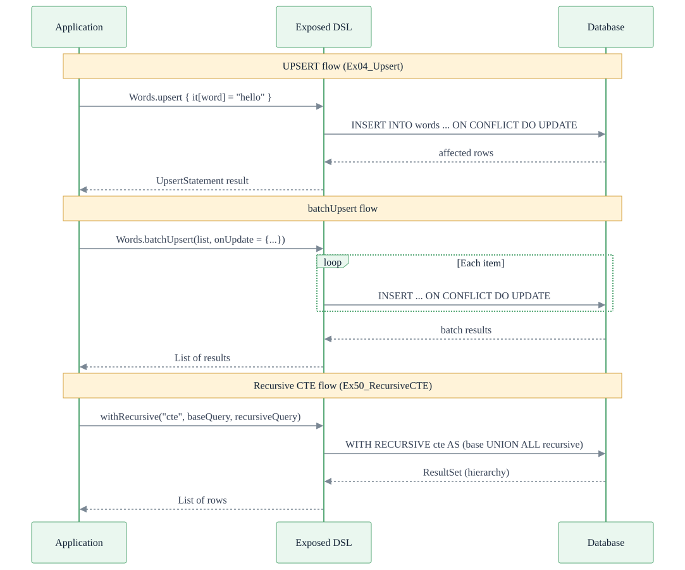

> 한국어 버전: [README.ko.md](README.ko.md)

# 01-dml

A comprehensive example module for **DML (Data Manipulation Language)** operations using the Exposed R2DBC DSL. Covers nearly all SQL DML patterns — SELECT, INSERT, UPDATE, DELETE, UPSERT, MERGE, JOIN, UNION, CTE, and more — across 27 test files.

## Tech Stack

| Category  | Technology                                                  |
|-----------|-------------------------------------------------------------|
| ORM       | Exposed R2DBC DSL                                           |
| Async     | Kotlin Coroutines                                           |
| DB        | H2 (default), MariaDB, MySQL 8, PostgreSQL                  |
| Container | Testcontainers                                              |
| Testing   | JUnit 5 + bluetape4k-assertions + ParameterizedTest (multi-DB support)     |

## Project Structure

```
src/test/kotlin/exposed/r2dbc/examples/dml/
├── Ex01_Select.kt              # SELECT basics: where, and/or, inList, inSubQuery, anyFrom, allFrom, distinct, limit/offset
├── Ex02_Insert.kt              # INSERT basics: insert, batchInsert, insertIgnore, insertAndGetId
├── Ex03_Update.kt              # UPDATE basics: update, joinQuery update, alias update
├── Ex04_Upsert.kt              # UPSERT: insert-or-update on PK/Unique conflict, batchUpsert, onUpdate, where conditions
├── Ex05_Delete.kt              # DELETE: deleteWhere, deleteAll, deleteIgnoreWhere, join-based delete
├── Ex06_Exists.kt              # EXISTS / NOT EXISTS subquery conditions
├── Ex07_DistinctOn.kt          # DISTINCT ON clause (PostgreSQL etc.)
├── Ex08_Count.kt               # COUNT, COUNT DISTINCT, schema-level count
├── Ex09_GroupBy.kt             # GROUP BY + aggregate functions (sum, avg, min, max, having)
├── Ex10_OrderBy.kt             # ORDER BY: single/multi-column sort, SortOrder, nullsFirst/Last
├── Ex11_Join.kt                # JOIN: inner, left, cross, alias join, nested join, many-to-many
├── Ex12_InsertInto_Select.kt   # INSERT INTO ... SELECT pattern
├── Ex13_Replace.kt             # REPLACE statement (MySQL/MariaDB)
├── Ex14_MergeBase.kt           # MERGE base class (table definitions and test data)
├── Ex14_MergeSelect.kt         # MERGE ... USING SELECT pattern
├── Ex14_MergeTable.kt          # MERGE ... USING TABLE pattern
├── Ex15_Returning.kt           # RETURNING clause (return results from INSERT/UPDATE/DELETE)
├── Ex16_FetchBatchedResults.kt # Batch retrieval of large result sets (fetchBatchedResults)
├── Ex17_Union.kt               # UNION / INTERSECT / EXCEPT set operations
├── Ex20_AdjustQuery.kt         # Dynamic query modification: adjustSelect, adjustWhere, adjustColumn
├── Ex21_Arithmetic.kt          # Arithmetic operations (plus, minus, times, div, rem)
├── Ex22_ColumnWithTransform.kt # Column value transformation (serialize/deserialize via transform)
├── Ex23_Conditions.kt          # Compound conditions: compoundAnd, compoundOr, case/when, coalesce
├── Ex30_Explain.kt             # EXPLAIN / EXPLAIN ANALYZE query plan inspection
├── Ex40_LateralJoin.kt         # LATERAL JOIN (PostgreSQL)
├── Ex50_RecursiveCTE.kt        # Recursive CTE (WITH RECURSIVE)
└── Ex99_Dual.kt                # DUAL table (SELECT without a table)
```

> **Note**: This module has no `src/main`. All code lives in `src/test` — it is a test-only learning module.

## Example Categories

### Basic CRUD

| File            | Description                                                                                                                          |
|-----------------|--------------------------------------------------------------------------------------------------------------------------------------|
| `Ex01_Select`   | Nearly all SELECT patterns: WHERE, AND/OR, `inList`, `inSubQuery`, `anyFrom`, `allFrom`, DISTINCT, LIMIT/OFFSET                      |
| `Ex02_Insert`   | Single/batch INSERT, `insertIgnore`, `insertAndGetId`, auto-increment, generated columns (auto-derived, read-only), Sequence, UUID   |
| `Ex03_Update`   | Single UPDATE, conditional UPDATE via joinQuery, alias-based UPDATE                                                                  |
| `Ex04_Upsert`   | INSERT or UPDATE on PK/Unique conflict, `batchUpsert`, custom `onUpdate` logic, `where` conditions, `onUpdateExclude`                |
| `Ex05_Delete`   | `deleteWhere`, `deleteAll`, `deleteIgnoreWhere`, JOIN-based delete                                                                   |

### Aggregation / Sorting / Filtering

| File                | Description                                                      |
|---------------------|------------------------------------------------------------------|
| `Ex06_Exists`       | EXISTS / NOT EXISTS subqueries in WHERE conditions               |
| `Ex07_DistinctOn`   | `DISTINCT ON` clause to retrieve the first row per group (PostgreSQL) |
| `Ex08_Count`        | `count()`, `countDistinct()`, count after schema switch          |
| `Ex09_GroupBy`      | `GROUP BY` + `sum`, `avg`, `min`, `max`, `having` clause         |
| `Ex10_OrderBy`      | Single/multi-column sort, `SortOrder`, `nullsFirst`/`nullsLast`  |

### Joins

| File                 | Description                                                                          |
|----------------------|--------------------------------------------------------------------------------------|
| `Ex11_Join`          | INNER/LEFT/CROSS JOIN, alias join, nested join, many-to-many, additional conditions  |
| `Ex40_LateralJoin`   | PostgreSQL LATERAL JOIN for correlated subqueries as joins                           |

### Advanced DML

| File                            | Description                                                                          |
|---------------------------------|--------------------------------------------------------------------------------------|
| `Ex12_InsertInto_Select`        | Copy data between tables using `INSERT INTO ... SELECT`                              |
| `Ex13_Replace`                  | MySQL/MariaDB `REPLACE` statement (DELETE + INSERT)                                  |
| `Ex14_MergeBase/Select/Table`   | SQL `MERGE`: USING SELECT / USING TABLE, WHEN MATCHED/NOT MATCHED                   |
| `Ex15_Returning`                | Immediately return results via `RETURNING` after INSERT/UPDATE/DELETE (PostgreSQL)   |

### Set Operations

| File           | Description                                                   |
|----------------|---------------------------------------------------------------|
| `Ex17_Union`   | `UNION`, `UNION ALL`, `INTERSECT`, `EXCEPT` set operations    |

### Utilities / Expressions

| File                         | Description                                                              |
|------------------------------|--------------------------------------------------------------------------|
| `Ex20_AdjustQuery`           | Dynamic query modification via `adjustSelect`, `adjustWhere`, `adjustColumn` |
| `Ex21_Arithmetic`            | Arithmetic operations between columns (`+`, `-`, `*`, `/`, `%`)          |
| `Ex22_ColumnWithTransform`   | Column value serialization/deserialization using `transform()`            |
| `Ex23_Conditions`            | Compound conditions: `compoundAnd`, `compoundOr`, `case`/`when`, `coalesce` |

### Analysis / CTE / Misc

| File                         | Description                                                      |
|------------------------------|------------------------------------------------------------------|
| `Ex30_Explain`               | Inspect query execution plan with `EXPLAIN` / `EXPLAIN ANALYZE`  |
| `Ex50_RecursiveCTE`          | Recursive CTE using `WITH RECURSIVE` (hierarchical queries)       |
| `Ex16_FetchBatchedResults`   | Batch retrieval of large results (`fetchBatchedResults`)          |
| `Ex99_Dual`                  | Execute SELECT without a table (DUAL table pattern)               |

## Core Code Examples

### SELECT - Various WHERE Conditions

```kotlin
// WHERE + AND condition combination
users.selectAll()
    .where { users.id eq "andrey" }
    .andWhere { users.name.isNotNull() }
    .single()

// Filter by multiple values with inList
users.selectAll()
    .where { users.id inList listOf("andrey", "alex") }
    .orderBy(users.name)
    .toList()

// Use subquery with inSubQuery
val subQuery = cities.select(cities.id).where { cities.id eq 2 }
cities.selectAll()
    .where { cities.id inSubQuery subQuery }
```

### UPSERT - INSERT or UPDATE on Conflict

```kotlin
// Auto UPDATE on PK conflict
AutoIncTable.upsert {
    it[id] = existingId
    it[name] = "Updated Name"
}

// Custom UPDATE logic with onUpdate
Words.upsert(onUpdate = { it[Words.count] = Words.count + 1 }) {
    it[word] = testWord
}

// Batch processing with batchUpsert
Words.batchUpsert(
    lettersWithDuplicates,
    onUpdate = { it[Words.count] = Words.count + 1 }
) { letter ->
    this[Words.word] = letter
}
```

### JOIN - Various Join Patterns

```kotlin
// INNER JOIN (FK-based auto join)
users.innerJoin(cities)
    .select(users.name, cities.name)
    .where { cities.name eq "St. Petersburg" }
    .single()

// Triple INNER JOIN
cities.innerJoin(users).innerJoin(userData)
    .selectAll()
    .orderBy(users.id)
    .toList()

// CROSS JOIN
cities.crossJoin(users)
    .select(users.name, cities.name)
    .where { cities.name eq "St. Petersburg" }
    .toList()
```

## Example Table Structure (ER Diagram)

The tables used across this module:



## DSL API Structure (Class Diagram)



## CTE / UPSERT Execution Flow (Sequence Diagram)



## Flow Collection Patterns

Exposed R2DBC query results are returned as Kotlin `Flow`. Choose the appropriate collection function for each use case.

```kotlin
// Collect all results as a List
val allUsers = users.selectAll().toList()

// Single result (throws if absent)
val user = users.selectAll().where { users.id eq "andrey" }.single()

// Single result (null if absent)
val userOrNull = users.selectAll().where { users.id eq "unknown" }.singleOrNull()

// First result (throws if absent)
val first = users.selectAll().orderBy(users.name).first()

// First result (null if absent)
val firstOrNull = users.selectAll().where { users.id eq "x" }.firstOrNull()

// Collect excluding nulls
val names = users.selectAll()
    .mapNotNull { it[users.name] }
    .toList()

// Aggregation (count returns Long)
val count: Long = users.selectAll().count()

// Transform then collect via Flow
val cityNames: List<String> = cities.selectAll()
    .map { it[cities.name] }
    .toList()
```

## Shared Test Infrastructure

This module uses the common test infrastructure from `00-shared/exposed-r2dbc-shared`.

### DMLTestData

A shared object providing test data:

| Table         | Description                                                          |
|---------------|----------------------------------------------------------------------|
| `Cities`      | City table (id, name) — St. Petersburg, Munich, Prague               |
| `Users`       | User table (id, name, cityId, flags) — FK references Cities          |
| `UserData`    | User extra info (userId, comment, value) — FK references Users       |
| `Sales`       | Sales table (year, month, product, amount)                           |
| `SomeAmounts` | Amount table (amount) — used for inTable, anyFrom, etc.              |

Key helper functions:

- `withCitiesAndUsers()` — Creates Cities, Users, UserData and inserts test data
- `withSales()` — Inserts tea/coffee sales data into the Sales table
- `withSalesAndSomeAmounts()` — Sets up both Sales and SomeAmounts tables

### R2dbcExposedTestBase

The base class for all test classes. Runs the same tests against multiple databases — H2, MariaDB, MySQL, PostgreSQL — via `ENABLE_DIALECTS_METHOD`.

## Running Tests

```bash
# Run all DML tests
./gradlew :01-dml:test

# Run a specific test class
./gradlew :01-dml:test --tests "exposed.r2dbc.examples.dml.Ex01_Select"

# Run a specific test method
./gradlew :01-dml:test --tests "exposed.r2dbc.examples.dml.Ex04_Upsert.upsert with PK conflict"
```

## Further Reading

- [7.1 DML Functions](https://debop.notion.site/1ad2744526b0800baf1ce81c31f3cbf9?v=1ad2744526b08007ab62000c0901bcfa)
