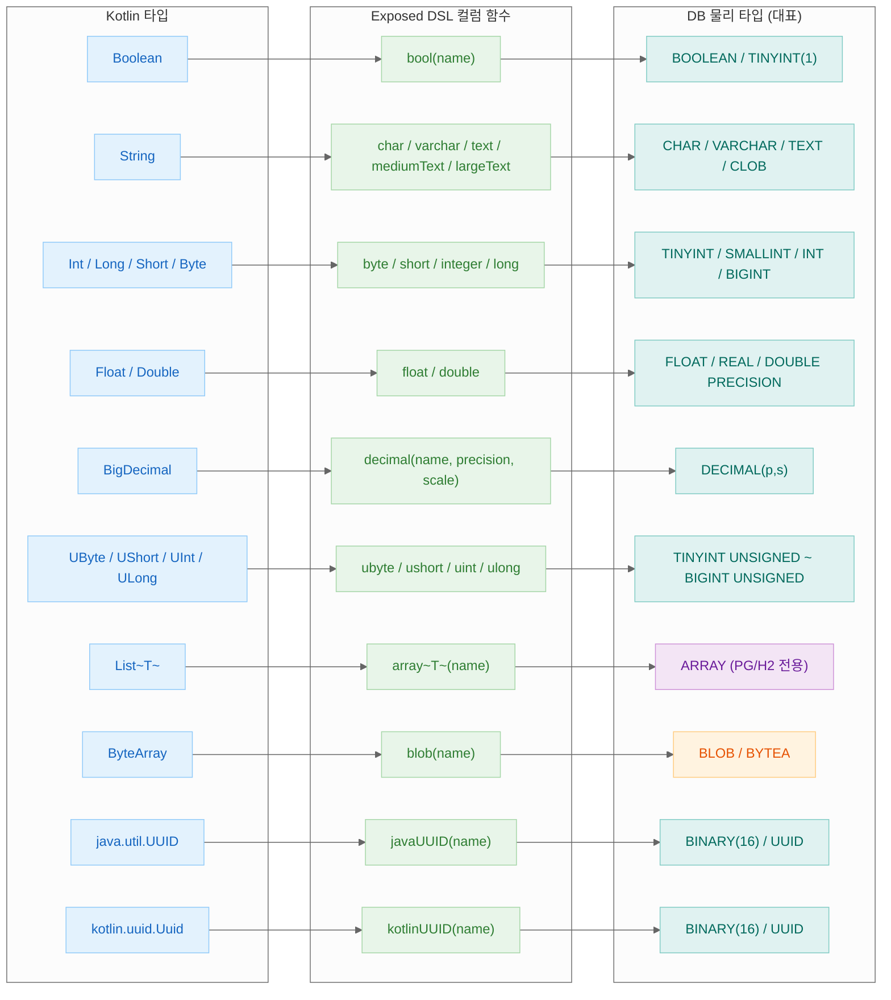

> English version: [README.md](README.md)

# 02 Column Types (컬럼 타입)

Exposed R2DBC DSL에서 지원하는 **다양한 컬럼 타입(Column Types)
** 의 사용법을 다루는 예제 모듈입니다. Boolean, Char, Numeric, Double, Array, Unsigned, Blob, UUID 등 SQL 데이터 타입별로 테이블 정의, INSERT, SELECT, 타입 변환 패턴을 9개의 테스트 파일로 학습할 수 있습니다.

## 학습 목표

- 다양한 SQL 컬럼 타입을 Exposed DSL로 정의하는 방법 이해
- Boolean, String, Numeric 타입의 활용
- Array, Blob, UUID 등 고급 타입 사용법
- 데이터베이스별 타입 지원 차이점 파악

## 기술 스택

| 구분   | 기술                                              |
|------|-------------------------------------------------|
| ORM  | Exposed R2DBC DSL                               |
| 비동기  | Kotlin Coroutines                               |
| DB   | H2 (기본), MariaDB, MySQL 8, PostgreSQL           |
| 컨테이너 | Testcontainers                                  |
| 테스트  | JUnit 5 + bluetape4k-assertions + ParameterizedTest (멀티 DB 지원) |

## 구조 다이어그램

```mermaid
%%{init: {"theme": "neutral"}}%%
classDiagram
    class Column~T~ {
        <<abstract>>
        +columnType: IColumnType
        +name: String
    }

    class BooleanColumn {
        +bool(name)
        +booleanParam(value)
    }

    class CharColumn {
        +char(name, length)
    }

    class VarCharColumn {
        +varchar(name, length)
        +length: Int
    }

    class TextColumn {
        +text(name)
        +mediumText(name)
        +largeText(name)
    }

    class IntegerColumn {
        +byte(name)
        +short(name)
        +integer(name)
        +long(name)
    }

    class FloatColumn {
        +float(name)
    }

    class DoubleColumn {
        +double(name)
    }

    class DecimalColumn {
        +decimal(name, precision, scale)
        +precision: Int
        +scale: Int
    }

    class UnsignedColumn {
        +ubyte(name)
        +ushort(name)
        +uint(name)
        +ulong(name)
    }

    class ArrayColumn~T~ {
        +array(name)
        +anyFrom(column)
        +allFrom(column)
        +slice(column, lower, upper)
    }

    class BlobColumn {
        +blob(name)
        +blobParam(value)
    }

    class JavaUUIDColumn {
        +javaUUID(name)
        +autoGenerate()
    }

    class KotlinUUIDColumn {
        +kotlinUUID(name)
        +generateV7()
    }

    Column <|-- BooleanColumn
    Column <|-- CharColumn
    Column <|-- VarCharColumn
    Column <|-- TextColumn
    Column <|-- IntegerColumn
    Column <|-- FloatColumn
    Column <|-- DoubleColumn
    Column <|-- DecimalColumn
    Column <|-- UnsignedColumn
    Column <|-- ArrayColumn
    Column <|-- BlobColumn
    Column <|-- JavaUUIDColumn
    Column <|-- KotlinUUIDColumn

    note for ArrayColumn "PostgreSQL / H2 전용"
    note for KotlinUUIDColumn "@OptIn(ExperimentalUuidApi) 필요 (Kotlin 2.x)"

    style Column fill:#E3F2FD,stroke:#90CAF9,color:#1565C0
    style BooleanColumn fill:#E8F5E9,stroke:#A5D6A7,color:#2E7D32
    style IntegerColumn fill:#E8F5E9,stroke:#A5D6A7,color:#2E7D32
    style DecimalColumn fill:#E8F5E9,stroke:#A5D6A7,color:#2E7D32
    style ArrayColumn fill:#F3E5F5,stroke:#CE93D8,color:#6A1B9A
    style BlobColumn fill:#FFF3E0,stroke:#FFCC80,color:#E65100
    style JavaUUIDColumn fill:#E0F2F1,stroke:#80CBC4,color:#00695C
    style KotlinUUIDColumn fill:#E0F2F1,stroke:#80CBC4,color:#00695C
```



## Kotlin 타입 → DB 타입 매핑 흐름



## 프로젝트 구조

```
src/test/kotlin/exposed/r2dbc/examples/types/
├── Ex01_BooleanColumnType.kt    # Boolean 컬럼: bool(), nullable boolean, booleanParam
├── Ex02_CharColumnType.kt       # Char/String 컬럼: char(), varchar(), text(), mediumText(), largeText()
├── Ex03_NumericColumnType.kt    # 숫자 컬럼: short, int, long, float, decimal, byte + Param 함수
├── Ex04_DoubleColumnType.kt     # Double 컬럼: double(), 정밀도 처리
├── Ex05_ArrayColumnType.kt      # 배열 컬럼: array(), anyFrom, allFrom, slice (PostgreSQL/H2)
├── Ex07_UnsignedColumnType.kt   # Unsigned 수형: ubyte, ushort, uint, ulong + 범위 검증
├── Ex08_BlobColumnType.kt       # Blob 컬럼: blob(), ExposedBlob, 바이너리 데이터 처리
├── Ex09_JavaUUIDColumnType.kt   # Java UUID 컬럼: javaUUID(), autoGenerate
└── Ex10_KotlinUUIDColumnType.kt # Kotlin UUID 컬럼: uuid(), Uuid.generateV7()
```

> **참고**: 이 모듈은 `src/main`이 없고, 모든 코드가 `src/test`에 위치합니다. 학습/실습 목적의 테스트 전용 모듈입니다.

## 예제 카테고리

### 기본 데이터 타입

| 파일                       | 설명                                                                                 |
|--------------------------|------------------------------------------------------------------------------------|
| `Ex01_BooleanColumnType` | `bool()` 컬럼 정의, nullable boolean, `booleanParam` 활용, 조건절에서 boolean 비교              |
| `Ex02_CharColumnType`    | `char()`, `varchar()`, `text()`, `mediumText()`, `largeText()` 등 문자열 컬럼 타입 비교      |
| `Ex03_NumericColumnType` | `short`, `integer`, `long`, `float`, `decimal`, `byte` 수형 및 각 타입별 Param/Literal 함수 |
| `Ex04_DoubleColumnType`  | `double()` 컬럼의 INSERT/SELECT, 부동소수점 정밀도 처리                                         |

### 고급 데이터 타입

| 파일                          | 설명                                                            |
|-----------------------------|---------------------------------------------------------------|
| `Ex05_ArrayColumnType`      | PostgreSQL/H2 배열 컬럼, `anyFrom`/`allFrom` 연산자, `slice` 배열 슬라이싱 |
| `Ex07_UnsignedColumnType`   | `ubyte`, `ushort`, `uint`, `ulong` Unsigned 수형, 범위 초과 시 에러 검증 |
| `Ex08_BlobColumnType`       | `blob()` 컬럼으로 바이너리 데이터 저장/조회, `ExposedBlob`, `blobParam`      |
| `Ex09_JavaUUIDColumnType`   | `javaUUID()` 컬럼, `autoGenerate`, PK로 활용                       |
| `Ex10_KotlinUUIDColumnType` | Kotlin `kotlinUUID()` 컬럼, `Uuid.generateV7()` 활용 (`@OptIn(ExperimentalUuidApi::class)` 필요, Kotlin 2.x) |

## 핵심 코드 예제

### Boolean 컬럼

```kotlin
object TestTable: IntIdTable("bool_table") {
    val flag = bool("flag").default(true)
    val nullableFlag = bool("nullable_flag").nullable()
}

// boolean 조건절 활용
TestTable.selectAll()
    .where { TestTable.flag eq booleanParam(true) }
    .single()
```

### Array 컬럼 (PostgreSQL/H2)

```kotlin
object ArrayTable: IntIdTable("array_table") {
    val numbers = array<Int>("numbers")
    val strings = array<String>("strings", TextColumnType())
}

// anyFrom으로 배열 내 값 검색
ArrayTable.selectAll()
    .where { intLiteral(5) eq anyFrom(ArrayTable.numbers) }
    .toFastList()
```

### UUID 컬럼

```kotlin
// Java UUID
object JavaUUIDTable: Table("test_java_uuid") {
    val id = javaUUID("id")
}

// Kotlin UUID (Kotlin 2.x, @OptIn(ExperimentalUuidApi::class) 필요)
object KotlinUUIDTable: Table("test_kotlin_uuid") {
    val id = kotlinUUID("id")
}
```

## DB별 타입 매핑 참조표

Exposed 컬럼 타입이 각 DB에서 어떻게 매핑되는지 정리한 표입니다.

| Exposed 타입                  | H2            | PostgreSQL       | MySQL / MariaDB  | 비고                                      |
|-----------------------------|---------------|------------------|------------------|-------------------------------------------|
| `bool("col")`               | BOOLEAN       | BOOLEAN          | TINYINT(1)       | MySQL은 TINYINT(1)로 저장                  |
| `integer("col")`            | INT           | INT              | INT              |                                           |
| `long("col")`               | BIGINT        | BIGINT           | BIGINT           |                                           |
| `float("col")`              | FLOAT         | REAL             | FLOAT            |                                           |
| `double("col")`             | DOUBLE        | DOUBLE PRECISION | DOUBLE           |                                           |
| `decimal("col", p, s)`      | DECIMAL(p, s) | DECIMAL(p, s)    | DECIMAL(p, s)    |                                           |
| `varchar("col", n)`         | VARCHAR(n)    | VARCHAR(n)       | VARCHAR(n)       |                                           |
| `text("col")`               | CLOB          | TEXT             | TEXT             | H2는 CLOB 사용                             |
| `binary("col", n)`          | BINARY(n)     | BYTEA            | BINARY(n)        |                                           |
| `blob("col")`               | BLOB          | BYTEA            | BLOB             |                                           |
| `javaUUID("col")`           | BINARY(16)    | UUID             | BINARY(16)       | PostgreSQL은 네이티브 UUID 타입 사용         |
| `array<T>("col")`           | ARRAY         | ARRAY            | 미지원            | PostgreSQL/H2 전용                         |
| `enumeration("col", E)`     | INT           | INT              | INT              | 열거형을 ordinal(정수)로 저장                |
| `enumerationByName("col")`  | VARCHAR(n)    | VARCHAR(n)       | VARCHAR(n)       | 열거형을 이름(문자열)으로 저장               |
| `customEnumeration()`       | VARCHAR/INT   | VARCHAR/INT      | VARCHAR/INT      | DB 네이티브 ENUM 타입 매핑 시 사용           |

## 공유 테스트 인프라

이 모듈은 `00-shared/exposed-r2dbc-shared`의 `R2dbcExposedTestBase`를 상속하여 H2, MariaDB, MySQL, PostgreSQL에서 동일 테스트를 실행합니다.

## 테스트 실행

```bash
# 전체 Column Types 테스트 실행
./gradlew :02-types:test

# 특정 테스트 클래스 실행
./gradlew :02-types:test --tests "exposed.r2dbc.examples.types.Ex05_ArrayColumnType"
```

## Further Reading

- [7.2 Column Types](https://debop.notion.site/1c32744526b080f098f8f9727dc3615c?v=1c32744526b0817db4c7000c586f5ae0)
