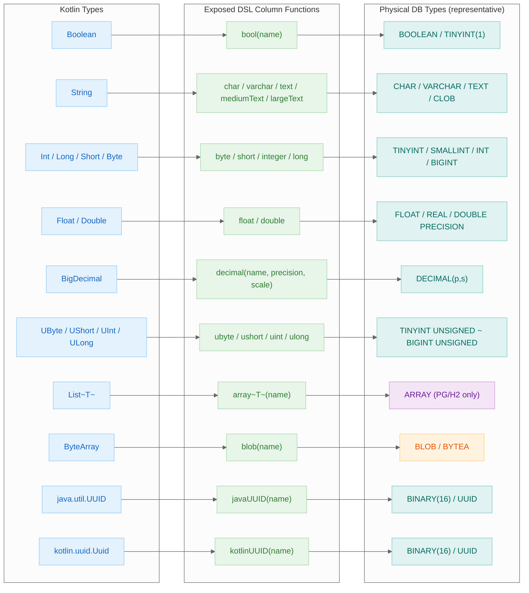

> 한국어 버전: [README.ko.md](README.ko.md)

# 02 Column Types

An example module covering the usage of **various column types** supported by the Exposed R2DBC DSL. Learn table definitions, INSERT, SELECT, and type conversion patterns for Boolean, Char, Numeric, Double, Array, Unsigned, Blob, UUID, and other SQL data types across 9 test files.

## Learning Objectives

- Understand how to define various SQL column types using the Exposed DSL
- Use Boolean, String, and Numeric types effectively
- Learn advanced types: Array, Blob, UUID, etc.
- Understand differences in type support across databases

## Tech Stack

| Category  | Technology                                                  |
|-----------|-------------------------------------------------------------|
| ORM       | Exposed R2DBC DSL                                           |
| Async     | Kotlin Coroutines                                           |
| DB        | H2 (default), MariaDB, MySQL 8, PostgreSQL                  |
| Container | Testcontainers                                              |
| Testing   | JUnit 5 + bluetape4k-assertions + ParameterizedTest (multi-DB support)     |

## Structure Diagram

```mermaid
%%{init: {"theme": "neutral"}}%%
classDiagram
    class Column~T~ {
        <<abstract>>
        +columnType: IColumnType
        +name: String
    }

    class BooleanColumn {
        +bool(name)
        +booleanParam(value)
    }

    class CharColumn {
        +char(name, length)
    }

    class VarCharColumn {
        +varchar(name, length)
        +length: Int
    }

    class TextColumn {
        +text(name)
        +mediumText(name)
        +largeText(name)
    }

    class IntegerColumn {
        +byte(name)
        +short(name)
        +integer(name)
        +long(name)
    }

    class FloatColumn {
        +float(name)
    }

    class DoubleColumn {
        +double(name)
    }

    class DecimalColumn {
        +decimal(name, precision, scale)
        +precision: Int
        +scale: Int
    }

    class UnsignedColumn {
        +ubyte(name)
        +ushort(name)
        +uint(name)
        +ulong(name)
    }

    class ArrayColumn~T~ {
        +array(name)
        +anyFrom(column)
        +allFrom(column)
        +slice(column, lower, upper)
    }

    class BlobColumn {
        +blob(name)
        +blobParam(value)
    }

    class JavaUUIDColumn {
        +javaUUID(name)
        +autoGenerate()
    }

    class KotlinUUIDColumn {
        +kotlinUUID(name)
        +generateV7()
    }

    Column <|-- BooleanColumn
    Column <|-- CharColumn
    Column <|-- VarCharColumn
    Column <|-- TextColumn
    Column <|-- IntegerColumn
    Column <|-- FloatColumn
    Column <|-- DoubleColumn
    Column <|-- DecimalColumn
    Column <|-- UnsignedColumn
    Column <|-- ArrayColumn
    Column <|-- BlobColumn
    Column <|-- JavaUUIDColumn
    Column <|-- KotlinUUIDColumn

    note for ArrayColumn "PostgreSQL / H2 only"
    note for KotlinUUIDColumn "Requires @OptIn(ExperimentalUuidApi) (Kotlin 2.x)"

    style Column fill:#E3F2FD,stroke:#90CAF9,color:#1565C0
    style BooleanColumn fill:#E8F5E9,stroke:#A5D6A7,color:#2E7D32
    style IntegerColumn fill:#E8F5E9,stroke:#A5D6A7,color:#2E7D32
    style DecimalColumn fill:#E8F5E9,stroke:#A5D6A7,color:#2E7D32
    style ArrayColumn fill:#F3E5F5,stroke:#CE93D8,color:#6A1B9A
    style BlobColumn fill:#FFF3E0,stroke:#FFCC80,color:#E65100
    style JavaUUIDColumn fill:#E0F2F1,stroke:#80CBC4,color:#00695C
    style KotlinUUIDColumn fill:#E0F2F1,stroke:#80CBC4,color:#00695C
```



## Kotlin Type → DB Type Mapping Flow



## Project Structure

```
src/test/kotlin/exposed/r2dbc/examples/types/
├── Ex01_BooleanColumnType.kt    # Boolean column: bool(), nullable boolean, booleanParam
├── Ex02_CharColumnType.kt       # Char/String columns: char(), varchar(), text(), mediumText(), largeText()
├── Ex03_NumericColumnType.kt    # Numeric columns: short, int, long, float, decimal, byte + Param functions
├── Ex04_DoubleColumnType.kt     # Double column: double(), floating-point precision handling
├── Ex05_ArrayColumnType.kt      # Array column: array(), anyFrom, allFrom, slice (PostgreSQL/H2)
├── Ex07_UnsignedColumnType.kt   # Unsigned integers: ubyte, ushort, uint, ulong + out-of-range validation
├── Ex08_BlobColumnType.kt       # Blob column: blob(), ExposedBlob, binary data handling
├── Ex09_JavaUUIDColumnType.kt   # Java UUID column: javaUUID(), autoGenerate
└── Ex10_KotlinUUIDColumnType.kt # Kotlin UUID column: uuid(), Uuid.generateV7()
```

> **Note**: This module has no `src/main`. All code lives in `src/test` — it is a test-only learning module.

## Example Categories

### Basic Data Types

| File                       | Description                                                                                     |
|----------------------------|-------------------------------------------------------------------------------------------------|
| `Ex01_BooleanColumnType`   | `bool()` column definition, nullable boolean, `booleanParam`, boolean comparison in WHERE       |
| `Ex02_CharColumnType`      | Comparison of `char()`, `varchar()`, `text()`, `mediumText()`, `largeText()` string column types |
| `Ex03_NumericColumnType`   | Numeric types: `short`, `integer`, `long`, `float`, `decimal`, `byte` + Param/Literal functions |
| `Ex04_DoubleColumnType`    | INSERT/SELECT with `double()` column, floating-point precision handling                          |

### Advanced Data Types

| File                          | Description                                                               |
|-------------------------------|---------------------------------------------------------------------------|
| `Ex05_ArrayColumnType`        | PostgreSQL/H2 array columns, `anyFrom`/`allFrom` operators, `slice`       |
| `Ex07_UnsignedColumnType`     | `ubyte`, `ushort`, `uint`, `ulong` unsigned integers, out-of-range errors |
| `Ex08_BlobColumnType`         | Binary data storage/retrieval with `blob()`, `ExposedBlob`, `blobParam`   |
| `Ex09_JavaUUIDColumnType`     | `javaUUID()` column, `autoGenerate`, use as PK                            |
| `Ex10_KotlinUUIDColumnType`   | Kotlin `kotlinUUID()` column, `Uuid.generateV7()` (`@OptIn(ExperimentalUuidApi::class)` required, Kotlin 2.x) |

## Core Code Examples

### Boolean Column

```kotlin
object TestTable: IntIdTable("bool_table") {
    val flag = bool("flag").default(true)
    val nullableFlag = bool("nullable_flag").nullable()
}

// Use boolean in WHERE condition
TestTable.selectAll()
    .where { TestTable.flag eq booleanParam(true) }
    .single()
```

### Array Column (PostgreSQL/H2)

```kotlin
object ArrayTable: IntIdTable("array_table") {
    val numbers = array<Int>("numbers")
    val strings = array<String>("strings", TextColumnType())
}

// Search for a value within an array using anyFrom
ArrayTable.selectAll()
    .where { intLiteral(5) eq anyFrom(ArrayTable.numbers) }
    .toFastList()
```

### UUID Column

```kotlin
// Java UUID
object JavaUUIDTable: Table("test_java_uuid") {
    val id = javaUUID("id")
}

// Kotlin UUID (Kotlin 2.x, requires @OptIn(ExperimentalUuidApi::class))
object KotlinUUIDTable: Table("test_kotlin_uuid") {
    val id = kotlinUUID("id")
}
```

## DB Type Mapping Reference

How Exposed column types map to each database:

| Exposed Type                | H2            | PostgreSQL       | MySQL / MariaDB  | Notes                                          |
|-----------------------------|---------------|------------------|------------------|------------------------------------------------|
| `bool("col")`               | BOOLEAN       | BOOLEAN          | TINYINT(1)       | MySQL stores as TINYINT(1)                     |
| `integer("col")`            | INT           | INT              | INT              |                                                |
| `long("col")`               | BIGINT        | BIGINT           | BIGINT           |                                                |
| `float("col")`              | FLOAT         | REAL             | FLOAT            |                                                |
| `double("col")`             | DOUBLE        | DOUBLE PRECISION | DOUBLE           |                                                |
| `decimal("col", p, s)`      | DECIMAL(p, s) | DECIMAL(p, s)    | DECIMAL(p, s)    |                                                |
| `varchar("col", n)`         | VARCHAR(n)    | VARCHAR(n)       | VARCHAR(n)       |                                                |
| `text("col")`               | CLOB          | TEXT             | TEXT             | H2 uses CLOB                                   |
| `binary("col", n)`          | BINARY(n)     | BYTEA            | BINARY(n)        |                                                |
| `blob("col")`               | BLOB          | BYTEA            | BLOB             |                                                |
| `javaUUID("col")`           | BINARY(16)    | UUID             | BINARY(16)       | PostgreSQL uses native UUID type               |
| `array<T>("col")`           | ARRAY         | ARRAY            | Not supported    | PostgreSQL/H2 only                             |
| `enumeration("col", E)`     | INT           | INT              | INT              | Enum stored as ordinal (integer)               |
| `enumerationByName("col")`  | VARCHAR(n)    | VARCHAR(n)       | VARCHAR(n)       | Enum stored as name (string)                   |
| `customEnumeration()`       | VARCHAR/INT   | VARCHAR/INT      | VARCHAR/INT      | Use when mapping to DB-native ENUM type        |

## Shared Test Infrastructure

This module extends `R2dbcExposedTestBase` from `00-shared/exposed-r2dbc-shared` to run the same tests against H2, MariaDB, MySQL, and PostgreSQL.

## Running Tests

```bash
# Run all Column Types tests
./gradlew :02-types:test

# Run a specific test class
./gradlew :02-types:test --tests "exposed.r2dbc.examples.types.Ex05_ArrayColumnType"
```

## Further Reading

- [7.2 Column Types](https://debop.notion.site/1c32744526b080f098f8f9727dc3615c?v=1c32744526b0817db4c7000c586f5ae0)
