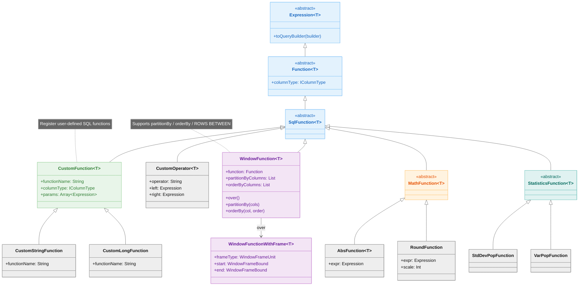

> 한국어 버전: [README.ko.md](README.ko.md)

# 03 SQL Functions

An example module for **SQL Functions** available in the Exposed R2DBC DSL. Covers SQL built-in and custom functions — string/bitwise operations, math functions, statistics functions, trigonometric functions, and window functions — across 6 test files.

## Learning Objectives

- Understand how to use SQL functions in the Exposed DSL
- Use string, math, statistics, and trigonometric functions
- Write analytical queries with window functions
- Learn how to define and use custom functions

## Tech Stack

| Category  | Technology                                                  |
|-----------|-------------------------------------------------------------|
| ORM       | Exposed R2DBC DSL                                           |
| Async     | Kotlin Coroutines                                           |
| DB        | H2 (default), MariaDB, MySQL 8, PostgreSQL                  |
| Container | Testcontainers                                              |
| Testing   | JUnit 5 + bluetape4k-assertions + ParameterizedTest (multi-DB support)     |

## Function Categories

```mermaid
%%{init: {"theme": "neutral"}}%%
flowchart TD
    classDef blue   fill:#E3F2FD,stroke:#90CAF9,color:#1565C0
    classDef green  fill:#E8F5E9,stroke:#A5D6A7,color:#2E7D32
    classDef purple fill:#F3E5F5,stroke:#CE93D8,color:#6A1B9A
    classDef orange fill:#FFF3E0,stroke:#FFCC80,color:#E65100
    classDef teal   fill:#E0F2F1,stroke:#80CBC4,color:#00695C
    classDef red    fill:#FFEBEE,stroke:#EF9A9A,color:#C62828

    F["Exposed R2DBC\nFunction Library"]

    F --> C1["String & Conditional Functions\n(Ex01_Functions)"]
    F --> C2["Math Functions\n(Ex02_MathFunction)"]
    F --> C3["Statistics Functions\n(Ex03_StatisticsFunction)"]
    F --> C4["Trigonometric Functions\n(Ex04_TrigonometricalFunction)"]
    F --> C5["Window Functions\n(Ex05_WindowFunction)"]

    C1 --> C1a["upper / lower / concat\ncharLength / substring / trim"]
    C1 --> C1b["bitwiseAnd / bitwiseOr / bitwiseXor"]
    C1 --> C1c["case/when / Coalesce"]
    C1 --> C1d["CustomFunction / CustomOperator"]

    C2 --> C2a["abs / ceil / floor / round"]
    C2 --> C2b["sqrt / exp / power / sign"]

    C3 --> C3a["stdDevPop / stdDevSamp"]
    C3 --> C3b["varPop / varSamp"]

    C4 --> C4a["sin / cos / tan / cot"]
    C4 --> C4b["asin / acos / atan"]
    C4 --> C4c["degrees / radians / pi"]

    C5 --> C5a["Ranking: rowNumber / rank\ndenseRank / ntile"]
    C5 --> C5b["Value access: lead / lag\nfirstValue / lastValue / nthValue"]
    C5 --> C5c["Distribution: percentRank / cumeDist"]
    C5 --> C5d["Aggregate OVER: sum / avg\ncount / min / max"]

    class F blue
    class C1 green
    class C2 orange
    class C3 purple
    class C4 teal
    class C5 red
    class C1a green
    class C1b green
    class C1c green
    class C1d green
    class C2a orange
    class C2b orange
    class C3a purple
    class C3b purple
    class C4a teal
    class C4b teal
    class C4c teal
    class C5a red
    class C5b red
    class C5c red
    class C5d red
```



## Function Class Hierarchy (Class Diagram)



## Project Structure

```
src/test/kotlin/exposed/r2dbc/examples/functions/
├── Ex00_FunctionBase.kt           # Common base class: helper to evaluate functions against the DUAL table
├── Ex01_Functions.kt              # General functions: string (upper, lower, concat, charLength), bitwise, case/when, coalesce, CustomFunction
├── Ex02_MathFunction.kt           # Math functions: abs, ceil, floor, round, sqrt, exp, power, sign
├── Ex03_StatisticsFunction.kt     # Statistics functions: stdDevPop, stdDevSamp, varPop, varSamp
├── Ex04_TrigonometricalFunction.kt # Trigonometric functions: sin, cos, tan, asin, acos, atan, cot, degrees, radians, pi
└── Ex05_WindowFunction.kt         # Window functions: rowNumber, rank, denseRank, lead, lag, firstValue, lastValue, nthValue, ntile, cumeDist, percentRank
```

> **Note**: This module has no `src/main`. All code lives in `src/test` — it is a test-only learning module.

## Example Details

### Ex00_FunctionBase - Common Base Class

The parent class for all function tests. Provides a `shouldExpressionEqualTo` helper that evaluates SQL function results using the `DUAL` table.

```kotlin
// Evaluate function result against the DUAL table
protected suspend infix fun <T> SqlFunction<T>.shouldExpressionEqualTo(expected: T) {
    val result = Table.Dual.select(this).first()[this]
    result shouldBeEqualTo expected
}
```

### Ex01_Functions - General Functions

| Category    | Functions                                                                                        |
|-------------|--------------------------------------------------------------------------------------------------|
| String      | `UpperCase`, `LowerCase`, `Concat`, `CharLength`, `substring`, `trim`, `locate`                  |
| Bitwise     | `bitwiseAnd`, `bitwiseOr`, `bitwiseXor`                                                          |
| Conditional | `case`/`when`, `Coalesce`, `andIfNotNull`, `orIfNotNull`                                         |
| Arithmetic  | `DivideOp`, `ModOp`, `Sum`                                                                       |
| Custom      | `CustomStringFunction`, `CustomLongFunction`, `CustomFunction`, `CustomOperator`                  |

### Ex02_MathFunction - Math Functions

| Function          | Description                      |
|-------------------|----------------------------------|
| `AbsFunction`     | Absolute value                   |
| `CeilingFunction` | Ceiling (round up)               |
| `FloorFunction`   | Floor (round down)               |
| `RoundFunction`   | Round to specified decimal places |
| `SqrtFunction`    | Square root                      |
| `ExpFunction`     | Exponential function (e^x)       |
| `PowerFunction`   | Exponentiation                   |
| `SignFunction`    | Sign (-1, 0, 1)                  |

### Ex03_StatisticsFunction - Statistics Functions

| Function      | Description                |
|---------------|----------------------------|
| `stdDevPop`   | Population standard deviation |
| `stdDevSamp`  | Sample standard deviation  |
| `varPop`      | Population variance        |
| `varSamp`     | Sample variance            |

### Ex04_TrigonometricalFunction - Trigonometric Functions

Covers the Exposed DSL mapping for SQL trigonometric functions: `sin`, `cos`, `tan`, `asin`, `acos`, `atan`, `cot`, `degrees`, `radians`, `pi`.

### Ex05_WindowFunction - Window Functions

Comprehensive examples of SQL analytical (window) functions:

| Category     | Functions                                                                                           |
|--------------|-----------------------------------------------------------------------------------------------------|
| Ranking      | `rowNumber`, `rank`, `denseRank`, `percentRank`, `cumeDist`, `ntile`                               |
| Value access | `lead`, `lag`, `firstValue`, `lastValue`, `nthValue`                                                |
| Aggregate    | `sum`, `avg`, `count`, `min`, `max`, `stdDevPop`, `stdDevSamp`, `varPop`, `varSamp` (with OVER)     |
| Frame        | `WindowFrameBound`, `ROWS`, `RANGE`, `UNBOUNDED PRECEDING/FOLLOWING`                               |

```kotlin
// Window function usage example
val rowNum = rowNumber().over()
    .partitionBy(sales.product)
    .orderBy(sales.amount, SortOrder.DESC)

sales.select(sales.product, sales.amount, rowNum)
    .toList()
```

## Function Reference Tables

### Math Functions

| Function        | SQL Mapping      | Description                 | Supported DBs        |
|-----------------|------------------|-----------------------------|----------------------|
| `abs(col)`      | ABS(col)         | Absolute value              | All                  |
| `floor(col)`    | FLOOR(col)       | Floor                       | All                  |
| `ceiling(col)`  | CEILING(col)     | Ceiling                     | All                  |
| `round(col, n)` | ROUND(col, n)    | Round                       | All                  |
| `sqrt(col)`     | SQRT(col)        | Square root                 | All                  |
| `power(col, n)` | POWER(col, n)    | Exponentiation              | All                  |
| `exp(col)`      | EXP(col)         | Natural exponent            | All                  |
| `ln(col)`       | LN(col)          | Natural logarithm           | All                  |
| `log(base, col)`| LOG(base, col)   | Logarithm                   | PostgreSQL, MySQL    |
| `mod(a, b)`     | MOD(a, b)        | Remainder                   | All                  |
| `sign(col)`     | SIGN(col)        | Sign (-1, 0, 1)             | All                  |

### Aggregate Functions

| Function          | SQL Mapping          | Description                |
|-------------------|----------------------|----------------------------|
| `count(col)`      | COUNT(col)           | Row count                  |
| `sum(col)`        | SUM(col)             | Sum                        |
| `avg(col)`        | AVG(col)             | Average                    |
| `min(col)`        | MIN(col)             | Minimum                    |
| `max(col)`        | MAX(col)             | Maximum                    |
| `stdDevPop(col)`  | STDDEV_POP(col)      | Population standard deviation |
| `stdDevSamp(col)` | STDDEV_SAMP(col)     | Sample standard deviation  |
| `varPop(col)`     | VAR_POP(col)         | Population variance        |
| `varSamp(col)`    | VAR_SAMP(col)        | Sample variance            |

### Window Functions

| Function        | SQL Mapping       | Description                          |
|-----------------|-------------------|--------------------------------------|
| `rowNumber()`   | ROW_NUMBER()      | Row number within partition          |
| `rank()`        | RANK()            | Rank with gaps for ties              |
| `denseRank()`   | DENSE_RANK()      | Rank without gaps for ties           |
| `lead(col, n)`  | LEAD(col, n)      | Value n rows ahead                   |
| `lag(col, n)`   | LAG(col, n)       | Value n rows behind                  |
| `firstValue()`  | FIRST_VALUE()     | First value in partition             |
| `lastValue()`   | LAST_VALUE()      | Last value in partition              |
| `ntile(n)`      | NTILE(n)          | Classify into n buckets              |
| `percentRank()` | PERCENT_RANK()    | Percentile rank (0.0–1.0)            |
| `cumeDist()`    | CUME_DIST()       | Cumulative distribution (0.0–1.0)    |

### Trigonometric Functions

| Function        | SQL Mapping    | Description             |
|-----------------|----------------|-------------------------|
| `sin(col)`      | SIN(col)       | Sine                    |
| `cos(col)`      | COS(col)       | Cosine                  |
| `tan(col)`      | TAN(col)       | Tangent                 |
| `asin(col)`     | ASIN(col)      | Arcsine                 |
| `acos(col)`     | ACOS(col)      | Arccosine               |
| `atan(col)`     | ATAN(col)      | Arctangent              |
| `degrees(col)`  | DEGREES(col)   | Radians to degrees      |
| `radians(col)`  | RADIANS(col)   | Degrees to radians      |
| `pi()`          | PI()           | Pi constant             |

## Shared Test Infrastructure

- `Ex00_FunctionBase` — Base class for function evaluation
- `DMLTestData.Sales` — Sales data used in window function tests
- `R2dbcExposedTestBase` — Multi-DB test support

## Running Tests

```bash
# Run all Functions tests
./gradlew :03-functions:test

# Run a specific test class
./gradlew :03-functions:test --tests "exposed.r2dbc.examples.functions.Ex05_WindowFunction"
```

## Further Reading

- [7.3 Functions](https://debop.notion.site/1ca2744526b0805e9689efa4a03d01df?v=1ca2744526b08138857a000c9847c052)
