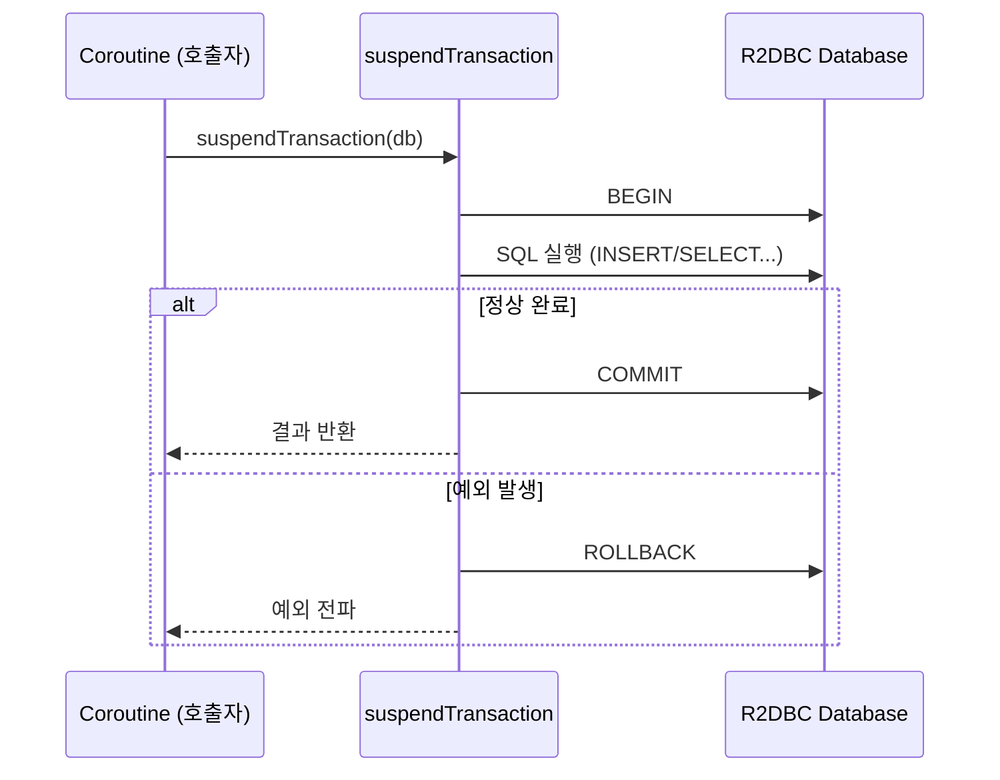
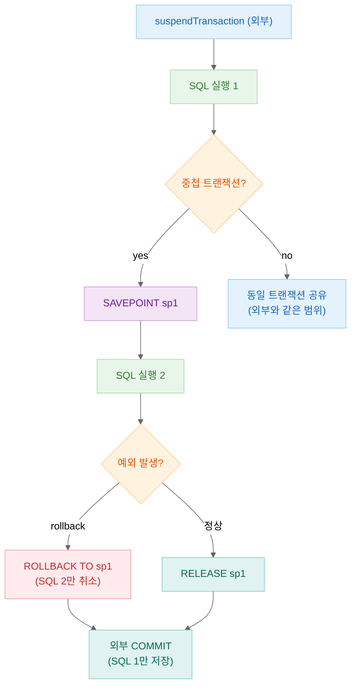
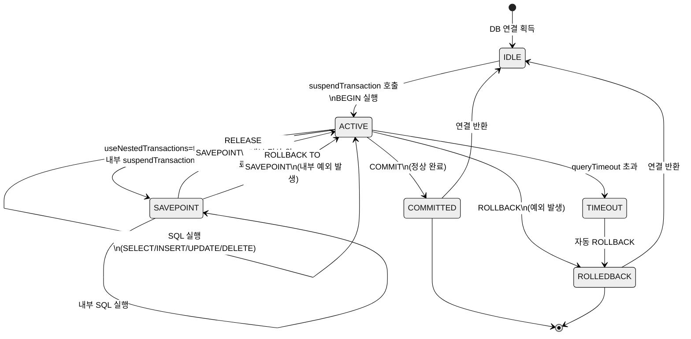

> English version: [README.md](README.md)

# 04 Transaction Management (트랜잭션 관리)

Exposed R2DBC의 **트랜잭션(Transaction)** 관리 기능을 다루는 예제 모듈입니다. 트랜잭션 격리 수준, Raw SQL 실행, 파라미터 바인딩, 쿼리 타임아웃, 중첩 트랜잭션(Savepoint) 등 트랜잭션 제어의 핵심 패턴을 6개의 테스트 파일로 학습할 수 있습니다.

## 학습 목표

- 트랜잭션 격리 수준(Isolation Level) 설정 방법 이해
- Raw SQL 실행 및 파라미터 바인딩
- 쿼리 타임아웃 설정 및 예외 처리
- 중첩 트랜잭션과 Savepoint 활용
- Coroutine 기반 트랜잭션 제어 패턴 습득

## 기술 스택

| 구분   | 기술                                              |
|------|-------------------------------------------------|
| ORM  | Exposed R2DBC DSL                               |
| 비동기  | Kotlin Coroutines                               |
| DB   | H2 (기본), MariaDB, MySQL 8, PostgreSQL           |
| 컨테이너 | Testcontainers                                  |
| 테스트  | JUnit 5 + Kluent + ParameterizedTest (멀티 DB 지원) |

## 실행 흐름

### R2DBC suspendTransaction 흐름



### 중첩 트랜잭션 / Savepoint 흐름



## 트랜잭션 상태 다이어그램



## 프로젝트 구조

```
src/test/kotlin/exposed/r2dbc/examples/transactions/
├── Ex01_TransactionIsolation.kt           # 트랜잭션 격리 수준 설정 (READ_UNCOMMITTED ~ SERIALIZABLE)
├── Ex02_TransactionExec.kt                # Transaction.exec()으로 Raw SQL 실행, batchInsert + exec 조합
├── Ex03_Parameterization.kt               # exec()에 파라미터 바인딩: ColumnType + 값 매핑
├── Ex04_QueryTimeout.kt                   # 쿼리 타임아웃 설정 및 타임아웃 초과 시 예외 처리
├── Ex05_NestedTransactions.kt             # 중첩 트랜잭션: useNestedTransactions, 내부 롤백 시 외부 유지
└── Ex05_NestedTransactions_Coroutines.kt  # Coroutine 기반 중첩 트랜잭션: Savepoint + withContext 활용
```

> **참고**: 이 모듈은 `src/main`이 없고, 모든 코드가 `src/test`에 위치합니다. 학습/실습 목적의 테스트 전용 모듈입니다.

## 예제 상세

### Ex01_TransactionIsolation - 트랜잭션 격리 수준

R2DBC 환경에서 트랜잭션 격리 수준(Isolation Level)을 설정하는 방법을 다룹니다.

| 격리 수준              | 설명                  |
|--------------------|---------------------|
| `READ_UNCOMMITTED` | 커밋되지 않은 데이터 읽기 허용   |
| `READ_COMMITTED`   | 커밋된 데이터만 읽기         |
| `REPEATABLE_READ`  | 트랜잭션 내 반복 읽기 일관성 보장 |
| `SERIALIZABLE`     | 완전 직렬화 수준           |

```kotlin
suspendTransaction(
    transactionIsolation = IsolationLevel.READ_COMMITTED,
    db = database
) {
    // 트랜잭션 본문
}
```

### Ex02_TransactionExec - Raw SQL 실행

`Transaction.exec()`을 사용하여 Exposed DSL 외의 Raw SQL을 직접 실행합니다.

```kotlin
val result = exec(
    stmt = "SELECT * FROM exec_table WHERE amount > ?",
    args = listOf(IntegerColumnType() to 100),
    explicitStatementType = StatementType.SELECT
) { row -> row.getInt("amount") }
```

### Ex03_Parameterization - 파라미터 바인딩

`Transaction.exec()` 사용 시 SQL Injection 방지를 위한 파라미터 바인딩 패턴입니다.

```kotlin
exec(
    stmt = "INSERT INTO tmp (username) VALUES (?)",
    args = listOf(VarCharColumnType() to "John \"Johny\" Johnson"),
    explicitStatementType = StatementType.INSERT
)
```

### Ex04_QueryTimeout - 쿼리 타임아웃

쿼리 실행 시간 제한을 설정하고, 타임아웃 초과 시 예외 처리 패턴을 다룹니다.

```kotlin
withDb(testDB) {
    this.queryTimeout = 3  // 3초 타임아웃
    exec("SELECT pg_sleep(10)")  // 타임아웃 초과 → 예외 발생
}
```

### Ex05_NestedTransactions - 중첩 트랜잭션

`useNestedTransactions = true` 설정으로 내부 트랜잭션 롤백 시에도 외부 트랜잭션이 유지되는 패턴입니다.

```kotlin
withTables(testDB, cities, configure = { useNestedTransactions = true }) {
    cities.insert { it[name] = "city1" }

    suspendTransaction {
        cities.insert { it[name] = "city2" }
        rollback()
    }

    cityCounts() shouldBeEqualTo 1
}
```

### Ex05_NestedTransactions_Coroutines - Savepoint 기반 중첩 트랜잭션

Coroutine `withContext`와 Savepoint를 직접 사용하여 더 세밀한 트랜잭션 제어를 구현합니다.

```kotlin
suspend fun <T> runWithSavepoint(
    name: String = "savepoint_${Base58.randomString(8)}",
    rollback: Boolean = false,
    block: suspend R2dbcTransaction.() -> T,
): T? = withContext(Dispatchers.IO) {
    val connection = tx.connection()
    val savepoint = connection.setSavepoint(name)
    try {
        block(tx)
    } catch (e: Exception) {
        connection.rollback(savepoint)
        null
    }
}
```

## 트랜잭션 격리 수준 DB별 지원 현황

| 격리 수준              | H2  | PostgreSQL | MySQL 8 | MariaDB | 비고                              |
|--------------------|-----|------------|---------|---------|-----------------------------------|
| `READ_UNCOMMITTED` | O   | △ (사실상 RC) | O       | O       | PostgreSQL은 READ_COMMITTED로 처리 |
| `READ_COMMITTED`   | O   | O          | O       | O       | 기본값 (대부분 DB)                  |
| `REPEATABLE_READ`  | O   | △ (SSI)    | O       | O       | PostgreSQL은 Snapshot Isolation   |
| `SERIALIZABLE`     | O   | O          | O       | O       | 가장 엄격한 격리 수준               |

## Savepoint (중첩 트랜잭션) DB별 지원 현황

| 기능                       | H2  | PostgreSQL | MySQL 8 | MariaDB | 비고                              |
|--------------------------|-----|------------|---------|---------|-----------------------------------|
| `SAVEPOINT`              | O   | O          | O       | O       | 모든 지원 DB에서 사용 가능           |
| `RELEASE SAVEPOINT`      | O   | O          | O       | O       |                                   |
| `ROLLBACK TO SAVEPOINT`  | O   | O          | O       | O       |                                   |
| `useNestedTransactions`  | O   | O          | O       | O       | Exposed 설정 옵션                   |
| Auto-commit + Savepoint  | △   | X          | △       | △       | auto-commit 모드에서 동작 DB마다 상이 |

## 트랜잭션 실행 함수 비교

| 함수                                    | 설명                                          | 중첩 지원   |
|---------------------------------------|---------------------------------------------|---------|
| `suspendTransaction { }`             | 코루틴 트랜잭션. 새 트랜잭션 시작                       | Savepoint |
| `inTopLevelSuspendTransaction { }`   | 항상 최상위 트랜잭션으로 시작 (중첩 불가)              | X       |
| `withDb(testDB) { }`                 | DB 지정 후 트랜잭션 컨텍스트 진입 (테스트 헬퍼)           | Savepoint |
| `withTables(testDB, *tables) { }`    | 테이블 생성 후 트랜잭션 실행, 종료 후 자동 정리 (테스트 헬퍼) | Savepoint |

## 공유 테스트 인프라

- `R2dbcExposedTestBase` - 멀티 DB 테스트 지원 베이스 클래스
- `DMLTestData.Cities` - 중첩 트랜잭션 테스트에 사용하는 도시 테이블

## 테스트 실행

```bash
# 전체 Transactions 테스트 실행
./gradlew :04-transactions:test

# 특정 테스트 클래스 실행
./gradlew :04-transactions:test --tests "exposed.r2dbc.examples.transactions.Ex05_NestedTransactions"
```

## Further Reading

- [7.4 Transactions](https://debop.notion.site/1ca2744526b080a69567d993571e21aa?v=1ca2744526b081bdab55000c5928063a)
