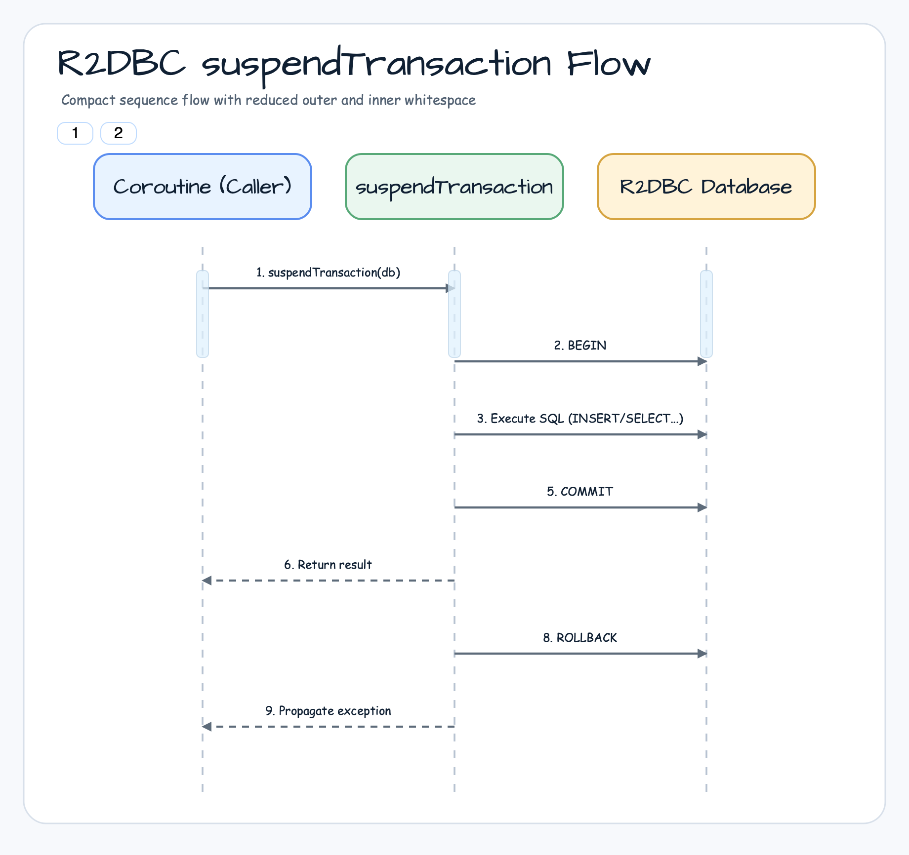
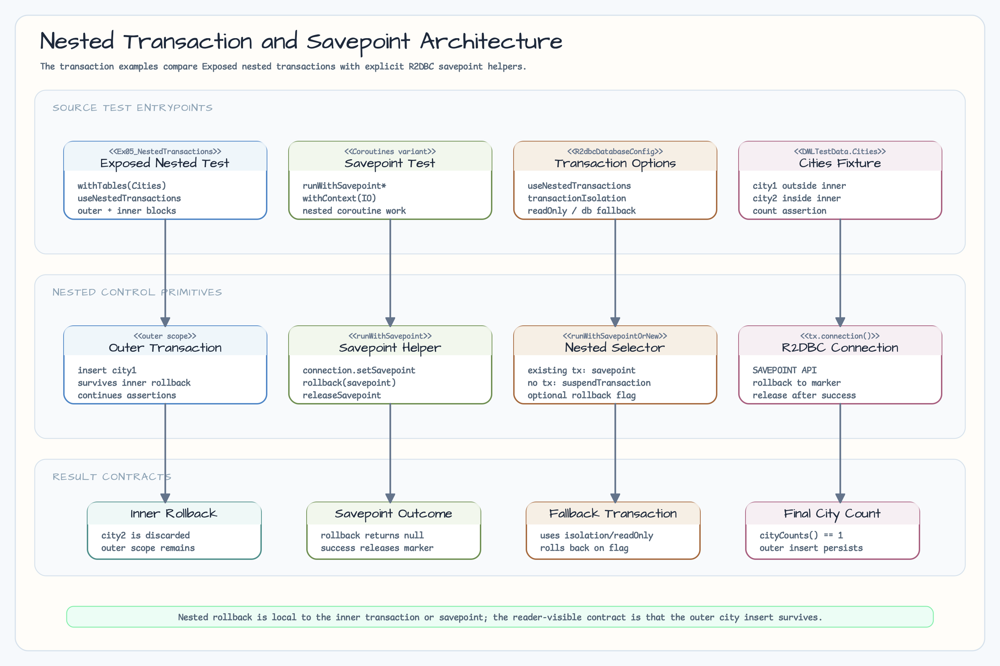
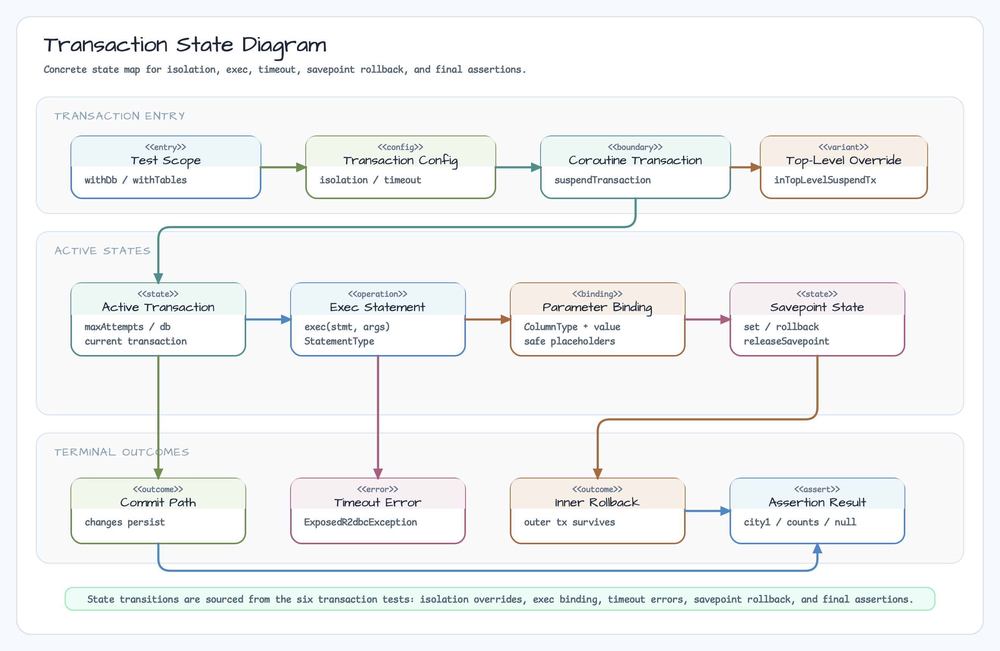

> Korean version: [README.ko.md](README.ko.md)

# 04 Transaction Management

An example module covering **Transaction** management in Exposed R2DBC. Learn the core patterns of transaction control — isolation levels, raw SQL execution, parameter binding, query timeouts, and nested transactions (Savepoints) — across 6 test files.

## Learning Objectives

- Understand how to configure transaction isolation levels
- Execute raw SQL and bind parameters
- Configure query timeouts and handle exceptions
- Use nested transactions and Savepoints
- Master coroutine-based transaction control patterns

## Tech Stack

| Category  | Technology                                                  |
|-----------|-------------------------------------------------------------|
| ORM       | Exposed R2DBC DSL                                           |
| Async     | Kotlin Coroutines                                           |
| DB        | H2 (default), MariaDB, MySQL 8, PostgreSQL                  |
| Container | Testcontainers                                              |
| Testing   | JUnit 5 + bluetape4k-assertions + ParameterizedTest (multi-DB support)     |

## Execution Flow

### R2DBC suspendTransaction Flow



### Nested Transaction / Savepoint Flow



## Transaction State Diagram



## Project Structure

```
src/test/kotlin/exposed/r2dbc/examples/transactions/
├── Ex01_TransactionIsolation.kt           # Set isolation levels (READ_UNCOMMITTED ~ SERIALIZABLE)
├── Ex02_TransactionExec.kt                # Raw SQL via Transaction.exec(), batchInsert + exec combination
├── Ex03_Parameterization.kt               # Parameter binding in exec(): ColumnType + value mapping
├── Ex04_QueryTimeout.kt                   # Query timeout configuration and exception handling on timeout
├── Ex05_NestedTransactions.kt             # Nested transactions: useNestedTransactions, outer survives inner rollback
└── Ex05_NestedTransactions_Coroutines.kt  # Coroutine-based nested transactions: Savepoint + withContext
```

> **Note**: This module has no `src/main`. All code lives in `src/test` — it is a test-only learning module.

## Example Details

### Ex01_TransactionIsolation - Transaction Isolation Levels

How to configure transaction isolation levels in an R2DBC environment.

| Isolation Level    | Description                                              |
|--------------------|----------------------------------------------------------|
| `READ_UNCOMMITTED` | Allows reading uncommitted data                          |
| `READ_COMMITTED`   | Reads only committed data                                |
| `REPEATABLE_READ`  | Guarantees consistent repeated reads within a transaction |
| `SERIALIZABLE`     | Full serialization level                                 |

```kotlin
suspendTransaction(
    transactionIsolation = IsolationLevel.READ_COMMITTED,
    db = database
) {
    // transaction body
}
```

### Ex02_TransactionExec - Raw SQL Execution

Execute raw SQL outside the Exposed DSL using `Transaction.exec()`.

```kotlin
// Query data with raw SQL
val result = transaction.exec(
    stmt = "SELECT * FROM exec_table WHERE amount > ?",
    args = listOf(IntegerColumnType() to 100),
    explicitStatementType = StatementType.SELECT
) { row -> row.getInt("amount") }
```

### Ex03_Parameterization - Parameter Binding

Safe parameter binding to prevent SQL injection when using `Transaction.exec()`.

```kotlin
// Safe parameter binding via ColumnType + value mapping
transaction.exec(
    stmt = "INSERT INTO tmp (username) VALUES (?)",
    args = listOf(VarCharColumnType() to "John \"Johny\" Johnson"),
    explicitStatementType = StatementType.INSERT
)
```

### Ex04_QueryTimeout - Query Timeout

Set a time limit for query execution and handle exceptions when the timeout is exceeded.

```kotlin
withDb(testDB) {
    this.queryTimeout = 3  // 3-second timeout
    // Exceeds timeout → exception raised:
    transaction.exec("SELECT pg_sleep(10)")
}
```

### Ex05_NestedTransactions - Nested Transactions

With `useNestedTransactions = true`, the outer transaction is preserved even when the inner transaction rolls back.

```kotlin
withTables(testDB, cities, configure = { useNestedTransactions = true }) {
    cities.insert { it[name] = "city1" }  // outer transaction

    suspendTransaction {
        cities.insert { it[name] = "city2" }  // inner transaction
        rollback()  // rollback inner only
    }

    cityCounts() shouldBeEqualTo 1  // only city1 remains
}
```

### Ex05_NestedTransactions_Coroutines - Savepoint-Based Nested Transactions

Finer-grained transaction control using coroutine `withContext` and Savepoints directly.

```kotlin
suspend fun <T> runWithSavepoint(
    name: String = "savepoint_${Base58.randomString(8)}",
    rollback: Boolean = false,
    block: suspend R2dbcTransaction.() -> T,
): T? = withContext(Dispatchers.IO) {
    val connection = tx.connection()
    val savepoint = connection.setSavepoint(name)
    try {
        block(tx)
    } catch (e: Exception) {
        connection.rollback(savepoint)
        null
    }
}
```

## Transaction Isolation Level Support by DB

| Isolation Level    | H2  | PostgreSQL     | MySQL 8 | MariaDB | Notes                                    |
|--------------------|-----|----------------|---------|---------|------------------------------------------|
| `READ_UNCOMMITTED` | O   | △ (acts as RC) | O       | O       | PostgreSQL treats as READ_COMMITTED      |
| `READ_COMMITTED`   | O   | O              | O       | O       | Default for most DBs                     |
| `REPEATABLE_READ`  | O   | △ (SSI)        | O       | O       | PostgreSQL uses Snapshot Isolation       |
| `SERIALIZABLE`     | O   | O              | O       | O       | Strictest isolation level                |

## Savepoint (Nested Transaction) Support by DB

| Feature                   | H2  | PostgreSQL | MySQL 8 | MariaDB | Notes                                      |
|---------------------------|-----|------------|---------|---------|---------------------------------------------|
| `SAVEPOINT`               | O   | O          | O       | O       | Available on all supported DBs              |
| `RELEASE SAVEPOINT`       | O   | O          | O       | O       |                                             |
| `ROLLBACK TO SAVEPOINT`   | O   | O          | O       | O       |                                             |
| `useNestedTransactions`   | O   | O          | O       | O       | Exposed configuration option                |
| Auto-commit + Savepoint   | △   | X          | △       | △       | Behavior varies by DB in auto-commit mode   |

## Transaction Function Comparison

| Function                             | Description                                               | Nesting Support |
|--------------------------------------|-----------------------------------------------------------|-----------------|
| `suspendTransaction { }`            | Coroutine transaction; starts a new transaction           | Savepoint       |
| `inTopLevelSuspendTransaction { }`  | Always starts a top-level transaction (no nesting)        | X               |
| `withDb(testDB) { }`                | Enter transaction context with specified DB (test helper) | Savepoint       |
| `withTables(testDB, *tables) { }`   | Create tables, run transaction, auto-cleanup (test helper)| Savepoint       |

## Shared Test Infrastructure

- `R2dbcExposedTestBase` — Base class for multi-DB test support
- `DMLTestData.Cities` — City table used in nested transaction tests

## Running Tests

```bash
# Run all Transactions tests
./gradlew :04-transactions:test

# Run a specific test class
./gradlew :04-transactions:test --tests "exposed.r2dbc.examples.transactions.Ex05_NestedTransactions"
```

## Further Reading

- [7.4 Transactions](https://debop.notion.site/1ca2744526b080a69567d993571e21aa?v=1ca2744526b081bdab55000c5928063a)
