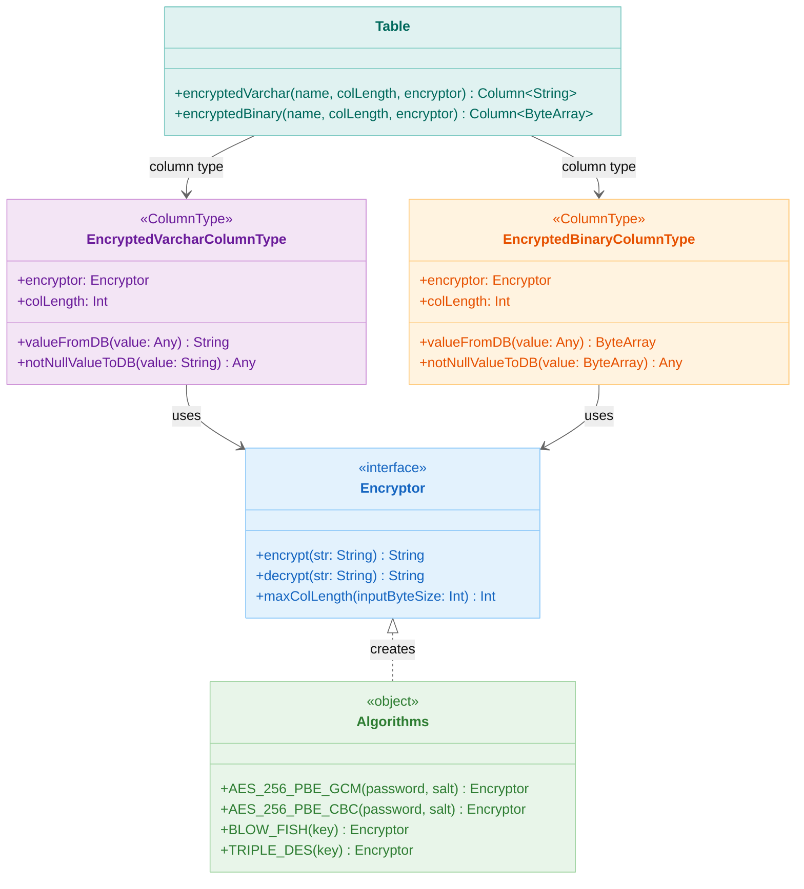
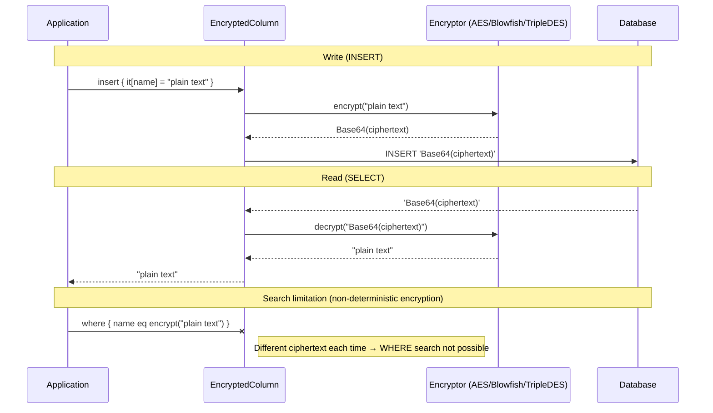

> 한국어 버전: [README.ko.md](README.ko.md)

# 01 Exposed R2DBC Crypt (Transparent Column Encryption)

This module covers transparent encryption and decryption of database columns using the `exposed-crypt` extension. It is useful for protecting sensitive information such as personal data, secrets, and financial data at rest.

## Learning Objectives

- Understand how to define encrypted columns in an Exposed table
- Learn how to use various encryption algorithms (`AES`, `Blowfish`, `Triple DES`)
- Apply encrypted columns in both DSL and DAO styles
- Recognize the limitations of searching encrypted columns

## Core Concepts

The heart of this feature is a custom column type that automatically handles encryption and decryption.

- `encryptedVarchar(name: String, colLength: Int, encryptor: Encryptor)`: Defines a `VARCHAR` column that stores its content as an encrypted string.
- `encryptedBinary(name: String, colLength: Int, encryptor: Encryptor)`: Defines a `VARBINARY` or `BYTEA` column that stores its content as encrypted binary data.
- `Encryptor`: An interface for encryption/decryption logic. Several implementations are provided by the `org.jetbrains.exposed.v1.crypt.Algorithms` object.

**Important**: The default `Encryptor` implementations in Exposed use algorithms that generate a different ciphertext each time for the same plaintext. This is a security feature to prevent pattern analysis. However, this means you **cannot** perform direct equality checks (`where { table.column eq "value" }`) on these columns. Deterministic encryption algorithms such as Jasypt are needed for searchable encryption (see the `10-exposed-jasypt` example).

## Supported Encryption Algorithms

Algorithms provided by the `org.jetbrains.exposed.v1.crypt.Algorithms` object and their characteristics:

| Algorithm                          | Mode | Non-deterministic | Key Parameters                    | Security Level | Notes                                      |
|------------------------------------|------|-------------------|-----------------------------------|----------------|--------------------------------------------|
| `AES_256_PBE_GCM(password, salt)`  | GCM  | Yes               | Password + Salt (8+ bytes)        | High           | AEAD authenticated encryption, includes IV |
| `AES_256_PBE_CBC(password, salt)`  | CBC  | Yes               | Password + Salt (8+ bytes)        | Medium         | Beware of padding oracle vulnerabilities   |
| `BLOW_FISH(key)`                   | ECB  | Yes               | Key (arbitrary length, max 56B)   | Low            | Legacy algorithm, not recommended for new projects |
| `TRIPLE_DES(key)`                  | CBC  | Yes               | Key (exactly 24 bytes)            | Low            | Legacy algorithm, not recommended for new projects |

> **Recommended Algorithm**: Use `AES_256_PBE_GCM` for new projects. GCM mode includes built-in authentication (AEAD) that can detect ciphertext tampering.

## Security Notes

> **Warning**: When using encrypted columns in production, you must follow these rules.

1. **No hardcoding**: Values like `"passwd"`, `"12345678"`, `"key"` in example code are for testing only.
   In real environments, inject values with sufficient entropy from environment variables or a key management system such as Vault or AWS KMS.

2. **Salt management**: AES PBE variants do not include the salt in the ciphertext, so the same salt is required for decryption.
   Losing the salt makes existing data unrecoverable.

3. **Column size calculation**: After encryption and Base64 encoding, data is longer than the plaintext.
   Use `Encryptor.maxColLength(plaintextByteSize)` to appropriately size the column.

4. **Non-deterministic encryption and search**: The default Exposed `Encryptor` is non-deterministic (different ciphertext each time), so `WHERE` clause searches are not possible.
   If you need to search encrypted columns, use a deterministic encryption module:
   - `10-exposed-r2dbc-jasypt`: Jasypt-based deterministic encryption
   - `12-exposed-r2dbc-tink`: Google Tink-based deterministic encryption

5. **Key rotation**: If a key needs to be rotated, all existing data must be re-encrypted in bulk.
   Plan your key rotation procedure in advance for production environments.

## Example Overview

### `Ex01_EncryptedColumn.kt` (DSL Style)

Demonstrates basic usage of encrypted columns using the DSL API.

- **Table definition**: How to define a table with columns using various encryption algorithms (`AES_256_PBE_CBC`, `AES_256_PBE_GCM`, `BLOW_FISH`, `TRIPLE_DES`)
- **Insert & Update**: When a value is inserted or updated, it is automatically encrypted before being sent to the database. Application code only handles plaintext.
- **Select**: When data is fetched, column values are automatically decrypted.
- **Search limitation**: Explicitly shows that `select` queries using a `where` clause on an encrypted column do not work as expected.

### `Ex02_EncryptedColumnWithEntity.kt` (DAO Style)

Shows how to integrate the DAO API with encrypted columns to use them like entity properties.

- **Entity definition**: Defines an `IntEntity` with properties mapped to `encryptedVarchar` and `encryptedBinary` columns.
- **CRUD operations**: Entity creation (`ETest.new { ... }`), reading (`ETest.all()`), and updates work seamlessly. Encryption and decryption are completely transparent to the developer.
- **Search limitation**: Highlights that finding entities by an encrypted property (`ETest.find { TestTable.varchar eq "value" }`) fails.

## Class Structure Diagram



> Non-deterministic encryption: same plaintext generates a different ciphertext each time — AES_256_PBE_GCM recommended (includes AEAD authentication)

> Encrypted columns cannot be searched with `WHERE` clause equality — see `jasypt` module for deterministic encryption

## Execution Flow



## Code Examples

### 1. Defining a Table with Encrypted Columns (DSL)

```kotlin
val nameEncryptor = Algorithms.AES_256_PBE_CBC("passwd", "5c0744940b5c369b")

object StringTable: IntIdTable("StringTable") {
  val name: Column<String> = encryptedVarchar("name", 80, nameEncryptor)
  val city: Column<String> =
    encryptedVarchar("city", 80, Algorithms.AES_256_PBE_GCM("passwd", "5c0744940b5c369b"))
  val address: Column<String> = encryptedVarchar("address", 100, Algorithms.BLOW_FISH("key"))
}
```

### 2. Using Encrypted Columns in an Entity (DAO)

```kotlin
object TestTable: IntIdTable() {
  private val encryptor = Algorithms.AES_256_PBE_GCM("passwd", "12345678")
  val varchar = encryptedVarchar("varchar", 100, encryptor)
  val binary = encryptedBinary("binary", 100, encryptor)
}

class ETest(id: EntityID<Int>): IntEntity(id) {
  companion object: IntEntityClass<ETest>(TestTable)

  var varchar: String by TestTable.varchar
  var binary: ByteArray by TestTable.binary
}

// Usage is transparent
val entity = ETest.new {
  varchar = "my secret value"
  binary = "another secret".toByteArray()
}

println(entity.varchar) // prints "my secret value"
```

## Running Tests

```bash
# Run all tests in this module
./gradlew :01-exposed-r2dbc-crypt:test

# Run a specific test class
./gradlew :01-exposed-r2dbc-crypt:test --tests "exposed.examples.crypt.Ex01_EncryptedColumn"
```

## References

- [Exposed Crypt Module](https://debop.notion.site/Exposed-Crypt-1c32744526b0802da419d5ce74d2c5f3)
