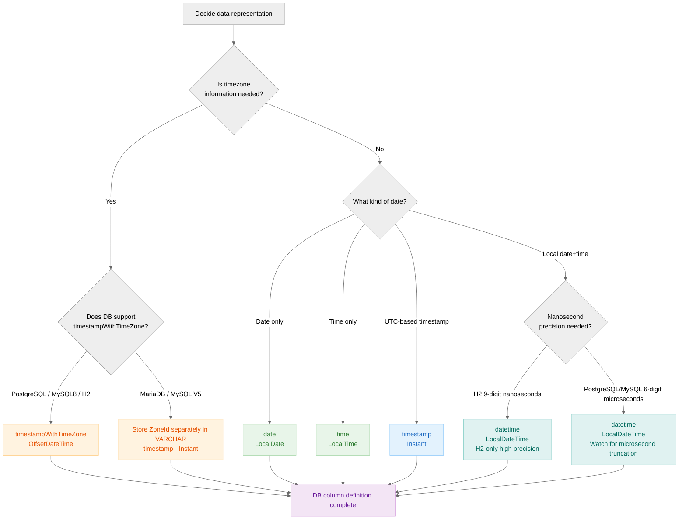

> 한국어 버전: [README.ko.md](README.ko.md)

# 02 Exposed R2DBC JavaTime (java.time Integration)

This module covers how to integrate Java 8's `java.time` (JSR-310) API with Exposed. This is the standard and recommended approach for handling date and time values in Exposed.

## Learning Objectives

- Understand how to map database date/time types to `java.time` objects such as `LocalDate`, `LocalDateTime`, `Instant`, and `OffsetDateTime`
- Use built-in SQL functions for date/time manipulation (`year()`, `month()`, `day()`, etc.)
- Define default values for date/time columns including server-side defaults like `CURRENT_TIMESTAMP`
- Correctly use date/time literals for comparisons in `WHERE` clauses
- Recognize date/time handling and precision differences across various database dialects

## Key Column Types and Functions

The `exposed-java-time` module adds several column types and functions to the Exposed DSL.

### Column Types

| Type                            | Description              | Java Type                    |
|---------------------------------|--------------------------|------------------------------|
| `date(name)`                    | Date                     | `java.time.LocalDate`        |
| `time(name)`                    | Time                     | `java.time.LocalTime`        |
| `datetime(name)`                | Date and time            | `java.time.LocalDateTime`    |
| `timestamp(name)`               | Timestamp                | `java.time.Instant`          |
| `timestampWithTimeZone(name)`   | Timestamp with time zone | `java.time.OffsetDateTime`   |
| `duration(name)`                | Duration                 | `java.time.Duration`         |

### Default Value Expressions

Special expressions are available to set server-side default values.

| Expression                              | Description                                                    |
|-----------------------------------------|----------------------------------------------------------------|
| `CurrentDate`                           | The database's `CURRENT_DATE` function                         |
| `CurrentDateTime` / `CurrentTimestamp`  | The database's `CURRENT_TIMESTAMP` or equivalent function      |
| `CurrentTimestampWithTimeZone`          | The database's `CURRENT_TIMESTAMP WITH TIME ZONE` function     |

### Literals for Queries

When comparing date/time values in a `WHERE` clause, it is recommended to use literal functions to ensure values are formatted correctly for the specific database dialect.

| Function                                         | Description                          |
|--------------------------------------------------|--------------------------------------|
| `dateLiteral(LocalDate)`                         | Date literal                         |
| `timeLiteral(LocalTime)`                         | Time literal                         |
| `dateTimeLiteral(LocalDateTime)`                 | Date-time literal                    |
| `timestampLiteral(Instant)`                      | Timestamp literal                    |
| `timestampWithTimeZoneLiteral(OffsetDateTime)`   | Timestamp with time zone literal     |

## Structure Diagram

```mermaid
%%{init: {"theme": "neutral"}}%%
classDiagram
    class JavaTimeColumn {
        <<exposed-java-time extension>>
    }
    class DateColumn {
        +date(name) Column~LocalDate~
    }
    class TimeColumn {
        +time(name) Column~LocalTime~
    }
    class DateTimeColumn {
        +datetime(name) Column~LocalDateTime~
    }
    class TimestampColumn {
        +timestamp(name) Column~Instant~
    }
    class TimestampWithTimeZoneColumn {
        +timestampWithTimeZone(name) Column~OffsetDateTime~
    }
    class DurationColumn {
        +duration(name) Column~Duration~
    }

    JavaTimeColumn <|-- DateColumn
    JavaTimeColumn <|-- TimeColumn
    JavaTimeColumn <|-- DateTimeColumn
    JavaTimeColumn <|-- TimestampColumn
    JavaTimeColumn <|-- TimestampWithTimeZoneColumn
    JavaTimeColumn <|-- DurationColumn

    style JavaTimeColumn fill:#E3F2FD,stroke:#90CAF9,color:#1565C0
    style DateColumn fill:#E8F5E9,stroke:#A5D6A7,color:#2E7D32
    style TimeColumn fill:#E8F5E9,stroke:#A5D6A7,color:#2E7D32
    style DateTimeColumn fill:#E8F5E9,stroke:#A5D6A7,color:#2E7D32
    style TimestampColumn fill:#F3E5F5,stroke:#CE93D8,color:#6A1B9A
    style TimestampWithTimeZoneColumn fill:#FFF3E0,stroke:#FFCC80,color:#E65100
    style DurationColumn fill:#E0F2F1,stroke:#80CBC4,color:#00695C
```



## Java Time Type to DB Mapping Decision Flow



## Timezone Notes

### `TIMESTAMP WITH TIME ZONE` Behavior Differences by DB

The `timestampWithTimeZone` column behaves differently per database.

| DB         | Preserves timezone info | Notes                                              |
|------------|-------------------------|----------------------------------------------------|
| PostgreSQL | No                      | Normalizes to UTC — original offset is lost        |
| MySQL 8    | No                      | Normalizes to UTC — original offset is lost        |
| H2         | Yes                     | Stores the original offset as-is                   |
| MariaDB    | Not supported           | Throws `UnsupportedByDialectException`             |
| MySQL V5   | Not supported           | Throws `UnsupportedByDialectException`             |

> **Recommendation**: If you need to preserve the original timezone offset in PostgreSQL/MySQL, store the timezone ID (`ZoneId.systemDefault().id`) separately in a `VARCHAR` column.

### Nanosecond Precision Differences

Different databases have different sub-second time precision. The `shouldTemporalEqualTo` extension function accounts for per-database precision in comparisons.

| DB         | Maximum Precision              |
|------------|--------------------------------|
| PostgreSQL | Microseconds (6 digits)        |
| MySQL      | Microseconds (6 digits)        |
| MariaDB    | Microseconds (6 digits)        |
| H2         | Nanoseconds (9 digits)         |
| SQLServer  | Rounded to 100-nanosecond unit |
| Oracle     | Rounded to millisecond unit    |

### UTC Fixed in Test Environment

`AbstractR2dbcExposedTest` sets `TimeZone.setDefault(UTC)` during initialization. Within any test that changes the timezone, you must restore the original timezone after the test completes.

```kotlin
val systemTimeZone = TimeZone.getDefault()
// ... work after changing timezone ...
TimeZone.setDefault(systemTimeZone) // must restore
```

## Example Overview

### `Ex01_JavaTime.kt` - Basic Usage and Functions

Demonstrates core features:

- Using date part extraction functions like `year()`, `month()`, `day()` in queries
- Storing and retrieving `Instant` and `LocalDateTime` values, including nanosecond precision handling
- Working with `timestampWithTimeZone` and understanding how timezone information is handled in various databases

### `Ex02_Defaults.kt` - Default Values

Explores how to set default values for date/time columns.

- `clientDefault { ... }`: Generates a default value on the client (application) before the `INSERT` statement
- `default(value)`: A constant default value
- `defaultExpression(...)`: Generates a default value from the database itself using functions like `CurrentDateTime`

### `Ex03_DateTimeLiteral.kt` - Querying with Literals

Shows how to correctly use date/time values in `WHERE` clauses. Using literal functions like `dateLiteral()` and `dateTimeLiteral()` ensures comparisons work correctly across various databases.

### `Ex04_MiscTable.kt` - Comprehensive Integration Test

Includes a large table (`Misc`) containing all `java.time` column types in both nullable and non-nullable variants. Provides extensive tests for `INSERT`, `SELECT`, and `UPDATE` operations.

## Code Examples

### 1. Defining a Table with `java.time` Columns

```kotlin
object CitiesTime: IntIdTable("CitiesTime") {
  val name: Column<String> = varchar("name", 50)

  // nullable LocalDateTime column
  val local_time: Column<LocalDateTime?> = datetime("local_time").nullable()
}

object TableWithDBDefault: IntIdTable("t_db_default") {
  // non-nullable LocalDateTime column with server-side default
  val t1: Column<LocalDateTime> = datetime("t1").defaultExpression(CurrentDateTime)
}
```

### 2. Inserting and Retrieving `java.time` Values

```kotlin
// Insert a value
val now = LocalDateTime.now()
val cityID = CitiesTime.insertAndGetId {
  it[name] = "Seoul"
  it[local_time] = now
}

// Query using date part functions
val year = CitiesTime
  .select(CitiesTime.local_time.year())
  .where { CitiesTime.id eq cityID }
  .single()[CitiesTime.local_time.year()]

// Query using a literal in the WHERE clause
val result = TableWithDate.selectAll()
  .where { TableWithDate.date less dateLiteral(LocalDate.of(3000, 1, 1)) }
  .firstOrNull()
```

## Running Tests

```bash
# Run all tests in this module
./gradlew :02-exposed-r2dbc-javatime:test

# Run a specific test class
./gradlew :02-exposed-r2dbc-javatime:test --tests "exposed.r2dbc.examples.java.time.Ex01_JavaTime"
```

## References

- [Exposed Java Time Module](https://debop.notion.site/Exposed-Java-Time-1c32744526b0809d85e1d0425038dfdd)
