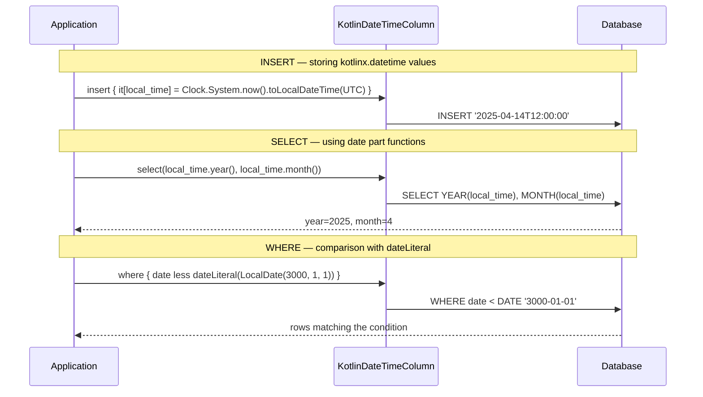
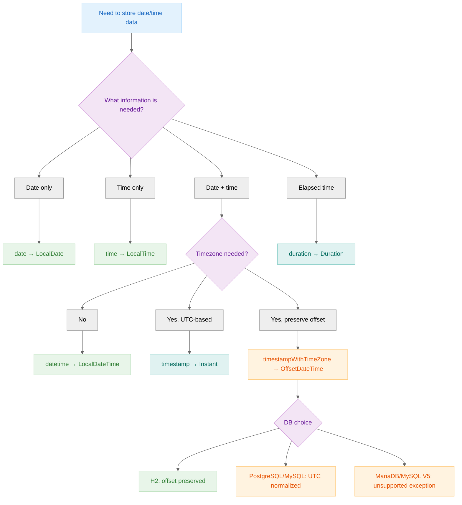

> 한국어 버전: [README.ko.md](README.ko.md)

# 03 Exposed R2DBC Kotlin DateTime (kotlinx.datetime Integration)

This module covers how to integrate the `kotlinx.datetime` library with Exposed. This is the recommended approach for handling date and time in modern multiplatform Kotlin projects.

## Learning Objectives

- Understand how to map database date/time types to `kotlinx.datetime` objects such as `LocalDate`, `LocalDateTime`, and `Instant`
- Use built-in SQL functions for date/time manipulation (`year()`, `month()`, `day()`, etc.)
- Define server-side default values for date/time columns using expressions like `CurrentDateTime`
- Correctly use date/time literals in `WHERE` clauses for type-safe comparisons
- Recognize date/time handling differences across various database backends

## Key Column Types and Functions

The `exposed-kotlin-datetime` module provides a set of column types and functions similar to the `exposed-java-time` module, adapted for the `kotlinx.datetime` library.

### Column Types

| Type                            | Description              | Kotlin Type                        |
|---------------------------------|--------------------------|------------------------------------|
| `date(name)`                    | Date                     | `kotlinx.datetime.LocalDate`       |
| `time(name)`                    | Time                     | `kotlinx.datetime.LocalTime`       |
| `datetime(name)`                | Date and time            | `kotlinx.datetime.LocalDateTime`   |
| `timestamp(name)`               | Timestamp                | `kotlinx.datetime.Instant`         |
| `timestampWithTimeZone(name)`   | Timestamp with time zone | `java.time.OffsetDateTime`         |
| `duration(name)`                | Duration                 | `kotlin.time.Duration`             |

> **Note**: Since `kotlinx.datetime` has no native offset-aware type, `timestampWithTimeZone` maps to `java.time.OffsetDateTime`.

### Default Value Expressions

Expressions for setting database-generated default values.

| Expression                              | Description                                               |
|-----------------------------------------|-----------------------------------------------------------|
| `CurrentDate`                           | The database's `CURRENT_DATE` function                    |
| `CurrentDateTime` / `CurrentTimestamp`  | The database's `CURRENT_TIMESTAMP` or equivalent function |
| `CurrentTimestampWithTimeZone`          | `CURRENT_TIMESTAMP WITH TIME ZONE`                        |

### Literals for Queries

Used when comparing values in `WHERE` clauses to ensure correct SQL generation across different database dialects.

| Function                                         | Description                          |
|--------------------------------------------------|--------------------------------------|
| `dateLiteral(LocalDate)`                         | Date literal                         |
| `timeLiteral(LocalTime)`                         | Time literal                         |
| `dateTimeLiteral(LocalDateTime)`                 | Date-time literal                    |
| `timestampLiteral(Instant)`                      | Timestamp literal                    |
| `timestampWithTimeZoneLiteral(OffsetDateTime)`   | Timestamp with time zone literal     |

## Structure Diagram

```mermaid
%%{init: {"theme": "neutral"}}%%
classDiagram
    class KotlinDateTimeColumn {
        <<exposed-kotlin-datetime extension>>
    }
    class KotlinLocalDateColumn {
        +date(name) Column~kotlinx.datetime.LocalDate~
    }
    class KotlinLocalTimeColumn {
        +time(name) Column~kotlinx.datetime.LocalTime~
    }
    class KotlinLocalDateTimeColumn {
        +datetime(name) Column~kotlinx.datetime.LocalDateTime~
    }
    class KotlinInstantColumn {
        +timestamp(name) Column~kotlin.time.Instant~
    }
    class KotlinTimestampWithTimeZoneColumn {
        +timestampWithTimeZone(name) Column~OffsetDateTime~
    }
    class KotlinDurationColumn {
        +duration(name) Column~kotlin.time.Duration~
    }

    KotlinDateTimeColumn <|-- KotlinLocalDateColumn
    KotlinDateTimeColumn <|-- KotlinLocalTimeColumn
    KotlinDateTimeColumn <|-- KotlinLocalDateTimeColumn
    KotlinDateTimeColumn <|-- KotlinInstantColumn
    KotlinDateTimeColumn <|-- KotlinTimestampWithTimeZoneColumn
    KotlinDateTimeColumn <|-- KotlinDurationColumn

    style KotlinDateTimeColumn fill:#E3F2FD,stroke:#90CAF9,color:#1565C0
    style KotlinLocalDateColumn fill:#E8F5E9,stroke:#A5D6A7,color:#2E7D32
    style KotlinLocalTimeColumn fill:#E8F5E9,stroke:#A5D6A7,color:#2E7D32
    style KotlinLocalDateTimeColumn fill:#E8F5E9,stroke:#A5D6A7,color:#2E7D32
    style KotlinInstantColumn fill:#F3E5F5,stroke:#CE93D8,color:#6A1B9A
    style KotlinTimestampWithTimeZoneColumn fill:#FFF3E0,stroke:#FFCC80,color:#E65100
    style KotlinDurationColumn fill:#E0F2F1,stroke:#80CBC4,color:#00695C
```



## Date/Time Processing Flow



## Column Type Selection Flow



## Differences from the `java.time` Module

`exposed-kotlin-datetime` and `exposed-java-time` provide nearly identical APIs but have different type systems.

| Item                       | `exposed-kotlin-datetime`                     | `exposed-java-time`                |
|----------------------------|-----------------------------------------------|------------------------------------|
| Date                       | `kotlinx.datetime.LocalDate`                  | `java.time.LocalDate`              |
| Date-time                  | `kotlinx.datetime.LocalDateTime`              | `java.time.LocalDateTime`          |
| Timestamp                  | `kotlin.time.Instant` (`@ExperimentalTime`)   | `java.time.Instant`                |
| Timestamp with timezone    | `java.time.OffsetDateTime` (same)             | `java.time.OffsetDateTime`         |
| Multiplatform support      | Yes (KMP)                                     | No (JVM only)                      |

> `kotlin.time.Instant` is an experimental API, so the `@file:OptIn(ExperimentalTime::class)` annotation is required.

## Timezone Notes

### `TIMESTAMP WITH TIME ZONE` Behavior Differences by DB

The `timestampWithTimeZone` column behaves differently per database.

| DB         | Preserves timezone info | Notes                                              |
|------------|-------------------------|----------------------------------------------------|
| PostgreSQL | No                      | Normalizes to UTC — original offset is lost        |
| MySQL 8    | No                      | Normalizes to UTC — original offset is lost        |
| H2         | Yes                     | Stores the original offset as-is                   |
| MariaDB    | Not supported           | Throws `UnsupportedByDialectException`             |
| MySQL V5   | Not supported           | Throws `UnsupportedByDialectException`             |

> **Recommendation**: If you need to preserve the original timezone offset in PostgreSQL/MySQL, store the timezone ID (`ZoneId.systemDefault().id`) separately in a `VARCHAR` column.

### Nanosecond Precision Differences

| DB         | Maximum Precision              |
|------------|--------------------------------|
| PostgreSQL | Microseconds (6 digits)        |
| MySQL      | Microseconds (6 digits)        |
| MariaDB    | Microseconds (6 digits)        |
| H2         | Nanoseconds (9 digits)         |
| SQLServer  | Rounded to 100-nanosecond unit |
| Oracle     | Rounded to millisecond unit    |

## Example Overview

The examples in this module are similar to those in the `exposed-java-time` module, demonstrating parallel functionality for `kotlinx.datetime`.

### `Ex01_KotlinDateTime.kt` - Basic Usage and Functions

Demonstrates core features:

- Using date part extraction functions (`.year()`, `.month()`) in queries
- Storing and retrieving `kotlinx.datetime` types including nanosecond precision
- Working with time zones via `timestampWithTimeZone`

### `Ex02_Defaults.kt` - Default Values

Explores how to set default values for `kotlinx.datetime` columns.

- `default(value)`: Constant, client-side default value
- `clientDefault { ... }`: Client-side default value generated by a lambda
- `defaultExpression(...)`: Server-side default value using database functions like `CurrentDateTime`

### `Ex03_DateTimeLiteral.kt` - Querying with Literals

Shows how to correctly use `kotlinx.datetime` values in `WHERE` clauses. Wrapping values with literal functions like `dateLiteral` and `dateTimeLiteral` ensures proper SQL formatting.

## Code Examples

### 1. Defining a Table with `kotlinx.datetime` Columns

```kotlin
import kotlinx.datetime.LocalDateTime
import org.jetbrains.exposed.v1.datetime.datetime
import org.jetbrains.exposed.v1.datetime.CurrentDateTime

object CitiesTime: IntIdTable("CitiesTime") {
  val name: Column<String> = varchar("name", 50)

  // nullable kotlinx.datetime.LocalDateTime column
  val local_time: Column<LocalDateTime?> = datetime("local_time").nullable()
}

object TableWithDBDefault: IntIdTable() {
  // non-nullable kotlinx.datetime.LocalDateTime column with server-side default
  val t1: Column<LocalDateTime> = datetime("t1").defaultExpression(CurrentDateTime)
}
```

### 2. Inserting and Retrieving `kotlinx.datetime` Values

```kotlin
import kotlinx.datetime.Clock
import kotlinx.datetime.TimeZone
import kotlinx.datetime.toLocalDateTime
import org.jetbrains.exposed.v1.datetime.dateLiteral

// Insert a value
val now = Clock.System.now().toLocalDateTime(TimeZone.currentSystemDefault())
val cityID = CitiesTime.insertAndGetId {
  it[name] = "Tunisia"
  it[local_time] = now
}

// Query using date part functions
val insertedMonth = CitiesTime.select(CitiesTime.local_time.month())
  .where { CitiesTime.id eq cityID }
  .single()[CitiesTime.local_time.month()]

// Query using a literal in the WHERE clause
val result = TableWithDate.selectAll()
  .where { TableWithDate.date less dateLiteral(LocalDate(3000, 1, 1)) }
  .firstOrNull()
```

## Running Tests

```bash
# Run all tests in this module
./gradlew :03-exposed-r2dbc-kotlin-datetime:test

# Run a specific test class
./gradlew :03-exposed-r2dbc-kotlin-datetime:test --tests "exposed.r2dbc.examples.kotlin.datetime.Ex01_KotlinDateTime"
```

## References

- [Exposed Kotlin DateTime Module](https://debop.notion.site/Exposed-Kotlin-DateTime-1c32744526b0807bb3e8f149ef88f5f5)
