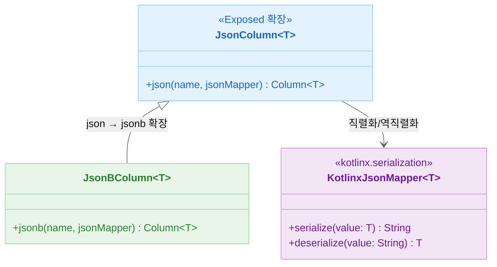
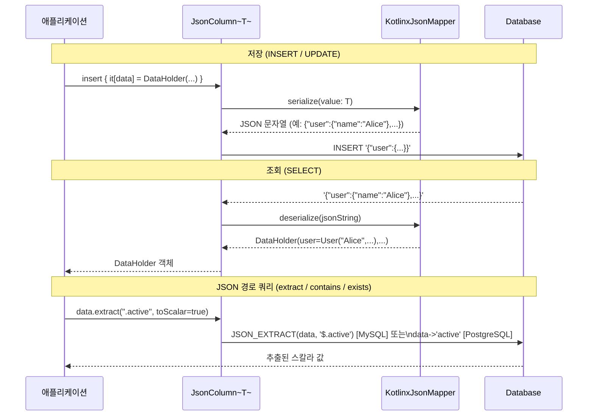
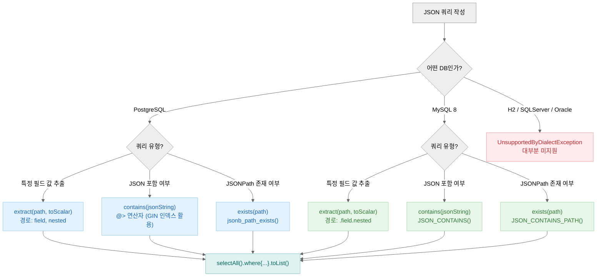

> English version: [README.md](README.md)

# 04 Exposed R2DBC JSON (JSON/JSONB 지원)

이 모듈은 `exposed-json` 확장을 사용하여 `@Serializable` Kotlin 클래스를 네이티브 데이터베이스 `JSON`과
`JSONB` 컬럼에 매핑하는 방법을 학습합니다. 관계형 데이터베이스 내에 복잡하고 스키마 없는 데이터를 직접 저장하고, 강력한 데이터베이스별 JSON 쿼리 함수를 활용할 수 있습니다.

이 기능은 `kotlinx.serialization` 라이브러리를 기반으로 합니다.

## 학습 목표

- `JSON`과 `JSONB` 데이터 타입에 매핑되는 테이블 컬럼 정의
- 단일 컬럼에 복잡하고 중첩된 Kotlin 객체와 컬렉션 저장 및 조회
- `.extract<T>()` 함수를 사용하여 JSON 객체 내의 특정 필드 쿼리
- `.contains()`와 `.exists()` 연산자를 사용하여 JSON 구조 내 데이터 존재 여부 필터링
- `json`과 `jsonb` 컬럼 타입의 차이점 이해
- DSL과 DAO 스타일 모두에서 JSON 컬럼 적용

## 핵심 개념

### `json` vs `jsonb`

| 타입                           | 설명                    | 장단점                           |
|------------------------------|-----------------------|-------------------------------|
| `json<T>(name, jsonMapper)`  | 일반 텍스트 `JSON` 문자열로 저장 | 쓰기는 빠르지만 쿼리는 느림, 공백과 중복 키 보존  |
| `jsonb<T>(name, jsonMapper)` | 분해된 바이너리 형식으로 저장      | 쓰기는 약간 느리지만 쿼리는 훨씬 빠름, 인덱싱 가능 |

**권장**: PostgreSQL처럼 데이터베이스에서 지원하고 JSON 데이터에 대한 쿼리를 수행해야 한다면 `jsonb`를 사용하세요.

### DB별 JSON 지원 현황

| DB         | `json` | `jsonb` | `.extract()` | `.contains()` | `.exists()` |
|------------|--------|---------|--------------|---------------|-------------|
| PostgreSQL | O      | O       | O            | O (`@>`)      | O           |
| MySQL 8    | O      | X       | O            | O             | O           |
| MariaDB    | O      | X       | O            | 제한적          | 제한적        |
| H2         | O      | X       | X            | X             | X           |
| SQLServer  | 미지원   | 미지원    | 미지원          | 미지원          | 미지원        |
| Oracle     | 미지원   | 미지원    | 미지원          | 미지원          | 미지원        |

> H2, SQLServer, Oracle에서는 대부분의 JSON 쿼리 함수가 `UnsupportedByDialectException`을 발생시킵니다.
> 광범위한 JSON 쿼리가 필요하다면 PostgreSQL 또는 MySQL 8을 사용하세요.

### 쿼리 함수

| 함수                            | 설명                                                                                            |
|-------------------------------|-----------------------------------------------------------------------------------------------|
| `.extract<T>(path, toScalar)` | JSON 문서에서 특정 경로의 값 추출. 경로 문법은 데이터베이스마다 다름 (MySQL: `.user.name`, PostgreSQL: `"user", "name"`) |
| `.contains(value, path)`      | JSON 문서에 주어진 JSON 형식 문자열이 값으로 포함되어 있는지 확인. PostgreSQL에서는 효율적인 `@>` 연산자 사용                     |
| `.exists(path, optional)`     | 주어진 JSONPath 표현식에 값이 존재하는지 확인                                                                 |

## 예제 개요

### `JsonTestData.kt`

예제 전반에서 사용되는 `@Serializable` 데이터 클래스(`User`, `DataHolder`, `UserGroup`)와 Exposed `Table` 객체(`JsonTable`,
`JsonBTable`)를 정의합니다.

### `Ex01_JsonColumn.kt` (DSL & DAO with `json`)

`json` 컬럼 타입의 사용법을 보여줍니다.

- **DSL**: DSL을 사용한 `insert`, `update`, `select` 방법
- **DAO**: `JsonEntity` 클래스를 사용하여 DAO 패턴에서 `json` 컬럼을 속성으로 사용하는 방법
- **쿼리**: `.extract<T>()`로 값 추출, `.contains()`와 `.exists()`로 레코드 필터링

### `Ex02_JsonBColumn.kt` (DSL & DAO with `jsonb`)

`Ex01_JsonColumn.kt`와 유사하지만 더 성능이 좋은 `jsonb` 컬럼 타입을 사용합니다. 코드는 거의 동일하며, 주요 차이점은 테이블 정의와 기본 데이터베이스 성능 및 기능에 있음을 보여줍니다.

## 구조 다이어그램



> `JsonBColumn`: PostgreSQL 전용 (인덱싱/연산 지원)

> `json`: 모든 DB(H2, MySQL, MariaDB, PostgreSQL) 지원 — 텍스트 저장, 쿼리 느림
> `jsonb`: PostgreSQL 전용 — 바이너리 저장, 인덱싱·`@>` 연산 지원, 쿼리 빠름

## JSON 직렬화/역직렬화 흐름



## JSON 쿼리 함수 사용 흐름



## 코드 예제

### 1. `jsonb` 컬럼이 있는 테이블 정의

```kotlin
import org.jetbrains.exposed.v1.json.jsonb
import kotlinx.serialization.Serializable
import kotlinx.serialization.json.Json

@Serializable
data class User(val name: String, val team: String?)

@Serializable
data class DataHolder(val user: User, val logins: Int, val active: Boolean)

object UserTable: IntIdTable("users") {
    // 컬럼이 전체 DataHolder 객체를 JSONB로 저장
    val data = jsonb<DataHolder>("data", Json.Default)
}
```

### 2. JSON 데이터 삽입 및 업데이트

```kotlin
// 새 레코드 삽입
val id = UserTable.insertAndGetId {
  it[data] = DataHolder(User("John Doe", "A-Team"), 15, true)
}

// 레코드의 JSON 데이터 업데이트
UserTable.update({ UserTable.id eq id }) {
  it[data] = DataHolder(User("John Doe", "A-Team"), 16, false)
}
```

### 3. `.extract()`로 쿼리하기

```kotlin
// JSONB 컬럼에서 'active' 불린 필드 추출
// 참고: 경로 문법은 데이터베이스마다 다를 수 있음
val isActive = UserTable.data.extract<Boolean>(".active", toScalar = true)

// 모든 비활성 사용자 찾기
val inactiveUsers = UserTable.selectAll().where { isActive eq false }.toList()
```

### 4. JSONB GIN 인덱스 생성 (PostgreSQL)

```kotlin
// JSONB 컬럼에 GIN 인덱스를 생성하면 @> 연산자(contains) 쿼리 성능이 크게 향상됩니다.
object UserTable: IntIdTable("users") {
    val data = jsonb<DataHolder>("data", Json.Default)
}

// SchemaUtils.createIndex()를 직접 사용하거나 DDL에서 수동으로 생성:
// CREATE INDEX ON users USING GIN (data);
// CREATE INDEX ON users USING GIN (data jsonb_path_ops);  -- @> 연산만 최적화, 인덱스 크기 작음
```

### 5. `.contains()`로 필터링 (PostgreSQL & MySQL)

```kotlin
// 데이터에 "active":false가 있는 모든 사용자 찾기
val userIsInactive = UserTable.data.contains("""{"active":false}""")
val result = UserTable.selectAll().where { userIsInactive }.toList()
```

## 테스트 실행

**참고**: JSON/JSONB 기능은 데이터베이스에 따라 크게 달라집니다. 많은 테스트가 제한된 지원을 가진 데이터베이스(예: H2)에서는 건너뜁니다. 최상의 결과를 위해 PostgreSQL에서 실행하세요.

```bash
# 이 모듈의 모든 테스트 실행
./gradlew :04-exposed-r2dbc-json:test

# JSONB 컬럼 타입 테스트
./gradlew :04-exposed-r2dbc-json:test --tests "exposed.examples.json.Ex02_JsonBColumn"
```

## 참고 자료

- [Exposed Json](https://debop.notion.site/Exposed-Json-1c32744526b080a9bee3d7b92463e90c)
