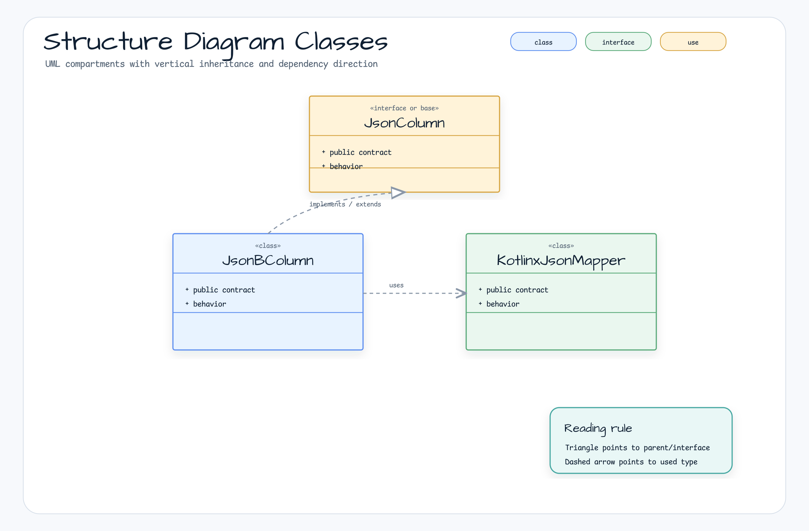
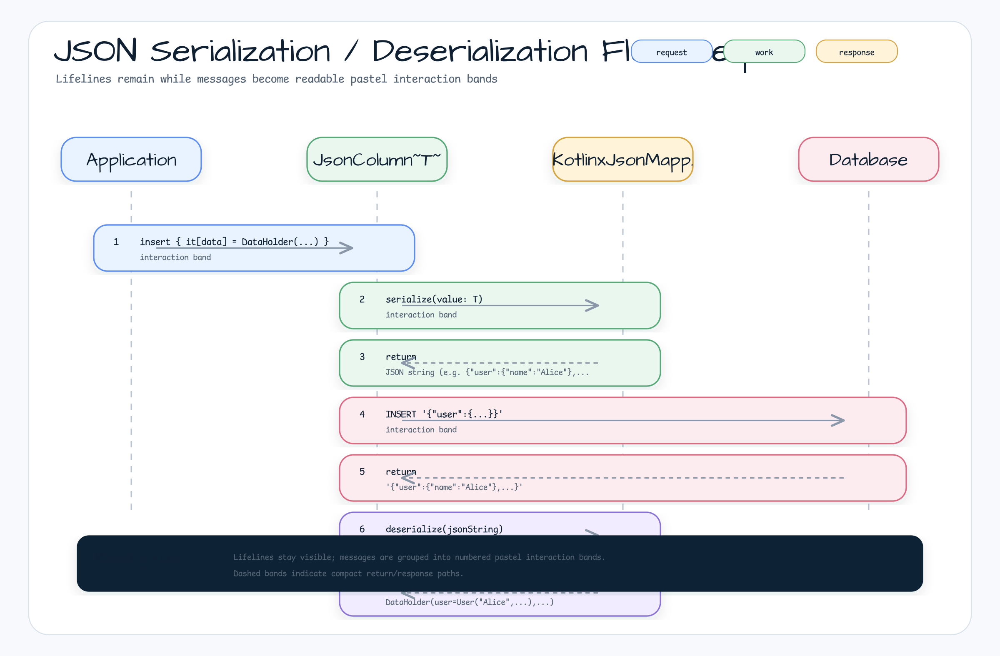
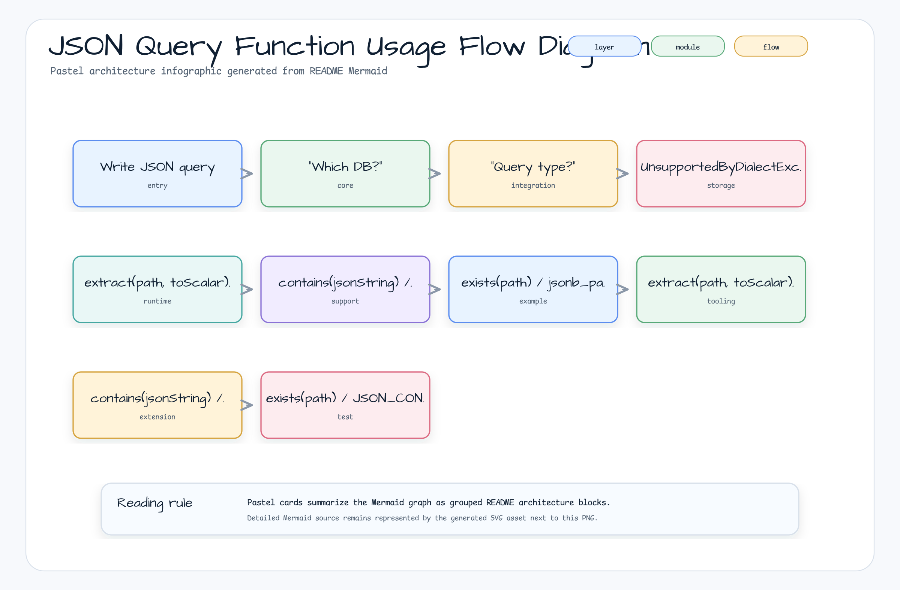

> 한국어 버전: [README.ko.md](README.ko.md)

# 04 Exposed R2DBC JSON (JSON/JSONB Support)

This module covers how to map `@Serializable` Kotlin classes to native database `JSON` and `JSONB` columns using the `exposed-json` extension. You can store complex, schema-less data directly in a relational database and leverage powerful database-specific JSON query functions.

This feature is built on the `kotlinx.serialization` library.

## Learning Objectives

- Define table columns mapped to `JSON` and `JSONB` data types
- Store and retrieve complex, nested Kotlin objects and collections in a single column
- Query specific fields within a JSON object using the `.extract<T>()` function
- Filter based on data existence within JSON structures using `.contains()` and `.exists()` operators
- Understand the differences between `json` and `jsonb` column types
- Apply JSON columns in both DSL and DAO styles

## Core Concepts

### `json` vs `jsonb`

| Type                           | Description                               | Trade-offs                                                      |
|--------------------------------|-------------------------------------------|-----------------------------------------------------------------|
| `json<T>(name, jsonMapper)`    | Stored as a plain text `JSON` string      | Faster writes but slower queries; preserves whitespace and duplicate keys |
| `jsonb<T>(name, jsonMapper)`   | Stored in a decomposed binary format      | Slightly slower writes but much faster queries; supports indexing |

**Recommendation**: Use `jsonb` if the database supports it (e.g., PostgreSQL) and you need to query JSON data.

### JSON Support by DB

| DB         | `json` | `jsonb` | `.extract()` | `.contains()` | `.exists()` |
|------------|--------|---------|--------------|---------------|-------------|
| PostgreSQL | Yes    | Yes     | Yes          | Yes (`@>`)    | Yes         |
| MySQL 8    | Yes    | No      | Yes          | Yes           | Yes         |
| MariaDB    | Yes    | No      | Yes          | Limited       | Limited     |
| H2         | Yes    | No      | No           | No            | No          |
| SQLServer  | No     | No      | No           | No            | No          |
| Oracle     | No     | No      | No           | No            | No          |

> Most JSON query functions throw `UnsupportedByDialectException` on H2, SQLServer, and Oracle.
> Use PostgreSQL or MySQL 8 if you need extensive JSON querying.

### Query Functions

| Function                        | Description                                                                                                                      |
|---------------------------------|----------------------------------------------------------------------------------------------------------------------------------|
| `.extract<T>(path, toScalar)`   | Extracts a value at a specific path from the JSON document. Path syntax varies by database (MySQL: `.user.name`, PostgreSQL: `"user", "name"`) |
| `.contains(value, path)`        | Checks if the JSON document contains the given JSON-formatted string as a value. Uses the efficient `@>` operator in PostgreSQL.  |
| `.exists(path, optional)`       | Checks if a value exists at the given JSONPath expression.                                                                       |

## Example Overview

### `JsonTestData.kt`

Defines `@Serializable` data classes (`User`, `DataHolder`, `UserGroup`) and Exposed `Table` objects (`JsonTable`, `JsonBTable`) used throughout the examples.

### `Ex01_JsonColumn.kt` (DSL & DAO with `json`)

Demonstrates the usage of the `json` column type.

- **DSL**: How to `insert`, `update`, and `select` using the DSL
- **DAO**: How to use a `json` column as a property in the DAO pattern using the `JsonEntity` class
- **Queries**: Extracting values with `.extract<T>()`, filtering records with `.contains()` and `.exists()`

### `Ex02_JsonBColumn.kt` (DSL & DAO with `jsonb`)

Similar to `Ex01_JsonColumn.kt` but uses the higher-performance `jsonb` column type. The code is nearly identical, illustrating that the key difference lies in the table definition and underlying database performance and capabilities.

## Structure Diagram



> `JsonBColumn`: PostgreSQL only (supports indexing and operators)

> `json`: Supported by all DBs (H2, MySQL, MariaDB, PostgreSQL) — text storage, slower queries
> `jsonb`: PostgreSQL only — binary storage, supports indexing and `@>` operator, faster queries

## JSON Serialization/Deserialization Flow



## JSON Query Function Usage Flow



## Code Examples

### 1. Defining a Table with a `jsonb` Column

```kotlin
import org.jetbrains.exposed.v1.json.jsonb
import kotlinx.serialization.Serializable
import kotlinx.serialization.json.Json

@Serializable
data class User(val name: String, val team: String?)

@Serializable
data class DataHolder(val user: User, val logins: Int, val active: Boolean)

object UserTable: IntIdTable("users") {
    // The column stores the entire DataHolder object as JSONB
    val data = jsonb<DataHolder>("data", Json.Default)
}
```

### 2. Inserting and Updating JSON Data

```kotlin
// Insert a new record
val id = UserTable.insertAndGetId {
  it[data] = DataHolder(User("John Doe", "A-Team"), 15, true)
}

// Update JSON data in a record
UserTable.update({ UserTable.id eq id }) {
  it[data] = DataHolder(User("John Doe", "A-Team"), 16, false)
}
```

### 3. Querying with `.extract()`

```kotlin
// Extract the 'active' boolean field from the JSONB column
// Note: path syntax may vary by database
val isActive = UserTable.data.extract<Boolean>(".active", toScalar = true)

// Find all inactive users
val inactiveUsers = UserTable.selectAll().where { isActive eq false }.toList()
```

### 4. Creating a JSONB GIN Index (PostgreSQL)

```kotlin
// Creating a GIN index on a JSONB column significantly improves @> operator (contains) query performance.
object UserTable: IntIdTable("users") {
    val data = jsonb<DataHolder>("data", Json.Default)
}

// Use SchemaUtils.createIndex() directly or create manually in DDL:
// CREATE INDEX ON users USING GIN (data);
// CREATE INDEX ON users USING GIN (data jsonb_path_ops);  -- only optimizes @>, smaller index size
```

### 5. Filtering with `.contains()` (PostgreSQL & MySQL)

```kotlin
// Find all users where data contains "active":false
val userIsInactive = UserTable.data.contains("""{"active":false}""")
val result = UserTable.selectAll().where { userIsInactive }.toList()
```

## Running Tests

**Note**: JSON/JSONB features vary significantly by database. Many tests are skipped on databases with limited support (e.g., H2). For best results, run on PostgreSQL.

```bash
# Run all tests in this module
./gradlew :04-exposed-r2dbc-json:test

# Test JSONB column type
./gradlew :04-exposed-r2dbc-json:test --tests "exposed.r2dbc.examples.json.Ex02_JsonBColumn"
```

## References

- [Exposed Json](https://debop.notion.site/Exposed-Json-1c32744526b080a9bee3d7b92463e90c)
