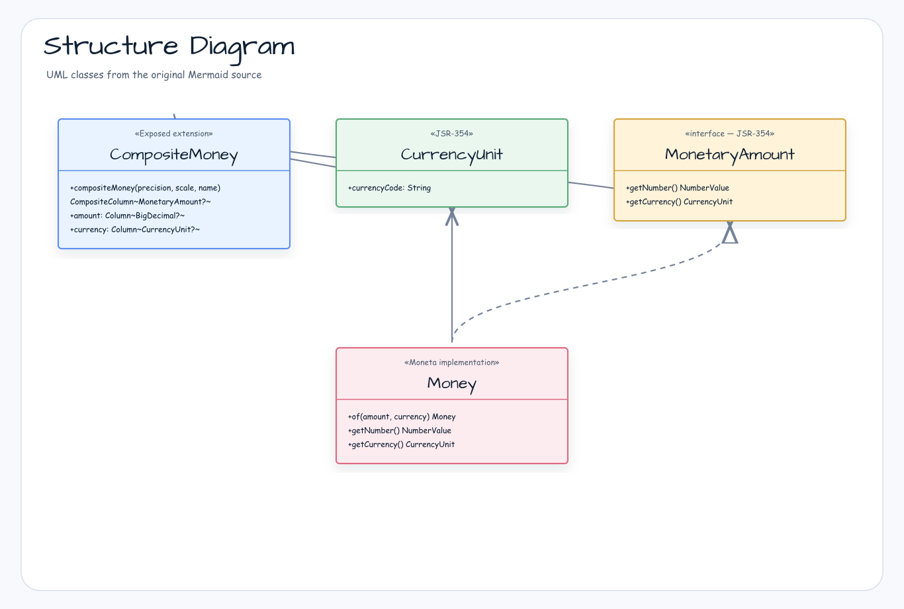
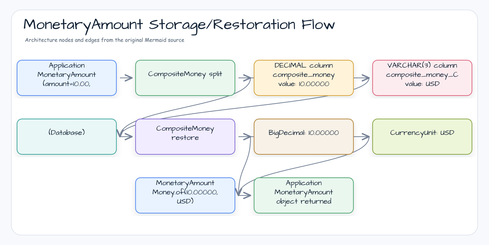
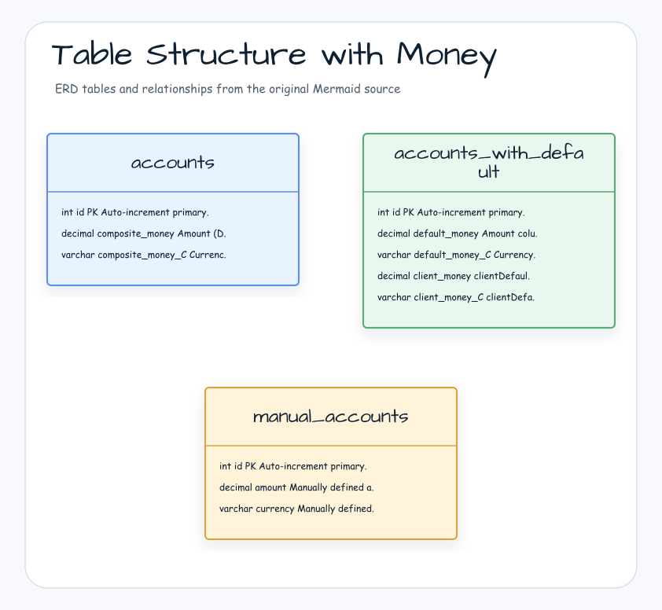

> 한국어 버전: [README.ko.md](README.ko.md)

# 05 Exposed R2DBC Money (Financial Data Handling)

This module covers how to handle monetary values safely and in a structured way using the `exposed-money` extension. It integrates with the JavaMoney (`javax.money`) API, the standard for dealing with money in Java/Kotlin applications. This approach avoids common pitfalls of using `Double` or `Float` for financial calculations and ensures that currency information is always paired with a numeric amount.

## Learning Objectives

- Define columns that store monetary values using `compositeMoney`
- Understand how `compositeMoney` maps a single `MonetaryAmount` object to separate amount and currency columns in the database
- Insert, update, and query monetary data in both DSL and DAO styles
- Access and query individual components (amount and currency) of a monetary column
- Set default values for monetary columns

## Core Concepts

### `compositeMoney`

The heart of this extension is the `compositeMoney()` function. It is a "composite column" that bundles multiple underlying database columns into a single logical property in Kotlin code.

```kotlin
compositeMoney(precision: Int, scale: Int, columnName: String)
```

This function creates and manages two columns in the background:

1. A `DECIMAL` column for the amount (e.g., `DECIMAL(precision, scale)`)
2. A `VARCHAR` column for the currency (e.g., `VARCHAR(3)`). The currency column name is derived by appending `_C` to the `columnName`.

In code, you interact with it as a single `CompositeColumn<MonetaryAmount?>`.

### Accessing Amount and Currency

The `CompositeColumn` returned by `compositeMoney` provides access to its components:

- `.amount`: A `Column<BigDecimal?>` representing the numeric value
- `.currency`: A `Column<CurrencyUnit?>` representing the currency unit

This enables flexible queries filtering by the full `MonetaryAmount`, the amount only, or the currency only.

## Structure Diagram



> `CurrencyUnit`: ISO 4217 code (USD, KRW, etc.)

> `compositeMoney` stores a single property across two DB columns (`DECIMAL` + `VARCHAR(3)`)
> Direct access to `amount` and `currency` sub-columns allows individual filtering

## MonetaryAmount Storage/Restoration Flow



## Table Structure with Money (ER Diagram)



> `compositeMoney` always creates a paired currency column with `_C` suffix — column names can be freely specified when defined manually

## Notes and Limitations

### JSR-354 (JavaMoney API) Dependency

`exposed-money` depends on the `Moneta` library, a JSR-354 implementation. Use `Money.of(amount, currency)` (Moneta) or `moneyOf(amount, currency)` (bluetape4k extension) to create `MonetaryAmount` objects.

```kotlin
// Direct Moneta usage
val tenDollars = Money.of(BigDecimal.TEN, "USD")

// bluetape4k extension (convenience function)
val tenDollars = moneyOf(BigDecimal.TEN, "USD")
```

### Currency Consistency

`compositeMoney` stores amount and currency as **separate DB columns**. Both columns must always be set together:

- If only the amount is NULL in a `nullable()` column, `MonetaryAmount` cannot be restored
- The `VARCHAR(3)` value in the `currency` column must be a valid ISO 4217 currency code
- An invalid currency code throws `UnknownCurrencyException`

### `compositeMoney` vs Manual Column Definition

| Approach                          | Pros                              | Cons                                         |
|-----------------------------------|-----------------------------------|----------------------------------------------|
| `compositeMoney()`                | Convenient single-property access | Amount/currency column names have fixed `_C` suffix |
| Manual (`decimal` + `currency`)   | Column names can be freely set    | More complex code                            |

## Example Overview

### `MoneyData.kt` - Table and Entity Definitions

Defines `AccountTable` and `AccountEntity` showing the basic setup of `compositeMoney`.

- **`AccountTable`**: An `IntIdTable` with a `compositeMoney` column named `composite_money`. Creates `composite_money` (DECIMAL) and `composite_money_C` (VARCHAR) columns in the database.
- **`AccountEntity`**: The corresponding DAO entity. Maps the composite column to a single `money` property of type `MonetaryAmount?`. Also shows how to create convenient delegated properties for direct access to `amount` and `currency`.

### `Ex01_MoneyDefaults.kt` - Default Values

Shows how to set default values for `compositeMoney` columns using both `.default()` for constant values and `.clientDefault()` for lambda-generated values.

### `Ex02_Money.kt` - CRUD and Queries

Provides comprehensive examples for working with monetary columns.

- **Insert**: Inserting a full `MonetaryAmount` object and inserting by setting `.amount` and `.currency` components separately
- **Select**: Retrieving `MonetaryAmount` objects
- **Query**: Finding records using the composite column and its components in `WHERE` clauses
- **Manual composite column**: How to manually create a `compositeMoney` column from existing `decimal` and `currency` columns

## Code Examples

### 1. Defining a Table with a Monetary Column

```kotlin
import org.jetbrains.exposed.v1.money.compositeMoney

internal object AccountTable: IntIdTable("Accounts") {
    // Define a nullable monetary column with 8 total digits and 5 decimal places
    // Creates two DB columns: "composite_money" and "composite_money_C"
    val composite_money = compositeMoney(8, 5, "composite_money").nullable()
}
```

### 2. Handling Money in an Entity (DAO)

```kotlin
internal class AccountEntity(id: EntityID<Int>): IntEntity(id) {
  companion object: EntityClass<Int, AccountEntity>(AccountTable)

  // Full MonetaryAmount object
  var money: MonetaryAmount? by AccountTable.composite_money

  // Direct access to underlying amount and currency
  val amount: BigDecimal? by AccountTable.composite_money.amount
  val currency: CurrencyUnit? by AccountTable.composite_money.currency
}
```

### 3. Inserting and Querying Monetary Values (DSL)

```kotlin
import org.javamoney.moneta.Money

// Create a MonetaryAmount
val tenDollars = Money.of(10, "USD")

// Insert the full object
AccountTable.insert {
    it[composite_money] = tenDollars
}

// Or insert by setting components separately
AccountTable.insert {
    it[composite_money.amount] = BigDecimal("10.00")
    it[composite_money.currency] = // ... get CurrencyUnit for "USD"
}

// Query by full object
val results = AccountTable.selectAll().where { AccountTable.composite_money eq tenDollars }

// Query by currency only
val usdAccounts = AccountTable.selectAll().where { AccountTable.composite_money.currency eq currencyUnitOf("USD") }
```

## Running Tests

```bash
# Run all tests in this module
./gradlew :05-exposed-r2dbc-money:test

# Run a specific test class
./gradlew :05-exposed-r2dbc-money:test --tests "exposed.r2dbc.examples.money.Ex02_Money"
```

## References

- [Exposed Money](https://debop.notion.site/Exposed-Money-1c32744526b08051a216d87ca750d73f)
