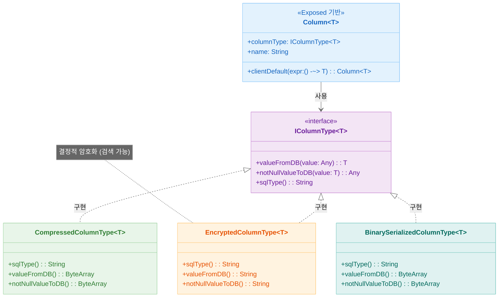
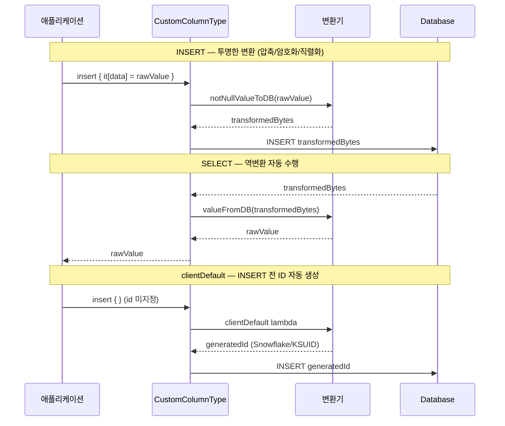
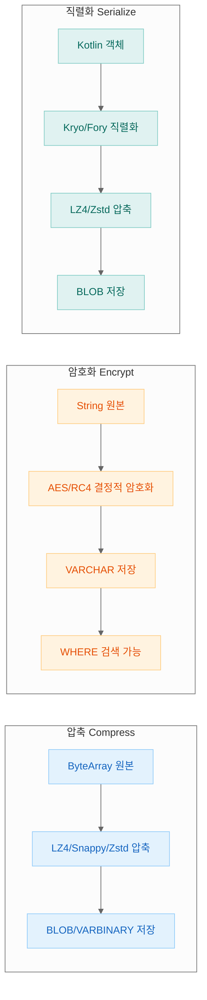

> English version: [README.md](README.md)

# 06 Exposed R2DBC Custom ColumnType (사용자 정의 컬럼 타입)

이 모듈은 커스텀 컬럼 타입과 클라이언트 측 기본값 생성기를 생성하여 Exposed의 기능을 확장하는 고급 예제 모음입니다. 이 기술을 통해 투명한 암호화, 압축, 바이너리 직렬화, 커스텀 ID 생성 등의 기능을 테이블 정의에 직접 추가할 수 있습니다.

## 학습 목표

- 컬럼용 커스텀 클라이언트 측 기본값 생성기 생성 및 사용 (예: 고유 ID용)
- 압축 및 암호화 같은 투명한 데이터 변환을 위한 커스텀 컬럼 타입 구현
- 검색 가능한(결정적) 암호화 컬럼 구축 방법 이해
- 직렬화를 사용하여 임의의 Kotlin 객체를 바이너리 컬럼에 저장하는 방법 학습
- 직렬화와 압축 같은 여러 변환 조합

## 구조 다이어그램



> `IColumnType`의 `valueFromDB`/`notNullValueToDB`를 오버라이드하여 투명한 변환(압축·암호화·직렬화) 구현
> `clientDefault { }` 확장으로 INSERT 전 애플리케이션 측 ID 자동 생성(Snowflake, KSUID 등)

---

## 처리 흐름



## 변환 타입별 비교



## 1. 커스텀 클라이언트 측 기본값 생성기

**(출처: `CustomClientDefaultFunctionsTest.kt`)**

Exposed의 `clientDefault` 메커니즘을 확장 함수로 감싸서 재사용 가능하고 설명적인 ID 생성기를 만들 수 있습니다. 이 함수들은 `INSERT` 문이 데이터베이스로 전송되기
*전에* 애플리케이션에서 호출됩니다.

### 핵심 개념

- **`clientDefault { ... }`**: 값이 제공되지 않으면 람다를 실행하여 기본값을 생성하는 컬럼 정의의 함수
- **확장 함수**: `clientDefault`를 자신만의 함수로 감싸서 깔끔하고 선언적인 API를 생성

### 예제

| 함수                      | 설명                                                   |
|-------------------------|------------------------------------------------------|
| `.timebasedGenerated()` | 시간 기반(버전 1) UUID 생성                                  |
| `.snowflakeGenerated()` | Snowflake 알고리즘을 사용한 k-ordered 고유 `Long` ID 생성        |
| `.ksuidGenerated()`     | 시간 순서이고 사전식으로 정렬 가능한 K-Sortable Unique Identifier 생성 |

### 코드 예제

```kotlin
import io.bluetape4k.exposed.core.ksuidGenerated
import io.bluetape4k.exposed.core.snowflakeGenerated
import org.jetbrains.exposed.v1.core.dao.id.IntIdTable

object ClientGenerated: IntIdTable() {
    // 삽입 시 값이 제공되지 않으면 이 컬럼들은 자동으로 채워집니다
    val snowflake: Column<Long> = long("snowflake").snowflakeGenerated()
    val ksuid: Column<String> = varchar("ksuid", 27).ksuidGenerated()
}

// 사용 (DSL)
ClientGenerated.insert {
    // snowflake나 ksuid 값을 지정할 필요 없음
}

// 사용 (DAO)
class ClientGeneratedEntity(id: EntityID<Int>): IntEntity(id) {
    companion object: IntEntityClass<ClientGeneratedEntity>(ClientGenerated)
    // ...
}
ClientGeneratedEntity.new {
    // 속성이 자동으로 생성됨
}
```

---

## 2. 투명한 압축

**(출처: `compress/`)**

데이터를 데이터베이스에 쓰기 전에 자동으로 압축하고 읽을 때 압축을 해제하는 커스텀 컬럼 타입을 만드는 방법을 보여줍니다. 대용량 `TEXT` 또는 `BLOB` 필드의 저장 공간을 줄이는 데 이상적입니다.

### 핵심 개념

| 함수                                           | 설명                                                  |
|----------------------------------------------|-----------------------------------------------------|
| `compressedBinary(name, length, compressor)` | `VARBINARY` 데이터베이스 컬럼에 매핑되는 커스텀 컬럼 타입               |
| `compressedBlob(name, compressor)`           | `BLOB` 데이터베이스 컬럼에 매핑되는 커스텀 컬럼 타입                    |
| `Compressors`                                | `LZ4`, `Snappy`, `Zstd` 등 다양한 압축 알고리즘을 제공하는 객체/enum |

### 코드 예제

```kotlin
import io.bluetape4k.exposed.core.compress.compressedBlob
import io.bluetape4k.io.compressor.Compressors

private object CompressedTable: IntIdTable() {
    // 이 컬럼은 BLOB 필드에 Zstd로 압축된 데이터를 저장합니다
    val compressedContent = compressedBlob("zstd_blob", Compressors.Zstd).nullable()
}

// 사용
val largeData = "some very long string...".toByteArray()
CompressedTable.insert {
    // `largeData` ByteArray가 여기서 자동으로 압축됩니다
    it[compressedContent] = largeData
}

val row = CompressedTable.selectAll().single()
// 읽을 때 데이터가 자동으로 압축 해제됩니다
val originalData = row[CompressedTable.compressedContent]
```

---

## 3. 검색 가능한(결정적) 암호화

**(출처: `encrypt/`)**

투명하고 **결정적**인 암호화를 위한 커스텀 컬럼 타입을 구현합니다. "결정적"이라는 것은 동일한 입력이 항상 동일한 암호화된 출력을 생성한다는 의미입니다.

이는 비결정적 암호화를 사용하는 `exposed-crypt` 모듈과 중요한 차이점입니다. 보안성은 낮지만, 결정적 암호화는 암호화된 데이터에 대해 `WHERE` 절에서 직접 동등성 검사를 수행할 수 있습니다.

### 핵심 개념

| 함수                                          | 설명                                              |
|---------------------------------------------|-------------------------------------------------|
| `encryptedVarChar(name, length, encryptor)` | 검색 가능한 암호화된 문자열 저장용 커스텀 컬럼                      |
| `encryptedBinary(name, length, encryptor)`  | 검색 가능한 암호화된 바이트 배열 저장용 커스텀 컬럼                   |
| `Encryptors`                                | 결정적 출력으로 구성된 다양한 대칭 암호화 알고리즘(`AES`, `RC4` 등) 제공 |

### 코드 예제

```kotlin
import io.bluetape4k.exposed.core.encrypt.encryptedVarChar
import io.bluetape4k.crypto.encrypt.Encryptors

private object EncryptedUsers: IntIdTable("EncryptedUsers") {
    val email = encryptedVarChar("email", 256, Encryptors.AES)
}

// 사용
val userEmail = "test@example.com"
EncryptedUsers.insert {
    it[email] = userEmail
}

// 암호화가 결정적이므로 평문 값으로 검색할 수 있습니다
val user = EncryptedUsers.selectAll().where { EncryptedUsers.email eq userEmail }.single()

// 조회 시 값이 자동으로 복호화됩니다
user[EncryptedUsers.email] shouldBeEqualTo userEmail
```

---

## 4. 바이너리 직렬화

**(출처: `serialization/`)**

모든 `java.io.Serializable` Kotlin 객체를 바이너리 데이터베이스 컬럼(`VARBINARY` 또는
`BLOB`)에 저장하는 방법을 보여줍니다. 이는 구조화된 데이터 저장을 위한 JSON의 대안이며, 특히 압축과 결합할 때 더 공간 효율적일 수 있습니다.

### 핵심 개념

| 함수                                                    | 설명                                                            |
|-------------------------------------------------------|---------------------------------------------------------------|
| `binarySerializedBinary<T>(name, length, serializer)` | `Serializable` 객체 `T`를 `VARBINARY` 컬럼에 매핑                     |
| `binarySerializedBlob<T>(name, serializer)`           | `Serializable` 객체 `T`를 `BLOB` 컬럼에 매핑                          |
| `BinarySerializers`                                   | 압축 알고리즘과 결합된 다양한 바이너리 직렬화 라이브러리 제공 (예: `LZ4Kryo`, `ZstdFory`) |

### 코드 예제

```kotlin
import io.bluetape4k.exposed.core.serializable.binarySerializedBlob
import io.bluetape4k.io.serializer.BinarySerializers
import java.io.Serializable

// 데이터 클래스는 Serializable이어야 함
data class UserProfile(val username: String, val settings: Map<String, String>): Serializable

private object UserData: IntIdTable("UserData") {
    // UserProfile 객체를 BLOB에 저장, Kryo로 직렬화하고 LZ4로 압축
    val profile = binarySerializedBlob<UserProfile>("profile", BinarySerializers.LZ4Kryo)
}

// 사용
val userProfile = UserProfile("john.doe", mapOf("theme" to "dark", "lang" to "en"))
UserData.insert {
    it[profile] = userProfile
}

// 읽을 때 객체가 자동으로 역직렬화되고 압축 해제됩니다
val retrievedProfile = UserData.selectAll().first()[UserData.profile]
retrievedProfile.settings["theme"] shouldBeEqualTo "dark"
```

## 테스트 실행

```bash
# 이 모듈의 모든 테스트 실행
./gradlew :06-exposed-r2dbc-custom-columns:test

# 특정 기능 테스트 실행 (예: 압축)
./gradlew :06-exposed-r2dbc-custom-columns:test --tests "exposed.examples.custom.columns.compress.*"
```

## 참고 자료

- [Exposed Custom ColumnTypes](https://debop.notion.site/Custom-Columns-1c32744526b0802aa7a8e2e5f08042cb)
