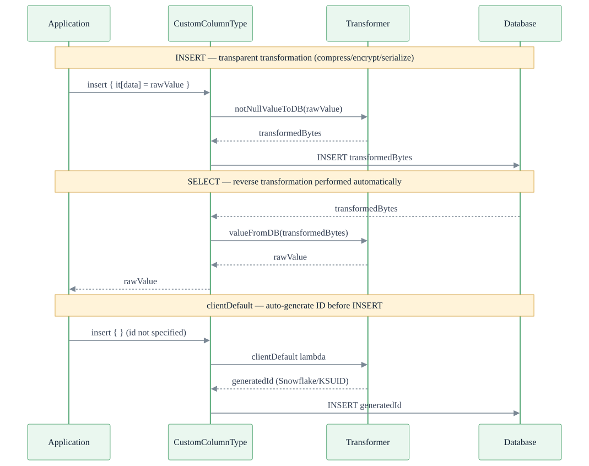

> 한국어 버전: [README.ko.md](README.ko.md)

# 06 Exposed R2DBC Custom ColumnType (Custom Column Types)

This module is a collection of advanced examples for extending Exposed's capabilities by creating custom column types and client-side default value generators. These techniques allow you to add transparent encryption, compression, binary serialization, and custom ID generation directly into your table definitions.

## Learning Objectives

- Create and use custom client-side default value generators for columns (e.g., for unique IDs)
- Implement custom column types for transparent data transformations such as compression and encryption
- Understand how to build searchable (deterministic) encrypted columns
- Learn how to store arbitrary Kotlin objects in binary columns using serialization
- Combine multiple transformations such as serialization and compression

## Structure Diagram



> Override `valueFromDB`/`notNullValueToDB` of `IColumnType` to implement transparent transformations (compression, encryption, serialization)
> Use the `clientDefault { }` extension to auto-generate application-side IDs (Snowflake, KSUID, etc.) before INSERT

---

## Processing Flow



## Comparison by Transformation Type



## 1. Custom Client-Side Default Value Generators

**(Source: `CustomClientDefaultFunctionsTest.kt`)**

You can wrap Exposed's `clientDefault` mechanism in extension functions to create reusable and descriptive ID generators. These functions are called in the application *before* the `INSERT` statement is sent to the database.

### Core Concepts

- **`clientDefault { ... }`**: A function in the column definition that runs a lambda to generate a default value when none is provided
- **Extension functions**: Wrap `clientDefault` in your own functions to create a clean, declarative API

### Examples

| Function                  | Description                                                              |
|---------------------------|--------------------------------------------------------------------------|
| `.timebasedGenerated()`   | Generates a time-based (version 1) UUID                                  |
| `.snowflakeGenerated()`   | Generates a k-ordered unique `Long` ID using the Snowflake algorithm     |
| `.ksuidGenerated()`       | Generates a time-ordered and lexicographically sortable K-Sortable Unique Identifier |

### Code Example

```kotlin
import io.bluetape4k.exposed.core.ksuidGenerated
import io.bluetape4k.exposed.core.snowflakeGenerated
import org.jetbrains.exposed.v1.core.dao.id.IntIdTable

object ClientGenerated: IntIdTable() {
    // These columns are automatically populated if no value is provided at insert time
    val snowflake: Column<Long> = long("snowflake").snowflakeGenerated()
    val ksuid: Column<String> = varchar("ksuid", 27).ksuidGenerated()
}

// Usage (DSL)
ClientGenerated.insert {
    // No need to specify snowflake or ksuid values
}

// Usage (DAO)
class ClientGeneratedEntity(id: EntityID<Int>): IntEntity(id) {
    companion object: IntEntityClass<ClientGeneratedEntity>(ClientGenerated)
    // ...
}
ClientGeneratedEntity.new {
    // Properties are auto-generated
}
```

---

## 2. Transparent Compression

**(Source: `compress/`)**

Shows how to create a custom column type that automatically compresses data before writing to the database and decompresses it when reading. Ideal for reducing storage space for large `TEXT` or `BLOB` fields.

### Core Concepts

| Function                                         | Description                                                        |
|--------------------------------------------------|--------------------------------------------------------------------|
| `compressedBinary(name, length, compressor)`     | Custom column type mapped to a `VARBINARY` database column         |
| `compressedBlob(name, compressor)`               | Custom column type mapped to a `BLOB` database column              |
| `Compressors`                                    | Object/enum providing various compression algorithms: `LZ4`, `Snappy`, `Zstd`, etc. |

### Code Example

```kotlin
import io.bluetape4k.exposed.core.compress.compressedBlob
import io.bluetape4k.io.compressor.Compressors

private object CompressedTable: IntIdTable() {
    // This column stores Zstd-compressed data in a BLOB field
    val compressedContent = compressedBlob("zstd_blob", Compressors.Zstd).nullable()
}

// Usage
val largeData = "some very long string...".toByteArray()
CompressedTable.insert {
    // The `largeData` ByteArray is automatically compressed here
    it[compressedContent] = largeData
}

val row = CompressedTable.selectAll().single()
// Data is automatically decompressed when read
val originalData = row[CompressedTable.compressedContent]
```

---

## 3. Searchable (Deterministic) Encryption

**(Source: `encrypt/`)**

Implements a custom column type for transparent, **deterministic** encryption. "Deterministic" means that the same input always produces the same encrypted output.

This is an important distinction from the `exposed-crypt` module which uses non-deterministic encryption. While less secure, deterministic encryption allows direct equality checks in `WHERE` clauses on encrypted data.

### Core Concepts

| Function                                          | Description                                                                 |
|---------------------------------------------------|-----------------------------------------------------------------------------|
| `encryptedVarChar(name, length, encryptor)`       | Custom column for storing searchable encrypted strings                      |
| `encryptedBinary(name, length, encryptor)`        | Custom column for storing searchable encrypted byte arrays                  |
| `Encryptors`                                      | Provides various symmetric encryption algorithms (`AES`, `RC4`, etc.) configured for deterministic output |

### Code Example

```kotlin
import io.bluetape4k.exposed.core.encrypt.encryptedVarChar
import io.bluetape4k.crypto.encrypt.Encryptors

private object EncryptedUsers: IntIdTable("EncryptedUsers") {
    val email = encryptedVarChar("email", 256, Encryptors.AES)
}

// Usage
val userEmail = "test@example.com"
EncryptedUsers.insert {
    it[email] = userEmail
}

// Since encryption is deterministic, you can search by plaintext value
val user = EncryptedUsers.selectAll().where { EncryptedUsers.email eq userEmail }.single()

// Values are automatically decrypted on retrieval
user[EncryptedUsers.email] shouldBeEqualTo userEmail
```

---

## 4. Binary Serialization

**(Source: `serialization/`)**

Shows how to store any `java.io.Serializable` Kotlin object in a binary database column (`VARBINARY` or `BLOB`). This is an alternative to JSON for structured data storage and can be more space-efficient, especially when combined with compression.

### Core Concepts

| Function                                                  | Description                                                                   |
|-----------------------------------------------------------|-------------------------------------------------------------------------------|
| `binarySerializedBinary<T>(name, length, serializer)`     | Maps a `Serializable` object `T` to a `VARBINARY` column                      |
| `binarySerializedBlob<T>(name, serializer)`               | Maps a `Serializable` object `T` to a `BLOB` column                           |
| `BinarySerializers`                                       | Provides various binary serialization libraries combined with compression algorithms (e.g., `LZ4Kryo`, `ZstdFory`) |

### Code Example

```kotlin
import io.bluetape4k.exposed.core.serializable.binarySerializedBlob
import io.bluetape4k.io.serializer.BinarySerializers
import java.io.Serializable

// Data class must be Serializable
data class UserProfile(val username: String, val settings: Map<String, String>): Serializable

private object UserData: IntIdTable("UserData") {
    // Stores UserProfile objects in a BLOB, serialized with Kryo and compressed with LZ4
    val profile = binarySerializedBlob<UserProfile>("profile", BinarySerializers.LZ4Kryo)
}

// Usage
val userProfile = UserProfile("john.doe", mapOf("theme" to "dark", "lang" to "en"))
UserData.insert {
    it[profile] = userProfile
}

// Objects are automatically deserialized and decompressed on read
val retrievedProfile = UserData.selectAll().first()[UserData.profile]
retrievedProfile.settings["theme"] shouldBeEqualTo "dark"
```

## Running Tests

```bash
# Run all tests in this module
./gradlew :06-exposed-r2dbc-custom-columns:test

# Run tests for a specific feature (e.g., compression)
./gradlew :06-exposed-r2dbc-custom-columns:test --tests "exposed.r2dbc.examples.custom.columns.compress.*"
```

## References

- [Exposed Custom ColumnTypes](https://debop.notion.site/Custom-Columns-1c32744526b0802aa7a8e2e5f08042cb)
