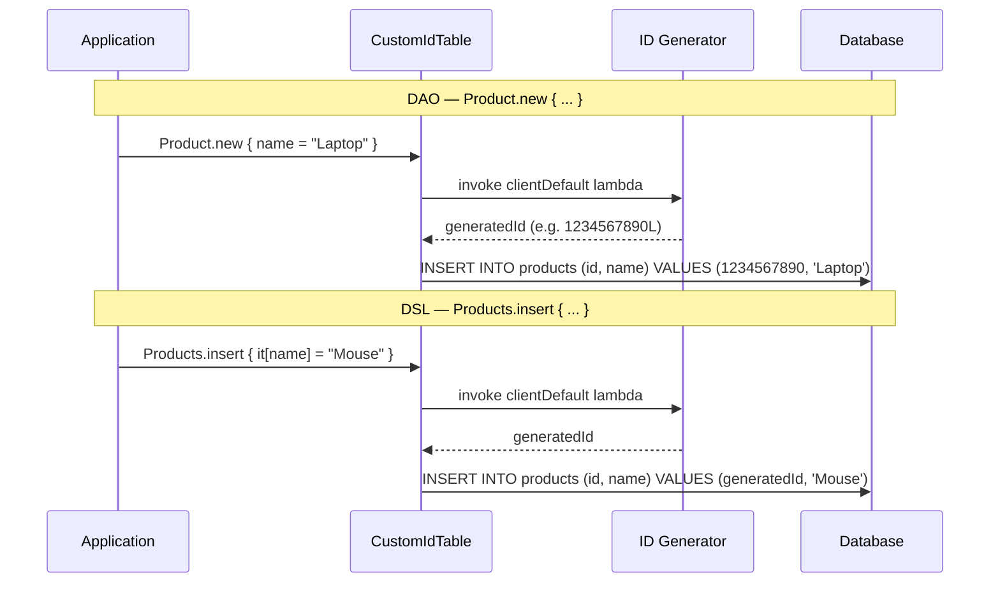
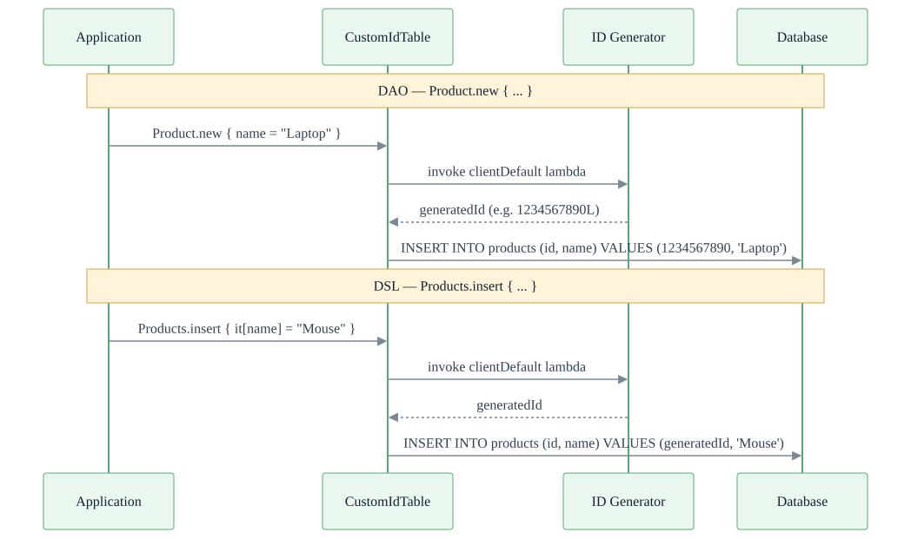

> 한국어 버전: [README.ko.md](README.ko.md)

# 07 Exposed R2DBC Custom Entities (ID Generation Strategies)

This module demonstrates a powerful pattern in Exposed: creating reusable base `Table` and `Entity` classes that encapsulate specific primary key strategies. Instead of manually defining the `id` column and its default generator for every table, you simply inherit from a pre-configured base class.

This approach builds on the concepts from the `06-custom-columns` module, packaging custom client-side default generators into convenient, reusable abstractions.

## Structure Diagram




## ID Generation Flow



## ID Strategy Selection Flowchart



## ID Generation Strategy Comparison

Different ID generation strategies vary in storage type, sortability, and length. Choose the strategy that best fits your use case.

| Base Class                    | ID Type          | Storage Type    | Sortable | Length | Generation Method | Primary Use Case                              |
|-------------------------------|------------------|-----------------|----------|--------|-------------------|-----------------------------------------------|
| `SnowflakeIdTable`            | `Long`           | `BIGINT`        | Millis   | 64bit  | Snowflake algorithm | High-performance numeric IDs for distributed systems |
| `KsuidTable`                  | `String`         | `VARCHAR(27)`   | Seconds  | 27ch   | KSUID (Base62)    | URL-friendly, sortable string IDs             |
| `KsuidMillisTable`            | `String`         | `VARCHAR(27)`   | Millis   | 27ch   | KSUID Millis      | KSUID with millisecond precision              |
| `TimebasedUUIDTable`          | `java.util.UUID` | `UUID`          | 100ns    | 36ch   | UUIDv1            | Systems requiring UUID standard, RFC 4122     |
| `TimebasedUUIDBase62Table`    | `String`         | `VARCHAR(22)`   | 100ns    | 22ch   | UUIDv1 + Base62   | Compact URL-safe representation of time-based UUID |

### Strategy Selection Guide

```
Need a numeric ID?
    YES → SnowflakeIdTable (Long, 64-bit, millis-sorted)

Need a string ID?
    Sortable + UUID standard compliance?
        YES → TimebasedUUIDTable (UUID, 36 chars, RFC 4122)
        Need compact representation?
            YES → TimebasedUUIDBase62Table (String, 22 chars)
    Lexicographic sort + URL-friendly?
        Second precision → KsuidTable (String, 27 chars)
        Millisecond precision → KsuidMillisTable (String, 27 chars)
```

## Learning Objectives

- Understand how to create custom base `IdTable` and `Entity` classes
- Learn how to abstract common ID generation strategies such as Snowflake, KSUID, and time-based UUID
- Simplify table definitions through custom base class inheritance
- Use these custom entities seamlessly in both DSL and DAO patterns

## Provided Examples

This module provides several ready-to-use base table/entity pairs for various ID generation needs.

### SnowflakeIdTable / SnowflakeIdEntity

| Item         | Description                                                   |
|--------------|---------------------------------------------------------------|
| **ID Type**  | `Long`                                                        |
| **Generator**| Generates k-ordered unique `Long` IDs using the Snowflake algorithm |
| **Use Case** | Ideal for distributed systems requiring roughly time-ordered unique numeric IDs |

### KsuidTable / KsuidEntity

| Item         | Description                                              |
|--------------|----------------------------------------------------------|
| **ID Type**  | `String` (varchar 27)                                    |
| **Generator**| Generates K-Sortable Unique Identifiers (KSUID)          |
| **Use Case** | Excellent when IDs need to be both unique and lexicographically sortable by creation time |

### KsuidMillisTable / KsuidMillisEntity

| Item         | Description                                     |
|--------------|-------------------------------------------------|
| **ID Type**  | `String` (varchar 27)                           |
| **Generator**| Generates KSUID with millisecond precision      |
| **Use Case** | Similar to KSUID but with finer time resolution |

### TimebasedUUIDTable / TimebasedUUIDEntity

| Item         | Description                                                |
|--------------|------------------------------------------------------------|
| **ID Type**  | `java.util.UUID`                                           |
| **Generator**| Generates time-based (version 1) UUIDs                    |
| **Use Case** | Useful when you need standard UUID format that is time-ordered |

### TimebasedUUIDBase62Table / TimebasedUUIDBase62Entity

| Item         | Description                                                                                  |
|--------------|----------------------------------------------------------------------------------------------|
| **ID Type**  | `String` (varchar 22)                                                                        |
| **Generator**| Generates time-based UUID and encodes it with Base62 for a shorter, URL-friendly string      |
| **Use Case** | When you need time-ordered UUIDs but want a more compact format than the standard 36-char string |

## How It Works

These base tables are typically implemented as `abstract class` inheriting from `IdTable`. The `id` column is overridden and configured with the desired type and `clientDefault` generator. Corresponding `Entity` and `EntityClass` are also provided to complete the abstraction.

## Code Example: Using SnowflakeIdTable

By inheriting from `SnowflakeIdTable`, you get the `id` column and auto-generation for free.

```kotlin
import io.bluetape4k.exposed.dao.id.SnowflakeIdTable
import io.bluetape4k.exposed.dao.id.SnowflakeIdEntity
import io.bluetape4k.exposed.dao.id.SnowflakeIdEntityClass
import io.bluetape4k.exposed.dao.id.SnowflakeIdEntityID

// 1. Define table by inheriting SnowflakeIdTable
object Products: SnowflakeIdTable("products") {
    val name = varchar("name", 255)
    val price = integer("price")
}

// 2. Define entity by inheriting SnowflakeIdEntity
class Product(id: SnowflakeIdEntityID): SnowflakeIdEntity(id) {
    companion object: SnowflakeIdEntityClass<Product>(Products)

    var name by Products.name
    var price by Products.price
}

// 3. Usage — ID is generated automatically
transaction {
    // DAO style
    val newProduct = Product.new {
        name = "Laptop"
        price = 1200
    }
    // ID already assigned: newProduct.id

    // DSL style
    Products.insert {
        it[name] = "Mouse"
        it[price] = 25
    }
    // Snowflake ID is auto-generated and inserted
}
```

This pattern significantly reduces boilerplate code and ensures a consistent primary key strategy across all tables that use it.

## Running the Tests

The tests in this module demonstrate record creation, batch insertion, and retrieval for each custom ID table type, in both standard and coroutine contexts.

```bash
# Run all tests in this module
./gradlew :07-exposed-r2dbc-custom-entities:test

# Run tests for a specific entity type (e.g. Snowflake)
./gradlew :07-exposed-r2dbc-custom-entities:test --tests "exposed.r2dbc.examples.custom.entities.SnowflakeIdTableTest"

# Run KSUID-based tests
./gradlew :07-exposed-r2dbc-custom-entities:test --tests "exposed.r2dbc.examples.custom.entities.KsuidTableTest"

# Run time-based UUID tests
./gradlew :07-exposed-r2dbc-custom-entities:test --tests "exposed.r2dbc.examples.custom.entities.TimebasedUUIDTableTest"
```

## References

- [Custom IdTable & Entities](https://debop.notion.site/Custom-Table-Entities-1c32744526b0804bad10ea3a0dce6c13)
