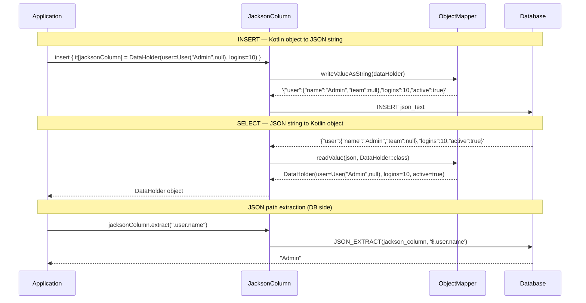

> 한국어 버전: [README.ko.md](README.ko.md)

# 08 Exposed R2DBC Jackson (Jackson-based JSON)

This module covers how to use `JSON` and `JSONB` column types in Exposed with the popular **Jackson** library. It serves as an alternative to the `exposed-json` module (which uses `kotlinx.serialization`) and is ideal for projects already using the Jackson ecosystem.

## Learning Objectives

- Define `json` and `jsonb` columns mapped to Kotlin data classes using Jackson
- Store and retrieve complex nested objects without `@Serializable` annotations
- Use Exposed's full JSON query functions including `.extract<T>()`, `.contains()`, and `.exists()`
- Apply Jackson-based JSON columns in both DSL and DAO programming styles

## Core Concepts

The API of this module is nearly identical to `exposed-json`, but the underlying implementation uses Jackson's `ObjectMapper`.

### Jackson ObjectMapper Configuration Notes

The Jackson column types in `bluetape4k-exposed` share an `ObjectMapper` instance internally.
If customization is needed, be aware of the following:

| Note                                               | Description                                                                          |
|----------------------------------------------------|--------------------------------------------------------------------------------------|
| **KotlinModule registration**                      | `KotlinModule` is automatically registered for deserializing Kotlin data classes     |
| **`@JsonIgnoreProperties(ignoreUnknown = true)`**  | Recommended to prevent deserialization errors on schema changes                      |
| **`WRITE_DATES_AS_TIMESTAMPS`**                    | Default `true` — set to `false` to serialize dates as ISO 8601 strings              |
| **`FAIL_ON_EMPTY_BEANS`**                          | Default `true` — throws on empty bean serialization. Disable with `false` if needed |
| **`FAIL_ON_UNKNOWN_PROPERTIES`**                   | Default `true` — throws on unknown JSON fields. Set `false` for schema evolution     |
| **Thread safety**                                  | `ObjectMapper` is thread-safe, so sharing a single instance is fine                 |

### Key SerializationFeature Options

Jackson's `SerializationFeature` and `DeserializationFeature` provide fine-grained control over serialization/deserialization behavior:

| Option                                               | Default | Description                                                        |
|------------------------------------------------------|---------|--------------------------------------------------------------------|
| `SerializationFeature.INDENT_OUTPUT`                 | `false` | Pretty-print JSON output (useful for debugging)                    |
| `SerializationFeature.WRITE_DATES_AS_TIMESTAMPS`     | `true`  | Serialize dates as numeric timestamps (`false` for ISO 8601)       |
| `SerializationFeature.WRITE_ENUMS_USING_TO_STRING`   | `false` | Serialize enums using `toString()` (default: `name()`)             |
| `SerializationFeature.FAIL_ON_EMPTY_BEANS`           | `true`  | Throw on serialization of beans with no mappable properties        |
| `DeserializationFeature.FAIL_ON_UNKNOWN_PROPERTIES`  | `true`  | Throw on unknown JSON fields (be careful with schema evolution)    |
| `DeserializationFeature.USE_BIG_DECIMAL_FOR_FLOATS`  | `false` | Deserialize floats as `BigDecimal` (use for precision-critical ops)|

### Column Types

| Type                 | Description                                                                                           |
|----------------------|-------------------------------------------------------------------------------------------------------|
| `jackson<T>(name)`   | Defines a column storing Jackson-compatible object `T` in a standard `JSON` text column               |
| `jacksonb<T>(name)`  | Defines a column storing Jackson-compatible object `T` in an optimized `JSONB` (binary JSON) column. Recommended for PostgreSQL and other supported databases |

Unlike `exposed-json`, data classes do **not** need to be annotated with `@Serializable`. You can use standard Kotlin data classes or POJOs.

### Query Functions

The same powerful query functions are available:

| Function                       | Description                                              |
|--------------------------------|----------------------------------------------------------|
| `.extract<T>(path, toScalar)`  | Extracts the value at a specific path from the JSON document |
| `.contains(value, path)`       | Checks if the JSON document contains the given JSON-formatted string as a value |
| `.exists(path, optional)`      | Checks whether a value exists at the given JSONPath expression |

## Structure Diagram



> No `@Serializable` needed — Jackson `ObjectMapper` handles standard Kotlin data classes directly
> `KotlinModule` is auto-registered to support data class, nullable, and default parameter handling

## JSON Serialization Flow



## Table Structure (ER Diagram)



## Example Overview

### `JacksonSchema.kt`

Defines data classes (`User`, `DataHolder`) and Exposed `Table` objects (`JacksonTable`, `JacksonBTable`). Also includes DAO `Entity` classes (`JacksonEntity`, `JacksonBEntity`) and test helper functions.

### `JacksonColumnTest.kt` (DSL & DAO with `json`)

Demonstrates usage of the `json` (text-based JSON) column type:

- `INSERT`, `UPDATE`, `UPSERT`, `SELECT` operations
- Queries using `.extract()`, `.contains()`, `.exists()`
- Using columns inside DAO entities
- Handling collections and nullable JSON columns

### `JacksonBColumnTest.kt` (DSL & DAO with `jsonb`)

Similar to `JacksonColumnTest.kt` but uses the higher-performance `jacksonb` column type. The code is nearly identical, demonstrating the API consistency.

## Code Examples

### 1. Define a table with a `jacksonb` column

```kotlin
import io.bluetape4k.exposed.core.jackson.jackson
import io.bluetape4k.exposed.core.jackson.jacksonb

// Standard data classes — no @Serializable needed
data class User(val name: String, val team: String?)
data class DataHolder(val user: User, val logins: Int, val active: Boolean, val team: String?)

object JacksonTable: IntIdTable("jackson_table") {
    // Column stores DataHolder objects as JSON using Jackson
    val jacksonColumn = jackson<DataHolder>("jackson_column")
}

object JacksonBTable: IntIdTable("jackson_b_table") {
    // Column stores DataHolder objects as JSONB using Jackson (PostgreSQL)
    val jacksonBColumn = jacksonb<DataHolder>("jackson_b_column")
}
```

### 2. Insert and query with Jackson (DSL)

```kotlin
val user = User("Admin", null)
val data = DataHolder(user, logins = 10, active = true, team = null)

// Insert data
JacksonTable.insert {
    it[jacksonColumn] = data
}

// Extract nested value and use in WHERE clause
// Note: path syntax may vary by database
val username = JacksonTable.jacksonColumn.extract<String>(".user.name")
val row = JacksonTable.selectAll().where { username eq "Admin" }.single()

// Entire object is automatically deserialized on read
val retrieved = row[JacksonTable.jacksonColumn]
retrieved.logins shouldBeEqualTo 10
```

### 3. Use a Jackson column in an entity (DAO)

```kotlin
class JacksonEntity(id: EntityID<Int>): IntEntity(id) {
    companion object: IntEntityClass<JacksonEntity>(JacksonTable)

    // Property is automatically mapped to/from JSON
    var jacksonColumn by JacksonTable.jacksonColumn
}

// Create a new entity
val entity = JacksonEntity.new {
    jacksonColumn = DataHolder(User("dao_user", "B"), logins = 1, active = true, team = "B")
}

// Access property
println(entity.jacksonColumn.user.name) // prints "dao_user"
```

## Running the Tests

**Note**: JSON/JSONB features vary significantly by database. Many tests are skipped on databases with limited support (e.g. H2). For best results, run with PostgreSQL.

```bash
# Run all tests in this module
./gradlew :08-exposed-r2dbc-jackson:test

# Test the JSONB column type
./gradlew :08-exposed-r2dbc-jackson:test --tests "exposed.r2dbc.examples.jackson.JacksonBColumnTest"
```

## References

- [Exposed Jackson](https://debop.notion.site/Exposed-Jackson-1c32744526b0809599a7db2e629a597a)
