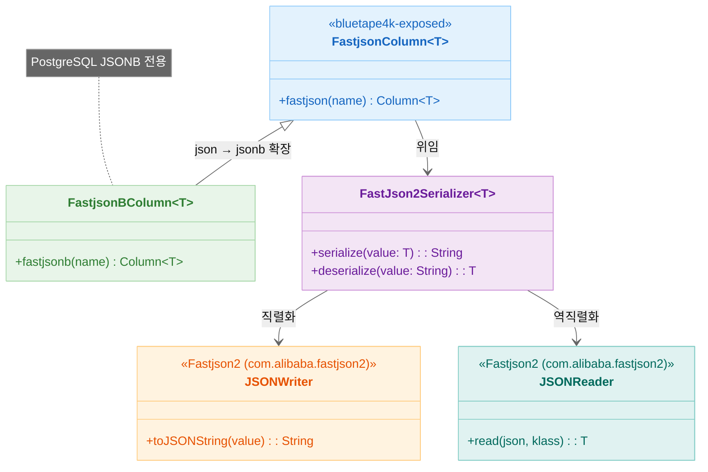
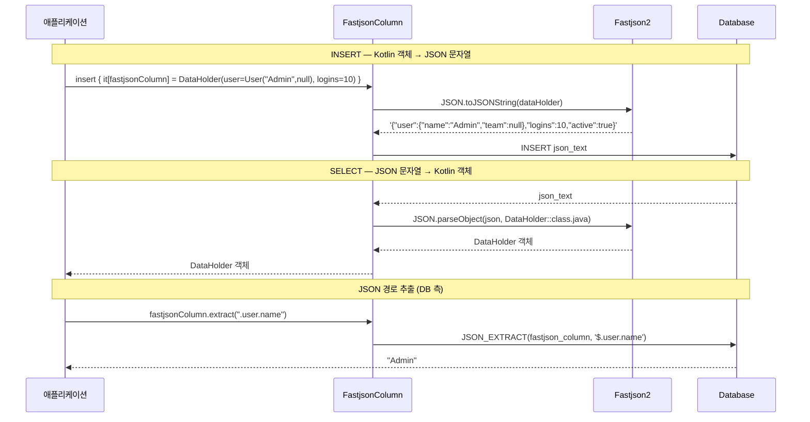
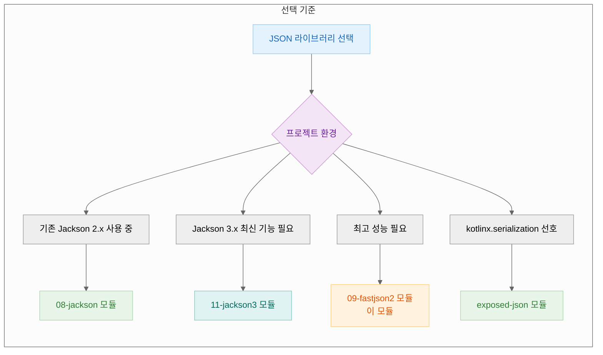

> English version: [README.md](README.md)

# 09 Exposed R2DBC Fastjson2 (Fastjson2 기반 JSON)

이 모듈은 Alibaba의 **Fastjson2** 라이브러리를 Exposed와 통합하여 `JSON`과
`JSONB` 컬럼 타입을 처리하는 방법을 학습합니다. Fastjson2는 JSON 직렬화 및 역직렬화에서 뛰어난 성능으로 알려져 있어, JSON 처리 속도가 중요한 애플리케이션에 적합합니다.

## 학습 목표

- Fastjson2를 사용하여 Kotlin 데이터 클래스에 매핑되는 `json`과 `jsonb` 컬럼 정의
- Fastjson2로 복잡하고 중첩된 객체를 효율적으로 저장 및 조회
- Fastjson2 기반 컬럼에서 Exposed의 JSON 쿼리 함수(`.extract<T>()`, `.contains()`, `.exists()`) 활용
- DSL과 DAO 프로그래밍 스타일 모두에서 Fastjson2 기반 JSON 컬럼 적용

## 핵심 개념

이 모듈의 API와 기능은 `exposed-json`(`kotlinx.serialization` 사용) 및
`exposed-jackson`(Jackson 사용)과 매우 유사하지만, 기본 직렬화 엔진으로 Fastjson2를 사용합니다.

### 컬럼 타입

| 타입                   | 설명                                                                                              |
|----------------------|-------------------------------------------------------------------------------------------------|
| `fastjson<T>(name)`  | 표준 `JSON` 텍스트 컬럼에 Fastjson2 호환 객체 `T`를 저장하는 컬럼 정의                                               |
| `fastjsonb<T>(name)` | 최적화된 `JSONB` (바이너리 JSON) 컬럼에 Fastjson2 호환 객체 `T`를 저장하는 컬럼 정의. PostgreSQL 등 지원 데이터베이스에서 일반적으로 권장 |

Jackson 통합과 유사하게 데이터 클래스에 특별한 어노테이션이 **필요하지 않습니다**. Fastjson2는 일반적으로 리플렉션을 사용하여 표준 Kotlin 데이터 클래스나 POJO를 처리할 수 있습니다.

### 쿼리 함수

Exposed가 제공하는 동일한 강력한 JSON 쿼리 함수 세트를 사용할 수 있습니다:

| 함수                            | 설명                               |
|-------------------------------|----------------------------------|
| `.extract<T>(path, toScalar)` | JSON 문서에서 특정 경로의 값 추출            |
| `.contains(value, path)`      | JSON 문서에 주어진 JSON 값이 포함되어 있는지 확인 |
| `.exists(path, optional)`     | 주어진 JSONPath 표현식에 키나 값이 존재하는지 확인 |

## 구조 다이어그램



> 어노테이션 불필요 — Fastjson2 리플렉션 기반으로 표준 Kotlin 데이터 클래스·POJO 처리
> Jackson 대비 직렬화/역직렬화 속도 우위, JSON 처리 성능이 중요한 서비스에 적합

## JSON 직렬화 흐름



## JSON 라이브러리 비교



## 예제 개요

### `FastjsonSchema.kt`

데이터 클래스(`User`, `DataHolder`)와 Exposed `Table` 객체(`FastjsonTable`, `FastjsonBTable`)를 정의합니다. DAO `Entity` 클래스(
`FastjsonEntity`, `FastjsonBEntity`)와 테스트 헬퍼 함수도 포함합니다.

### `FastjsonColumnTest.kt` (DSL & DAO with `json`)

`fastjson` (텍스트 기반 JSON) 컬럼 타입의 사용법을 보여줍니다. 표준 CRUD 작업과 `.extract()`, `.contains()`,
`.exists()`를 사용한 JSON 특정 쿼리를 다룹니다. DAO 패턴과의 통합도 보여줍니다.

### `FastjsonBColumnTest.kt` (DSL & DAO with `jsonb`)

`FastjsonColumnTest.kt`와 유사하지만 `fastjsonb` 컬럼 타입에 초점을 맞춥니다. 코드는 유사하게 구성되어 `json`과 `jsonb` 타입 간의 일관된 API를 강조합니다.

## 코드 예제

### 1. `fastjsonb` 컬럼이 있는 테이블 정의

```kotlin
import io.bluetape4k.exposed.core.fastjson2.fastjson
import io.bluetape4k.exposed.core.fastjson2.fastjsonb
import com.alibaba.fastjson2.annotation.JSONField // 선택사항, 커스터마이징용

// 표준 데이터 클래스
data class User(val name: String, val team: String?)
data class DataHolder(val user: User, val logins: Int, val active: Boolean, val team: String?)

object FastjsonTable: IntIdTable("fastjson_table") {
    // DataHolder 객체를 Fastjson2를 사용하여 JSON으로 저장
    val fastjsonColumn = fastjson<DataHolder>("fastjson_column")
}

object FastjsonBTable: IntIdTable("fastjson_b_table") {
    // DataHolder 객체를 Fastjson2를 사용하여 JSONB로 저장 (PostgreSQL)
    val fastjsonBColumn = fastjsonb<DataHolder>("fastjson_b_column")
}
```

### 2. Fastjson2로 삽입 및 쿼리 (DSL)

```kotlin
val user = User("Admin", null)
val data = DataHolder(user, logins = 10, active = true, team = null)

// 데이터 삽입
FastjsonTable.insert {
    it[fastjsonColumn] = data
}

// 중첩된 값 추출 후 WHERE 절에서 사용
// 참고: 경로 문법은 데이터베이스마다 다를 수 있음
val username = FastjsonTable.fastjsonColumn.extract<String>(".user.name")
val row = FastjsonTable.selectAll().where { username eq "Admin" }.single()

// 읽을 때 전체 객체가 자동으로 역직렬화됨
val retrieved = row[FastjsonTable.fastjsonColumn]
retrieved.logins shouldBeEqualTo 10
```

### 3. 엔티티에서 Fastjson2 컬럼 사용 (DAO)

```kotlin
class FastjsonEntity(id: EntityID<Int>): IntEntity(id) {
    companion object: IntEntityClass<FastjsonEntity>(FastjsonTable)

    // 속성이 JSON으로/에서 자동 매핑됨
    var fastjsonColumn by FastjsonTable.fastjsonColumn
}

// 새 엔티티 생성
val entity = FastjsonEntity.new {
    fastjsonColumn = DataHolder(User("dao_user", "B"), logins = 1, active = true, team = "B")
}

// 속성 접근
println(entity.fastjsonColumn.user.name) // "dao_user" 출력
```

## 테스트 실행

**참고**: JSON/JSONB 기능은 데이터베이스에 따라 크게 달라집니다. 많은 테스트가 제한된 지원을 가진 데이터베이스(예: H2)에서는 건너뜁니다. 최상의 결과를 위해 PostgreSQL에서 실행하세요.

```bash
# 이 모듈의 모든 테스트 실행
./gradlew :09-exposed-r2dbc-fastjson2:test

# FastjsonB 컬럼 타입 테스트
./gradlew :09-exposed-r2dbc-fastjson2:test --tests "exposed.r2dbc.examples.fastjson2.FastjsonBColumnTest"
```

## 참고 자료

- [Exposed Fastjson2](https://debop.notion.site/Exposed-Fastjson2-1c32744526b08050a9d4de947c3b3f0d)
