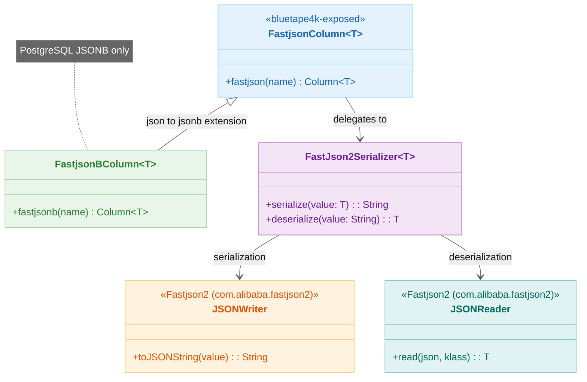
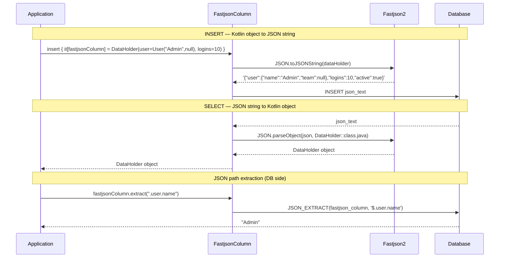
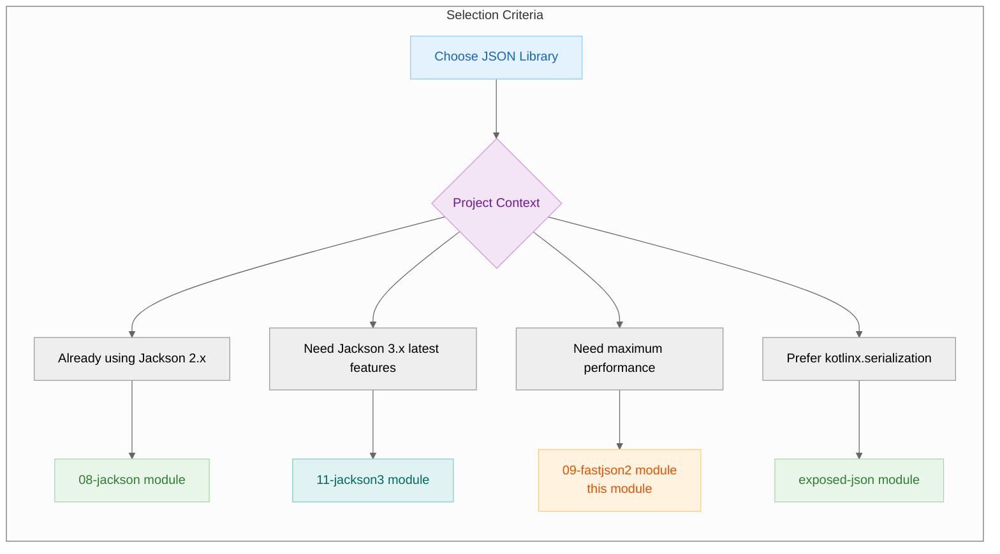

> 한국어 버전: [README.ko.md](README.ko.md)

# 09 Exposed R2DBC Fastjson2 (Fastjson2-based JSON)

This module covers how to integrate Alibaba's **Fastjson2** library with Exposed to handle `JSON` and `JSONB` column types. Fastjson2 is known for its excellent performance in JSON serialization and deserialization, making it ideal for applications where JSON processing speed matters.

## Learning Objectives

- Define `json` and `jsonb` columns mapped to Kotlin data classes using Fastjson2
- Efficiently store and retrieve complex nested objects with Fastjson2
- Use Exposed's JSON query functions (`.extract<T>()`, `.contains()`, `.exists()`) on Fastjson2-based columns
- Apply Fastjson2-based JSON columns in both DSL and DAO programming styles

## Core Concepts

The API and features of this module are very similar to `exposed-json` (using `kotlinx.serialization`) and `exposed-jackson` (using Jackson), but use Fastjson2 as the underlying serialization engine.

### Column Types

| Type                    | Description                                                                                                          |
|-------------------------|----------------------------------------------------------------------------------------------------------------------|
| `fastjson<T>(name)`     | Defines a column storing Fastjson2-compatible object `T` in a standard `JSON` text column                            |
| `fastjsonb<T>(name)`    | Defines a column storing Fastjson2-compatible object `T` in an optimized `JSONB` (binary JSON) column. Generally recommended for PostgreSQL and other supported databases |

Similar to the Jackson integration, data classes do **not** require special annotations. Fastjson2 can generally handle standard Kotlin data classes or POJOs using reflection.

### Query Functions

The same powerful set of JSON query functions provided by Exposed is available:

| Function                       | Description                                              |
|--------------------------------|----------------------------------------------------------|
| `.extract<T>(path, toScalar)`  | Extracts the value at a specific path from the JSON document |
| `.contains(value, path)`       | Checks if the JSON document contains the given JSON value |
| `.exists(path, optional)`      | Checks whether a key or value exists at the given JSONPath expression |

## Structure Diagram



> No annotations required — Fastjson2 handles standard Kotlin data classes and POJOs via reflection
> Faster serialization/deserialization than Jackson; suitable for services where JSON processing performance is critical

## JSON Serialization Flow



## JSON Library Comparison



## Example Overview

### `FastjsonSchema.kt`

Defines data classes (`User`, `DataHolder`) and Exposed `Table` objects (`FastjsonTable`, `FastjsonBTable`). Also includes DAO `Entity` classes (`FastjsonEntity`, `FastjsonBEntity`) and test helper functions.

### `FastjsonColumnTest.kt` (DSL & DAO with `json`)

Demonstrates usage of the `fastjson` (text-based JSON) column type. Covers standard CRUD operations and JSON-specific queries using `.extract()`, `.contains()`, and `.exists()`. Also shows integration with the DAO pattern.

### `FastjsonBColumnTest.kt` (DSL & DAO with `jsonb`)

Similar to `FastjsonColumnTest.kt` but focused on the `fastjsonb` column type. The code is similarly structured to highlight the consistent API between `json` and `jsonb` types.

## Code Examples

### 1. Define a table with a `fastjsonb` column

```kotlin
import io.bluetape4k.exposed.core.fastjson2.fastjson
import io.bluetape4k.exposed.core.fastjson2.fastjsonb
import com.alibaba.fastjson2.annotation.JSONField // optional, for customization

// Standard data classes
data class User(val name: String, val team: String?)
data class DataHolder(val user: User, val logins: Int, val active: Boolean, val team: String?)

object FastjsonTable: IntIdTable("fastjson_table") {
    // Column stores DataHolder objects as JSON using Fastjson2
    val fastjsonColumn = fastjson<DataHolder>("fastjson_column")
}

object FastjsonBTable: IntIdTable("fastjson_b_table") {
    // Column stores DataHolder objects as JSONB using Fastjson2 (PostgreSQL)
    val fastjsonBColumn = fastjsonb<DataHolder>("fastjson_b_column")
}
```

### 2. Insert and query with Fastjson2 (DSL)

```kotlin
val user = User("Admin", null)
val data = DataHolder(user, logins = 10, active = true, team = null)

// Insert data
FastjsonTable.insert {
    it[fastjsonColumn] = data
}

// Extract nested value and use in WHERE clause
// Note: path syntax may vary by database
val username = FastjsonTable.fastjsonColumn.extract<String>(".user.name")
val row = FastjsonTable.selectAll().where { username eq "Admin" }.single()

// Entire object is automatically deserialized on read
val retrieved = row[FastjsonTable.fastjsonColumn]
retrieved.logins shouldBeEqualTo 10
```

### 3. Use a Fastjson2 column in an entity (DAO)

```kotlin
class FastjsonEntity(id: EntityID<Int>): IntEntity(id) {
    companion object: IntEntityClass<FastjsonEntity>(FastjsonTable)

    // Property is automatically mapped to/from JSON
    var fastjsonColumn by FastjsonTable.fastjsonColumn
}

// Create a new entity
val entity = FastjsonEntity.new {
    fastjsonColumn = DataHolder(User("dao_user", "B"), logins = 1, active = true, team = "B")
}

// Access property
println(entity.fastjsonColumn.user.name) // prints "dao_user"
```

## Running the Tests

**Note**: JSON/JSONB features vary significantly by database. Many tests are skipped on databases with limited support (e.g. H2). For best results, run with PostgreSQL.

```bash
# Run all tests in this module
./gradlew :09-exposed-r2dbc-fastjson2:test

# Test the FastjsonB column type
./gradlew :09-exposed-r2dbc-fastjson2:test --tests "exposed.r2dbc.examples.fastjson2.FastjsonBColumnTest"
```

## References

- [Exposed Fastjson2](https://debop.notion.site/Exposed-Fastjson2-1c32744526b08050a9d4de947c3b3f0d)
