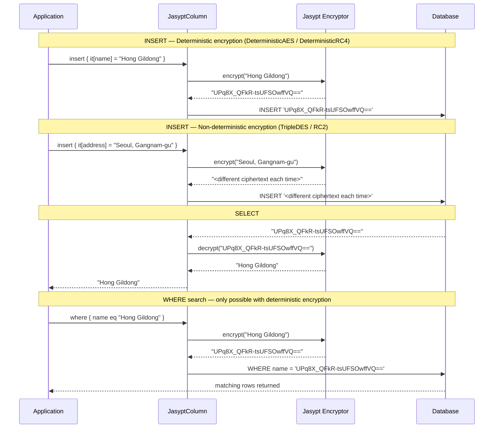
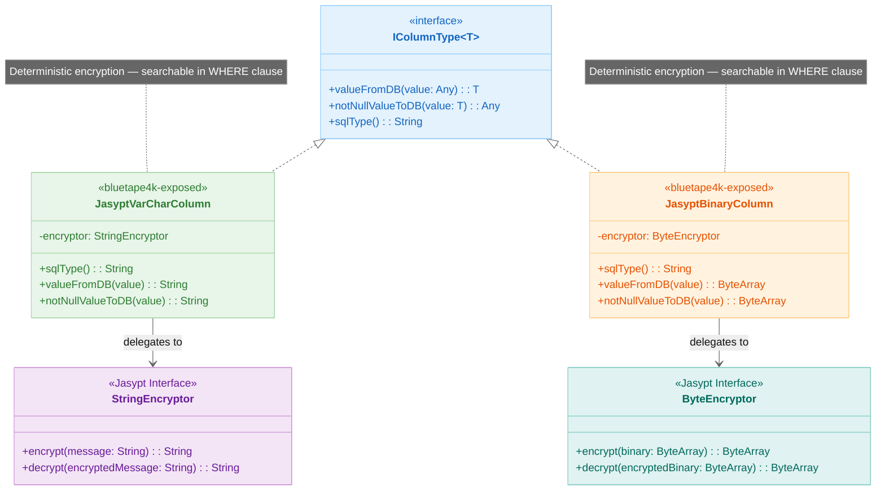

> 한국어 버전: [README.ko.md](README.ko.md)

# 10 Exposed R2DBC Jasypt (Deterministic Encryption)

This module covers how to integrate the **Jasypt (Java Simplified Encryption)** library with Exposed to provide transparent column encryption and decryption. The key feature of this integration is its **deterministic** nature: the same plaintext input always produces the same ciphertext output. This property allows encrypted data to be used directly in `WHERE` clause equality checks.

This module addresses the limitation of non-deterministic encryption approaches (such as the default `exposed-crypt` module) where encrypted data cannot be queried directly.

## Execution Flow



## Structure Diagram



## Learning Objectives

- Understand how to define Jasypt encryption columns (`jasyptVarChar`, `jasyptBinary`)
- Perform transparent encryption and decryption of string and binary data
- Leverage deterministic encryption to query encrypted columns directly in `WHERE` clauses
- Apply Jasypt encryption columns in both DSL and DAO programming styles

## Core Concepts

### Deterministic Encryption

Unlike many standard encryption schemes that add randomness (salting, IV) to produce different ciphertexts for the same plaintext, Jasypt can be configured to produce consistent ciphertexts. This allows SQL equality comparisons (`WHERE encrypted_column = 'encrypted_value'`) to work correctly.

**Trade-off**: While enabling searchability, deterministic encryption offers weaker cryptographic strength against attacks that exploit patterns in repeated data. It is suitable for scenarios where searchability is a strict requirement and the sensitivity of the data allows for this trade-off.

### Column Types

| Type                                        | Description                                              |
|---------------------------------------------|----------------------------------------------------------|
| `jasyptVarChar(name, length, encryptor)`    | Defines a column that encrypts `String` values using Jasypt |
| `jasyptBinary(name, length, encryptor)`     | Defines a column that encrypts `ByteArray` values using Jasypt |

### Encryptors

The `Encryptors` enum (e.g., `Encryptors.AES`, `Encryptors.RC4`) specifies the encryption algorithm and implicitly handles key management configuration for Jasypt.

## Example Overview

### `JasyptColumnTypeTest.kt` (DSL style)

Demonstrates usage of Jasypt encryption columns within the Exposed DSL.

- **CRUD Operations**: How to `insert` and `update` encrypted `String` and `ByteArray` fields. Encryption/decryption is transparent.
- **Searchability**: Explicitly highlights that encrypted columns can be used in `WHERE` clauses for `eq` comparisons — the key advantage of deterministic encryption.

### `JasyptColumnTypeDaoTest.kt` (DAO style)

Similar to `JasyptColumnTypeTest.kt` but applies the concepts to the Exposed DAO API.

- **Entity mapping**: How `jasyptVarChar` and `jasyptBinary` columns map to entity properties
- **Seamless DAO usage**: CRUD operations on entities are transparent, and queries with encrypted properties work as expected

## Code Examples

### 1. Define a table with Jasypt encryption columns

```kotlin
import io.bluetape4k.exposed.core.jasypt.jasyptVarChar
import io.bluetape4k.exposed.core.jasypt.jasyptBinary
import io.bluetape4k.crypto.encrypt.Encryptors

object UserSecrets: IntIdTable("user_secrets") {
  val username = varchar("username", 255)

  // Encrypted string column for API keys using AES
  // This column is searchable
  val apiKey = jasyptVarChar("api_key", 512, Encryptors.AES)

  // Encrypted binary column for secret tokens using RC4
  // This column is also searchable
  val secretToken = jasyptBinary("secret_token", 256, Encryptors.RC4)
}
```

### 2. Insert and query encrypted data (DSL)

```kotlin
// Insert an encrypted record
val id = UserSecrets.insertAndGetId {
  it[username] = "john.doe"
  it[apiKey] = "my_super_secret_api_key_123"
  it[secretToken] = "binary_token_data".toByteArray()
}

// Retrieve and verify
val retrievedUser = UserSecrets.selectAll().where { UserSecrets.id eq id }.single()
retrievedUser[UserSecrets.username] shouldBeEqualTo "john.doe"
retrievedUser[UserSecrets.apiKey] shouldBeEqualTo "my_super_secret_api_key_123"
retrievedUser[UserSecrets.secretToken].toUtf8String() shouldBeEqualTo "binary_token_data"

// Query by encrypted column (works because encryption is deterministic)
val userByApiKey = UserSecrets.selectAll().where { UserSecrets.apiKey eq "my_super_secret_api_key_123" }.single()
userByApiKey[UserSecrets.username] shouldBeEqualTo "john.doe"
```

## Running the Tests

```bash
# Run all tests in this module
./gradlew :10-exposed-r2dbc-jasypt:test

# Run a specific test class
./gradlew :10-exposed-r2dbc-jasypt:test --tests "exposed.examples.jasypt.JasyptColumnTypeTest"
```

## References

- [Exposed Jasypt](https://debop.notion.site/Exposed-Jasypt-1c32744526b080f08ab2f3e21149e9d7)
- [Exposed Crypt](https://debop.notion.site/Exposed-Crypt-1c32744526b0802da419d5ce74d2c5f3)
