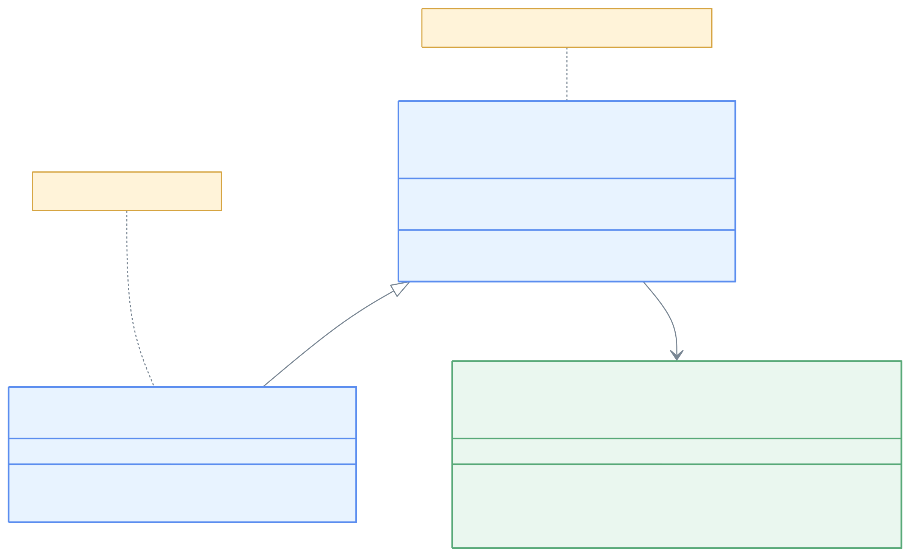
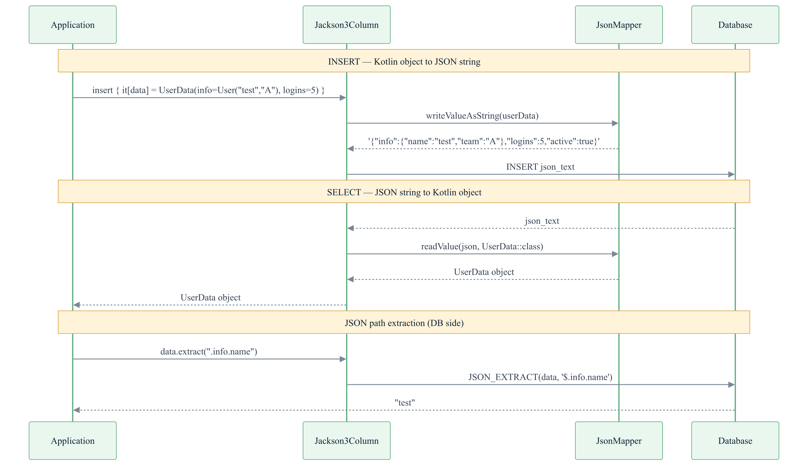
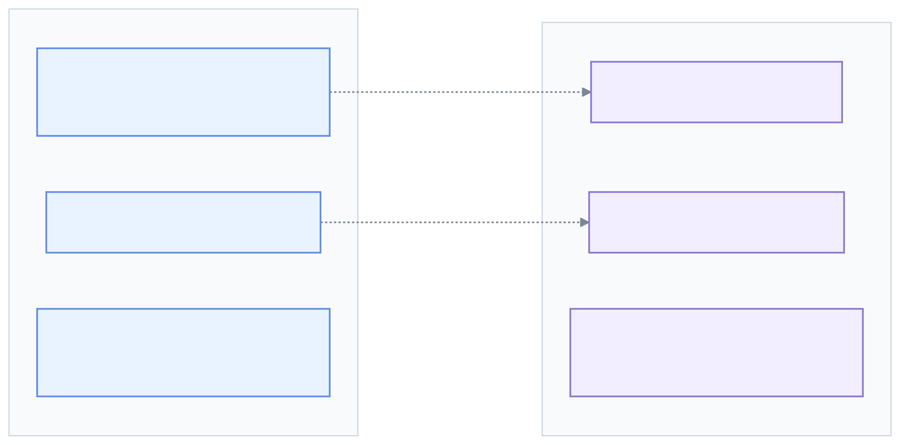

> 한국어 버전: [README.ko.md](README.ko.md)

# 11 Exposed R2DBC Jackson 3 (Jackson 3.x-based JSON)

This module covers how to use `JSON` and `JSONB` column types in Exposed with the **Jackson 3.x** library. It provides the same functionality as the Jackson 2.x-based module but leverages the new features and improvements in Jackson 3.x.

## Learning Objectives

- Define `json` and `jsonb` columns mapped to Kotlin data classes using Jackson 3.x
- Store and retrieve complex nested objects with Jackson 3.x
- Use Exposed's full JSON query functions including `.extract<T>()`, `.contains()`, and `.exists()`
- Apply Jackson 3.x-based JSON columns in both DSL and DAO programming styles

## Core Concepts

### Column Types

| Type                  | Description                                                                    |
|-----------------------|--------------------------------------------------------------------------------|
| `jackson<T>(name)`    | Defines a column storing Jackson 3.x-compatible object `T` in a standard `JSON` text column |
| `jacksonb<T>(name)`   | Defines a column storing Jackson 3.x-compatible object `T` in an optimized `JSONB` (binary JSON) column |

### Query Functions

The same query functions as the Jackson 2.x module are available:

| Function                       | Description                                              |
|--------------------------------|----------------------------------------------------------|
| `.extract<T>(path, toScalar)`  | Extracts the value at a specific path from the JSON document |
| `.contains(value, path)`       | Checks if the JSON document contains the given JSON value |
| `.exists(path, optional)`      | Checks whether a value exists at the given JSONPath expression |

## Structure Diagram



> Jackson 2.x (`com.fasterxml.jackson`) → Jackson 3.x (`tools.jackson`) package change
> `JsonMapper` is the main entry point in Jackson 3.x — replaces `ObjectMapper` from Jackson 2.x

## JSON Serialization Flow



## Jackson 2.x vs 3.x Differences



## Example Overview

### `JacksonColumnTest.kt` (DSL & DAO with `json`)

Demonstrates usage of the `json` (text-based JSON) column type using Jackson 3.x. Covers standard CRUD operations and JSON-specific queries using `.extract()`, `.contains()`, and `.exists()`. Also shows integration with the DAO pattern.

### `JacksonBColumnTest.kt` (DSL & DAO with `jsonb`)

Similar to `JacksonColumnTest.kt` but focused on the `jacksonb` column type. The code is similarly structured to highlight the consistent API between `json` and `jsonb` types.

## Code Examples

### 1. Define a table with a `jacksonb` column using Jackson 3.x

```kotlin
import io.bluetape4k.exposed.core.jackson3.jacksonb
import com.fasterxml.jackson.annotation.JsonCreator // Jackson 3 annotation example

// Standard data classes
data class User(val name: String, val team: String?)
data class UserData(val info: User, val logins: Int, val active: Boolean)

object UsersTable: IntIdTable("users") {
    // Column stores UserData objects as JSONB using Jackson 3.x
    val data = jacksonb<UserData>("data")
}
```

### 2. Insert and query with Jackson 3.x (DSL)

```kotlin
val userData = UserData(info = User("test", "A"), logins = 5, active = true)

// Insert data
UsersTable.insert {
    it[data] = userData
}

// Extract nested value and use in WHERE clause
// Note: path syntax may vary by database
val username = UsersTable.data.extract<String>(".info.name")
val userRecord = UsersTable.selectAll().where { username eq "test" }.single()

// Entire object is automatically deserialized on read
val retrievedData = userRecord[UsersTable.data]
retrievedData.logins shouldBeEqualTo 5
```

### 3. Use a Jackson 3.x column in an entity (DAO)

```kotlin
class UserEntity(id: EntityID<Int>): IntEntity(id) {
    companion object: IntEntityClass<UserEntity>(UsersTable)

    // Property is automatically mapped to/from JSON
    var data by UsersTable.data
}

// Create a new entity
val entity = UserEntity.new {
    data = UserData(info = User("dao_user", "B"), logins = 1, active = true)
}

// Access property
println(entity.data.info.name) // prints "dao_user"
```

## Running the Tests

**Note**: JSON/JSONB features vary significantly by database. Many tests are skipped on databases with limited support (e.g. H2). For best results, run with PostgreSQL.

```bash
# Run all tests in this module
./gradlew :11-exposed-r2dbc-jackson3:test

# Test the JSONB column type
./gradlew :11-exposed-r2dbc-jackson3:test --tests "exposed.r2dbc.examples.jackson3.JacksonBColumnTest"
```

## References

- [Exposed Jackson](https://debop.notion.site/Exposed-Jackson-1c32744526b0809599a7db2e629a597a)
