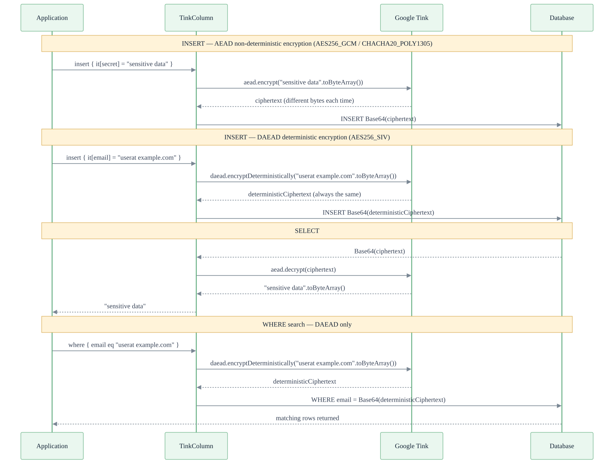

> 한국어 버전: [README.ko.md](README.ko.md)

# 12 Exposed R2DBC Tink (Google Tink-based Encryption)

This module covers how to integrate the **Google Tink** encryption library with Exposed R2DBC to transparently encrypt and decrypt database columns.

Tink is a high-level cryptographic library developed by Google, designed to make safe encryption algorithms easy to use. This module supports two encryption modes:

- **DAEAD** (Deterministic Authenticated Encryption with Associated Data): Deterministic encryption — the same plaintext always produces the same ciphertext → searchable in `WHERE` clauses
- **AEAD** (Authenticated Encryption with Associated Data): Non-deterministic encryption — produces a different ciphertext each time → stronger security but not searchable in `WHERE` clauses

## Execution Flow



## Structure Diagram



## Learning Objectives

- Understand how to define Tink DAEAD/AEAD encryption columns
- Perform transparent encryption and decryption of string and binary data
- Query encrypted columns directly in `WHERE` clauses using DAEAD deterministic encryption
- Understand the trade-offs between AEAD non-deterministic and DAEAD deterministic encryption

## Core Concepts

### DAEAD vs AEAD

| Mode       | Determinism     | WHERE Search | Security Level | Recommended Use                               |
|------------|-----------------|--------------|----------------|-----------------------------------------------|
| **DAEAD**  | Deterministic   | Possible     | Moderate       | Searchable PII (names, email addresses, etc.) |
| **AEAD**   | Non-deterministic | Not possible | High          | Sensitive data that doesn't need searching (addresses, passwords) |

### Column Types

| Function                                          | Encryption Mode | Storage Type | Description                                 |
|---------------------------------------------------|-----------------|--------------|---------------------------------------------|
| `tinkDaeadVarChar(name, length)`                  | DAEAD           | `VARCHAR`    | Deterministic encrypted string column (searchable) |
| `tinkAeadVarChar(name, length, algorithm)`        | AEAD            | `VARCHAR`    | Non-deterministic encrypted string column (not searchable) |
| `tinkAeadBinary(name, length, algorithm)`         | AEAD            | `VARBINARY`  | Non-deterministic encrypted binary column (not searchable) |

### Supported Algorithms (`TinkAeads`)

| Algorithm                       | Description                                           |
|---------------------------------|-------------------------------------------------------|
| `TinkAeads.AES256_GCM`          | AES-256 GCM mode (default) — general purpose, high-performance encryption |
| `TinkAeads.CHACHA20_POLY1305`   | ChaCha20-Poly1305 — software-based high-performance encryption |

## Example Overview

### `TinkColumnTypeTest.kt`

Validates CRUD behavior and searchability of Tink encryption columns in Exposed DSL.

#### Example Table Definition

```kotlin
val stringTable = object: IntIdTable("string_table") {
    // DAEAD: deterministic encryption — searchable in WHERE clause, indexable
    val name    = tinkDaeadVarChar("name", 255).nullable().index()
    val city    = tinkDaeadVarChar("city", 255).nullable().index()

    // AEAD: non-deterministic encryption — not searchable in WHERE clause, stronger security
    val address = tinkAeadBinary("address", 255, TinkAeads.AES256_GCM).nullable()
    val age     = tinkAeadVarChar("age", 255, TinkAeads.CHACHA20_POLY1305).nullable()
}
```

#### Test Scenarios

| Test                                             | Description                                                               |
|--------------------------------------------------|---------------------------------------------------------------------------|
| `encrypt and decrypt for strings`                | Verify transparent decryption on INSERT → SELECT; confirm DAEAD searchable, AEAD not searchable |
| `update an encrypted column`                     | Confirm encrypted value is correctly updated after UPDATE                 |
| `nullable encrypted columns keep null values`    | Confirm that `null` values are preserved in nullable encrypted columns    |

## Code Examples

### 1. Table Definition

```kotlin
import io.bluetape4k.exposed.core.tink.tinkAeadBinary
import io.bluetape4k.exposed.core.tink.tinkAeadVarChar
import io.bluetape4k.exposed.core.tink.tinkDaeadVarChar
import io.bluetape4k.tink.aead.TinkAeads

object UserSecrets: IntIdTable("user_secrets") {
    // DAEAD: email requires login search — use deterministic encryption
    val email = tinkDaeadVarChar("email", 255).index()

    // AEAD: address does not need searching — non-deterministic for stronger security
    val address = tinkAeadVarChar("address", 512, TinkAeads.AES256_GCM).nullable()

    // AEAD Binary: encrypt binary data
    val profileImage = tinkAeadBinary("profile_image", 65535).nullable()
}
```

### 2. Insert data (encryption handled transparently)

```kotlin
val id = UserSecrets.insertAndGetId {
    it[email] = "user@example.com"
    it[address] = "123 Teheran-ro, Gangnam-gu, Seoul"
    it[profileImage] = imageBytes
}
```

### 3. Retrieve data (decryption handled transparently)

```kotlin
val row = UserSecrets.selectAll().where { UserSecrets.id eq id }.single()

row[UserSecrets.email]   // "user@example.com" (auto-decrypted)
row[UserSecrets.address] // "123 Teheran-ro, Gangnam-gu, Seoul" (auto-decrypted)
```

### 4. WHERE search with DAEAD columns (deterministic encryption only)

```kotlin
// DAEAD columns support equality comparison while encrypted
val user = UserSecrets.selectAll()
    .where { UserSecrets.email eq "user@example.com" }
    .single()

// AEAD columns produce a different ciphertext each time — WHERE search is not possible
UserSecrets.selectAll()
    .where { UserSecrets.address eq "123 Teheran-ro, Gangnam-gu, Seoul" }
    .toList()   // always returns empty result
```

## DAEAD vs AEAD Selection Guide

```
Is searching required?
    YES → DAEAD (tinkDaeadVarChar)
           e.g. names, email addresses, phone numbers, partial IDs
    NO  → AEAD (tinkAeadVarChar / tinkAeadBinary)
           e.g. password hints, full addresses, card numbers, biometric data
```

> **Note**: DAEAD always produces the same ciphertext for the same plaintext, making it vulnerable to statistical attacks such as frequency analysis. Use it only when searching is strictly required.

## Comparison with Other Encryption Modules

| Module                              | Encryption Type         | WHERE Search | Library           |
|-------------------------------------|-------------------------|--------------|-------------------|
| `01-exposed-r2dbc-crypt`            | Non-deterministic       | Not possible | Bouncy Castle     |
| `10-exposed-r2dbc-jasypt`           | Deterministic           | Possible     | Jasypt            |
| `12-exposed-r2dbc-tink`             | Deterministic or non-deterministic (selectable) | DAEAD only | Google Tink |
| `06-exposed-r2dbc-custom-columns`   | Custom implementation   | Depends on implementation | Direct AES |

## Running the Tests

```bash
# Run all tests in this module
./gradlew :12-exposed-r2dbc-tink:test

# Run a specific test class
./gradlew :12-exposed-r2dbc-tink:test --tests "exposed.r2dbc.examples.tink.TinkColumnTypeTest"

# Fast test using H2 only
./gradlew :12-exposed-r2dbc-tink:test -PuseFastDB=true
```

## References

- [Google Tink Official Docs](https://developers.google.com/tink)
- [Exposed Crypt](https://debop.notion.site/Exposed-Crypt-1c32744526b0802da419d5ce74d2c5f3)
- [Exposed Jasypt](https://debop.notion.site/Exposed-Jasypt-1c32744526b080f08ab2f3e21149e9d7)
