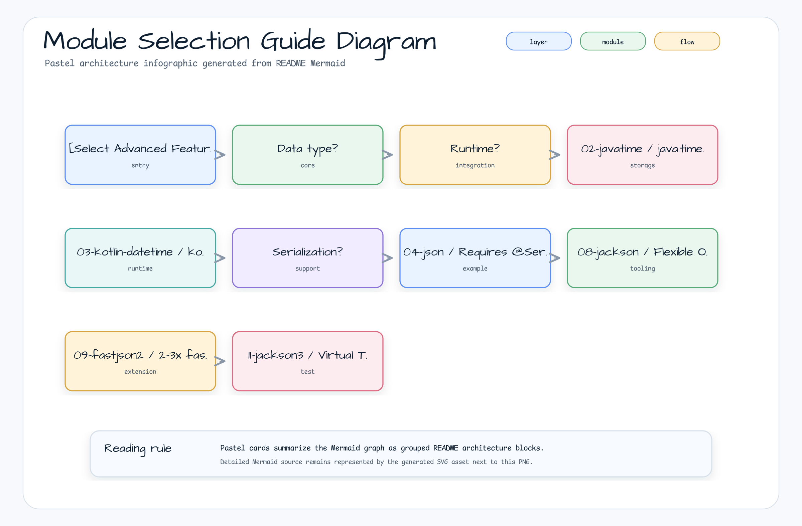

> 한국어 버전: [README.ko.md](README.ko.md)

# 06 Advanced

This directory contains modules covering advanced features of Exposed R2DBC. Learn advanced patterns frequently needed in production — encryption, date/time, JSON, custom column types, and various JSON library integrations.

## Module List

### [01 Exposed R2DBC Crypt (Transparent Column Encryption)](01-exposed-r2dbc-crypt/README.md)

Transparently encrypt and decrypt database columns in an R2DBC environment using the `exposed-crypt` extension.

| Feature            | Description                                                               |
|--------------------|---------------------------------------------------------------------------|
| Supported algorithms | `AES_256_PBE_CBC`, `AES_256_PBE_GCM`, `BLOW_FISH`, `TRIPLE_DES`        |
| DSL/DAO support    | Both styles supported                                                     |
| WHERE search       | **Not possible** with non-deterministic encryption → see `10-exposed-r2dbc-jasypt` if search is needed |

---

### [02 Exposed R2DBC JavaTime (java.time Integration)](02-exposed-r2dbc-javatime/README.md)

Learn how to integrate Java 8's `java.time` (JSR-310) API with Exposed R2DBC.

| Column Type                        | Java Type                    |
|------------------------------------|------------------------------|
| `date(name)`                       | `java.time.LocalDate`        |
| `time(name)`                       | `java.time.LocalTime`        |
| `datetime(name)`                   | `java.time.LocalDateTime`    |
| `timestamp(name)`                  | `java.time.Instant`          |
| `timestampWithTimeZone(name)`      | `java.time.OffsetDateTime`   |
| `duration(name)`                   | `java.time.Duration`         |

---

### [03 Exposed R2DBC Kotlinx-Datetime](03-exposed-r2dbc-kotlin-datetime/README.md)

Learn how to integrate the `kotlinx.datetime` library with Exposed R2DBC. Ideal for Kotlin Multiplatform projects.

---

### [04 Exposed R2DBC JSON (JSON/JSONB Support)](04-exposed-r2dbc-json/README.md)

Work with JSON/JSONB columns in an R2DBC environment using the `exposed-json` module (based on `kotlinx.serialization`).

| Feature                  | Description                    |
|--------------------------|--------------------------------|
| `.extract<T>(path)`      | Extract a JSON field           |
| `.contains(value)`       | Check if JSON contains a value |
| `.exists(path)`          | Check if a JSONPath exists     |

---

### [05 Exposed R2DBC Money (Financial Data)](05-exposed-r2dbc-money/README.md)

Safely handle monetary values using the JavaMoney (`javax.money`) API via the `exposed-money` module. `compositeMoney` manages both the amount (`DECIMAL`) and currency (`VARCHAR`) columns as a single property.

---

### [06 Custom Column Types](06-exposed-r2dbc-custom-columns/README.md)

Learn how to implement user-defined column types.

| Feature                  | Description                                                  |
|--------------------------|--------------------------------------------------------------|
| **Custom ID generator**  | Auto-generate Snowflake, KSUID, TimebasedUUID IDs            |
| **Transparent compression** | Automatic compress/decompress using LZ4, Snappy, Zstd     |
| **Deterministic encryption** | AES-based deterministic encryption enabling `WHERE` search |
| **Binary serialization** | Object serialization with Kryo/Fory combined with compression |

---

### [07 Custom Entity (ID Generation Strategies)](07-exposed-r2dbc-custom-entities/README.md)

Implement custom base table/entity classes encapsulating various ID generation strategies: Snowflake, KSUID, Time-based UUID, etc.

| Base Class                     | ID Type            | Generation Strategy           |
|--------------------------------|--------------------|-------------------------------|
| `SnowflakeIdTable`             | `Long`             | Snowflake algorithm           |
| `KsuidTable`                   | `String (27 chars)` | KSUID                        |
| `KsuidMillisTable`             | `String (27 chars)` | Millisecond-precision KSUID  |
| `TimebasedUUIDTable`           | `java.util.UUID`   | Time-based (version 1) UUID  |
| `TimebasedUUIDBase62Table`     | `String (22 chars)` | Time-based UUID + Base62     |

---

### [08 Exposed R2DBC Jackson (Jackson-Based JSON)](08-exposed-r2dbc-jackson/README.md)

Handle JSON/JSONB columns in an R2DBC environment using Jackson 2.x. Use standard Kotlin data classes without the `@Serializable` annotation.

---

### [09 Exposed R2DBC Fastjson2](09-exposed-r2dbc-fastjson2/README.md)

Handle JSON columns using Alibaba's Fastjson2 library. Suitable for applications requiring high JSON serialization throughput.

---

### [10 Exposed R2DBC Jasypt (Deterministic Encryption)](10-exposed-r2dbc-jasypt/README.md)

Implement **deterministic (searchable)** encryption in an R2DBC environment using Jasypt. The same plaintext always produces the same ciphertext, enabling direct `WHERE` clause queries.

| Column Type                                      | Description                         |
|--------------------------------------------------|-------------------------------------|
| `jasyptVarChar(name, length, encryptor)`         | Searchable encrypted string         |
| `jasyptBinary(name, length, encryptor)`          | Searchable encrypted binary         |

---

### [11 Exposed R2DBC Jackson 3](11-exposed-r2dbc-jackson3/README.md)

Handle JSON/JSONB columns in an R2DBC environment using Jackson 3.x.

---

### [12 Exposed R2DBC Tink (Google Tink Encryption)](12-exposed-r2dbc-tink/README.md)

Integrate the **Google Tink** encryption library with Exposed R2DBC. Choose between DAEAD (deterministic, searchable) and AEAD (non-deterministic, high security) encryption modes.

| Column Type                                          | Encryption Mode | WHERE Search |
|------------------------------------------------------|-----------------|--------------|
| `tinkDaeadVarChar(name, length)`                     | DAEAD           | Possible     |
| `tinkAeadVarChar(name, length, algorithm)`           | AEAD            | Not possible |
| `tinkAeadBinary(name, length, algorithm)`            | AEAD            | Not possible |

---

## Module Selection Guide



## JSON Module Comparison

| Module                          | JSON Library              | `@Serializable` Required | Features                                                  |
|---------------------------------|---------------------------|--------------------------|-----------------------------------------------------------|
| `04-exposed-r2dbc-json`         | `kotlinx.serialization`   | Required                 | Kotlin Multiplatform compatible, compile-time serialization |
| `08-exposed-r2dbc-jackson`      | Jackson 2.x               | Not required             | Rich ecosystem, easy `ObjectMapper` customization          |
| `09-exposed-r2dbc-fastjson2`    | Fastjson2 (Alibaba)       | Not required             | 2–3x faster than Jackson, lower GC pressure               |
| `11-exposed-r2dbc-jackson3`     | Jackson 3.x               | Not required             | Jakarta EE 9+ compatible, stable Virtual Thread support   |

---

## Encryption Module Comparison

| Module                              | Encryption Mode        | WHERE Search       | Library        |
|-------------------------------------|------------------------|--------------------|----------------|
| `01-exposed-r2dbc-crypt`            | Non-deterministic      | Not possible       | Bouncy Castle  |
| `10-exposed-r2dbc-jasypt`           | Deterministic          | Possible           | Jasypt         |
| `12-exposed-r2dbc-tink`             | Deterministic or non-deterministic (selectable) | DAEAD only | Google Tink |
| `06-exposed-r2dbc-custom-columns`   | Custom implementation  | Depends on impl.   | Custom AES     |

## Running Tests

```bash
# Test all advanced feature modules
./gradlew :01-exposed-r2dbc-crypt:test
./gradlew :12-exposed-r2dbc-tink:test

# Fast test using H2 only
./gradlew :12-exposed-r2dbc-tink:test -PuseFastDB=true
```
