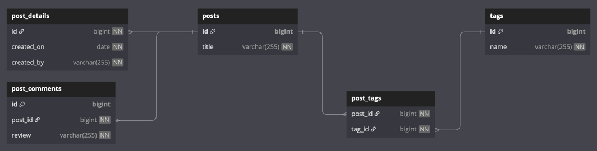
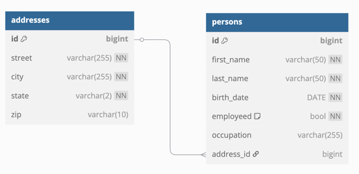

> 한국어 버전: [README.ko.md](README.ko.md)

# 01-convert-jpa-basic

An example module demonstrating how to convert common JPA patterns (Entity, relationship mapping, `@Convert`, etc.) to Exposed R2DBC DSL. Covers step-by-step learning of how to implement common JPA patterns in Exposed: Simple Entity, Blog (1:1, 1:N, N:M relationships), Person (Many-to-One + advanced CRUD), Task (Enum mapping), and Custom Column Type (value class).

## Tech Stack

| Category  | Technology                                              |
|-----------|---------------------------------------------------------|
| ORM       | Exposed R2DBC + Exposed DAO + Exposed JDBC              |
| Async     | Kotlin Coroutines                                       |
| DB        | H2 (default), MariaDB, MySQL 8, PostgreSQL              |
| Container | Testcontainers                                          |
| Test      | JUnit 5 + bluetape4k-assertions + ParameterizedTest (multi-DB support) |

## JPA → Exposed R2DBC Migration Path



## Project Structure

```
src/test/kotlin/exposed/r2dbc/examples/jpa/
├── ex01_simple/
│   ├── SimpleSchema.kt          # Simple entity: Table + Entity(DAO) + DTO + Mapper
│   └── Ex01_Simple_DSL.kt       # Basic DSL CRUD: batchInsert, select, limit, inList, projection
│
├── ex02_entities/
│   ├── BlogSchema.kt            # Blog schema: Post, PostDetail(1:1), PostComment(1:N), Tag(N:M)
│   ├── Ex01_Blog.kt             # Blog table creation, One-to-One relationship insert/select
│   ├── PersonSchema.kt          # Person-Address schema: Many-to-One relationship + DML table for INSERT SELECT
│   ├── Ex02_Person.kt           # Person advanced CRUD: count, delete, insert, batchInsert, INSERT SELECT
│   └── Ex03_Task.kt             # Enum column mapping (enumerationByName)
│
└── ex03_customId/
    ├── CustomColumnTypes.kt     # Custom column types based on value class (Email, Ssn)
    └── Ex01_CustomId.kt         # Example using custom types as PK and column
```

> **Note**: This module has no `src/main`; all code resides in `src/test`. It is a test-only module for learning and practice.

## Example Details

### ex01_simple - Basic CRUD (DSL)

An example converting the simplest JPA `@Entity` + `@Id` + `@Column` to Exposed.

**JPA Mapping:**

| JPA                      | Exposed                                            |
|--------------------------|----------------------------------------------------|
| `@Entity` + `@Table`     | `object SimpleTable: LongIdTable("simple_entity")` |
| `@Id @GeneratedValue`    | Auto-generated id in `LongIdTable`                 |
| `@Column(unique=true)`   | `varchar("name", 255).uniqueIndex()`               |
| `@Column(nullable=true)` | `text("description").nullable()`                   |
| Entity class             | `LongEntity` (DAO) or `data class` (DTO)           |

**Key Points:**

- **DSL**: Type-safe query builder close to SQL, handles `ResultRow` directly
- **DAO**: Object-oriented access similar to JPA Entity, supports automatic dirty checking
- **Record**: `data class`-based DTO, immutable object suitable for caching or transfer

```kotlin
// Table definition (JPA's @Entity + @Table)
object SimpleTable: LongIdTable("simple_entity") {
    val name = varchar("name", 255).uniqueIndex()
    val description = text("description").nullable()
}

// Entity definition (JPA's Entity class)
class SimpleEntity(id: EntityID<Long>): LongEntity(id) {
    companion object: LongEntityClass<SimpleEntity>(SimpleTable)

    var name by SimpleTable.name
    var description by SimpleTable.description
}

// Record definition (JPA's DTO Projection)
data class SimpleRecord(val id: Long, val name: String, val description: String?)
```

**Test Coverage:**

- `batchInsert` - Bulk data insertion
- `select` + `limit` + `offset` - Pagination
- `inList` - IN clause query
- `ResultRow` → DTO conversion (projection)

### ex02_entities - Composite Entities and Relationship Mapping

#### Blog Domain (1:1, 1:N, N:M)

Defines relationships among multiple entities: Post, PostDetail, PostComment, Tag.

**Schema Structure:**

```
posts (1) ←──→ (1) post_details        (One-to-One: shared PK)
posts (1) ←──→ (N) post_comments       (One-to-Many: FK reference)
posts (N) ←──→ (N) tags                (Many-to-Many: post_tags join table)
```

**JPA vs Exposed Relationship Mapping:**

```kotlin
// JPA: @OneToOne + shared PK
// Exposed: backReferencedOn (1:1 reverse reference)
val details: PostDetail by PostDetail backReferencedOn PostDetailTable.id

// JPA: @OneToMany(mappedBy = "post")
// Exposed: referrersOn (1:N reference)
val comments: SizedIterable<PostComment> by PostComment referrersOn PostCommentTable.postId

// JPA: @ManyToMany + @JoinTable
// Exposed: via (M:N join table)
val tags: SizedIterable<Tag> by Tag via PostTagTable
```

**Test Coverage (Ex01_Blog):**



- Blog table creation and `exists()` verification
- One-to-One relationship insert (Post + PostDetail shared PK)

#### Person Domain (Many-to-One + Advanced CRUD)

Implements Person-Address relationship CRUD and various SQL patterns using Exposed DSL.

**Test Coverage (Ex02_Person):**



- `count` / `countDistinct` - Aggregate functions
- `deleteWhere` - Conditional delete (various combinations of `AND`, `OR`, `LIMIT`)
- `insertAndGetId` - Single insert then return ID
- `batchInsert` - Bulk insert based on DTO (`PersonRecord`)
- `insert(select(...))` - INSERT SELECT pattern
- `PersonTableDML` - Reference the same physical table without AutoIncrement to specify IDs directly (the `id + 100` pattern in INSERT SELECT)

#### Task (Enum Mapping)

Converts JPA's `@Enumerated(EnumType.STRING)` to Exposed's `enumerationByName`.

```kotlin
// JPA
@Enumerated(EnumType.STRING)
@Column(length = 10)
val status: TaskStatusType

// Exposed
val status = enumerationByName("status", 10, TaskStatusType::class)
```

### ex03_customId - Custom Column Types (JPA @Convert)

Converts JPA's `@Convert` + `AttributeConverter` to Exposed's `ColumnWithTransform`. Uses Kotlin `value class` for type safety.

**JPA Mapping:**

| JPA                                          | Exposed                                |
|----------------------------------------------|----------------------------------------|
| `@Convert(converter = EmailConverter.class)` | `email("email_id")` (custom column function) |
| `AttributeConverter<String, Email>`          | `ColumnTransformer<String, Email>`     |
| `@Embeddable` value type                     | `value class Email(val value: String)` |

**Custom Type Definition:**

```kotlin
// Type safety via value class
@JvmInline
value class Email(val value: String): Comparable<Email>, Serializable

// Custom column type registration function
fun Table.email(name: String, length: Int = 64): Column<Email> =
    registerColumn(name, EmailColumnType(length))

// DB↔Kotlin type conversion with ColumnWithTransform
open class EmailColumnType(length: Int = 64):
    ColumnWithTransform<String, Email>(VarCharColumnType(length), StringToEmailTransformer())
```

**Using Custom Type as PK:**

```kotlin
object CustomIdTable: IdTable<Email>("emails") {
    override val id: Column<EntityID<Email>> = email("email_id").entityId()
    val name = varchar("name", 255)
    val ssn = ssn("ssn").uniqueIndex()   // Ssn is also a custom type
}
```

## JPA Entity vs Exposed Table Comparison



## Blog Domain ERD



## JPA vs Exposed Key Concept Mapping Summary

| JPA                          | Exposed DSL (R2DBC)       | Exposed DAO                         |
|------------------------------|---------------------------|-------------------------------------|
| `@Entity`                    | `Table` / `IdTable`       | `Entity` + `EntityClass`            |
| `@Id` + `@GeneratedValue`    | `LongIdTable`             | `LongEntity`                        |
| `@Column`                    | `varchar()`, `text()` etc | `var name by Table.name`            |
| `@Enumerated(STRING)`        | `enumerationByName()`     | `enumerationByName()`               |
| `@Convert`                   | Custom `ColumnType`       | Custom `ColumnType`                 |
| `@OneToOne`                  | `reference()`             | `referencedOn` / `backReferencedOn` |
| `@OneToMany`                 | FK `reference()`          | `referrersOn`                       |
| `@ManyToOne`                 | `reference()`             | `referencedOn`                      |
| `@ManyToMany` + `@JoinTable` | Define join table         | `via`                               |
| `EntityManager.persist()`    | `Table.insert {}`         | `Entity.new {}`                     |
| `EntityManager.find()`       | `Table.selectAll()`       | `Entity.findById()`                 |
| JPQL / Criteria API          | DSL chaining              | `Entity.find {}`                    |
| `@UniqueConstraint`          | `.uniqueIndex()`          | `.uniqueIndex()`                    |

## Running Tests

```bash
./gradlew :01-convert-jpa-basic:test
```

All tests run automatically across multiple DBs (H2, MySQL, PostgreSQL, etc.) using `@ParameterizedTest` + `@MethodSource`.

## JPA → Exposed R2DBC Migration Checklist

Check each step when migrating JPA code to Exposed R2DBC.

### Step 1: Table/Entity Migration

- [ ] `@Entity` + `@Table(name = "…")` → `object MyTable : LongIdTable("…")`
- [ ] `@Id @GeneratedValue(IDENTITY)` → `LongIdTable` (handled automatically)
- [ ] `@Id @GeneratedValue(UUID)` → use `UUIDTable`
- [ ] `@Column(name, nullable, unique, length)` → `varchar(…).nullable()`, `.uniqueIndex()`
- [ ] `@Enumerated(EnumType.STRING)` → `enumerationByName("col", length, Enum::class)`
- [ ] `@Convert(converter = …)` → implement `ColumnWithTransform` + `ColumnTransformer`

### Step 2: Relationship Mapping Migration

- [ ] `@ManyToOne @JoinColumn` → `reference("fk_col", OtherTable)`
- [ ] `@OneToMany(mappedBy)` → `val items by Item referrersOn ItemTable.parentId`
- [ ] `@OneToOne @MapsId` → `id = reference("id", ParentTable)` in `IdTable`
- [ ] `@OneToOne(mappedBy)` → `val detail by Detail backReferencedOn DetailTable.id`
- [ ] `@ManyToMany @JoinTable` → define a join `Table`, then `val tags by Tag via JoinTable`
- [ ] `CascadeType.REMOVE` → `onDelete = ReferenceOption.CASCADE`

### Step 3: Persistence Operations Migration

- [ ] `entityManager.persist(entity)` → `MyTable.insert { it[col] = value }`
- [ ] `entityManager.find(Entity::class, id)` → `MyTable.selectAll().where { MyTable.id eq id }.singleOrNull()`
- [ ] `entityManager.merge(entity)` → `MyTable.update({ MyTable.id eq id }) { it[col] = value }`
- [ ] `entityManager.remove(entity)` → `MyTable.deleteWhere { MyTable.id eq id }`
- [ ] JPQL `SELECT e FROM Entity e WHERE …` → `MyTable.selectAll().where { … }`
- [ ] DTO Projection (JPQL `new` or `@Query`) → convert via `ResultRow` extension function

### Step 4: Transaction Migration

- [ ] `@Transactional` (sync, Spring) → `suspendTransaction { … }` (R2DBC coroutine)
- [ ] `@Transactional(readOnly = true)` → `suspendTransaction(readOnly = true) { … }`
- [ ] `TransactionTemplate` manual transaction → `suspendTransaction { … }` block
- [ ] Nested transaction (REQUIRES_NEW) → `inTopLevelSuspendTransaction { … }`

### Step 5: Test Migration

- [ ] `@DataJpaTest` + `TestEntityManager` → extend `AbstractR2dbcExposedTest`
- [ ] JUnit `@Transactional` rollback → `withTables(testDB, …) { }` helper (auto cleanup)
- [ ] `H2Database` in-memory → `TestDB.H2` (or `USE_FAST_DB=true`)
- [ ] Real DB integration tests → `TestDB.POSTGRESQL` / `TestDB.MYSQL_V8` + Testcontainers

## Further Reading

- [9.1 JPA 기본기능 구현하기](https://debop.notion.site/1c32744526b080458ca0f7eee791cab3?v=1c32744526b081ca8b00000c231b9b43)
