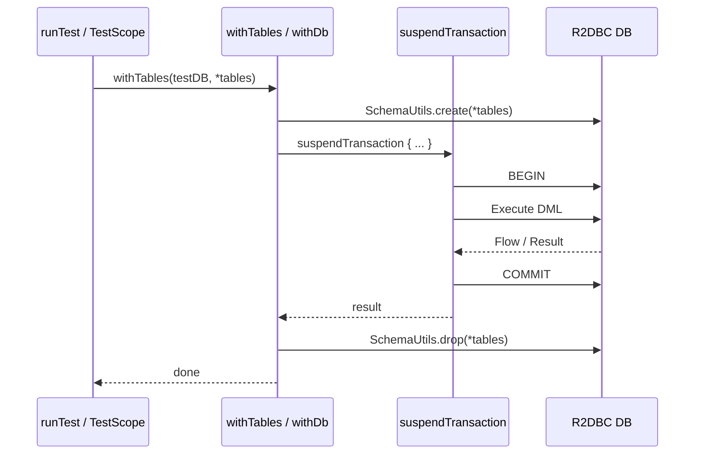
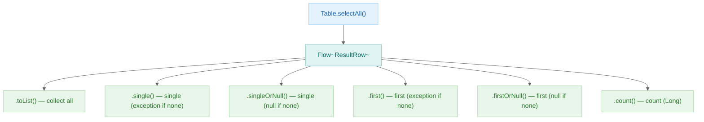
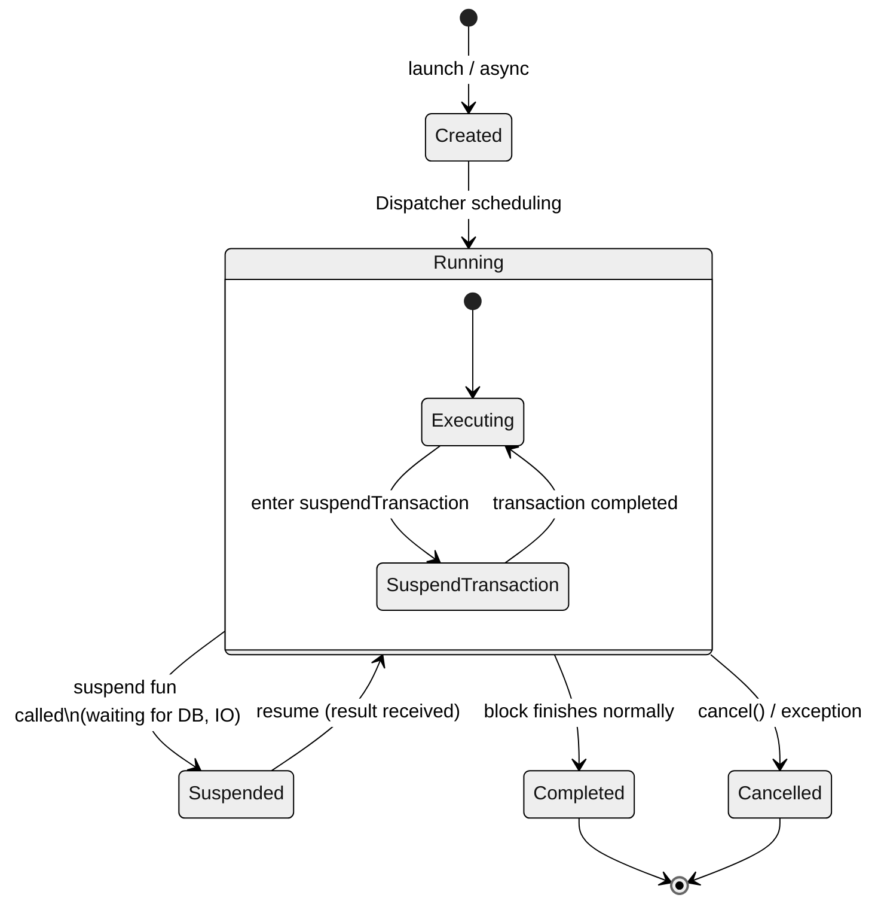

> 한국어 버전: [README.ko.md](README.ko.md)

# 01 R2DBC Coroutines Basic

Learn how to perform asynchronous database operations in an Exposed R2DBC + Kotlin Coroutines environment. Write readable asynchronous code by wrapping the R2DBC async API with coroutines.

## Learning Objectives

- Perform async transactions with `suspendTransaction`
- Execute parallel transactions with `suspendTransactionAsync`
- Stream reactive results using Flow
- Integrate Coroutine Dispatcher with Exposed R2DBC
- Handle exceptions within a coroutine context

## Tech Stack

| Category  | Technology                                              |
|-----------|---------------------------------------------------------|
| ORM       | Exposed R2DBC DSL                                       |
| Async     | Kotlin Coroutines + Flow                                |
| DB        | H2 (default), MariaDB, MySQL 8, PostgreSQL              |
| Container | Testcontainers                                          |
| Test      | JUnit 5 + Kluent + ParameterizedTest (multi-DB support) |

## Execution Flow

### Coroutine + R2DBC Transaction



### Flow Collection Patterns



## Coroutine State Diagram



## Key Concepts

### `suspendTransaction` vs `transaction`

| Property              | `transaction { }`                       | `suspendTransaction { }`              |
|-----------------------|-----------------------------------------|---------------------------------------|
| Execution mode        | Synchronous (blocking)                  | Asynchronous (coroutine suspend)      |
| Thread occupancy      | Thread held throughout transaction      | Thread released on suspend            |
| Usage location        | Regular function (`fun`)               | suspend function or inside coroutine  |
| R2DBC compatibility   | Not compatible (R2DBC is async-only)    | Compatible                            |
| Nested support        | `nestedTransactionMode` setting         | Use `inTopLevelSuspendTransaction`    |
| Spring integration    | Corresponds to `@Transactional`         | `@Transactional` + coroutine support  |

```kotlin
// Synchronous (JDBC only) - cannot be used with R2DBC
transaction {
    MyTable.selectAll().toList()   // blocking call
}

// Asynchronous (R2DBC) - for use in coroutine context
suspend fun query() = suspendTransaction {
    MyTable.selectAll().toList()   // suspend / non-blocking
}
```

### Coroutine Scope Management Diagram

```
runTest / runSuspendIO
│
├── withTables(testDB, MyTable)          ← create table, start transaction context
│   │
│   ├── suspendTransaction { }           ← start new transaction (reuse existing context)
│   │   └── MyTable.insert { }           ← R2DBC async SQL execution
│   │
│   ├── CoroutineScope(Dispatchers.IO)
│   │   └── async {
│   │       inTopLevelSuspendTransaction { }  ← independent top-level transaction (new connection)
│   │           └── MyTable.insert { }
│   │       }
│   │
│   └── awaitAll(...)                    ← wait for all async work to complete
│
└── auto-cleanup tables (DROP)
```

**Key Rules:**
- `suspendTransaction`: reuses the DB connection from the current coroutine context (nestable)
- `inTopLevelSuspendTransaction`: always creates a new connection and transaction (suited for independent execution)
- `withContext(dispatcher)`: run transaction on a different thread pool by switching dispatcher

### suspendTransaction

A `suspend` function that performs a transaction in a coroutine context.

```kotlin
suspend fun getUsers(): List<UserRecord> = suspendTransaction {
    Users.selectAll().map { it.toUserRecord() }
}
```

### suspendTransactionAsync

Executes multiple transactions in parallel.

```kotlin
val usersDeferred = suspendTransactionAsync {
    Users.selectAll().toFastList()
}

val ordersDeferred = suspendTransactionAsync {
    Orders.selectAll().toFastList()
}

val (users, orders) = awaitAll(usersDeferred, ordersDeferred)
```

### Flow Streaming

Use Flow to efficiently process large result sets.

```kotlin
fun streamUsers(): Flow<UserRecord> = Users
    .selectAll()
    .asFlow()
    .map { it.toUserRecord() }
```

## Code Examples

### Basic CRUD with Coroutines

```kotlin
suspend fun createUser(name: String, email: String): Long = suspendTransaction {
    Users.insertAndGetId {
        it[Users.name] = name
        it[Users.email] = email
    }.value
}

suspend fun findUserById(id: Long): UserRecord? = suspendTransaction {
    Users.selectAll()
        .where { Users.id eq id }
        .singleOrNull()
        ?.toUserRecord()
}

suspend fun updateUser(id: Long, name: String): Int = suspendTransaction {
    Users.update({ Users.id eq id }) {
        it[Users.name] = name
    }
}

suspend fun deleteUser(id: Long): Int = suspendTransaction {
    Users.deleteWhere { Users.id eq id }
}
```

### Parallel Transaction Execution

```kotlin
suspend fun parallelOperations() = coroutineScope {
    val insertJob = suspendTransactionAsync {
        // INSERT operation
        Users.insert { it[name] = "User1" }
    }
    
    val updateJob = suspendTransactionAsync {
        // UPDATE operation
        Users.update({ Users.id eq 1 }) { it[name] = "Updated" }
    }
    
    val (insertResult, updateResult) = awaitAll(insertJob, updateJob)
}
```

### Exception Handling

```kotlin
suspend fun safeOperation(): Result<UserRecord> = runCatching {
    suspendTransaction {
        Users.selectAll()
            .where { Users.id eq 1 }
            .single()
            .toUserRecord()
    }
}.onFailure { e ->
    log.error(e) { "Transaction failed" }
}
```

## Example Test Structure

This module validates core coroutine transaction patterns against multiple DBs using `ParameterizedTest`.

- `Ex01_Coroutines`: Sequential/parallel transactions, nested transactions, async operation combinations
- `Ex02_CoroutinesFlow`: Flow-based result collection, parallel execution with `inTopLevelSuspendTransaction`

`Ex02_CoroutinesFlow` in particular demonstrates two practical patterns as minimal examples:

1. Safely collecting `selectAll()` results via Flow operations (`map`, `toList`)
2. Running independent transactions in parallel from multiple coroutines and verifying results consistently

## Running Tests

```bash
# Run all tests in this module
./gradlew :01-exposed-r2dbc-coroutines-basic:test

# Run a specific test
./gradlew :01-exposed-r2dbc-coroutines-basic:test --tests "exposed.r2dbc.examples.coroutines.Ex01_Coroutines"

# Run only the Flow example tests
./gradlew :01-exposed-r2dbc-coroutines-basic:test --tests "exposed.r2dbc.examples.coroutines.Ex02_CoroutinesFlow"
```

## References

- [Kotlin Coroutines Guide](https://kotlinlang.org/docs/coroutines-guide.html)
- [Exposed R2DBC](https://github.com/JetBrains/Exposed)
- [Kotlin Exposed Book](https://debop.notion.site/Kotlin-Exposed-Book-1ad2744526b080428173e9c907abdae2)
