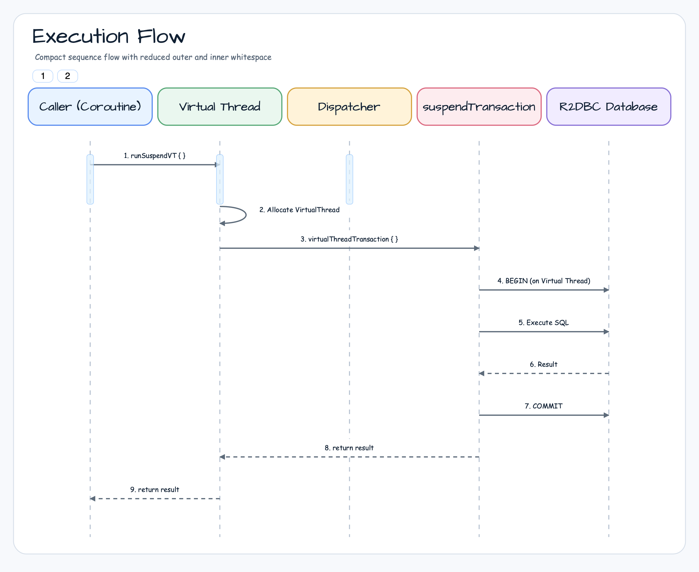
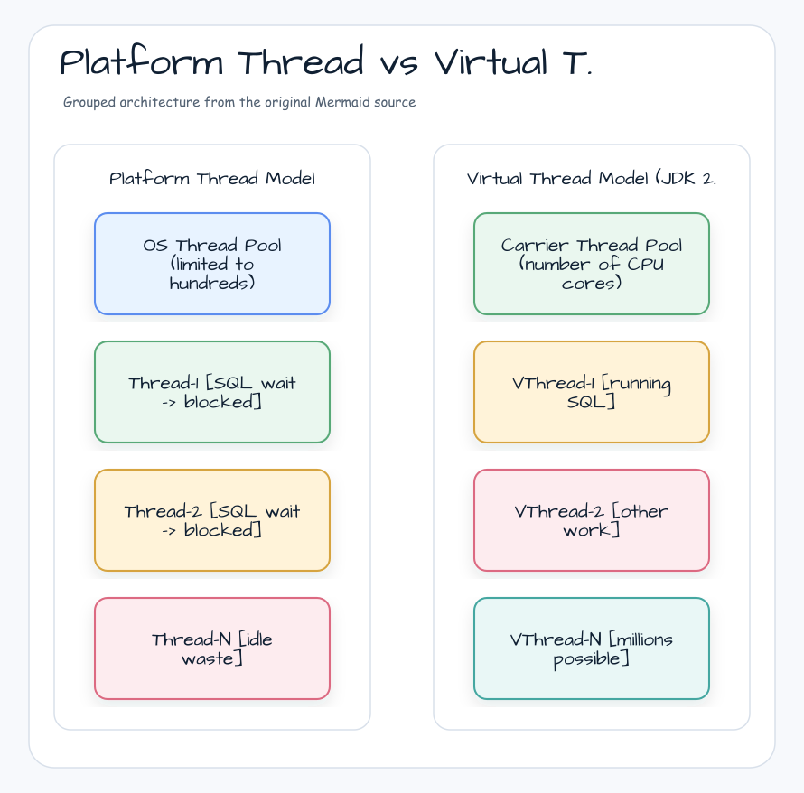
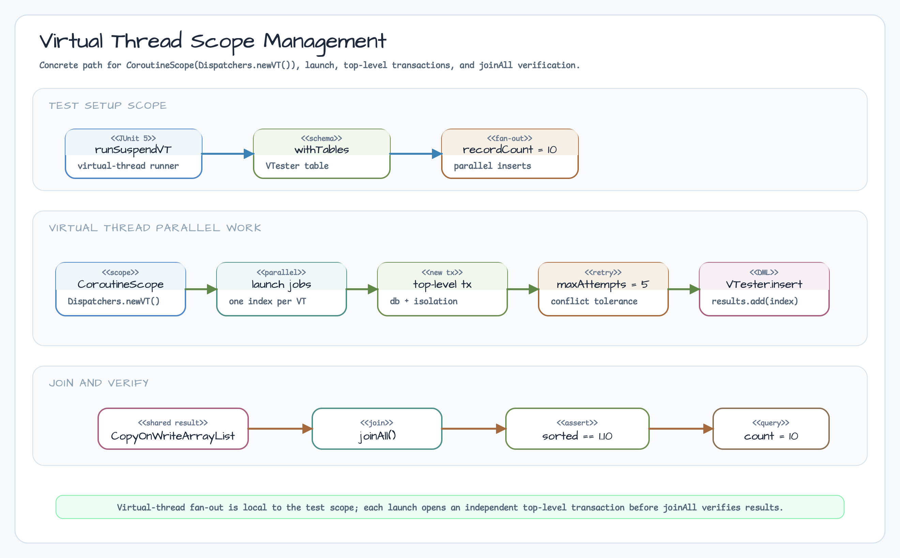
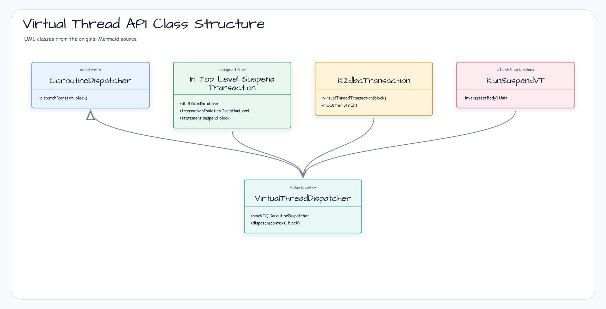

> English version: [README.md](README.md)

# 02 R2DBC Virtual Threads Basic (가상 스레드 기본)

Exposed R2DBC + Java 25 Virtual Threads 환경에서 비동기 데이터베이스 작업을 수행하는 방법을 학습합니다.
`runSuspendVT`, `virtualThreadTransaction`, `inTopLevelSuspendTransaction` 등 Virtual Threads 전용 API를 통해
블로킹 스타일 코드로 고성능 비동기 처리를 구현합니다.

> **요구 사항**: JDK 25 (`@EnabledOnJre(JRE.JAVA_25)` 조건 적용)

Version Catalog의 versionless `bluetape4k-virtualthread-jdk25` alias는
개발 `bluetape4k-dependencies:2.1.0-SNAPSHOT` BOM을 통해
`bluetape4k-virtualthread-jdk25:2.1.0-SNAPSHOT`으로 해석됩니다. 공개 discovery 계약은
`io.bluetape4k.concurrent.virtualthread.api` 패키지에 있으며, 테스트는 public
ServiceLoader API에서 `jdk25-structured-task-scope` provider와 `jdk25` runtime을
각각 정확히 하나씩 발견해야 합니다.

---

## 실행 흐름



---

## 학습 목표

- Java 25 Virtual Threads와 Exposed R2DBC 통합 방법 이해
- `runSuspendVT` / `virtualThreadTransaction` / `inTopLevelSuspendTransaction` API 활용
- `Dispatchers.newVT()` 디스패처로 Virtual Threads 기반 병렬 처리 구현
- 기존 `suspendTransaction` 대비 Virtual Threads 트랜잭션의 차이점 파악
- MariaDB 계열 중첩 트랜잭션 제한 사항 파악

---

## 핵심 API

| API | 설명 |
|-----|------|
| `runSuspendVT { }` | Virtual Thread 기반 코루틴 테스트 실행기 (JUnit 5 전용) |
| `virtualThreadTransaction { }` | 현재 트랜잭션 내에서 Virtual Thread로 새 트랜잭션 생성·실행 |
| `inTopLevelSuspendTransaction { }` | 독립적인 최상위 suspend 트랜잭션 (기존 트랜잭션과 무관하게 새 트랜잭션 시작) |
| `Dispatchers.newVT()` | Virtual Thread 기반 코루틴 디스패처 (`CoroutineScope(Dispatchers.newVT())`) |
| `suspendTransaction { }` | 일반 suspend 트랜잭션 (비교 기준) |

---

## 코드 예제

### 1. 기본 Virtual Thread 트랜잭션

`runSuspendVT`로 테스트를 실행하고, `virtualThreadTransaction`으로 중첩 트랜잭션을 생성합니다.

```kotlin
@EnabledOnJre(JRE.JAVA_25)
class Ex01_VirtualThreads: AbstractR2dbcExposedTest() {

    object VTester: IntIdTable("virtualthreads_table") {
        val name = varchar("name", 50).nullable()
    }

    // 현재 트랜잭션 내에서 Virtual Thread 기반 새 트랜잭션으로 조회
    suspend fun R2dbcTransaction.getTesterById(id: Int): ResultRow? =
        virtualThreadTransaction {
            VTester.selectAll()
                .where { VTester.id eq id }
                .singleOrNull()
        }

    @ParameterizedTest
    @MethodSource(ENABLE_DIALECTS_METHOD)
    fun `virtual threads 를 이용하여 순차 작업 수행하기`(testDB: TestDB) = runSuspendVT {
        withTables(testDB, VTester) {
            val id = VTester.insertAndGetId { }
            getTesterById(id.value)!![VTester.id].value shouldBeEqualTo id.value
        }
    }
}
```

### 2. 중첩 트랜잭션 비동기 실행

`coroutineScope` + `async`로 병렬 INSERT를 수행한 뒤, `inTopLevelSuspendTransaction`으로 독립 트랜잭션에서 조회합니다.

```kotlin
@ParameterizedTest
@MethodSource(ENABLE_DIALECTS_METHOD)
fun `중첩된 virtual thread 용 트랜잭션을 async로 실행`(testDB: TestDB) = runSuspendVT {
    // MariaDB 계열은 중첩 트랜잭션 미지원 → 스킵
    Assumptions.assumeTrue { testDB !in TestDB.ALL_MARIADB_LIKE }

    withTables(testDB, VTester) {
        val recordCount = 5

        // 병렬 INSERT (suspendTransaction)
        List(recordCount) { index ->
            coroutineScope {
                async {
                    suspendTransaction {
                        maxAttempts = 10
                        VTester.insert { }
                    }
                }
            }
        }.awaitAll()

        // 병렬 SELECT (inTopLevelSuspendTransaction)
        val rows = List(recordCount) { index ->
            coroutineScope {
                async {
                    inTopLevelSuspendTransaction {
                        maxAttempts = 10
                        VTester.selectAll().map { it.toVRecord() }.toList()
                    }
                }
            }
        }.awaitAll().flatten()

        rows shouldHaveSize recordCount * recordCount
    }
}
```

### 3. `Dispatchers.newVT()` 기반 병렬 처리

`CoroutineScope(Dispatchers.newVT())`로 Virtual Thread 디스패처를 생성하고, `launch`로 병렬 INSERT를 수행합니다.

```kotlin
@ParameterizedTest
@MethodSource(ENABLE_DIALECTS_METHOD)
fun `다수의 비동기 작업을 수행 후 대기`(testDB: TestDB) = runSuspendVT {
    withTables(testDB, VTester) {
        val recordCount = 10
        val results = CopyOnWriteArrayList<Int>()

        val vtScope = CoroutineScope(Dispatchers.newVT())
        List(recordCount) { index ->
            vtScope.launch {
                inTopLevelSuspendTransaction(
                    transactionIsolation = db.transactionManager.defaultIsolationLevel!!,
                    db = db
                ) {
                    maxAttempts = 5
                    VTester.insert { }
                    results.add(index + 1)
                }
            }
        }.joinAll()

        results.count() shouldBeEqualTo recordCount
        VTester.selectAll().count() shouldBeEqualTo recordCount.toLong()
    }
}
```

### 4. 조건부 조회

일반 `selectAll().where { }` 조회를 Virtual Thread 환경에서 실행합니다.

```kotlin
@ParameterizedTest
@MethodSource(ENABLE_DIALECTS_METHOD)
fun `virtual threads 환경에서 조건 조회`(testDB: TestDB) = runSuspendVT {
    withTables(testDB, VTester) {
        listOf("alpha", "beta", "gamma").forEach { name ->
            VTester.insert { it[VTester.name] = name }
        }

        val row = VTester.selectAll()
            .where { VTester.name eq "beta" }
            .singleOrNull()

        row?.getOrNull(VTester.name) shouldBeEqualTo "beta"
    }
}
```

---

## Virtual Thread (JDK 25) 활용 이점

JDK 25의 Virtual Threads(Project Loom)는 기존 플랫폼 스레드의 한계를 극복합니다.

### 성능 비교

| 특성             | 플랫폼 스레드         | Virtual Threads      |
|------------------|----------------------|----------------------|
| 생성 비용         | 높음 (~1ms)          | 매우 낮음 (~수 마이크로초) |
| 메모리 사용       | ~1MB/스레드          | ~수 KB/스레드         |
| 컨텍스트 스위칭   | OS 수준, 비용 높음   | JVM 수준, 비용 낮음   |
| 최대 동시 스레드  | 수천 개              | 수백만 개             |
| 블로킹 I/O       | 스레드 점유          | 자동 언마운트·재마운트  |
| JDK 요구사항     | 모든 버전             | 25                   |

### R2DBC + Virtual Threads 조합의 이점



### Coroutine Scope + Virtual Threads 관리 다이어그램



## Virtual Thread API 클래스 구조



### 언제 Virtual Threads를 선택해야 하나?

- **I/O 집약적 작업**: DB 쿼리, 외부 API 호출 등 대기 시간이 긴 작업이 많을 때
- **높은 동시성 요구**: 수천~수백만 개의 동시 요청을 처리해야 할 때
- **기존 블로킹 코드 활용**: 레거시 JDBC 라이브러리 등 블로킹 API를 그대로 사용해야 할 때
- **Kotlin 코루틴과 병행**: `Dispatchers.newVT()`로 기존 코루틴 코드에 자연스럽게 통합

---

## 주의 사항

- **JDK 25 필수**: 테스트 클래스에 `@EnabledOnJre(JRE.JAVA_25)`가 적용되어 있어, 이전 JDK에서는 자동 스킵됩니다.
- **MariaDB 계열 중첩 트랜잭션 미지원**: `MariaDB-compatible nested transactions are not supported` capability 사유로 중첩 트랜잭션 테스트를 스킵합니다.
- **CopyOnWriteArrayList 사용**: 여러 Virtual Thread에서 동시에 결과를 수집할 때 스레드 안전한 컬렉션을 사용해야 합니다.
- **maxAttempts 설정**: 병렬 트랜잭션에서 충돌이 발생할 수 있으므로 `maxAttempts = 5~10` 재시도 설정을 권장합니다.

---

## 테스트 실행

```bash
# 이 모듈의 원시 테스트 실행 (진단용)
./gradlew :02-exposed-r2dbc-virtualthreads-basic:test

# H2만 사용하는 빠른 테스트
./gradlew :02-exposed-r2dbc-virtualthreads-basic:test -PuseFastDB=true

# 실행 수를 검증하는 권위 있는 gate (test를 먼저 실행)
./gradlew :02-exposed-r2dbc-virtualthreads-basic:verifyVirtualThreadTestExecution -PuseFastDB=true

# 기본 H2, PostgreSQL, MySQL 8 matrix (13 total / 13 executed / 0 skipped)
./gradlew :02-exposed-r2dbc-virtualthreads-basic:verifyVirtualThreadTestExecution

# MariaDB 호환 capability 확인 (5 total / 4 executed / 1 skipped)
./gradlew :02-exposed-r2dbc-virtualthreads-basic:verifyVirtualThreadTestExecution -PuseDB=H2_MARIADB
```

fast gate는 `5 total / 5 executed / 0 skipped`를, 기본 matrix는
`13 total / 13 executed / 0 skipped`를 출력해야 합니다. `MARIADB` 또는
`H2_MARIADB`를 명시하면 중첩 트랜잭션 capability skip 하나만 허용합니다.
`verifyVirtualThreadTestExecution`이 내부에서 test task를 실행하므로 별도의
`test` 명령은 진단할 때만 사용합니다. JUnit XML 누락, 잘못된
`useDB`/`useFastDB` 값, 예상 밖 skip, failure, error가 있으면 gate가
fail-closed로 종료됩니다. 검증 gate 자체는 환경 변수·system property·secret
전체를 출력하지 않습니다.

---

## 참고 자료

- [JEP 444: Virtual Threads](https://openjdk.org/jeps/444)
- [Virtual Threads — Java 25 Guide](https://docs.oracle.com/en/java/javase/25/core/virtual-threads.html)
- [Kotlin Coroutines + Virtual Threads](https://kotlinlang.org/docs/coroutines-overview.html)
