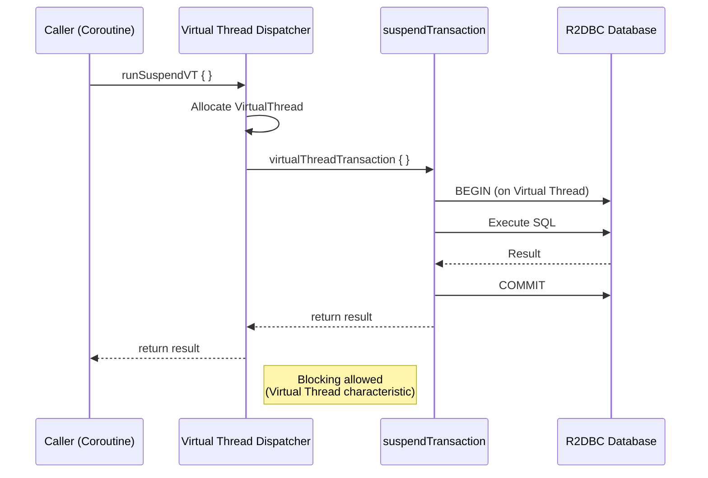
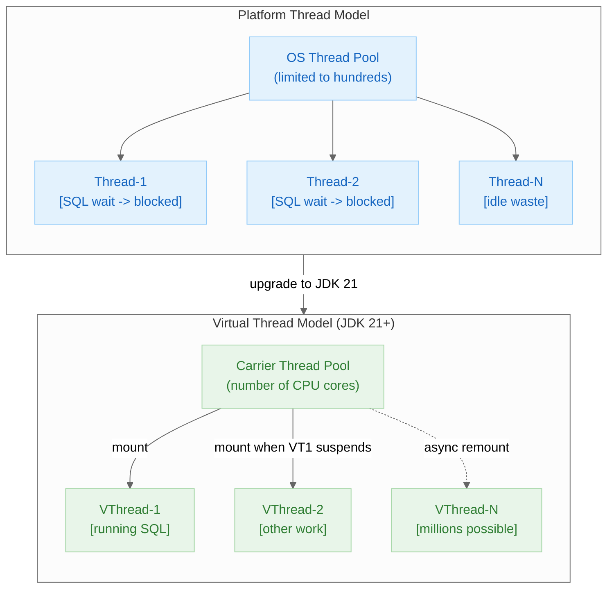
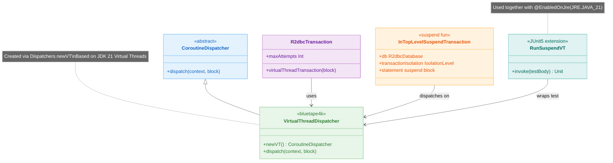

> 한국어 버전: [README.ko.md](README.ko.md)

# 02 R2DBC Virtual Threads Basic

Learn how to perform asynchronous database operations in an Exposed R2DBC + Java 21 Virtual Threads environment.
Use Virtual Threads-specific APIs such as `runSuspendVT`, `virtualThreadTransaction`, and `inTopLevelSuspendTransaction`
to achieve high-performance async processing with blocking-style code.

> **Requirement**: JDK 21 or later (`@EnabledOnJre(JRE.JAVA_21)` condition applied)

---

## Execution Flow



---

## Learning Objectives

- Understand how to integrate Java 21 Virtual Threads with Exposed R2DBC
- Use `runSuspendVT` / `virtualThreadTransaction` / `inTopLevelSuspendTransaction` APIs
- Implement parallel processing based on Virtual Threads using the `Dispatchers.newVT` dispatcher
- Understand the differences between Virtual Thread transactions and standard `suspendTransaction`
- Identify nested transaction limitations for MariaDB-compatible databases

---

## Core APIs

| API | Description |
|-----|-------------|
| `runSuspendVT { }` | Virtual Thread-based coroutine test runner (JUnit 5 only) |
| `virtualThreadTransaction { }` | Create and execute a new transaction on a Virtual Thread within the current transaction |
| `inTopLevelSuspendTransaction { }` | Independent top-level suspend transaction (starts a new transaction regardless of existing one) |
| `Dispatchers.newVT` | Virtual Thread-based coroutine dispatcher (`CoroutineScope(Dispatchers.newVT)`) |
| `suspendTransaction { }` | Standard suspend transaction (baseline for comparison) |

---

## Code Examples

### 1. Basic Virtual Thread Transaction

Run the test with `runSuspendVT` and create a nested transaction with `virtualThreadTransaction`.

```kotlin
@EnabledOnJre(JRE.JAVA_21)
class Ex01_VirtualThreads: AbstractR2dbcExposedTest() {

    object VTester: IntIdTable("virtualthreads_table") {
        val name = varchar("name", 50).nullable()
    }

    // Query via a new VT-based transaction within the current transaction
    suspend fun R2dbcTransaction.getTesterById(id: Int): ResultRow? =
        virtualThreadTransaction {
            VTester.selectAll()
                .where { VTester.id eq id }
                .singleOrNull()
        }

    @ParameterizedTest
    @MethodSource(ENABLE_DIALECTS_METHOD)
    fun `perform sequential operations using virtual threads`(testDB: TestDB) = runSuspendVT {
        withTables(testDB, VTester) {
            val id = VTester.insertAndGetId { }
            getTesterById(id.value)!![VTester.id].value shouldBeEqualTo id.value
        }
    }
}
```

### 2. Async Nested Transaction Execution

Perform parallel INSERTs with `coroutineScope` + `async`, then query in an independent transaction using `inTopLevelSuspendTransaction`.

```kotlin
@ParameterizedTest
@MethodSource(ENABLE_DIALECTS_METHOD)
fun `execute nested virtual thread transactions async`(testDB: TestDB) = runSuspendVT {
    // MariaDB-compatible DBs do not support nested transactions → skip
    Assumptions.assumeTrue { testDB !in TestDB.ALL_MARIADB_LIKE }

    withTables(testDB, VTester) {
        val recordCount = 5

        // Parallel INSERT (suspendTransaction)
        List(recordCount) { index ->
            coroutineScope {
                async {
                    suspendTransaction {
                        maxAttempts = 10
                        VTester.insert { }
                    }
                }
            }
        }.awaitAll()

        // Parallel SELECT (inTopLevelSuspendTransaction)
        val rows = List(recordCount) { index ->
            coroutineScope {
                async {
                    inTopLevelSuspendTransaction {
                        maxAttempts = 10
                        VTester.selectAll().map { it.toVRecord() }.toList()
                    }
                }
            }
        }.awaitAll().flatten()

        rows shouldHaveSize recordCount * recordCount
    }
}
```

### 3. Parallel Processing with `Dispatchers.newVT`

Create a Virtual Thread dispatcher with `CoroutineScope(Dispatchers.newVT)` and perform parallel INSERTs with `launch`.

```kotlin
@ParameterizedTest
@MethodSource(ENABLE_DIALECTS_METHOD)
fun `perform multiple async operations and wait`(testDB: TestDB) = runSuspendVT {
    withTables(testDB, VTester) {
        val recordCount = 10
        val results = CopyOnWriteArrayList<Int>()

        val vtScope = CoroutineScope(Dispatchers.newVT)
        List(recordCount) { index ->
            vtScope.launch {
                inTopLevelSuspendTransaction(
                    transactionIsolation = db.transactionManager.defaultIsolationLevel!!,
                    db = db
                ) {
                    maxAttempts = 5
                    VTester.insert { }
                    results.add(index + 1)
                }
            }
        }.joinAll()

        results.count() shouldBeEqualTo recordCount
        VTester.selectAll().count() shouldBeEqualTo recordCount.toLong()
    }
}
```

### 4. Conditional Query

Execute a standard `selectAll().where { }` query in a Virtual Thread environment.

```kotlin
@ParameterizedTest
@MethodSource(ENABLE_DIALECTS_METHOD)
fun `conditional query in virtual threads environment`(testDB: TestDB) = runSuspendVT {
    withTables(testDB, VTester) {
        listOf("alpha", "beta", "gamma").forEach { name ->
            VTester.insert { it[VTester.name] = name }
        }

        val row = VTester.selectAll()
            .where { VTester.name eq "beta" }
            .singleOrNull()

        row?.getOrNull(VTester.name) shouldBeEqualTo "beta"
    }
}
```

---

## Benefits of Virtual Threads (JDK 21)

Java 21's Virtual Threads (Project Loom) overcome the limitations of traditional platform threads.

### Performance Comparison

| Property           | Platform Threads          | Virtual Threads              |
|--------------------|---------------------------|------------------------------|
| Creation cost      | High (~1ms)               | Very low (~microseconds)     |
| Memory usage       | ~1MB/thread               | ~a few KB/thread             |
| Context switching  | OS level, high cost       | JVM level, low cost          |
| Max concurrent     | Thousands                 | Millions                     |
| Blocking I/O       | Thread occupied           | Auto unmount/remount         |
| JDK requirement    | All versions              | 21+                          |

### Benefits of R2DBC + Virtual Threads Combination

```
Traditional Platform Thread Model:
┌─────────────────────────────────────────────────┐
│ Thread Pool (limited to hundreds)               │
│  [Thread-1] → SQL wait → [Thread-1 blocked]    │
│  [Thread-2] → SQL wait → [Thread-2 blocked]    │
│  ...         (threads wasted during I/O wait)  │
└─────────────────────────────────────────────────┘

Virtual Threads Model (JDK 21+):
┌─────────────────────────────────────────────────┐
│ Carrier Thread Pool (number of CPU cores)       │
│  [Carrier-1] ← mount → [VThread-1] run SQL     │
│               ← SQL wait occurs                 │
│  [Carrier-1] ← mount → [VThread-2] other work  │
│               (VThread-1 suspended, thread free)│
│  ...         (millions of VThreads concurrently)│
└─────────────────────────────────────────────────┘
```

### Coroutine Scope + Virtual Threads Management Diagram

```
runSuspendVT { }                         ← Virtual Thread-based coroutine test runner
│
├── withTables(testDB, VTester)          ← create table, start transaction context
│   │
│   ├── virtualThreadTransaction { }     ← create new VT transaction from current transaction
│   │   └── VTester.selectAll()          ← R2DBC async SQL (runs on VT)
│   │
│   ├── CoroutineScope(Dispatchers.newVT)
│   │   ├── launch { inTopLevelSuspendTransaction { VTester.insert { } } }
│   │   ├── launch { inTopLevelSuspendTransaction { VTester.insert { } } }
│   │   └── ... (millions can run simultaneously)
│   │
│   └── joinAll(...)                     ← wait for all VT work to complete
│
└── auto-cleanup tables (DROP)

Core API roles:
  Dispatchers.newVT        → Virtual Thread-based coroutine dispatcher
  virtualThreadTransaction → branch to VT from current transaction context
  inTopLevelSuspendTransaction → independent connection and transaction (suited for parallel I/O)
  runSuspendVT             → run JUnit 5 test as VT coroutine
```

## Platform Thread vs Virtual Thread Comparison



## Virtual Thread API Class Structure



### When Should You Choose Virtual Threads?

- **I/O-intensive workloads**: When many tasks involve long wait times such as DB queries or external API calls
- **High concurrency requirements**: When you need to handle thousands to millions of concurrent requests
- **Leveraging existing blocking code**: When you must use blocking APIs like legacy JDBC libraries
- **Combined with Kotlin Coroutines**: Naturally integrates into existing coroutine code via `Dispatchers.newVT`

---

## Cautions

- **JDK 21 required**: Tests have `@EnabledOnJre(JRE.JAVA_21)`, so they are automatically skipped on JDK versions below 21.
- **MariaDB-compatible nested transactions not supported**: Tests for nested transactions are skipped on MariaDB via `Assumptions.assumeTrue { testDB !in TestDB.ALL_MARIADB_LIKE }`.
- **Use CopyOnWriteArrayList**: When collecting results from multiple Virtual Threads simultaneously, use a thread-safe collection.
- **Set maxAttempts**: Conflicts can occur in parallel transactions, so setting `maxAttempts = 5~10` retries is recommended.

---

## Running Tests

```bash
# Run all tests in this module
./gradlew :02-exposed-r2dbc-virtualthreads-basic:test

# Fast test using only H2
./gradlew :02-exposed-r2dbc-virtualthreads-basic:test -PuseFastDB=true
```

---

## References

- [JEP 444: Virtual Threads](https://openjdk.org/jeps/444)
- [Virtual Threads — Java 21 Guide](https://docs.oracle.com/en/java/javase/21/core/virtual-threads.html)
- [Kotlin Coroutines + Virtual Threads](https://kotlinlang.org/docs/coroutines-overview.html)
