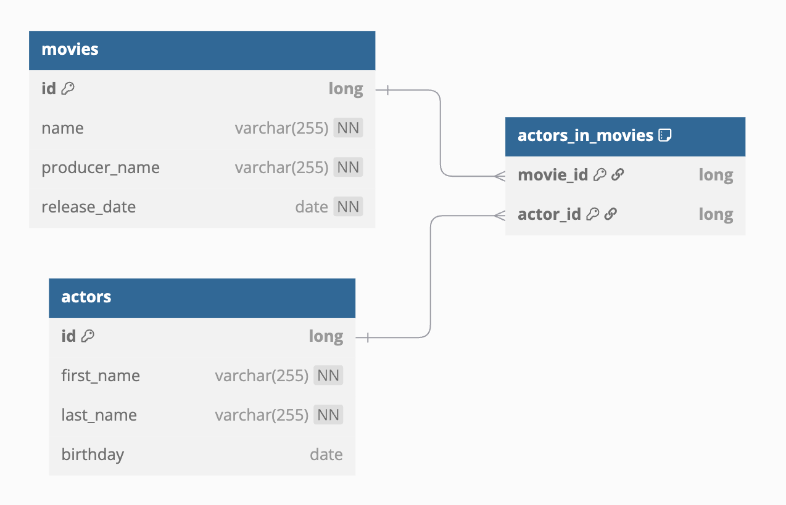

# 05-exposed-r2dbc-repository-coroutines

Spring WebFlux + Exposed R2DBC + Kotlin Coroutines를 활용한 비동기 Repository 패턴 예제입니다.
`ExposedR2dbcRepository` 인터페이스를 구현하여 영화(Movie)와 배우(Actor) 도메인을 CRUD하는 REST API를 제공합니다.

## 문서

* [ExposedRepository with Coroutines](https://debop.notion.site/ExposedRepository-with-Coroutines-1c32744526b080a1a6cbe2c86c2cb889)

## 기술 스택

| 구분        | 기술                             |
|-----------|--------------------------------|
| Framework | Spring Boot (WebFlux)          |
| ORM       | Exposed R2DBC                  |
| 비동기       | Kotlin Coroutines + Flow       |
| DB        | H2 (기본), MySQL 8, PostgreSQL   |
| DB 컨테이너   | Testcontainers                 |
| API 문서    | SpringDoc OpenAPI (Swagger UI) |
| 서버        | Netty (Reactive)               |

## 프로젝트 구조

```
src/main/kotlin/exposed/r2dbc/examples/
├── ExposedR2dbcRepositoryApp.kt          # Spring Boot 애플리케이션 진입점
├── config/
│   ├── ExposedR2dbcConfig.kt             # R2DBC Database 및 ConnectionPool 설정
│   ├── NettyConfig.kt                    # Netty 서버 튜닝 (이벤트 루프, 커넥션 등)
│   └── SwaggerConfig.kt                  # OpenAPI(Swagger) 문서 설정
├── controller/
│   ├── IndexController.kt                # 빌드 정보 조회 (/)
│   ├── MovieController.kt                # 영화 CRUD API (/movies)
│   ├── ActorController.kt                # 배우 CRUD API (/actors)
│   └── MovieActorsController.kt          # 영화-배우 관계 조회 API (/movie-actors)
├── domain/
│   ├── model/
│   │   ├── MovieSchema.kt                # Exposed 테이블 정의 (MovieTable, ActorTable, ActorInMovieTable)
│   │   ├── MovieDtos.kt                  # DTO 클래스들 (MovieRecord, ActorRecord 등)
│   │   └── Mappers.kt                    # ResultRow → DTO 변환 확장 함수
│   └── repository/
│       ├── MovieR2dbcRepository.kt       # 영화 Repository (ExposedR2dbcRepository 구현)
│       └── ActorR2dbcRepository.kt       # 배우 Repository (ExposedR2dbcRepository 구현)
└── utils/
    └── DataInitializer.kt                # 애플리케이션 시작 시 샘플 데이터 삽입
```

## 데이터베이스 스키마



### 테이블 구조

- **movies** - 영화 정보 (`id`, `name`, `producer_name`, `release_date`)
- **actors** - 배우 정보 (`id`, `first_name`, `last_name`, `birthday`)
- **actors_in_movies** - 영화-배우 다대다 관계 (`movie_id`, `actor_id`)

```kotlin
object MovieTable: LongIdTable("movies") {
    val name = varchar("name", 255).index()
    val producerName = varchar("producer_name", 255).index()
    val releaseDate = date("release_date")
}

object ActorTable: LongIdTable("actors") {
    val firstName = varchar("first_name", 255).index()
    val lastName = varchar("last_name", 255).index()
    val birthday = date("birthday").nullable()
}

object ActorInMovieTable: Table("actors_in_movies") {
    val movieId = reference("movie_id", MovieTable, onDelete = ReferenceOption.CASCADE)
    val actorId = reference("actor_id", ActorTable, onDelete = ReferenceOption.CASCADE)
    override val primaryKey = PrimaryKey(movieId, actorId)
}
```

## 핵심 구현 패턴

### 1. ExposedR2dbcRepository 기반 Repository

`ExposedR2dbcRepository<T, ID>` 인터페이스를 구현하여 기본 CRUD(`findAll`, `findById`,
`deleteById` 등)를 상속받고, 도메인별 커스텀 쿼리 메서드를 추가합니다.

```kotlin
@Repository
class MovieR2dbcRepository: ExposedR2dbcRepository<MovieRecord, Long> {
    override val table: IdTable<Long> = MovieTable
    override suspend fun ResultRow.toEntity(): MovieRecord = toMovieRecord()

    suspend fun save(movie: MovieRecord): MovieRecord {
        ...
    }
    fun searchMovies(params: Map<String, String?>): Flow<MovieRecord> {
        ...
    }
    fun getAllMoviesWithActors(): Flow<MovieWithActorRecord> {
        ...
    }
}
```

### 2. Coroutine 기반 Controller

Spring WebFlux의 `suspend` 함수를 활용하여 비동기 API 엔드포인트를 구현합니다. 모든 DB 접근은 `suspendTransaction` 블록 내에서 수행됩니다.

```kotlin
@RestController
@RequestMapping("/movies")
class MovieController(private val movieRepository: MovieR2dbcRepository) {

    @GetMapping("/{id}")
    suspend fun getMovieWithActors(@PathVariable id: Long): MovieWithActorRecord? =
        suspendTransaction {
            movieRepository.getMovieWithActors(id)
        }
}
```

### 3. Flow를 활용한 Join 쿼리 + bufferUntilChanged

영화-배우 관계(다대다 Join)를 조회할 때, `Flow`의 `bufferUntilChanged`를 사용하여 동일 영화에 속하는 배우들을 그룹핑합니다.

```kotlin
fun getAllMoviesWithActors(): Flow<MovieWithActorRecord> {
    return MovieActorJoin
        .select(MovieTable.id, MovieTable.name, ..., ActorTable.id, ActorTable.firstName, ...)
    .map { row -> row.toMovieRecord() to row.toActorRecord() }
        .bufferUntilChanged { it.first.id }
        .mapNotNull { pairs ->
            val movie = pairs.first().first
            val actors = pairs.map { it.second }
            movie.toMovieWithActorRecord(actors)
        }
}
```

### 4. R2DBC ConnectionPool 설정

`ConnectionFactoryOptions`를 Profile별(H2/MySQL/PostgreSQL)로 구성하고,
`ConnectionPool`로 래핑하여 `R2dbcDatabase`에 연결합니다.

```kotlin
@Bean
fun r2dbcDatabase(
    connectionPool: ConnectionPool,
    connectionFactoryOptions: ConnectionFactoryOptions,
    databaseCoroutineDispatcher: CoroutineDispatcher,
): R2dbcDatabase {
    val config = R2dbcDatabaseConfig {
        this.dispatcher = databaseCoroutineDispatcher
        this.connectionFactoryOptions = connectionFactoryOptions
    }
    return R2dbcDatabase.connect(connectionPool, config)
}
```

## API 엔드포인트

### Movies (`/movies`)

| Method | Path                                       | 설명               |
|--------|--------------------------------------------|------------------|
| GET    | `/movies`                                  | 전체 영화 목록 조회      |
| GET    | `/movies/{id}`                             | 영화 상세 조회 (배우 포함) |
| GET    | `/movies/search?name=...&producerName=...` | 영화 검색            |
| POST   | `/movies`                                  | 영화 등록            |
| DELETE | `/movies/{id}`                             | 영화 삭제            |

### Actors (`/actors`)

| Method | Path                                        | 설명          |
|--------|---------------------------------------------|-------------|
| GET    | `/actors`                                   | 전체 배우 목록 조회 |
| GET    | `/actors/{id}`                              | 배우 상세 조회    |
| GET    | `/actors/search?firstName=...&lastName=...` | 배우 검색       |
| POST   | `/actors`                                   | 배우 등록       |
| DELETE | `/actors/{id}`                              | 배우 삭제       |

### Movie-Actors (`/movie-actors`)

| Method | Path                             | 설명                |
|--------|----------------------------------|-------------------|
| GET    | `/movie-actors/{movieId}`        | 특정 영화의 배우 목록 조회   |
| GET    | `/movie-actors/count`            | 영화별 출연 배우 수 조회    |
| GET    | `/movie-actors/acting-producers` | 제작자가 직접 출연한 영화 조회 |

## 실행 방법

### 기본 실행 (H2 인메모리)

```bash
./gradlew :09-spring:05-exposed-r2dbc-repository-coroutines:bootRun
```

### Profile 지정 실행

```bash
# PostgreSQL (Testcontainers 자동 실행)
./gradlew :09-spring:05-exposed-r2dbc-repository-coroutines:bootRun --args='--spring.profiles.active=postgres'

# MySQL (Testcontainers 자동 실행)
./gradlew :09-spring:05-exposed-r2dbc-repository-coroutines:bootRun --args='--spring.profiles.active=mysql'
```

### Swagger UI 접속

애플리케이션 실행 후 http://localhost:8080/webjars/swagger-ui/index.html 에서 API 문서를 확인할 수 있습니다.

## 테스트

```bash
./gradlew :09-spring:05-exposed-r2dbc-repository-coroutines:test
```

테스트는 `@ActiveProfiles("h2")`로 H2 인메모리 DB를 사용하며, `@SpringBootTest`로 전체 애플리케이션 컨텍스트를 로드합니다.

### 테스트 목록

- **MovieR2dbcRepositoryTest** - 영화 CRUD, 검색, Join 쿼리, 배우 수 집계, 제작자 겸 배우 조회
- **ActorR2dbcRepositoryTest** - 배우 CRUD, 검색
- **MovieControllerTest** - 영화 API 엔드포인트 통합 테스트
- **ActorControllerTest** - 배우 API 엔드포인트 통합 테스트
- **MovieActorsControllerTest** - 영화-배우 관계 API 통합 테스트
- **ConfigurationTest** - Spring 설정 로드 검증
- **DomainSQLTest** - 도메인 SQL 쿼리 테스트
