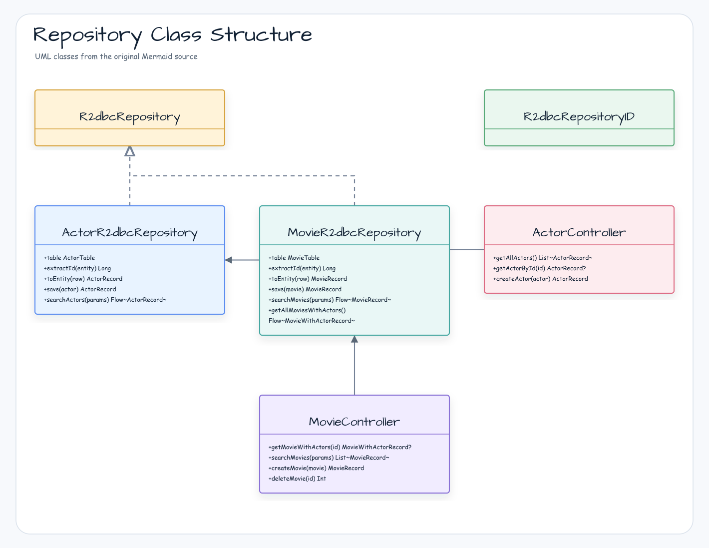
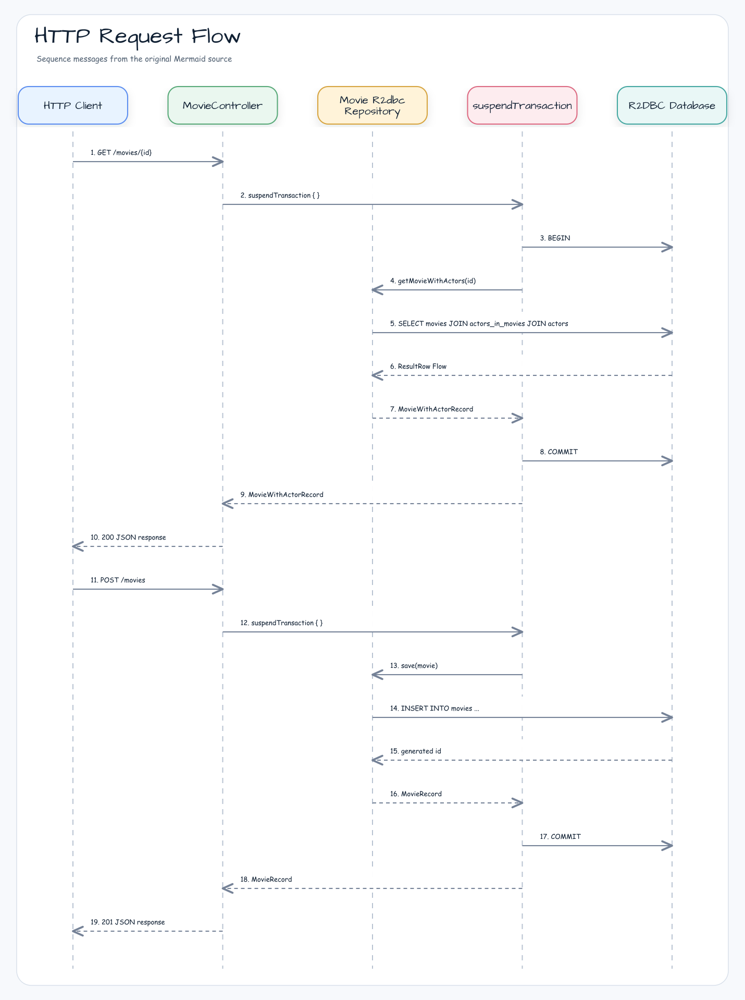
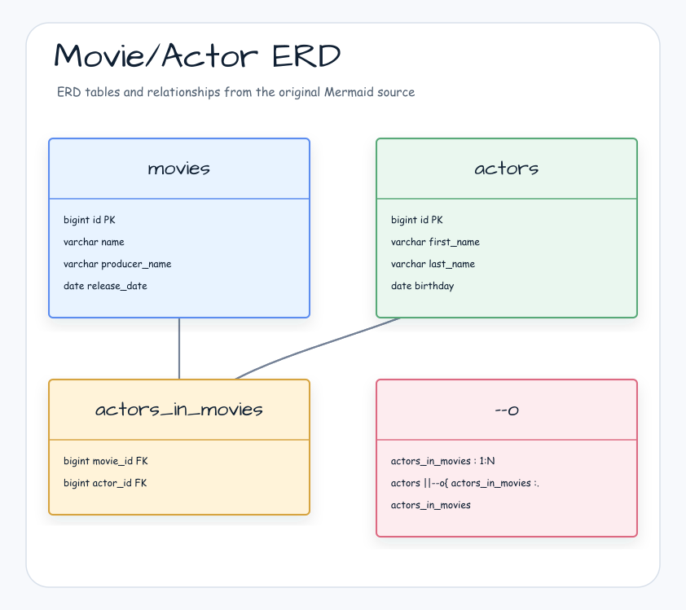
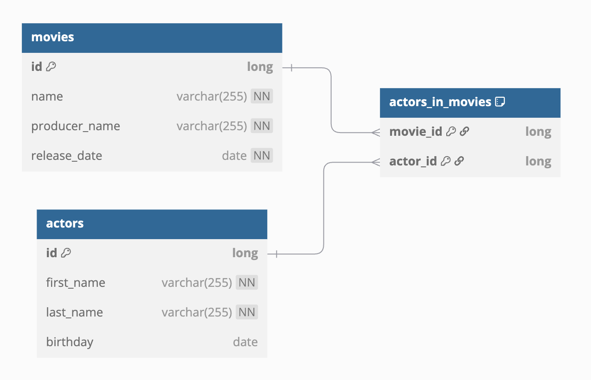

> 한국어 버전: [README.ko.md](README.ko.md)

# 05-exposed-r2dbc-repository-coroutines

An example of the async Repository pattern using Spring WebFlux + Exposed R2DBC + Kotlin Coroutines.
Implements the `R2dbcRepository` interface (from `io.bluetape4k.exposed.r2dbc.repository`) to provide a REST API for CRUD operations on Movie and Actor domains.

## Documentation

* [ExposedRepository with Coroutines](https://debop.notion.site/ExposedRepository-with-Coroutines-1c32744526b080a1a6cbe2c86c2cb889)

## Tech Stack

| Category    | Technology                             |
|-------------|----------------------------------------|
| Framework   | Spring Boot (WebFlux)                  |
| ORM         | Exposed R2DBC                          |
| Async       | Kotlin Coroutines + Flow               |
| DB          | H2 (default), MySQL 8, PostgreSQL      |
| DB Container| Testcontainers                         |
| API Docs    | SpringDoc OpenAPI (Swagger UI)         |
| Server      | Netty (Reactive)                       |

## Project Structure

```
src/main/kotlin/exposed/r2dbc/examples/
├── ExposedR2dbcRepositoryApp.kt          # Spring Boot application entry point
├── config/
│   ├── ExposedR2dbcConfig.kt             # R2DBC Database and ConnectionPool configuration
│   ├── NettyConfig.kt                    # Netty server tuning (event loop, connections, etc.)
│   └── SwaggerConfig.kt                  # OpenAPI (Swagger) documentation configuration
├── controller/
│   ├── IndexController.kt                # Build info endpoint (/)
│   ├── MovieController.kt                # Movie CRUD API (/movies)
│   ├── ActorController.kt                # Actor CRUD API (/actors)
│   └── MovieActorsController.kt          # Movie-Actor relationship API (/movie-actors)
├── domain/
│   ├── model/
│   │   ├── MovieSchema.kt                # Exposed table definitions (MovieTable, ActorTable, ActorInMovieTable)
│   │   ├── MovieDtos.kt                  # DTO classes (MovieRecord, ActorRecord, etc.)
│   │   └── Mappers.kt                    # ResultRow → DTO conversion extension functions
│   └── repository/
│       ├── MovieR2dbcRepository.kt       # Movie Repository (implements R2dbcRepository)
│       └── ActorR2dbcRepository.kt       # Actor Repository (implements R2dbcRepository)
└── utils/
    └── DataInitializer.kt                # Insert sample data on application startup (runBlocking bridge pattern)
```

## Repository Class Structure



## HTTP Request Flow



## Movie/Actor ERD



## Spring + Coroutine Bridge Pattern (`DataInitializer`)

`onApplicationEvent` in `ApplicationListener<ApplicationReadyEvent>` is a regular (non-suspend) function.
To use `suspendTransaction` from Exposed R2DBC, you must bridge to the coroutine world with `runBlocking`.

```kotlin
@Component
class DataInitializer: ApplicationListener<ApplicationReadyEvent> {

    override fun onApplicationEvent(event: ApplicationReadyEvent) {
        // runBlocking: blocks the current thread and runs coroutines
        // Dispatchers.IO: thread pool optimized for I/O-intensive initialization
        runBlocking(Dispatchers.IO) {
            suspendTransaction {
                createTables()
                populateData()
            }
        }
    }
}
```

> **Note**: Use `runBlocking` only in initialization logic. In service/repository layers,
> use `suspend fun` and `suspendTransaction` directly.

## Database Schema



### Table Structure

- **movies** - Movie info (`id`, `name`, `producer_name`, `release_date`)
- **actors** - Actor info (`id`, `first_name`, `last_name`, `birthday`)
- **actors_in_movies** - Many-to-many relationship between movies and actors (`movie_id`, `actor_id`)

```kotlin
object MovieTable: LongIdTable("movies") {
    val name = varchar("name", 255).index()
    val producerName = varchar("producer_name", 255).index()
    val releaseDate = date("release_date")
}

object ActorTable: LongIdTable("actors") {
    val firstName = varchar("first_name", 255).index()
    val lastName = varchar("last_name", 255).index()
    val birthday = date("birthday").nullable()
}

object ActorInMovieTable: Table("actors_in_movies") {
    val movieId = reference("movie_id", MovieTable, onDelete = ReferenceOption.CASCADE)
    val actorId = reference("actor_id", ActorTable, onDelete = ReferenceOption.CASCADE)
    override val primaryKey = PrimaryKey(movieId, actorId)
}
```

## Core Implementation Patterns

### 1. Repository Based on R2dbcRepository

Implement `R2dbcRepository<ID, T>` (from `io.bluetape4k.exposed.r2dbc.repository`) to inherit basic CRUD (`findAll`, `findById`, `deleteById`, etc.)
and add domain-specific custom query methods.

```kotlin
@Repository
class MovieR2dbcRepository: R2dbcRepository<Long, MovieRecord> {
    override val table = MovieTable
    override fun extractId(entity: MovieRecord): Long = entity.id
    override suspend fun ResultRow.toEntity(): MovieRecord = toMovieRecord()

    suspend fun save(movie: MovieRecord): MovieRecord {
        ...
    }
    fun searchMovies(params: Map<String, String?>): Flow<MovieRecord> {
        ...
    }
    fun getAllMoviesWithActors(): Flow<MovieWithActorRecord> {
        ...
    }
}
```

### 2. Coroutine-Based Controller

Implement async API endpoints using Spring WebFlux's `suspend` functions. All DB access is performed inside a `suspendTransaction` block.

```kotlin
@RestController
@RequestMapping("/movies")
class MovieController(private val movieRepository: MovieR2dbcRepository) {

    @GetMapping("/{id}")
    suspend fun getMovieWithActors(@PathVariable id: Long): MovieWithActorRecord? =
        suspendTransaction {
            movieRepository.getMovieWithActors(id)
        }
}
```

### 3. Join Query with Flow + bufferUntilChanged

When querying the many-to-many movie-actor relationship, use Flow's `bufferUntilChanged` to group actors belonging to the same movie.

```kotlin
fun getAllMoviesWithActors(): Flow<MovieWithActorRecord> {
    return MovieActorJoin
        .select(MovieTable.id, MovieTable.name, ..., ActorTable.id, ActorTable.firstName, ...)
    .map { row -> row.toMovieRecord() to row.toActorRecord() }
        .bufferUntilChanged { it.first.id }
        .mapNotNull { pairs ->
            val movie = pairs.first().first
            val actors = pairs.map { it.second }
            movie.toMovieWithActorRecord(actors)
        }
}
```

### 4. R2DBC ConnectionPool Configuration

Configure `ConnectionFactoryOptions` per profile (H2/MySQL/PostgreSQL),
wrap with `ConnectionPool`, and connect to `R2dbcDatabase`.

```kotlin
@Bean
fun r2dbcDatabase(
    connectionPool: ConnectionPool,
    connectionFactoryOptions: ConnectionFactoryOptions,
    databaseCoroutineDispatcher: CoroutineDispatcher,
): R2dbcDatabase {
    val config = R2dbcDatabaseConfig {
        this.dispatcher = databaseCoroutineDispatcher
        this.connectionFactoryOptions = connectionFactoryOptions
    }
    return R2dbcDatabase.connect(connectionPool, config)
}
```

## API Endpoints

### Movies (`/movies`)

| Method | Path                                       | Description                        |
|--------|--------------------------------------------|------------------------------------|
| GET    | `/movies`                                  | Get all movies                     |
| GET    | `/movies/{id}`                             | Get movie details (with actors)    |
| GET    | `/movies/search?name=...&producerName=...` | Search movies                      |
| POST   | `/movies`                                  | Create a movie                     |
| DELETE | `/movies/{id}`                             | Delete a movie                     |

### Actors (`/actors`)

| Method | Path                                        | Description        |
|--------|---------------------------------------------|--------------------|
| GET    | `/actors`                                   | Get all actors     |
| GET    | `/actors/{id}`                              | Get actor details  |
| GET    | `/actors/search?firstName=...&lastName=...` | Search actors      |
| POST   | `/actors`                                   | Create an actor    |
| DELETE | `/actors/{id}`                              | Delete an actor    |

### Movie-Actors (`/movie-actors`)

| Method | Path                             | Description                              |
|--------|----------------------------------|------------------------------------------|
| GET    | `/movie-actors/{movieId}`        | Get actors for a specific movie          |
| GET    | `/movie-actors/count`            | Get actor count per movie                |
| GET    | `/movie-actors/acting-producers` | Get movies where producer also acted     |

## Running the Application

### Default Run (H2 In-Memory)

```bash
./gradlew :05-exposed-r2dbc-repository-coroutines:bootRun
```

### Run with Specific Profile

```bash
# PostgreSQL (Testcontainers auto-starts)
./gradlew :05-exposed-r2dbc-repository-coroutines:bootRun --args='--spring.profiles.active=postgres'

# MySQL (Testcontainers auto-starts)
./gradlew :05-exposed-r2dbc-repository-coroutines:bootRun --args='--spring.profiles.active=mysql'
```

### Swagger UI

After starting the application, access API docs at http://localhost:8080/webjars/swagger-ui/index.html.

## Testing

```bash
./gradlew :05-exposed-r2dbc-repository-coroutines:test
```

Tests use H2 in-memory DB with `@ActiveProfiles("h2")` and load the full application context with `@SpringBootTest`.

### Test List

- **MovieR2dbcRepositoryTest** - Movie CRUD, search, join queries, actor count aggregation, producer-actor overlap queries
- **ActorR2dbcRepositoryTest** - Actor CRUD, search
- **MovieControllerTest** - Movie API endpoint integration tests
- **ActorControllerTest** - Actor API endpoint integration tests
- **MovieActorsControllerTest** - Movie-Actor relationship API integration tests
- **ConfigurationTest** - Spring configuration load verification
- **DomainSQLTest** - Domain SQL query tests

## Spring DI + Exposed R2DBC Integration Patterns

### Dependency Injection Structure

```
Spring Container
    ├── R2dbcDatabase  ←── ExposedR2dbcConfig (ConnectionPool + CoroutineDispatcher)
    ├── MovieR2dbcRepository  ←── @Repository (R2dbcRepository<Long, MovieRecord>)
    ├── ActorR2dbcRepository  ←── @Repository
    └── MovieController / ActorController / MovieActorsController
            └── suspendTransaction { repository.xxx() }
```

### Repository Layer Design

The `R2dbcRepository<ID, E>` interface (from `io.bluetape4k.exposed.r2dbc.repository`) provides basic CRUD.
Implementing classes need to provide `override val table`, `override fun extractId()`, and `override suspend fun ResultRow.toEntity()`
to inherit `findAll()`, `findById()`, `deleteById()`, etc.

```kotlin
// Base functionality from interface compliance
interface R2dbcRepository<ID, E> {
    val table: IdTable<ID>
    fun extractId(entity: E): ID
    suspend fun ResultRow.toEntity(): E
    fun findAll(): Flow<E>                  // inherited automatically
    suspend fun findById(id: ID): E?        // inherited automatically
    suspend fun deleteById(id: ID): Int     // inherited automatically
}
```

Domain-specific queries (`searchMovies`, `getAllMoviesWithActors`, etc.) are added directly to the implementation class.

### Transaction Boundaries

The Controller explicitly defines transaction boundaries with `suspendTransaction { }` blocks.
Repository methods themselves do not open transactions, so multiple Repository calls can be wrapped in a single transaction.

```kotlin
// Example: wrapping multiple Repository calls in a single transaction
@PostMapping("/{movieId}/actors/{actorId}")
suspend fun addActorToMovie(@PathVariable movieId: Long, @PathVariable actorId: Long) =
    suspendTransaction {
        val movie = movieRepository.findById(movieId) ?: error("Movie not found")
        val actor = actorRepository.findById(actorId) ?: error("Actor not found")
        actorInMovieRepository.link(movie, actor)
    }
```

## Further Reading

- [ExposedRepository with Coroutines](https://debop.notion.site/ExposedRepository-with-Coroutines-1c32744526b080a1a6cbe2c86c2cb889)
- [Kotlin Coroutines Guide](https://kotlinlang.org/docs/coroutines-guide.html)
- [Spring WebFlux](https://docs.spring.io/spring/docs/current/spring-framework-reference/web-reactive.html)
- [Exposed Wiki: Coroutines (if available)](https://github.com/JetBrains/Exposed/wiki/Coroutines)
