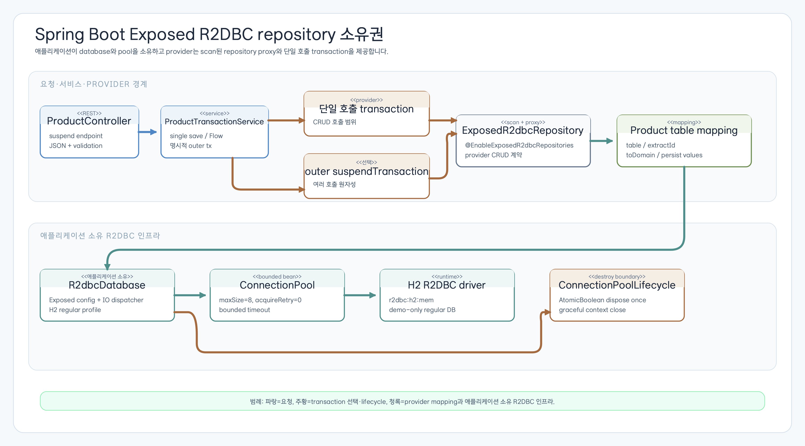

# Spring Boot Exposed R2DBC Repository

> English version: [README.md](README.md)

이 sibling 예제는 `bluetape4k-exposed-spring-boot-r2dbc` provider를 사용하는
Spring WebFlux `suspend` API를 보여 줍니다. 애플리케이션이 R2DBC
`ConnectionPool`과 Exposed `R2dbcDatabase`를 소유하고,
`@EnableExposedR2dbcRepositories`가 만든 repository proxy만 provider가
소유합니다.



## 이 예제에서 배우는 내용

- provider scan이 `ExposedR2dbcRepository` proxy를 만드는 방법;
- nullable ID, `IdTable`, 불변 `ProductRecord`를 매핑하는 방법;
- repository 호출 하나의 provider transaction과 여러 호출을 묶는 명시적
  outer `suspendTransaction`의 차이;
- WebFlux suspend handler가 JSON을 반환하기 전에 `Flow`를 materialize하는 방법;
- credential을 노출하지 않고 cancellation, rollback, bounded pool,
  lifecycle dispose, 잘못된 설정을 검증하는 방법.

H2 데이터베이스와 `ApplicationReadyEvent` initializer는 결정적인 학습용
fixture일 뿐입니다. 이 모듈은 운영 migration, credential, monitoring,
readiness의 기준 구현이 아닙니다.

## 05 수동 repository와 06 provider adapter

앞의 [`05-exposed-r2dbc-repository-coroutines`](../05-exposed-r2dbc-repository-coroutines/README.ko.md)
예제는 repository와 모든 transaction 경계를 직접 구현합니다. 이 sibling은
같은 R2DBC 플랫폼을 사용하지만 표준 CRUD method 구현을 provider에 위임합니다.
두 모듈은 별도 학습 예제이며 05에서 06으로의 drop-in migration을 뜻하지
않습니다.

| 항목 | 05 수동 `R2dbcRepository` | 06 provider adapter | 선택 기준 |
| --- | --- | --- | --- |
| 구현 | class와 SQL mapping을 직접 작성 | mapping default를 가진 interface; scanner가 proxy 생성 | 직접 query/transaction 제어 vs 표준 coroutine CRUD 계약 |
| Transaction 소유권 | 애플리케이션 코드가 `suspendTransaction` 실행 | provider 호출마다 한 transaction; 필요할 때 app이 outer transaction 실행 | 여러 호출의 명시적 원자성이 필요할 때 |
| ID 조회 | 프로젝트별 method | provider 계약의 `findByIdOrNull(id)` | nullable 조회를 명시하고 싶을 때 |
| Mapping | `ResultRow`와 insert/update를 직접 작성 | `table`, `extractId`, `toDomain`, `toPersistValues` | CRUD 반복 대신 adapter 경계를 학습할 때 |

## Provider와 애플리케이션 연결

dependency version은 workshop catalog/BOM이 관리합니다. live
`dependencyInsight`로 해석 결과를 확인하며 module 안에 provider 버전을
직접 고정하지 않습니다.

```kotlin
@SpringBootApplication(proxyBeanMethods = false)
@EnableExposedR2dbcRepositories(
    basePackages = ["exposed.r2dbc.examples.springbootrepository.repository"],
)
class ExposedSpringBootR2dbcRepositoryApp
```

`ExposedR2dbcConfig`는 H2 `ConnectionFactoryOptions`, bounded
`ConnectionPool`(`maxSize=8`, 생성 10초, acquire 3초, idle 10분, life 30분,
`acquireRetry=0`), `Dispatchers.IO`를 사용하는 `R2dbcDatabase`를 만듭니다.
`ConnectionPoolLifecycle`이 유일한 Spring destroy 경계이며
`AtomicBoolean`으로 dispose를 한 번만 수행합니다. whitelist sanitizer는
driver/protocol/host/port/database만 기록하고 password와 전체 R2DBC URL은
기록하지 않습니다.

## Product mapping

provider interface는 실제 provider API에 맞춘 최소 계약입니다.

```kotlin
interface ProductR2dbcRepository : ExposedR2dbcRepository<ProductRecord, Long> {
    override val table: IdTable<Long>
        get() = Products
    override fun extractId(entity: ProductRecord): Long? = entity.id
    override fun toDomain(row: ResultRow): ProductRecord = ProductRecord(
        id = row[Products.id].value,
        name = row[Products.name],
        description = row[Products.description],
    )
    override fun toPersistValues(entity: ProductRecord): Map<Column<*>, Any?> = buildMap {
        this[Products.name] = entity.name
        this[Products.description] = entity.description
    }
}
```

insert에서는 `ProductRecord.id`가 nullable입니다. `save`는 생성된 ID를
반환하고, 기존 ID를 저장하면 update semantics를 유지합니다. `findAll()`은
cold `Flow`이므로 호출자가 `toList()` 같은 소비 방식을 명시합니다.
`streamAll()`은 여기서 `take(1)`과 함께 bounded 소비와 cancellation을
보여 줍니다.

## Transaction과 실패 경계

`ProductTransactionService`는 `save`, `findByIdOrNull`, `findAll`, `count`,
`deleteIfExists`와 다음 학습용 method를 제공합니다.

- `saveTwoAtomically`: app-owned outer `suspendTransaction` 안에서 두 provider
  호출을 실행하므로 뒤의 실패가 모두 rollback됩니다.
- `saveTwoAndFailAtomically`: 유효한 두 저장 뒤 고정 예외를 발생시켜 outer
  rollback을 증명합니다.
- `saveTwoAndFailWithoutOuterTransaction`: 독립 provider 호출을 수행하므로
  두 번째 bounded insert가 실패해도 첫 번째 commit이 남습니다.

이 예제는 Spring `@Transactional`이 suspend repository를 감싼다고 주장하지
않습니다. 사용할 transaction 경계는 명시적인 Exposed `suspendTransaction`입니다.
단일 호출 rollback, outer rollback, 의도적으로 만든 no-outer partial commit을
모두 새로운 H2 transaction으로 검증합니다.

현재 `bluetape4k-exposed` 2.x direct JDK proxy는 implementation이 던진
`IllegalArgumentException`을 wrapper 없이 호출자에게 재전파합니다. 1.12.1에서
관찰되던 `UndeclaredThrowableException`은 해당 release의 historical surface이며,
이 예제는 중앙 catalog가 해석한 현재 provider 계약을 따릅니다.

## HTTP API

| Method | Path | 성공 응답 | Body |
| --- | --- | --- | --- |
| `GET` | `/products` | `200 application/json` | materialize한 `ProductRecord[]` |
| `GET` | `/products/{id}` | `200` 또는 `404 application/problem+json` | 존재할 때 `ProductRecord`, 없을 때 일반화된 `ProblemDetail` |
| `POST` | `/products` | `201 application/json` | `ProductCreateRequest` 입력, generated-ID `ProductRecord` 출력 |
| `DELETE` | `/products/{id}` | `204` 또는 `404` | 성공 시 비어 있음 |

`ProductCreateRequest`는 ID를 받지 않습니다. `name`은 `@NotBlank`이고 최대
120자이며, nullable `description`은 최대 500자입니다. unknown property,
공백/길이 초과, malformed JSON은 일반화된 `400 application/problem+json`
detail로 끝납니다. 없는 record는 같은 일반화된 `ProblemDetail` 형식의
`404 application/problem+json`으로 응답합니다. 애플리케이션이 소유한 설정과
lifecycle log는 whitelist/type-only 값만 기록하며, framework와 driver의
stack trace는 이 예제의 redaction 보장 범위가 아닙니다.

## Cancellation과 운영 경계

`streamAll().collect`를 취소하면 `CancellationException`이 호출자에게 다시
전달되고 connection은 반환되며 후속 query가 성공합니다. test-only pool은
`maxSize=1`, 100 ms acquire timeout, no retry로 bounded contention을
실행합니다. 애플리케이션 소유 pool close는 명시적이고 idempotent하며,
dispose 뒤 acquire는 새 pool을 만들지 않고 실패합니다.

Actuator, metrics, health endpoint는 이 예제에서 **N/A**입니다. production
readiness나 운영 monitoring을 보장하지 않으며, 관찰 범위는 애플리케이션 소유의
sanitized low-cardinality log와 bounded test evidence로 제한합니다.

## 실행

```bash
./gradlew :06-exposed-spring-boot-r2dbc-repository:bootRun
./gradlew :06-exposed-spring-boot-r2dbc-repository:test -PuseDB=H2
```

`bootRun`은 demo process입니다. bounded startup smoke 뒤 종료하고 장기
production service로 사용하지 않습니다. 기본 `h2` profile은 shared
`regular` 인메모리 데이터베이스를 사용합니다. 잘못된 driver는 database
설정 중 실패하고, test-only pool acquire timeout은 설정값으로 bounded하게
제한되어 테스트에서 검증되며, initializer/schema 실패는 원래 예외로
재전파됩니다.
복구는 local demo fixture의 정상 재기동 또는 rollback 범위이며 production
migration과 외부 credential은 이 모듈 밖입니다.

## 범위 밖

Query by Example, projection, `saveAll` endpoint는 이 예제에 구현하지
않았습니다. 이는 provider capability를 부정하는 것이 아니라 이번
workshop slice의 제외 범위입니다. Spring reactive transaction manager도
추가하지 않습니다. 여기서 보여 주는 동작은 app-owned Exposed
`suspendTransaction` 경계이기 때문입니다.

Provider source/manual: [bluetape4k exposed-spring-boot-r2dbc 2.0.0](https://github.com/bluetape4k/bluetape4k-exposed/releases/tag/2.0.0)
