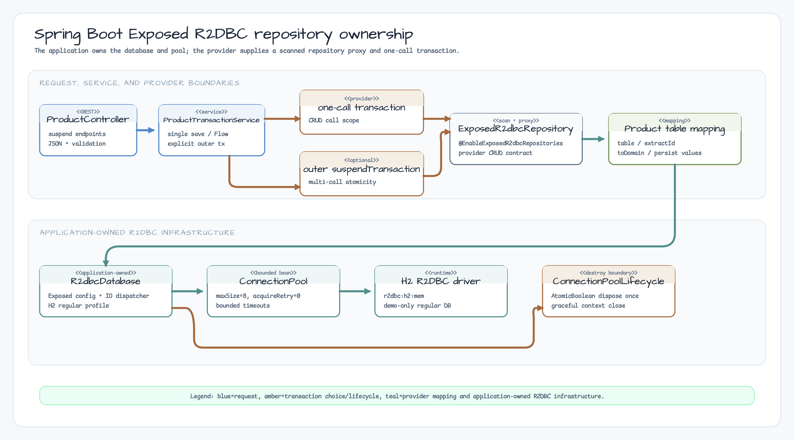

# Spring Boot Exposed R2DBC Repository

> Korean version: [README.ko.md](README.ko.md)

This sibling example shows a Spring WebFlux `suspend` API backed by the
`bluetape4k-exposed-spring-boot-r2dbc` provider. The application owns the
R2DBC `ConnectionPool` and Exposed `R2dbcDatabase`; the provider owns only the
repository proxy created by `@EnableExposedR2dbcRepositories`.



## What this example teaches

- how provider scanning creates an `ExposedR2dbcRepository` proxy;
- how a nullable ID, `IdTable`, and immutable `ProductRecord` are mapped;
- how a repository call has one provider transaction, while an explicit outer
  `suspendTransaction` groups multiple calls;
- how WebFlux suspend handlers materialize a `Flow` before returning JSON;
- how cancellation, rollback, bounded pool settings, lifecycle disposal, and
  invalid configuration are tested without exposing credentials.

The H2 database and `ApplicationReadyEvent` initializer are a deterministic
learning fixture only. This module is not a production migration, credential,
monitoring, or readiness reference.

## 05 manual repository vs 06 provider adapter

The preceding [`05-exposed-r2dbc-repository-coroutines`](../05-exposed-r2dbc-repository-coroutines/README.md)
example implements the repository and every transaction boundary directly.
This sibling keeps the same R2DBC platform but delegates standard CRUD method
implementation to the provider. It is a separate learning example, not a
drop-in migration of the 05 module.

| Concern | 05 manual `R2dbcRepository` | 06 provider adapter | Choose when |
| --- | --- | --- | --- |
| Implementation | Hand-written class and SQL mapping | Interface plus mapping defaults; scanner creates proxy | Direct query/transaction control vs standard coroutine CRUD contract |
| Transaction ownership | Application code opens `suspendTransaction` | Each provider call opens one transaction; app opens an outer one when needed | Explicit multi-call atomicity is needed in either approach |
| ID lookup | Project-specific method | `findByIdOrNull(id)` from the provider contract | Nullable lookup should be explicit |
| Mapping | Manual `ResultRow` and insert/update code | `table`, `extractId`, `toDomain`, `toPersistValues` | Learn adapter boundaries instead of repeating CRUD boilerplate |

## Provider and application wiring

The dependency is version-managed by the workshop catalog/BOM. The live
resolution is checked with `dependencyInsight`; no module-local provider
version is pinned.

```kotlin
@SpringBootApplication(proxyBeanMethods = false)
@EnableExposedR2dbcRepositories(
    basePackages = ["exposed.r2dbc.examples.springbootrepository.repository"],
)
class ExposedSpringBootR2dbcRepositoryApp
```

`ExposedR2dbcConfig` creates an H2 `ConnectionFactoryOptions`, a bounded
`ConnectionPool` (`maxSize=8`, create 10 seconds, acquire 3 seconds, idle 10
minutes, life 30 minutes, `acquireRetry=0`), and an `R2dbcDatabase` using
`Dispatchers.IO`. `ConnectionPoolLifecycle` is the one Spring destroy boundary;
its `AtomicBoolean` makes disposal idempotent. A whitelist sanitizer logs only
driver/protocol/host/port/database, never a password or complete R2DBC URL.

## Product mapping

The provider interface is intentionally small and source-backed:

```kotlin
interface ProductR2dbcRepository : ExposedR2dbcRepository<ProductRecord, Long> {
    override val table: IdTable<Long>
        get() = Products
    override fun extractId(entity: ProductRecord): Long? = entity.id
    override fun toDomain(row: ResultRow): ProductRecord = ProductRecord(
        id = row[Products.id].value,
        name = row[Products.name],
        description = row[Products.description],
    )
    override fun toPersistValues(entity: ProductRecord): Map<Column<*>, Any?> = buildMap {
        this[Products.name] = entity.name
        this[Products.description] = entity.description
    }
}
```

`ProductRecord.id` is nullable for inserts. `save` returns the generated ID;
saving an existing ID retains update semantics. `findAll()` is a cold `Flow`,
so callers choose an explicit consumer such as `toList()`. `streamAll()` is
used here with `take(1)` to demonstrate bounded consumption and cancellation.

## Transactions and failure boundaries

`ProductTransactionService` exposes `save`, `findByIdOrNull`, `findAll`,
`count`, `deleteIfExists`, and the following teaching methods:

- `saveTwoAtomically`: two provider calls inside one app-owned outer
  `suspendTransaction`, so a later failure rolls both back;
- `saveTwoAndFailAtomically`: two valid saves followed by a fixed exception,
  proving the outer rollback;
- `saveTwoAndFailWithoutOuterTransaction`: independent provider calls, so a
  bounded second insert failure leaves the first committed.

The example does not claim that a Spring `@Transactional` annotation wraps a
suspend repository. It uses Exposed's explicit `suspendTransaction` boundary.
Single-call provider rollback, outer rollback, and the deliberate no-outer
partial commit are all asserted with fresh H2 transactions.

## HTTP API

| Method | Path | Success | Body |
| --- | --- | --- | --- |
| `GET` | `/products` | `200 application/json` | Materialized `ProductRecord[]` |
| `GET` | `/products/{id}` | `200` or `404 application/problem+json` | One `ProductRecord` when present; generic `ProblemDetail` when absent |
| `POST` | `/products` | `201 application/json` | `ProductCreateRequest` in, generated-ID `ProductRecord` out |
| `DELETE` | `/products/{id}` | `204` or `404` | Empty on success |

`ProductCreateRequest` does not accept an ID. `name` is `@NotBlank` and at most
120 characters; nullable `description` is at most 500 characters. Unknown
properties, blank/bounded violations, and malformed JSON return generic
`400 application/problem+json` details. Missing records use the same generic
`ProblemDetail` shape with `404 application/problem+json`. Application-owned
configuration and lifecycle logs are whitelist/type-only; framework and driver
stack traces remain outside this example's redaction guarantee.

## Cancellation and operations boundary

Cancelling `streamAll().collect` rethrows `CancellationException`; the
connection is returned and a follow-up query succeeds. The test-only pool uses
`maxSize=1`, 100 ms acquire timeout, and no retry to exercise bounded
contention. Closing the application-owned pool is explicit and idempotent;
acquisition after disposal fails rather than creating a replacement pool.

Actuator, metrics, and health endpoints are intentionally **N/A** here. The
example makes no production-readiness or operational-monitoring guarantee;
observability is limited to application-owned sanitized low-cardinality logs
and bounded tests.

## Run

```bash
./gradlew :06-exposed-spring-boot-r2dbc-repository:bootRun
./gradlew :06-exposed-spring-boot-r2dbc-repository:test -PuseDB=H2
```

`bootRun` is a demo process. Stop it after the bounded startup smoke; do not
use it as a long-running production service. The default `h2` profile uses the
shared `regular` in-memory database. A bad driver fails during database setup,
the test-only pool acquire timeout is bounded by configuration and asserted in
tests, and an initializer/schema failure is rethrown. Recovery is a
normal restart or rollback of the local demo fixture; production migrations
and external credentials are outside this module.

## Out of scope

Query by Example, projections, and `saveAll` endpoints are not implemented in
this example. Those are exclusions from this workshop slice, not a denial of
provider capabilities. A Spring reactive transaction manager is also not added:
the application-owned Exposed `suspendTransaction` boundary is the behavior
being demonstrated.

Provider manual: [bluetape4k exposed-spring-boot-r2dbc 1.12.1](https://github.com/bluetape4k/bluetape4k-exposed/blob/1.12.1/spring-boot/r2dbc/README.md)
