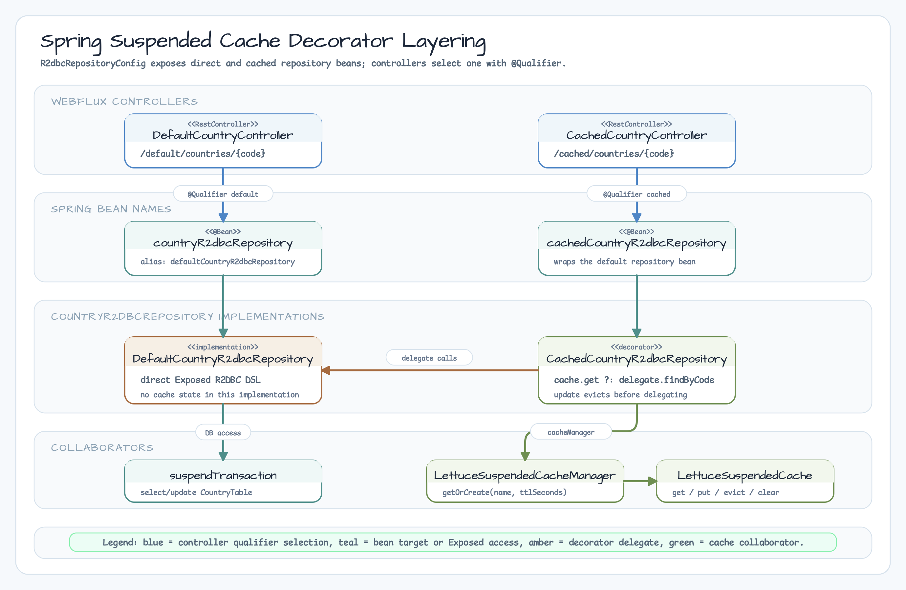
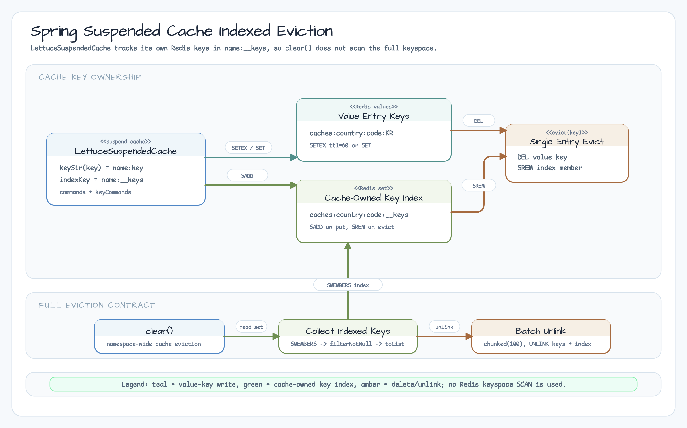

> 한국어 버전: [README.ko.md](README.ko.md)

# 07-spring-suspended-cache

An example implementing a Lettuce-based Suspended Cache with Coroutines in a Spring WebFlux + Exposed R2DBC environment. The same `CountryR2dbcRepository` interface is implemented in two ways — direct DB query (Default) and Redis cache (Cached) — to compare performance differences with and without caching.

## Documentation

* [Exposed with Spring Suspended Cache](https://debop.notion.site/Exposed-with-Suspended-Spring-Cache-1db2744526b080769d2ef307e4a3c6c9)

## Tech Stack

| Category    | Technology                             |
|-------------|----------------------------------------|
| Framework   | Spring Boot (WebFlux)                  |
| ORM         | Exposed R2DBC                          |
| Async       | Kotlin Coroutines                      |
| Cache       | Lettuce (Redis Coroutines API)         |
| Codec       | FastFory, Fory, Kryo                   |
| Compression | LZ4, Snappy, Zstd                      |
| DB          | H2 (default), MySQL 8, PostgreSQL      |
| Container   | Testcontainers (DB + Redis)            |
| Server      | Netty (Reactive)                       |

## Execution Flow


## Cache Class Structure


## Cache-Aside Pattern Flow


## Project Structure

```
src/main/kotlin/exposed/r2dbc/examples/suspendedcache/
├── SpringSuspendedCacheApplication.kt           # Spring Boot application entry point
├── cache/
│   ├── LettuceSuspendedCache.kt                 # Lettuce Coroutines-based cache implementation
│   └── LettuceSuspendedCacheManager.kt          # Cache instance manager
├── config/
│   ├── ExposedR2dbcConfig.kt                    # R2DBC Database and ConnectionPool configuration
│   ├── LettuceCacheConfig.kt                    # Redis client and CacheManager configuration
│   ├── NettyConfig.kt                           # Netty server tuning
│   └── R2dbcRepositoryConfig.kt                 # Repository Bean registration (Default/Cached)
├── controller/
│   ├── DefaultCountryController.kt              # Direct DB query API (/default/countries)
│   └── CachedCountryController.kt               # Redis cache API (/cached/countries)
├── domain/
│   ├── model/
│   │   └── CountrySchema.kt                     # CountryTable definition + CountryRecord DTO + Mapper
│   └── repository/
│       ├── CountryR2dbcRepository.kt            # Repository interface
│       ├── DefaultCountryR2dbcRepository.kt     # Direct DB query implementation
│       └── CachedCountryR2dbcRepository.kt      # Redis cache + DB query (Decorator pattern)
└── utils/
    └── DataPopulator.kt                         # Insert 249 country code sample data on startup (runBlocking bridge pattern)
```

## Spring + Coroutine Bridge Pattern (`DataPopulator`)

`onApplicationEvent` in `ApplicationListener<ApplicationReadyEvent>` is a regular (non-suspend) function.
To use `suspendTransaction` from Exposed R2DBC, you must bridge to the coroutine world with `runBlocking`.

```kotlin
@Component
class DataPopulator: ApplicationListener<ApplicationReadyEvent> {

    override fun onApplicationEvent(event: ApplicationReadyEvent) {
        // runBlocking: blocks the current thread and runs coroutines (initialization-only pattern)
        // Dispatchers.IO: thread pool optimized for inserting 249 country code data
        runBlocking(Dispatchers.IO) {
            suspendTransaction {
                createTables()
                populateCountries()
            }
        }
    }
}
```

> **Note**: Use `runBlocking` only in initialization logic. In the Repository/Service layer,
> use `suspend fun` and `suspendTransaction` directly.

## Architecture

### Cache Layer Separation Using Decorator Pattern

Cache logic is separated from the Repository implementation and applied via the Decorator pattern.
`CachedCountryR2dbcRepository` wraps `DefaultCountryR2dbcRepository` to transparently apply Redis caching.



### Bean Registration Structure

```kotlin
@Configuration
class R2dbcRepositoryConfig(private val suspendedCacheManager: LettuceSuspendedCacheManager) {

    @Bean(name = ["countryR2dbcRepository", "defaultCountryR2dbcRepository"])
    fun countryR2dbcRepository(): CountryR2dbcRepository =
        DefaultCountryR2dbcRepository()

    @Bean(name = ["cachedCountryR2dbcRepository"])
    fun cachedCountryR2dbcRepository(): CountryR2dbcRepository =
        CachedCountryR2dbcRepository(DefaultCountryR2dbcRepository(), cacheManager = suspendedCacheManager)
}
```

Controllers select the desired Repository with `@Qualifier`.

## Database Schema

### CountryTable

```kotlin
object CountryTable: IntIdTable("countries") {
    val code = varchar("code", 2).uniqueIndex()
    val name = varchar("name", 255)
    val description = text("description", eagerLoading = true).nullable()
}
```

- 249 ISO country codes inserted as sample data
- `description` contains large text to make cache effects perceptible

## Core Implementation

### 1. LettuceSuspendedCache

Uses Lettuce's `RedisCoroutinesCommands` to operate Redis cache with `suspend` functions. Supports TTL-based automatic expiration.

```kotlin
class LettuceSuspendedCache<K: Any, V: Any>(
    val name: String,
    val commands: RedisCoroutinesCommands<String, V>,
    private val keyCommands: RedisCoroutinesCommands<String, String>,
    private val ttlSeconds: Long? = null,
) {
    private val indexKey: String = "$name:__keys"

    suspend fun get(key: K): V? = commands.get(keyStr(key))

    suspend fun put(key: K, value: V) {
        val redisKey = keyStr(key)
        if (ttlSeconds != null) commands.setex(redisKey, ttlSeconds, value)
        else commands.set(redisKey, value)
        keyCommands.sadd(indexKey, redisKey)
    }

    suspend fun evict(key: K) {
        val redisKey = keyStr(key)
        commands.del(redisKey)
        keyCommands.srem(indexKey, redisKey)
    }

    suspend fun clear() {
        val keys = keyCommands.smembers(indexKey)
            .filterNotNull()
            .toList()
        keys.chunked(100).forEach { chunk ->
            if (chunk.isNotEmpty()) {
                keyCommands.unlink(*chunk.toTypedArray())
            }
        }
        keyCommands.unlink(indexKey)
    }
}
```

### 2. LettuceSuspendedCacheManager

Manages cache instances by name via `getOrCreate()` and applies `LettuceBinaryCodec` (LZ4 + FastFory serialization for volatile cache entries).

```kotlin
@Bean
fun lettuceSuspendedCacheManager(redisClient: RedisClient): LettuceSuspendedCacheManager {
    return LettuceSuspendedCacheManager(
        redisClient = redisClient,
        ttlSeconds = 60L,
        codec = LettuceBinaryCodecs.lz4FastFory(),   // LZ4 compression + FastFory (SCHEMA_CONSISTENT)
    )
}

// Usage inside a cache-aware repository:
private val cache: LettuceSuspendedCache<String, CountryRecord> by lazy {
    cacheManager.getOrCreate(
        name = CACHE_NAME,
        ttlSeconds = 60,
    )
}
```

> **FastFory cache contract**: This example uses `LettuceBinaryCodecs.lz4FastFory()` for volatile Redis cache entries. It uses `CompatibleMode.SCHEMA_CONSISTENT`, is not wire-compatible with the Fory codec, and has no automatic fallback. Flush or rebuild existing cache entries when changing the codec; do not use FastFory for persistent binary columns or other durable data.

### 3. CachedCountryR2dbcRepository

Implements the Cache-Aside pattern:

- **Read**: Check cache → if miss, query DB and store in cache
- **Update**: Invalidate cache then update DB
- **Evict All**: Delete keys tracked by the cache namespace index

```kotlin
class CachedCountryR2dbcRepository(
    private val delegate: CountryR2dbcRepository,
    private val cacheManager: LettuceSuspendedCacheManager,
): CountryR2dbcRepository {

    override suspend fun findByCode(code: String): CountryRecord? {
        return cache.get(code)
            ?: delegate.findByCode(code)?.apply { cache.put(code, this) }
    }

    override suspend fun update(countryRecord: CountryRecord): Int {
        cache.evict(countryRecord.code)
        return delegate.update(countryRecord)
    }
}
```

## API Endpoints

### Default (Direct DB Query)

| Method | Path                        | Description                    |
|--------|-----------------------------|--------------------------------|
| GET    | `/default/countries/{code}` | Query by country code (no cache) |

### Cached (Redis Cache Applied)

| Method | Path                       | Description                         |
|--------|----------------------------|-------------------------------------|
| GET    | `/cached/countries/{code}` | Query by country code (Redis cache) |

Compare `/default` and `/cached` paths with the same API structure to observe caching effects.

## Running the Application

```bash
# Default run (H2 + Redis via Testcontainers)
./gradlew :07-spring-suspended-cache:bootRun

# Use PostgreSQL
./gradlew :07-spring-suspended-cache:bootRun --args='--spring.profiles.active=postgres'

# Use MySQL
./gradlew :07-spring-suspended-cache:bootRun --args='--spring.profiles.active=mysql'
```

Redis starts automatically via Testcontainers.

## Testing

```bash
./gradlew :07-spring-suspended-cache:test
```

### Test List

- **DefaultCountryR2dbcRepositoryTest** - Direct DB query Repository tests (repeated load, update)
- **CachedCountryR2dbcRepositoryTest** - Cached Repository tests (repeated load, update, full cache eviction)
- **DefaultCountryControllerTest** - Direct DB query API tests (sequential/parallel queries)
- **CachedCountryControllerTest** - Cached API tests (sequential/parallel queries)
- **ExposedR2dbcConfigTest** - R2DBC configuration load verification
- **LettuceCacheConfigTest** - Redis cache configuration load verification
- **R2dbcRepositoryConfigTest** - Repository Bean registration verification

Tests use `@RepeatedTest` to verify performance differences between the first (cold) query and subsequent (warm/cached) queries.

## How Suspended Cache Works (Detail)

### LettuceSuspendedCache Internal Flow


### Indexed Full Cache Eviction

Redis's `KEYS` or broad keyspace scans can temporarily block or stress a Redis server on large datasets.
`LettuceSuspendedCache.clear()` avoids scanning the full Redis keyspace by reading the namespace-owned `indexKey` with `SMEMBERS`, deleting cached entries in chunks with `UNLINK`, and then deleting the index key itself:



Unlike `DEL`, `UNLINK` releases memory in the background and does not block the Redis event loop.

### Serialization/Compression Strategy

| Setting             | Codec        | Compression | Characteristics                              |
|---------------------|--------------|-------------|----------------------------------------------|
| `lz4FastFory()`     | FastFory     | LZ4         | Volatile-cache codec (`SCHEMA_CONSISTENT`; not wire-compatible with Fory) |
| `lz4Fory()`         | Fory (Java)  | LZ4         | Compatibility mode for existing Fory payloads |
| `lz4Kryo()`         | Kryo         | LZ4         | Slightly slower than Fory but wider type support |
| `snappyFory()`      | Fory         | Snappy      | Google compression (network transfer optimized) |
| `zstdFory()`        | Fory         | Zstd        | High compression ratio (saves storage space) |

Since `CountryRecord`'s `description` field contains large text, the compression effect is significant.

## Further Reading

- [Exposed with Spring Suspended Cache](https://debop.notion.site/Exposed-with-Suspended-Spring-Cache-1db2744526b080769d2ef307e4a3c6c9)
- [Spring Caching Abstraction](https://docs.spring.io/spring-framework/docs/current/reference/html/integration.html#cache)
- [Kotlin Coroutines Guide](https://kotlinlang.org/docs/coroutines-guide.html)
- [Spring WebFlux](https://docs.spring.io/spring/docs/current/spring-framework-reference/web-reactive.html)
