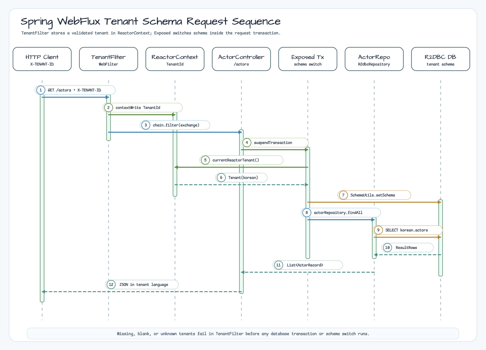
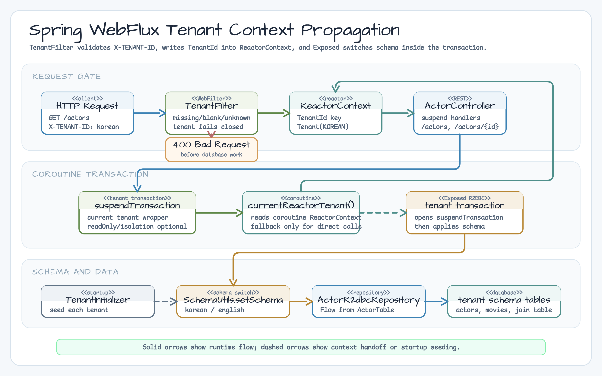
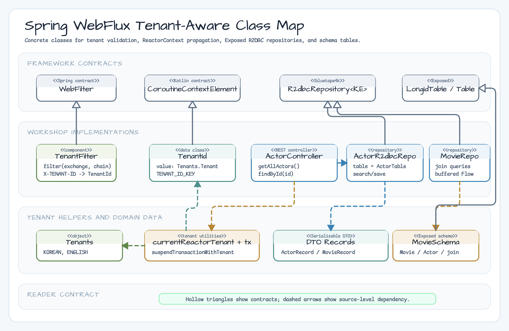
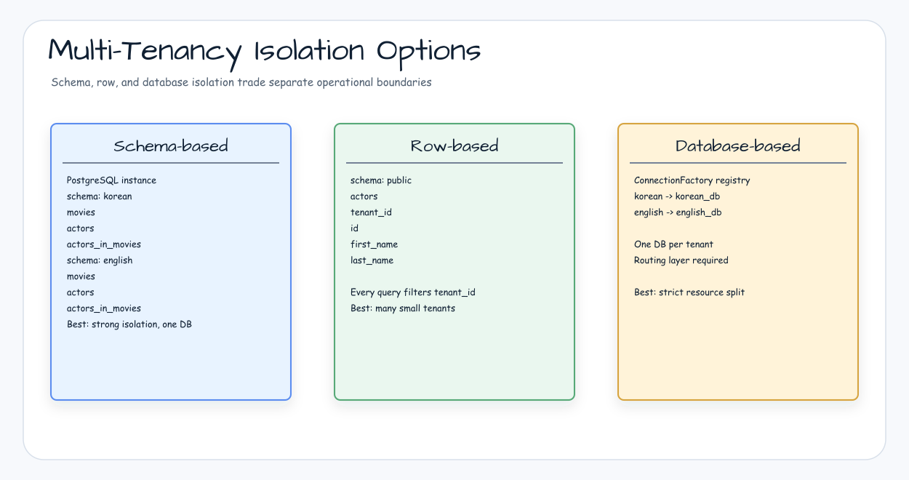

> English version: [README.md](README.md)

# 03-multitenant-spring-webflux

Spring WebFlux + Exposed R2DBC + Kotlin Coroutines 환경에서 Schema 기반 멀티테넌시(Multi-tenancy)를 구현하는 예제입니다. HTTP 요청 헤더(
`X-TENANT-ID`)로 테넌트를 식별하고, `ReactorContext`를 통해 코루틴까지 테넌트 정보를 전파하여 테넌트별로 격리된 DB 스키마에서 데이터를 조회합니다.

## 문서

* [Multi-tenant App with Spring Webflux and Coroutines](https://debop.notion.site/Multi-tenant-App-with-Spring-Webflux-and-Coroutines-1dc2744526b0802e926de76e268bd2a8)

## 기술 스택

| 구분        | 기술                             |
|-----------|--------------------------------|
| Framework | Spring Boot (WebFlux)          |
| ORM       | Exposed R2DBC                  |
| 비동기       | Kotlin Coroutines + Reactor    |
| 멀티테넌시     | Schema-based (테넌트별 스키마 분리)     |
| DB        | H2 (기본), PostgreSQL            |
| DB 컨테이너   | Testcontainers                 |
| API 문서    | SpringDoc OpenAPI (Swagger UI) |
| 서버        | Netty (Reactive)               |

> **참고**: R2DBC 환경에서 MySQL은 스키마 생성 권한 문제로 지원되지 않습니다. H2 또는 PostgreSQL을 사용하세요.

## 프로젝트 구조

```
src/main/kotlin/exposed/r2dbc/multitenant/webflux/
├── ExposedMultitenantWebfluxApp.kt        # Spring Boot 애플리케이션 진입점
├── config/
│   ├── ExposedR2dbcConfig.kt              # R2DBC Database 및 ConnectionPool 설정
│   ├── TenantConfig.kt                    # TenantInitializer Bean 등록
│   ├── NettyConfig.kt                     # Netty 서버 튜닝
│   └── SwaggerConfig.kt                   # OpenAPI(Swagger) 문서 설정
├── tenant/
│   ├── Tenants.kt                         # 테넌트 enum 정의 (KOREAN, ENGLISH)
│   ├── TenantId.kt                        # CoroutineContext Element + 테넌트 전파 유틸리티
│   ├── TenantFilter.kt                    # WebFilter - 요청 헤더에서 테넌트 추출 → ReactorContext 저장
│   ├── SchemaSupport.kt                   # 테넌트별 Schema 정의 생성
│   ├── TenantInitializer.kt              # 애플리케이션 시작 시 테넌트별 스키마 초기화
│   └── DataInitializer.kt                # 테넌트별 샘플 데이터 삽입 (한국어/영어)
├── controller/
│   └── ActorController.kt                 # 배우 조회 API (/actors) - 테넌트 인식
└── domain/
    ├── model/
    │   ├── MovieSchema.kt                 # Exposed 테이블 정의 (MovieTable, ActorTable, ActorInMovieTable)
    │   ├── MovieRecords.kt                # DTO 클래스들
    │   └── Mappers.kt                     # ResultRow → DTO 변환 확장 함수
    └── repository/
        ├── ActorR2dbcRepository.kt        # 배우 Repository
        └── MovieR2dbcRepository.kt        # 영화 Repository
```

## 아키텍처

### 멀티테넌시 요청 흐름



## 테넌트 컨텍스트 전파 흐름



## TenantAwareRepository 클래스 구조



### 테넌트 정의

두 개의 테넌트를 사용하며, 각 테넌트는 별도의 DB 스키마를 가집니다:

| 테넌트     | ID        | 스키마       | 데이터 언어                        |
|---------|-----------|-----------|-------------------------------|
| KOREAN  | `korean`  | `korean`  | 한국어 (조니 뎁, 글래디에이터 등)          |
| ENGLISH | `english` | `english` | 영어 (Johnny Depp, Gladiator 등) |

### 요청 테넌트 계약

모든 테넌트 인식 요청은 `X-TENANT-ID` 헤더를 포함해야 합니다.

| 상황 | 응답 |
|------|------|
| `X-TENANT-ID` 누락 또는 공백 | `400 Bad Request` |
| 알 수 없는 테넌트 ID | `400 Bad Request` |
| `korean` 또는 `english` | 해당 테넌트 스키마로 라우팅 |

## 멀티테넌시 격리 수준 옵션



### 1. Schema-based (이 예제)

각 테넌트가 **같은 DB 인스턴스의 별도 스키마**를 사용합니다.

**장점**: 단일 DB 인스턴스 관리, 테넌트 간 완전한 데이터 격리, 운영 단순성
**단점**: DB별 최대 스키마 수 제한, 테넌트가 매우 많으면 연결 풀 관리 복잡

### 2. Row-based (미구현, 참고용)

테넌트 식별자 컬럼(`tenant_id`)을 모든 테이블에 추가하여 하나의 스키마에서 분리합니다.

**장점**: 구현 단순, 무제한 테넌트 수
**단점**: 모든 쿼리에 `WHERE tenant_id = ?` 추가 필요, 데이터 격리 실수 위험

### 3. Database-based (미구현, 참고용)

테넌트마다 **별도 DB 인스턴스**를 사용합니다. 라우팅 DataSource(`DynamicRoutingConnectionFactory`)가 필요합니다.

**장점**: 완전한 리소스 격리, DB 수준의 보안
**단점**: 운영 복잡성 높음, 테넌트 수에 비례한 DB 인스턴스 비용

### Tenant 컨텍스트 전파 방식: ThreadLocal vs CoroutineContext

| 방식             | 사용 환경                  | 이 예제 채택 여부 |
|----------------|--------------------------|------------|
| `ThreadLocal`  | Spring MVC (블로킹)        | ❌ 사용 안 함  |
| `ReactorContext` | Spring WebFlux (리액티브)  | ✅ 채택      |
| `CoroutineContext` | Kotlin Coroutines      | ✅ 채택 (보조) |

WebFlux 환경에서는 요청마다 스레드가 고정되지 않으므로 `ThreadLocal` 사용이 불가능합니다.
대신 `ReactorContext`에 테넌트 정보를 저장하고, 코루틴 안에서 `coroutineContext[ReactorContext]`로 읽습니다.

## 핵심 구현

### 1. TenantFilter - 요청에서 테넌트 추출

`WebFilter`가 필수 HTTP 헤더 `X-TENANT-ID`를 읽어 `ReactorContext`에 `TenantId`를 저장합니다. 헤더가 없거나 공백이거나 알 수 없는 테넌트 ID이면 DB 작업 전에 `400 Bad Request`로 거부합니다.

```kotlin
@Component
class TenantFilter: WebFilter {
    companion object {
        const val TENANT_HEADER = "X-TENANT-ID"
    }

    override fun filter(exchange: ServerWebExchange, chain: WebFilterChain): Mono<Void> = mono {
        val tenantId = exchange.request.headers.getFirst(TENANT_HEADER)
        val resolvedTenantId = tenantId?.takeIf { it.isNotBlank() }
            ?: throw ResponseStatusException(HttpStatus.BAD_REQUEST, "Missing tenant id header: $TENANT_HEADER")
        val tenant = Tenants.findById(resolvedTenantId)
            ?: throw ResponseStatusException(HttpStatus.BAD_REQUEST, "Unknown tenant id: $resolvedTenantId")

        chain
            .filter(exchange)
            .contextWrite { it.put(TenantId.TENANT_ID_KEY, TenantId(tenant)) }
            .awaitSingleOrNull()
    }
}
```

### 2. TenantId - CoroutineContext를 통한 테넌트 전파

`TenantId`는 `CoroutineContext.Element`를 구현하여 코루틴 내에서 테넌트 정보를 전달합니다.
`ReactorContext`에서 테넌트를 읽는 `currentReactorTenant()` 함수를 제공합니다.
아래 fallback은 WebFlux 밖에서 직접 코루틴을 호출하는 예제 경로용이며, 사용 시 warning 로그를 남깁니다.
HTTP 요청에서 `X-TENANT-ID`가 없으면 `TenantFilter`가 먼저 거부합니다.

```kotlin
data class TenantId(val value: Tenants.Tenant): CoroutineContext.Element {
    companion object Key: CoroutineContext.Key<TenantId> {
        val DEFAULT = TenantId(Tenants.DEFAULT_TENANT)
        const val TENANT_ID_KEY = "TenantId"
    }

    override val key: CoroutineContext.Key<*> = Key
}

// ReactorContext에서 테넌트 읽기
suspend fun currentReactorTenant(): Tenants.Tenant =
    coroutineContext[ReactorContext]?.context
        ?.getOrDefault(TenantId.TENANT_ID_KEY, TenantId.DEFAULT)?.value
        ?: defaultTenantWithWarning("ReactorContext")
```

### 3. suspendTransactionWithCurrentTenant - 테넌트별 트랜잭션

트랜잭션 시작 시 현재 테넌트의 스키마로 `SET SCHEMA`를 실행하여 데이터를 격리합니다.

```kotlin
suspend fun <T> suspendTransactionWithCurrentTenant(
    db: R2dbcDatabase? = null,
    transactionIsolation: IsolationLevel? = null,
    readOnly: Boolean = false,
    statement: suspend R2dbcTransaction.() -> T,
): T = suspendTransactionWithTenant(
    tenant = currentReactorTenant(),  // ReactorContext에서 테넌트 읽기
    ...
)

suspend fun <T> suspendTransactionWithTenant(tenant: Tenants.Tenant?, ...) =
    suspendTransaction(db = db, ...) {
    val currentTenant = tenant ?: currentTenant()
    SchemaUtils.setSchema(getSchemaDefinition(currentTenant))  // 스키마 전환
    statement()
}
```

### 4. Controller - 테넌트 인식 API

Controller에서는 `suspendTransactionWithCurrentTenant`를 사용하여 요청의 `X-TENANT-ID` 헤더에 따라 자동으로 올바른 스키마에서 데이터를 조회합니다.

```kotlin
@RestController
@RequestMapping("/actors")
class ActorController(private val actorRepository: ActorR2dbcRepository) {

    @GetMapping
    suspend fun getAllActors(): List<ActorRecord> =
        suspendTransactionWithCurrentTenant {
            actorRepository.findAll().toFastList()
        }
}
```

### 5. 테넌트별 데이터 초기화

애플리케이션 시작 시 모든 테넌트에 대해 스키마를 생성하고 해당 언어의 샘플 데이터를 삽입합니다.

```kotlin
// KOREAN 테넌트: "조니", "뎁", "글래디에이터" ...
// ENGLISH 테넌트: "Johnny", "Depp", "Gladiator" ...
Tenants.Tenant.entries.forEach { tenant ->
    dataInitializer.initialize(tenant)  // 스키마 생성 + 샘플 데이터
}
```

## 데이터베이스 스키마

각 테넌트(`korean`, `english`)마다 동일한 테이블 구조를 별도 스키마로 생성합니다:

- **movies** - 영화 정보 (`id`, `name`, `producer_name`, `release_date`)
- **actors** - 배우 정보 (`id`, `first_name`, `last_name`, `birthday`)
- **actors_in_movies** - 영화-배우 다대다 관계 (`movie_id`, `actor_id`)

## API 엔드포인트

### Actors (`/actors`)

| Method | Path           | 설명                  |
|--------|----------------|---------------------|
| GET    | `/actors`      | 현재 테넌트의 전체 배우 목록 조회 |
| GET    | `/actors/{id}` | 현재 테넌트에서 배우 상세 조회   |

### 요청 예시

```bash
# 한국어 테넌트로 배우 조회
curl -H "X-TENANT-ID: korean" http://localhost:8080/actors
# → [{"id":1,"firstName":"조니","lastName":"뎁",...}, ...]

# 영어 테넌트로 배우 조회
curl -H "X-TENANT-ID: english" http://localhost:8080/actors
# → [{"id":1,"firstName":"Johnny","lastName":"Depp",...}, ...]

# 특정 배우 조회
curl -H "X-TENANT-ID: korean" http://localhost:8080/actors/2
# → {"id":2,"firstName":"브래드","lastName":"피트",...}
```

## 실행 방법

### 기본 실행 (H2 인메모리)

```bash
./gradlew :03-multitenant-spring-webflux:bootRun
```

### PostgreSQL 사용

```bash
./gradlew :03-multitenant-spring-webflux:bootRun --args='--spring.profiles.active=postgres'
```

## 테스트

```bash
./gradlew :03-multitenant-spring-webflux:test "-PuseDB=H2"
```

테스트는 `@ActiveProfiles("h2")`로 H2 인메모리 DB를 사용합니다.

### 테스트 목록

- **ActorControllerTest** - `@ParameterizedTest`로 모든 테넌트(KOREAN/ENGLISH)에 대해 API 테스트
    - 테넌트별 전체 배우 조회 및 데이터 언어 검증
    - 테넌트별 특정 배우 조회 및 이름 검증
    - 누락, 공백, 알 수 없는 테넌트 헤더가 `400`을 반환하는지 검증
    - 같은 배우 ID가 테넌트 스키마 간에 격리되는지 검증
- **ExposedR2dbcConfigTest** - R2DBC 설정 로드 검증
- **ConnectionPoolSizingTest** - 연결 풀 크기 산정 규칙 검증

## CI 및 Nightly 커버리지

이 모듈은 루트 CI의 `./gradlew test` 경로와 Nightly shard의
`:03-multitenant-spring-webflux:test` 실행으로 검증됩니다. 모듈 이름이
바뀌면 이 명령과 `.github/workflows/nightly.yml` 항목을 함께 갱신해야 합니다.
