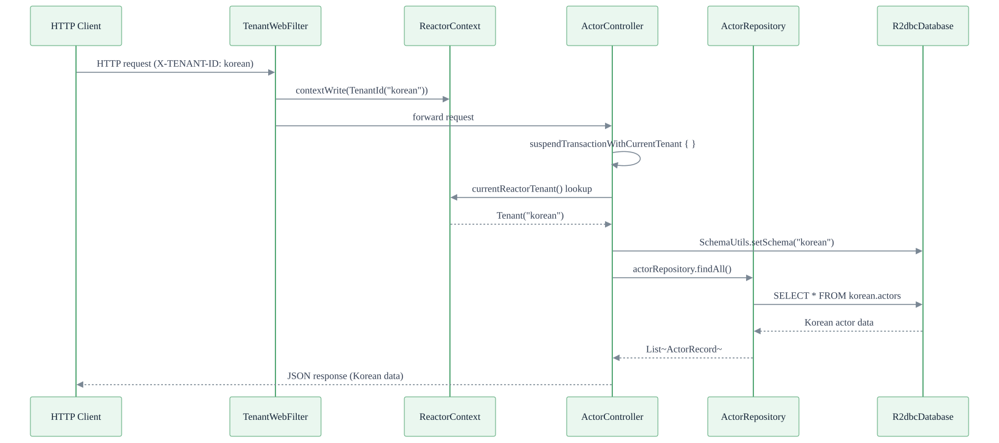

> 한국어 버전: [README.ko.md](README.ko.md)

# 03-multitenant-spring-webflux

An example implementing schema-based multi-tenancy in a Spring WebFlux + Exposed R2DBC + Kotlin Coroutines environment. Identifies tenants via the HTTP request header (`X-TENANT-ID`), propagates tenant information through to coroutines via `ReactorContext`, and queries data from each tenant's isolated DB schema.

## Documentation

* [Multi-tenant App with Spring Webflux and Coroutines](https://debop.notion.site/Multi-tenant-App-with-Spring-Webflux-and-Coroutines-1dc2744526b0802e926de76e268bd2a8)

## Tech Stack

| Category    | Technology                             |
|-------------|----------------------------------------|
| Framework   | Spring Boot (WebFlux)                  |
| ORM         | Exposed R2DBC                          |
| Async       | Kotlin Coroutines + Reactor            |
| Multi-tenancy | Schema-based (separate schema per tenant) |
| DB          | H2 (default), PostgreSQL               |
| DB Container| Testcontainers                         |
| API Docs    | SpringDoc OpenAPI (Swagger UI)         |
| Server      | Netty (Reactive)                       |

> **Note**: MySQL is not supported in R2DBC environments due to schema creation permission issues. Use H2 or PostgreSQL.

## Project Structure

```
src/main/kotlin/exposed/r2dbc/multitenant/webflux/
├── ExposedMultitenantWebfluxApp.kt        # Spring Boot application entry point
├── config/
│   ├── ExposedR2dbcConfig.kt              # R2DBC Database and ConnectionPool configuration
│   ├── TenantConfig.kt                    # TenantInitializer Bean registration
│   ├── NettyConfig.kt                     # Netty server tuning
│   └── SwaggerConfig.kt                   # OpenAPI (Swagger) documentation configuration
├── tenant/
│   ├── Tenants.kt                         # Tenant enum definitions (KOREAN, ENGLISH)
│   ├── TenantId.kt                        # CoroutineContext Element + tenant propagation utilities
│   ├── TenantFilter.kt                    # WebFilter - extract tenant from request header → store in ReactorContext
│   ├── SchemaSupport.kt                   # Create schema definition per tenant
│   ├── TenantInitializer.kt               # Initialize schema per tenant on application startup
│   └── DataInitializer.kt                 # Insert sample data per tenant (Korean/English)
├── controller/
│   └── ActorController.kt                 # Actor query API (/actors) - tenant-aware
└── domain/
    ├── model/
    │   ├── MovieSchema.kt                 # Exposed table definitions (MovieTable, ActorTable, ActorInMovieTable)
    │   ├── MovieRecords.kt                # DTO classes
    │   └── Mappers.kt                     # ResultRow → DTO conversion extension functions
    └── repository/
        ├── ActorR2dbcRepository.kt        # Actor Repository
        └── MovieR2dbcRepository.kt        # Movie Repository
```

## Architecture

### Multi-tenancy Request Flow



## Tenant Context Propagation Flow



## TenantAwareRepository Class Structure



### Tenant Definitions

Two tenants are used, each with a separate DB schema:

| Tenant  | ID        | Schema    | Data Language                             |
|---------|-----------|-----------|-------------------------------------------|
| KOREAN  | `korean`  | `korean`  | Korean (조니 뎁, 글래디에이터, etc.)        |
| ENGLISH | `english` | `english` | English (Johnny Depp, Gladiator, etc.)    |

## Multi-tenancy Isolation Level Options

### 1. Schema-based (This Example)

Each tenant uses a **separate schema on the same DB instance**.

```
PostgreSQL Instance
├── Schema: korean
│   ├── movies
│   ├── actors
│   └── actors_in_movies
└── Schema: english
    ├── movies
    ├── actors
    └── actors_in_movies
```

**Pros**: Single DB instance management, complete data isolation between tenants, operational simplicity
**Cons**: Maximum schema count limit per DB, complex connection pool management with many tenants

### 2. Row-based (Not Implemented, Reference Only)

Separates tenants within a single schema by adding a tenant identifier column (`tenant_id`) to all tables.

```
Schema: public
└── actors  (tenant_id, id, first_name, last_name, ...)
    ├── ROW: tenant_id="korean", id=1, first_name="조니"
    └── ROW: tenant_id="english", id=1, first_name="Johnny"
```

**Pros**: Simple implementation, unlimited tenant count
**Cons**: Must add `WHERE tenant_id = ?` to all queries, risk of data isolation errors

### 3. Database-based (Not Implemented, Reference Only)

Uses a **separate DB instance per tenant**. Requires a routing DataSource (`DynamicRoutingConnectionFactory`).

```
App → ConnectionFactory Registry
       ├── "korean" → ConnectionFactory(korean_db)
       └── "english" → ConnectionFactory(english_db)
```

**Pros**: Complete resource isolation, DB-level security
**Cons**: High operational complexity, DB instance costs proportional to tenant count

### Tenant Context Propagation: ThreadLocal vs CoroutineContext

| Method              | Usage Environment          | Adopted in this example |
|---------------------|----------------------------|-------------------------|
| `ThreadLocal`       | Spring MVC (blocking)      | Not used                |
| `ReactorContext`    | Spring WebFlux (reactive)  | Adopted                 |
| `CoroutineContext`  | Kotlin Coroutines          | Adopted (supplementary) |

In a WebFlux environment, threads are not fixed per request, making `ThreadLocal` unusable.
Instead, tenant information is stored in `ReactorContext` and read within coroutines via `coroutineContext[ReactorContext]`.

## Core Implementation

### 1. TenantFilter - Extract Tenant from Request

`WebFilter` reads the `X-TENANT-ID` HTTP header and stores `TenantId` in `ReactorContext`. If the header is absent, the default tenant (`KOREAN`) is used.

```kotlin
@Component
class TenantFilter: WebFilter {
    companion object {
        const val TENANT_HEADER = "X-TENANT-ID"
    }

    override fun filter(exchange: ServerWebExchange, chain: WebFilterChain): Mono<Void> = mono {
        val tenantId = exchange.request.headers.getFirst(TENANT_HEADER)
        val resolvedTenantId = tenantId?.takeIf { it.isNotBlank() } ?: Tenants.DEFAULT_TENANT.id
        val tenant = Tenants.findById(resolvedTenantId)
            ?: throw ResponseStatusException(HttpStatus.BAD_REQUEST, "Unknown tenant id: $resolvedTenantId")

        chain
            .filter(exchange)
            .contextWrite { it.put(TenantId.TENANT_ID_KEY, TenantId(tenant)) }
            .awaitSingleOrNull()
    }
}
```

### 2. TenantId - Tenant Propagation via CoroutineContext

`TenantId` implements `CoroutineContext.Element` to pass tenant information within coroutines.
Provides the `currentReactorTenant()` function to read the tenant from `ReactorContext`.

```kotlin
data class TenantId(val value: Tenants.Tenant): CoroutineContext.Element {
    companion object Key: CoroutineContext.Key<TenantId> {
        val DEFAULT = TenantId(Tenants.DEFAULT_TENANT)
        const val TENANT_ID_KEY = "TenantId"
    }

    override val key: CoroutineContext.Key<*> = Key
}

// Read tenant from ReactorContext
suspend fun currentReactorTenant(): Tenants.Tenant =
    coroutineContext[ReactorContext]?.context
        ?.getOrDefault(TenantId.TENANT_ID_KEY, TenantId.DEFAULT)?.value
        ?: Tenants.DEFAULT_TENANT
```

### 3. suspendTransactionWithCurrentTenant - Tenant-Specific Transaction

Executes `SET SCHEMA` for the current tenant's schema at transaction start to isolate data.

```kotlin
suspend fun <T> suspendTransactionWithCurrentTenant(
    db: R2dbcDatabase? = null,
    transactionIsolation: IsolationLevel? = null,
    readOnly: Boolean = false,
    statement: suspend R2dbcTransaction.() -> T,
): T = suspendTransactionWithTenant(
    tenant = currentReactorTenant(),  // read tenant from ReactorContext
    ...
)

suspend fun <T> suspendTransactionWithTenant(tenant: Tenants.Tenant?, ...) =
    suspendTransaction(db = db, ...) {
    val currentTenant = tenant ?: currentTenant()
    SchemaUtils.setSchema(getSchemaDefinition(currentTenant))  // switch schema
    statement()
}
```

### 4. Controller - Tenant-Aware API

The controller uses `suspendTransactionWithCurrentTenant` to automatically query data from the correct schema based on the request's `X-TENANT-ID` header.

```kotlin
@RestController
@RequestMapping("/actors")
class ActorController(private val actorRepository: ActorR2dbcRepository) {

    @GetMapping
    suspend fun getAllActors(): List<ActorRecord> =
        suspendTransactionWithCurrentTenant {
            actorRepository.findAll().toFastList()
        }
}
```

### 5. Per-Tenant Data Initialization

On application startup, creates schemas for all tenants and inserts sample data in the respective language.

```kotlin
// KOREAN tenant: "조니", "뎁", "글래디에이터" ...
// ENGLISH tenant: "Johnny", "Depp", "Gladiator" ...
Tenants.Tenant.entries.forEach { tenant ->
    dataInitializer.initialize(tenant)  // create schema + insert sample data
}
```

## Database Schema

The same table structure is created as a separate schema for each tenant (`korean`, `english`):

- **movies** - Movie info (`id`, `name`, `producer_name`, `release_date`)
- **actors** - Actor info (`id`, `first_name`, `last_name`, `birthday`)
- **actors_in_movies** - Many-to-many relationship between movies and actors (`movie_id`, `actor_id`)

## API Endpoints

### Actors (`/actors`)

| Method | Path           | Description                                  |
|--------|----------------|----------------------------------------------|
| GET    | `/actors`      | Get all actors for the current tenant        |
| GET    | `/actors/{id}` | Get actor details for the current tenant     |

### Request Examples

```bash
# Get actors for the Korean tenant
curl -H "X-TENANT-ID: korean" http://localhost:8080/actors
# → [{"id":1,"firstName":"조니","lastName":"뎁",...}, ...]

# Get actors for the English tenant
curl -H "X-TENANT-ID: english" http://localhost:8080/actors
# → [{"id":1,"firstName":"Johnny","lastName":"Depp",...}, ...]

# Get a specific actor
curl -H "X-TENANT-ID: korean" http://localhost:8080/actors/2
# → {"id":2,"firstName":"브래드","lastName":"피트",...}
```

## Running the Application

### Default Run (H2 In-Memory)

```bash
./gradlew :03-multitenant-spring-webflux:bootRun
```

### Use PostgreSQL

```bash
./gradlew :03-multitenant-spring-webflux:bootRun --args='--spring.profiles.active=postgres'
```

## Testing

```bash
./gradlew :03-multitenant-spring-webflux:test
```

Tests use H2 in-memory DB with `@ActiveProfiles("h2")`.

### Test List

- **ActorControllerTest** - API tests for all tenants (KOREAN/ENGLISH) using `@ParameterizedTest`
    - Query all actors per tenant and verify data language
    - Query specific actor per tenant and verify name
- **ExposedR2dbcConfigTest** - R2DBC configuration load verification
