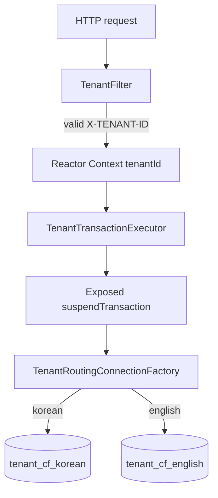

# 04-connection-factory-per-tenant-spring-webflux

[English](README.md) | [한국어](README.ko.md)

Spring WebFlux + Exposed R2DBC 예제로, 테넌트마다 별도의 R2DBC
`ConnectionFactory`와 connection pool을 사용합니다.

## 전략

이 모듈은 **connection-factory-per-tenant** 격리를 보여줍니다.

- HTTP 요청은 `X-TENANT-ID`를 반드시 포함해야 합니다.
- 지원 테넌트는 `korean`, `english`입니다.
- 각 테넌트는 서로 다른 H2 in-memory database URL을 사용합니다.
- Spring R2DBC는 `AbstractRoutingConnectionFactory`로 연결을 라우팅합니다.
- Exposed 트랜잭션은 항상 명시적인 routing `R2dbcDatabase`를 사용합니다.
- 시작 시 초기화는 registry가 소유한 tenant pool을 재사용하는 명시적
  tenant database로 수행합니다.



## 선택 기준

공유 schema 방식보다 더 강한 운영 격리가 필요하고, 테넌트 수가 제한적이거나
명시적으로 provision되는 경우에 이 전략을 선택합니다. 테넌트마다 pool이
생기므로 전체 connection 수는 테넌트 수에 비례합니다.

[`03-multitenant-spring-webflux`](../03-multitenant-spring-webflux/README.ko.md)와
비교하면 다음과 같습니다.

| 모듈 | 격리 방식 | 주요 tradeoff |
|---|---|---|
| `03` schema-per-tenant | 공유 DB, 트랜잭션마다 schema 전환 | pool 수가 적지만 connection schema state에 의존 |
| `04` connection-factory-per-tenant | tenant별 R2DBC URL과 pool | 격리가 명확하지만 pool 수 증가 |

이 모듈은 tenant authorization을 구현하지 않습니다. issue #40에서 Spring
Security가 추가되기 전까지는 유효한 tenant ID를 아는 client가 해당 tenant를
선택할 수 있습니다.

## 설정

```yaml
app:
  tenants:
    default-tenant: korean
    definitions:
      korean:
        url: r2dbc:h2:mem:///tenant_cf_korean;DB_CLOSE_DELAY=-1;DB_CLOSE_ON_EXIT=FALSE
      english:
        url: r2dbc:h2:mem:///tenant_cf_english;DB_CLOSE_DELAY=-1;DB_CLOSE_ON_EXIT=FALSE
  r2dbc:
    pool:
      max-size: 8
      initial-size: 1
      min-idle: 1
      max-idle-time: 10m
      max-life-time: 30m
      max-create-connection-time: 10s
      max-acquire-time: 3s
      acquire-retry: 3
      background-eviction-interval: 1m
```

HTTP 요청은 fail closed 방식입니다.

| Header | 결과 |
|---|---|
| `X-TENANT-ID: korean` | Korean tenant pool |
| `X-TENANT-ID: english` | English tenant pool |
| 없음, 공백, malformed, unknown | `400 Bad Request` |

HTTP 경로 밖에서는 Reactor lookup key가 없을 때 routing factory가 설정된
default tenant를 사용할 수 있습니다. 알 수 없는 lookup key가 emit되면
`setLenientFallback(false)` 때문에 라우팅이 실패합니다.

## 실행

```bash
./gradlew :04-connection-factory-per-tenant-spring-webflux:bootRun
```

```bash
curl -H "X-TENANT-ID: korean" http://localhost:8080/actors/2
curl -H "X-TENANT-ID: english" http://localhost:8080/actors/2
```

같은 actor ID가 tenant별 fixture 값을 다르게 반환합니다.

## 검증

```bash
./gradlew :04-connection-factory-per-tenant-spring-webflux:compileKotlin --warning-mode all --console=plain
repo-test-summary -- ./gradlew :04-connection-factory-per-tenant-spring-webflux:test "-PuseDB=H2" --continue --console=plain
```

Root CI가 `./gradlew test`를 실행하므로 이 H2-only 모듈은 PR CI에 포함됩니다.
이 PR에서는 container-heavy Nightly shard에 추가하지 않습니다.
