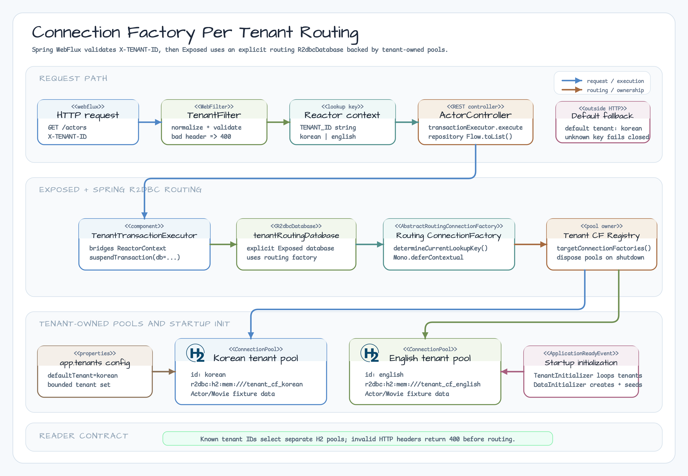

# 04-connection-factory-per-tenant-spring-webflux

[English](README.md) | [Korean](README.ko.md)

Spring WebFlux + Exposed R2DBC example that routes each tenant to a distinct
R2DBC `ConnectionFactory` and connection pool.

## Strategy

This module demonstrates **connection-factory-per-tenant** isolation:

- HTTP requests must include `X-TENANT-ID`.
- Supported tenants are `korean` and `english`.
- Each tenant uses a different H2 in-memory database URL.
- Spring R2DBC routes connections through `AbstractRoutingConnectionFactory`.
- Exposed transactions always use an explicit routing `R2dbcDatabase`.
- Startup initialization uses explicit tenant databases backed by the same
  registry-owned pools.



## When To Use

Choose this strategy when tenants need stronger operational separation than a
shared-schema model and the tenant set is bounded or explicitly provisioned.
Each tenant gets a separate pool, so connection count grows with tenant count.
This example uses a static, startup-provisioned registry; dynamic tenant
onboarding is intentionally outside its scope and should use a separate
provisioning/lifecycle component.

Compared with
[`03-multitenant-spring-webflux`](../03-multitenant-spring-webflux/README.md):

| Module | Isolation | Main tradeoff |
|---|---|---|
| `03` schema-per-tenant | Shared database, per-transaction schema switch | Fewer pools, but relies on connection schema state |
| `04` connection-factory-per-tenant | Separate R2DBC URL and pool per tenant | Clearer isolation, but more pools |

This module does not implement tenant authorization. Until issue #40 adds
Spring Security, any client that knows a valid tenant ID can select that tenant.

## Configuration

```yaml
app:
  tenants:
    default-tenant: korean
    definitions:
      korean:
        url: r2dbc:h2:mem:///tenant_cf_korean;DB_CLOSE_DELAY=-1;DB_CLOSE_ON_EXIT=FALSE
      english:
        url: r2dbc:h2:mem:///tenant_cf_english;DB_CLOSE_DELAY=-1;DB_CLOSE_ON_EXIT=FALSE
  r2dbc:
    pool:
      max-size: 8
      initial-size: 1
      min-idle: 1
      max-idle-time: 10m
      max-life-time: 30m
      max-create-connection-time: 10s
      max-acquire-time: 3s
      acquire-retry: 3
      background-eviction-interval: 1m
```

HTTP requests fail closed:

| Header | Result |
|---|---|
| `X-TENANT-ID: korean` | Korean tenant pool |
| `X-TENANT-ID: english` | English tenant pool |
| missing, blank, malformed, unknown | `400 Bad Request` |

## Tenant Carrier

TenantIdResolver still owns header trimming, syntax validation, and the fixed
korean/english registry. After validation, TenantFilter creates the provider
TenantId and binds it with ReactorTenantContext.withTenant in the immutable
subscription Context; TenantRoutingConnectionFactory reads the same provider key
with currentOrNull(contextView).

The default korean tenant is used only outside the mandatory HTTP-header path. It
is application configuration, not a default inside the shared carrier. The
deterministic tests also cover interleaved subscriptions, nested derived
contexts, cancellation, missing context, and no context leakage.

Outside the HTTP path, the routing factory can use the configured default tenant
when no Reactor lookup key is present. If an unknown lookup key is emitted,
`setLenientFallback(false)` makes routing fail.

## Run

```bash
./gradlew :04-connection-factory-per-tenant-spring-webflux:bootRun
```

```bash
curl -H "X-TENANT-ID: korean" http://localhost:8080/actors/2
curl -H "X-TENANT-ID: english" http://localhost:8080/actors/2
```

The same actor ID returns different tenant-specific fixture data.

## Verification

```bash
./gradlew :04-connection-factory-per-tenant-spring-webflux:compileKotlin --warning-mode all --console=plain
repo-test-summary -- ./gradlew :04-connection-factory-per-tenant-spring-webflux:test "-PuseDB=H2" --continue --console=plain
```

Root CI runs `./gradlew test`, so this H2-only module is covered by PR CI. It is
not added to container-heavy Nightly shards in this PR.
