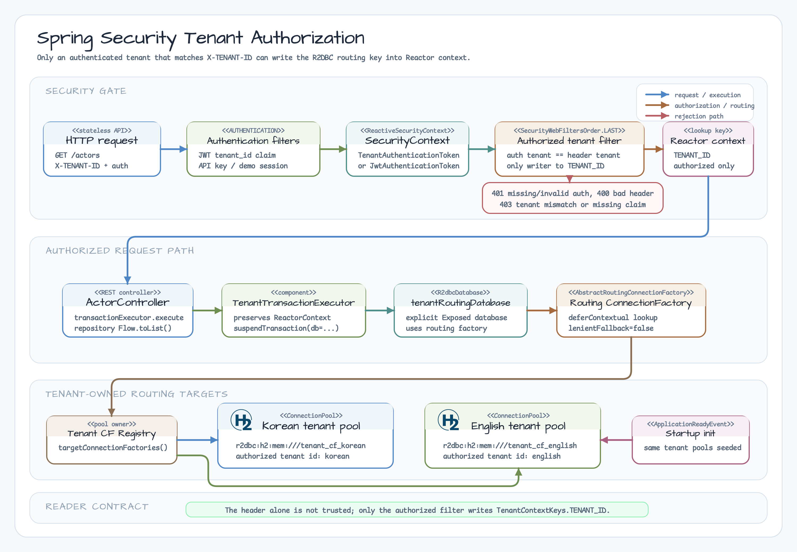

# Spring Security Tenant Authorization WebFlux 예제

[English](./README.md)

이 chapter 10 모듈은 인증된 요청의 tenant 권한을 확인한 뒤 Exposed R2DBC가
tenant별 `ConnectionFactory`로 라우팅하는 흐름을 보여줍니다.

요청의 인증 정보가 `X-TENANT-ID`로 선택한 tenant와 일치해야 할 때 이
전략을 선택하세요. 인증 경계 없이 connection-factory 라우팅만 학습하려면
`04-connection-factory-per-tenant-spring-webflux`를 사용하면 됩니다.



## 인증 소스

| 소스 | 예 | Tenant 소스 |
|---|---|---|
| JWT bearer token | `Authorization: Bearer korean-token` | JWT `tenant_id` claim |
| API key | `X-API-KEY: demo-korean-key` | 고정 demo key map |
| Demo session | `X-DEMO-SESSION: korean-session` | 고정 demo header map |

`X-DEMO-SESSION`은 워크숍 전용 헤더입니다. 운영용 session cookie나 로그인
플로우가 아닙니다. 이 예제는 stateless JSON API라 CSRF를 끕니다. Cookie 기반
session 플로우에서는 CSRF 보호를 유지해야 합니다.

tenant registry는 두 demo tenant를 시작 시 구성하는 정적 snapshot입니다.
실행 중 tenant onboarding은 이 예제의 범위 밖이며, tenant 집합이 런타임에
변경되는 경우 별도의 provisioning/lifecycle 컴포넌트를 사용해야 합니다.

## 요청 계약

```http
GET /actors
X-TENANT-ID: korean
X-API-KEY: demo-korean-key
```

| 상황 | 결과 |
|---|---|
| 인증 tenant와 `X-TENANT-ID`가 같음 | `200 OK` |
| 인증 없음 | `401 Unauthorized` |
| 잘못된 API key 또는 demo session | `401 Unauthorized` |
| 누락, 공백, 형식 오류, 알 수 없는 `X-TENANT-ID` | `400 Bad Request` |
| 인증 tenant와 `X-TENANT-ID`가 다름 | `403 Forbidden` |
| JWT에 사용할 수 있는 `tenant_id` claim이 없음 | `403 Forbidden` |

`TenantContextKeys.TENANT_ID`를 Reactor context에 쓰는 코드는
`AuthorizedTenantContextWebFilter`뿐입니다. 요청 헤더만 신뢰하지 않으므로
HTTP 요청 경로에서 Exposed R2DBC가 기본 tenant로 조용히 fallback하지 않습니다.

## 실행

```bash
./gradlew :05-spring-security-tenant-authorization-spring-webflux:test -PuseDB=H2
```

이 모듈은 H2 전용입니다. Root CI의 H2 test job에서 실행되고, `Examples.yml`의
chapter 10 예제 workflow에도 등록됩니다. PostgreSQL, MySQL, MariaDB tenant DB를
추가하지 않으므로 Nightly DB matrix는 변경하지 않습니다.
