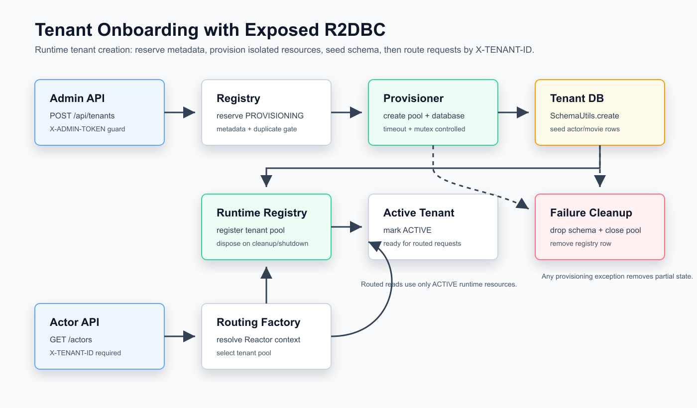

# Tenant Onboarding WebFlux Example

[한국어](./README.ko.md)

This chapter 10 module shows how a Spring WebFlux service can create tenant
metadata, provision an isolated R2DBC resource, seed Exposed tables, and route
later requests to the new tenant without restarting the application.

Choose this strategy when tenants are created at runtime and each tenant needs
its own `ConnectionFactory` and Exposed `R2dbcDatabase`. Use
`03-multitenant-spring-webflux` for shared-table tenancy,
`04-connection-factory-per-tenant-spring-webflux` when tenant pools are known at
startup, and `05-spring-security-tenant-authorization-spring-webflux` when the
main concern is authorizing an already-existing tenant route.



## Onboarding Flow

```http
POST /api/tenants
X-ADMIN-TOKEN: workshop-admin
Content-Type: application/json

{
  "tenantId": "alpha",
  "displayName": "Alpha Tenant"
}
```

1. `TenantRegistryRepository` reserves the tenant row as `PROVISIONING`.
2. `TenantProvisioner` creates a tenant H2 R2DBC pool and Exposed database.
3. Exposed `SchemaUtils.create(...)` creates the actor/movie schema.
4. Seed data is inserted so routed actor requests can verify isolation.
5. `TenantConnectionFactoryRegistry` registers the runtime resources.
6. The registry row is marked `ACTIVE`.

After onboarding, requests use the same routing header as the previous chapter
10 connection-factory examples:

```http
GET /actors
X-TENANT-ID: alpha
```

## Failure and Duplicate Handling

| Case | Result |
|---|---|
| missing or invalid `X-ADMIN-TOKEN` | `401 Unauthorized` |
| malformed tenant id or blank display name | `400 Bad Request` |
| duplicate active/provisioning tenant | `409 Conflict` |
| tenant cap exceeded | `429 Too Many Requests` |
| provisioning failure | `500 Internal Server Error`; runtime pool and registry row are removed |

The reservation path uses a global onboarding mutex plus a per-tenant mutex so
duplicate requests cannot race into two pools for the same tenant. Failed rows
may be reused only after cleanup or startup recovery marks stale rows as
`FAILED`.

## Registry and Resource Model

- The registry database stores tenant id, display name, database name, R2DBC
  URL, status, and creation time.
- Runtime resources live in `TenantConnectionFactoryRegistry` and are disposed
  independently during failure cleanup and application shutdown.
- This workshop uses H2 in-memory tenant databases. On restart, previous
  `ACTIVE` rows are marked `FAILED` because the in-memory pools no longer exist;
  re-onboard the tenants after restart.
- Non-H2 production URLs can contain credentials. Do not store plaintext
  credentials in a metadata table; use a secret manager, encryption, rotation,
  and audit logs.
- Offboarding, quota billing, and cross-region provisioning are intentionally
  outside this example.

## Run

```bash
./gradlew :06-tenant-onboarding-spring-webflux:test -PuseDB=H2
```

This module is H2-only. `Examples.yml` covers it in the chapter 10 example
workflow. Nightly matrix expansion is deferred to issue #42 because this issue
adds an H2 workshop provisioning flow, not a new multi-database compatibility
surface.
