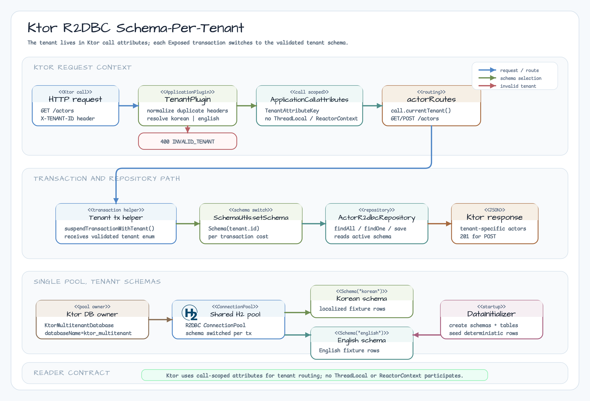

# 07-multitenant-ktor

[Korean](./README.ko.md)

Ktor + Exposed R2DBC schema-per-tenant example for chapter 10. It mirrors the
actor/movie workflow from `03-multitenant-spring-webflux`, but the request
tenant is carried by the shared KtorTenantContext adapter.

## Architecture



## What This Module Shows

| Area | Decision |
|---|---|
| Tenant header | `X-TENANT-ID` with `korean` or `english` |
| Tenant validation | Missing, blank, conflicting duplicate, and unknown values return `400` with `INVALID_TENANT` |
| Request context | `KtorTenantContext` binds one validated `TenantId` to one `ApplicationCall`; no ThreadLocal, no ReactorContext |
| DB isolation | One H2 R2DBC pool, one schema per tenant |
| Transaction boundary | `suspendTransactionWithTenant(tenant, db)` sets schema at transaction start |

`X-TENANT-ID` is a routing signal for the workshop only. It is not
authentication or authorization. Production systems should bind tenant routing
to an authenticated principal or signed tenant claim before using a tenant
header.

## Endpoints

| Method | Path | Description |
|---|---|---|
| `GET` | `/actors` | List actors in the current tenant schema |
| `GET` | `/actors/{id}` | Read one actor from the current tenant schema |
| `POST` | `/actors` | Insert an actor into the current tenant schema |

## Run Tests

```bash
repo-test-summary -- ./gradlew :07-multitenant-ktor:test -PuseDB=H2 --continue --console=plain
```

The tests cover tenant success paths, structured `400` errors, duplicate header
handling, write isolation, rapid tenant alternation on a pool of size `1`, and
overlapping Ktor requests.

## Notes

TenantPlugin owns header validation and the local korean/english registry. After
validation it calls `KtorTenantContext.bindTenant(call, TenantId(tenant.id))`.
Routes read `KtorTenantContext.requireCurrent(call)` through the local
`currentTenant()` mapping before selecting the tenant schema.

The adapter is deliberately one-call/one-tenant. A second bind does not overwrite
the first value; it raises `TenantAlreadyBoundException`. The deterministic fixture
therefore treats nested success as re-observing the outer tenant, and nested failure
as a rejected duplicate bind. Dispatcher hops, overlapping calls, and the existing
HTTP/header tests remain covered.

This module intentionally keeps a local tenant transaction helper instead of
sharing the WebFlux helper. The two examples remain parallel workshop modules,
while both consume their shared tenant carrier adapters.

Schema-per-tenant routing issues `SET SCHEMA` inside each transaction. That is
simple and visible for learning, but it has a per-transaction cost and depends
on correct connection-state reset. For pool-level routing, continue with the
chapter 11 routing datasource example tracked by #35.
