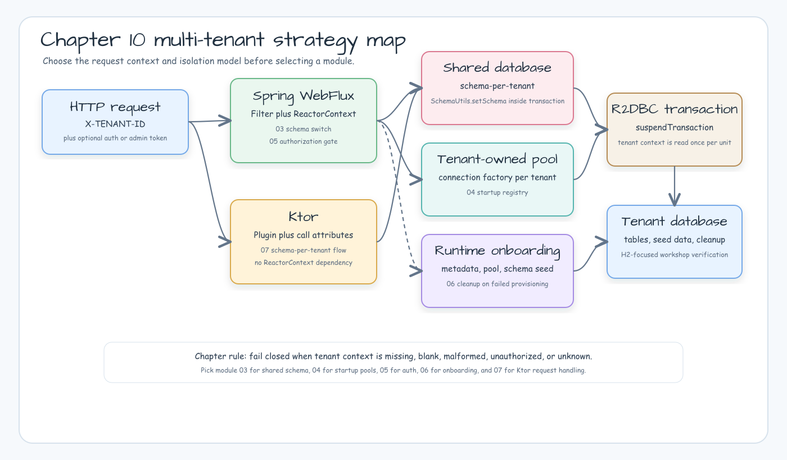

# Chapter 10 Multi-Tenant WebFlux Examples

[한국어](./README.ko.md)

Chapter 10 compares Spring WebFlux + Exposed R2DBC tenant routing strategies.
Start here when choosing whether tenant isolation should be a schema switch, a
tenant-owned R2DBC pool, an authorization gate, or a runtime onboarding flow.

## Architecture Diagram



Use this chapter-level diagram before opening an individual module README. It
shows whether a request should route through Spring WebFlux filters, Ktor call
attributes, a shared schema switch, a tenant-owned pool, authorization, or
runtime onboarding.

## Strategy Map

| Module | Choose when | Isolation model | Verification |
|---|---|---|---|
| [`03-multitenant-spring-webflux`](./03-multitenant-spring-webflux/README.md) | Tenants share one database and each request switches schema in the Exposed transaction | One R2DBC database, schema per tenant | H2 and PostgreSQL-capable tests; covered by CI and Nightly |
| [`04-connection-factory-per-tenant-spring-webflux`](./04-connection-factory-per-tenant-spring-webflux/README.md) | Tenants are known at startup and each tenant should own a separate pool | R2DBC URL and pool per tenant | H2-focused tests; covered by `Examples.yml`, with project-wide CI assertions gated to H2 |
| [`05-spring-security-tenant-authorization-spring-webflux`](./05-spring-security-tenant-authorization-spring-webflux/README.md) | Requests must prove the authenticated tenant matches `X-TENANT-ID` before routing | Authorization before tenant routing | H2-focused security/error tests; covered by `Examples.yml`, with project-wide CI assertions gated to H2 |
| [`06-tenant-onboarding-spring-webflux`](./06-tenant-onboarding-spring-webflux/README.md) | Tenants are created at runtime and need metadata reservation, pool provisioning, schema seed, and cleanup | Runtime tenant registry plus tenant-owned pool | H2-focused onboarding/failure tests; covered by `Examples.yml`, with project-wide CI assertions gated to H2 |
| [`07-multitenant-ktor`](./07-multitenant-ktor/README.md) | You want the same schema-per-tenant request flow in Ktor without ReactorContext or Spring filters | One R2DBC database, schema per tenant, Ktor call attributes | H2-focused Ktor request tests; covered by `Examples.yml` |

## Request Contracts

All request-routed examples fail closed when `X-TENANT-ID` is missing, blank,
malformed, or unknown. Module `05` adds authentication/authorization before the
tenant context is written. Module `06` adds an admin onboarding API guarded by
`X-ADMIN-TOKEN`. Module `07` keeps `X-TENANT-ID` as an unauthenticated workshop
routing signal and documents that production systems must bind tenant routing to
identity.

## Verification

Run the chapter 10 examples locally:

```bash
repo-test-summary -- ./gradlew \
  :03-multitenant-spring-webflux:test \
  :04-connection-factory-per-tenant-spring-webflux:test \
  :05-spring-security-tenant-authorization-spring-webflux:test \
  :06-tenant-onboarding-spring-webflux:test \
  :07-multitenant-ktor:test \
  -PuseDB=H2 \
  --continue \
  --console=plain
```

`Examples.yml` runs the same chapter 10 set on pull requests and pushes that
touch these modules. Nightly's H2 full shard also runs every module. The non-H2
PostgreSQL/MySQL Nightly shards intentionally keep only
`03-multitenant-spring-webflux`; the MariaDB smoke shard does not run chapter 10.
Modules `04`, `05`, `06`, and `07` are H2 workshop strategies with no
PostgreSQL/MySQL/MariaDB tenant database surface yet.

When running from the repository root, use the unique Gradle project names below:

```bash
./gradlew :03-multitenant-spring-webflux:test
./gradlew :04-connection-factory-per-tenant-spring-webflux:test
./gradlew :05-spring-security-tenant-authorization-spring-webflux:test
./gradlew :06-tenant-onboarding-spring-webflux:test
./gradlew :07-multitenant-ktor:test
```
