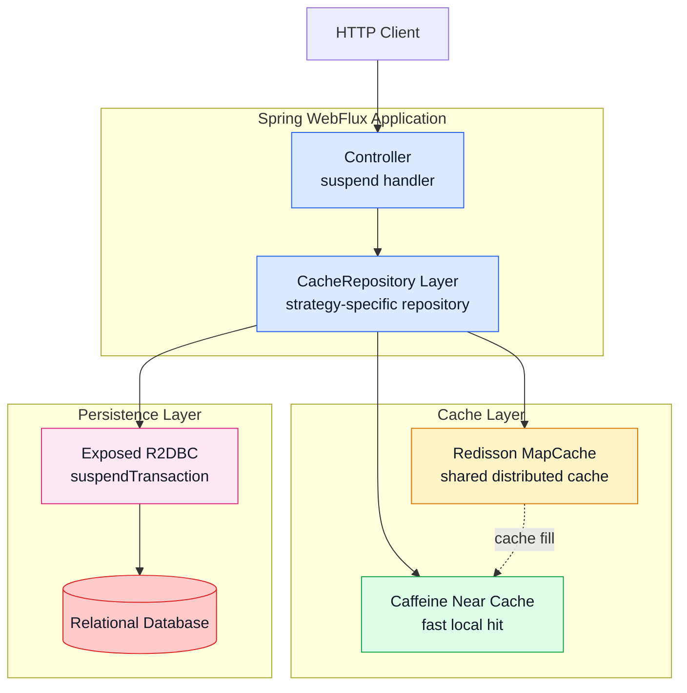
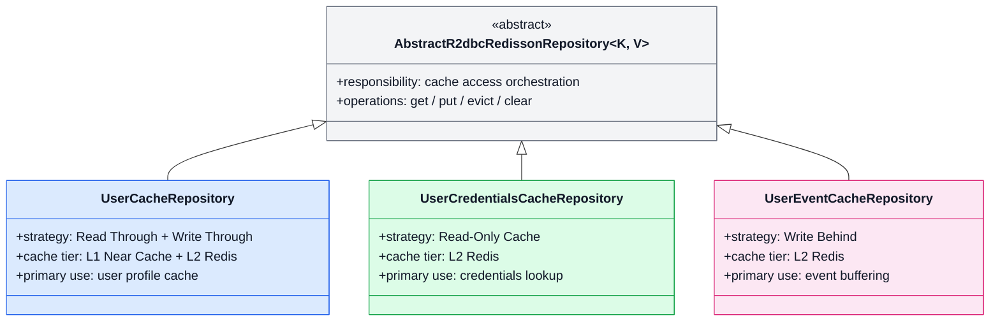

# 캐시 전략 - Coroutines (Caching Strategies for Coroutines)

Redisson + Exposed 를 활용한 캐시 전략의 **Kotlin Coroutines 기반 비동기 버전**입니다.
`01-cache-strategies` 모듈과 동일한 캐시 전략(Read Through, Write Through, Write Behind)을 구현하되, Spring WebFlux + Netty + Coroutines 환경에서
**Non-Blocking I/O** 로 동작합니다.

## 01-cache-strategies 와의 차이점

| 항목             | 01-cache-strategies                  | 02-cache-strategies-r2dbc            |
|----------------|--------------------------------------|-------------------------------------------|
| Web Framework  | Spring MVC (Tomcat + Virtual Thread) | Spring WebFlux (Netty)                    |
| 비동기 모델         | Virtual Thread (블로킹 허용)              | Kotlin Coroutines (`suspend` 함수)          |
| Repository     | `AbstractExposedCacheRepository`     | `AbstractSuspendedExposedCacheRepository` |
| Controller     | 일반 함수 + `transaction {}`             | `suspend` 함수 (트랜잭션 자동 관리)                 |
| 동시성 모델         | Thread-per-request (Virtual Thread)  | Event Loop (Netty) + Coroutine Dispatcher |
| Application 타입 | `WebApplicationType.SERVLET`         | `WebApplicationType.REACTIVE`             |

## 기술 스택

| 구분         | 기술                                            |
|------------|-----------------------------------------------|
| Framework  | Spring Boot (WebFlux) + Netty                 |
| ORM        | Exposed (DAO + DSL)                           |
| Async      | Kotlin Coroutines + Reactor                   |
| Cache      | Redisson (`MapCache`, Near Cache 포함)          |
| Serializer | Fory / Kryo5                                  |
| Compressor | LZ4 / Snappy / Zstd                           |
| Near Cache | Caffeine                                      |
| DB         | H2 (기본) / MySQL / PostgreSQL (Testcontainers) |
| Test       | JUnit 5, Kluent, Awaitility, Reactor Test     |

## 아키텍처 개요

이 모듈은 Spring WebFlux + Coroutines 환경에서 `CacheRepository`를 중심으로 Caffeine Near Cache, Redisson MapCache, Exposed R2DBC, 관계형 데이터베이스를 연결합니다. 읽기 요청은 L1/L2 캐시를 우선 사용하고, 쓰기 요청은 Repository 전략에 따라 DB 반영 방식이 달라집니다.



아키텍처 관점에서는 `CacheRepository`가 WebFlux 요청 처리와 캐시 계층, R2DBC 트랜잭션을 연결하는 허브 역할을 합니다. 따라서 README에서는 각 Repository의 전략 차이와 읽기 경로를 먼저 파악할 수 있도록 다이어그램을 재구성했습니다.

## CacheRepository 구조



세 Repository는 공통 캐시 접근 기반 클래스를 공유하지만, 적용하는 캐시 전략과 책임은 다릅니다. `UserCacheRepository`는 읽기/쓰기 경로 최적화, `UserCredentialsCacheRepository`는 읽기 전용 조회, `UserEventCacheRepository`는 비동기 적재에 초점을 둡니다.

## 프로젝트 구조

```
src/main/kotlin/exposed/examples/cache/
├── CacheStrategyApplication.kt          # WebFlux Reactive 애플리케이션
├── config/
│   ├── ExposedConfig.kt                 # Exposed Database 설정
│   ├── RedissonConfig.kt                # Redisson 클라이언트 설정
│   └── NettyConfig.kt                   # Netty Event Loop / Connection Pool 설정
├── controller/
│   ├── IndexController.kt               # 헬스체크 등 기본 엔드포인트
│   ├── UserController.kt                # User CRUD - suspend 함수 (Read/Write Through)
│   ├── UserCredentialsController.kt     # UserCredentials 조회 - suspend 함수 (Read-Only)
│   └── UserEventController.kt           # UserEvent 저장 - suspend 함수 (Write Behind)
├── domain/
│   ├── model/
│   │   ├── User.kt                      # UserTable, UserEntity, UserRecord
│   │   ├── UserCredentials.kt           # UserCredentialsTable, UserCredentialsRecord
│   │   └── UserEvent.kt                 # UserEventTable, UserEventRecord
│   └── repository/
│       ├── UserCacheRepository.kt               # Suspended Read/Write Through 캐시 저장소
│       ├── UserCredentialsCacheRepository.kt     # Suspended Read-Only 캐시 저장소
│       └── UserEventCacheRepository.kt           # Suspended Write Behind 캐시 저장소
└── utils/
    └── DataFakers.kt                    # 테스트 데이터 생성 유틸
```

## 캐시 전략 (01-cache-strategies 와 동일)

### Read Through

캐시 미스 시 DB에서 조회 후 캐시에 적재합니다. `UserCacheRepository`, `UserCredentialsCacheRepository`에서 사용합니다.

### Write Through

캐시에 저장하면 즉시 DB에도 동기 반영합니다. `UserCacheRepository`의 `put()` 호출 시 적용됩니다.

### Write Behind

캐시에 즉시 저장 후 DB에는 비동기 배치로 반영합니다. `UserEventCacheRepository`에서 대량 이벤트 처리에 사용합니다.

### Read-Only Cache

DB 데이터를 읽기 전용으로 캐시합니다. `UserCredentialsCacheRepository`에서 인증 정보 캐시에 사용합니다.

## 캐시 조회 흐름

```mermaid
flowchart LR
    REQ[get(key)] --> L1CHK{Near Cache<br/>HIT?}
    L1CHK -->|HIT| L1HIT[L1 return]
    L1CHK -->|MISS| L2CHK{Redis Cache<br/>HIT?}
    L2CHK -->|HIT| L2HIT[Redis return<br/>+ warm L1]
    L2CHK -->|MISS| DBREAD[Load<br/>suspendTransaction]
    DBREAD --> L2FILL[Store TTL]
    L2FILL --> L2HIT
    L2HIT --> RESP[Return]
    L1HIT --> RESP

    style REQ fill:#E0F2FE,stroke:#0284C7,color:#111827
    style L1CHK fill:#DBEAFE,stroke:#2563EB,color:#111827
    style L1HIT fill:#DBEAFE,stroke:#2563EB,color:#111827
    style L2CHK fill:#FEF3C7,stroke:#D97706,color:#111827
    style L2HIT fill:#FEF3C7,stroke:#D97706,color:#111827
    style L2FILL fill:#FEF3C7,stroke:#D97706,color:#111827
    style DBREAD fill:#FECACA,stroke:#DC2626,color:#111827
    style RESP fill:#DCFCE7,stroke:#16A34A,color:#111827
```

읽기 요청은 항상 L1 Near Cache를 먼저 확인하고, 미스 시 L2 Redis, 그 다음 DB로 내려갑니다. DB에서 적재된 값은 Redis에 TTL과 함께 저장되고, 응답 전에 Near Cache도 함께 warm-up 됩니다.

## Coroutines 기반 캐시 Repository

### AbstractSuspendedExposedCacheRepository

`01-cache-strategies`의 `AbstractExposedCacheRepository`와 달리 모든 캐시 조회/저장 메서드가
`suspend` 함수로 제공됩니다. 이를 통해 Redis I/O와 DB I/O를 **Coroutine Dispatcher** 위에서 비동기적으로 처리합니다.

```kotlin
// Blocking 버전 (01-cache-strategies)
fun get(id: Long): UserRecord? = transaction { repository.get(id) }

// Coroutines 버전 (02-cache-strategies-r2dbc)
suspend fun get(id: Long): UserRecord? = repository.get(id)  // suspend, transaction 블록 불필요
```

### Controller 차이점

```kotlin
// Blocking Controller (01-cache-strategies)
@GetMapping("/{id}")
fun get(@PathVariable id: Long): UserRecord? {
    return transaction { repository.get(id) }
}

// Coroutines Controller (02-cache-strategies-r2dbc)
@GetMapping("/{id}")
suspend fun get(@PathVariable id: Long): UserRecord? {
    return repository.get(id)
}
```

## REST API 엔드포인트

`01-cache-strategies`와 동일한 엔드포인트를 제공하며, 모든 핸들러가 `suspend` 함수입니다.

### UserController (`/users`) - Read/Write Through

| Method   | Path                     | 설명                        |
|----------|--------------------------|---------------------------|
| `GET`    | `/users`                 | 전체 사용자 조회 (limit 지원)      |
| `GET`    | `/users/{id}`            | 단일 사용자 조회 (Read Through)  |
| `GET`    | `/users/all?ids=1,2,3`   | 복수 사용자 일괄 조회              |
| `POST`   | `/users`                 | 사용자 저장/수정 (Write Through) |
| `DELETE` | `/users/invalidate?ids=` | 지정 ID 캐시 무효화              |
| `DELETE` | `/users/invalidate/all`  | 전체 캐시 무효화                 |

### UserCredentialsController (`/user-credentials`) - Read-Only

| Method   | Path                                            | 설명                                |
|----------|-------------------------------------------------|-----------------------------------|
| `GET`    | `/user-credentials/{id}`                        | 단일 사용자 인증 정보 조회 (Read-Only Cache) |
| `DELETE` | `/user-credentials/invalidate?ids=`             | 지정 ID 캐시 무효화                      |
| `DELETE` | `/user-credentials/invalidate/all`              | 전체 캐시 무효화                         |
| `DELETE` | `/user-credentials/invalidate/pattern?pattern=` | 패턴 매칭 캐시 무효화                      |

### UserEventController (`/user-events`) - Write Behind

| Method | Path                | 설명                       |
|--------|---------------------|--------------------------|
| `POST` | `/user-events`      | 단일 이벤트 저장 (Write Behind) |
| `POST` | `/user-events/bulk` | 대량 이벤트 일괄 저장             |

## Netty 설정

WebFlux 환경에서 Netty의 Event Loop 및 Connection Pool을 세밀하게 튜닝합니다.

```kotlin
class NettyConfig {
    // Event Loop 스레드 수: CPU 코어 * 8 (최소 64)
    // 최대 연결 수: 8,000
    // 최대 유휴 시간: 30초
    // SO_BACKLOG: 8,000
    // Read/Write Timeout: 10초
}
```

| 설정 항목              | 값                   | 설명           |
|--------------------|---------------------|--------------|
| `SO_KEEPALIVE`     | `true`              | TCP 연결 유지    |
| `SO_BACKLOG`       | `8,000`             | 대기 연결 큐 크기   |
| `maxConnections`   | `8,000`             | 최대 동시 연결 수   |
| `maxIdleTime`      | `30s`               | 유휴 연결 해제 시간  |
| Event Loop 스레드     | `CPU * 8` (최소 `64`) | I/O 처리 스레드 수 |
| Read/Write Timeout | `10s`               | 요청/응답 타임아웃   |

## 캐시 전략 비교

### 전략별 동작 흐름

```
[Read Through]
Controller → Repository.get(id)
                │
                ├─ Cache HIT  → Redis에서 즉시 반환 (DB 호출 없음)
                │
                └─ Cache MISS → DB 조회 → Redis 저장 → 반환
                                  (AbstractR2dbcRedissonRepository 자동 처리)

[Write Through]
Controller → Repository.put(entity)
                │
                ├─ Redis 저장 (즉시)
                └─ DB 저장    (즉시 동기 반영)
                   → 쓰기 지연(write lag) 없음, 일관성 보장

[Write Behind]
Controller → Repository.put(entity)
                │
                ├─ Redis 저장 (즉시)
                └─ DB 저장    (비동기 배치, 수 초~수 분 후)
                   → 쓰기 성능 극대화, 대량 이벤트 처리에 적합
                   ⚠ 앱 크래시 시 미반영 데이터 유실 가능

[Read-Only Cache]
Controller → Repository.get(id)
                │
                ├─ Cache HIT  → Redis 반환
                └─ Cache MISS → DB 조회 → Redis 저장 → 반환
                   쓰기 연산 없음 (인증 정보, 코드 테이블 등 불변 데이터에 적합)
```

### 전략 선택 기준

| 캐시 전략         | 구현 Repository                   | 적합한 데이터 유형              | 일관성 | 쓰기 성능 |
|-----------------|-----------------------------------|-----------------------------|--------|---------|
| Read Through    | `UserCacheRepository`             | 자주 읽히는 사용자 프로필         | 높음   | 중간    |
| Write Through   | `UserCacheRepository`             | 읽기/쓰기 균형이 필요한 마스터 데이터 | 높음   | 낮음    |
| Write Behind    | `UserEventCacheRepository`        | 대량 로그/이벤트, 분석 데이터      | 낮음   | 높음    |
| Read-Only Cache | `UserCredentialsCacheRepository`  | 인증 정보, 코드 테이블 (불변)      | 높음   | N/A    |

### Near Cache 효과

`READ_WRITE_THROUGH_WITH_NEAR_CACHE` 설정을 사용하면 애플리케이션 내부에 Caffeine 로컬 캐시가 활성화됩니다.

```
[Near Cache 적용 시 조회 경로]
Application Memory (Caffeine)  ← 1st 조회 (나노초 단위)
        │
        └─ MISS → Redis MapCache          ← 2nd 조회 (마이크로초 단위)
                        │
                        └─ MISS → DB (Exposed R2DBC)  ← 3rd 조회 (밀리초 단위)
```

동일 프로세스 내에서 반복 조회 시 Redis 라운드트립 없이 응답하여 **P99 레이턴시를 크게 낮출 수 있습니다**.

## 테스트

```bash
# 전체 테스트 실행
./gradlew :02-cache-strategies-r2dbc:test
```

### 주요 테스트 시나리오

- **Suspended Read Through**: `suspend` 함수로 DB 데이터를 캐시에서 읽어오는 검증
- **Suspended Write Through**: 코루틴 환경에서 캐시 저장 시 DB 동기 반영 검증
- **Suspended Write Behind**: 대량 이벤트의 비동기 DB 반영 검증
- **WebFlux 통합 테스트**: `WebTestClient`를 활용한 Reactive 엔드포인트 테스트

## Kotlin Benchmark

이 모듈은 `kotlinx-benchmark` 기반의 JVM 벤치마크를 실행할 수 있습니다. 벤치마크는 Spring 컨텍스트를 `h2` 프로파일로 기동한 뒤,
Redis + Exposed R2DBC 환경에서 다음 대표 시나리오를 측정합니다.

- `userCacheHitReadThrough`: Near Cache/Redis 적중 조회
- `userCacheMissReadThrough`: 캐시 무효화 후 DB 재적재 조회
- `userCredentialsCacheHitReadOnly`: Read-Only 캐시 적중 조회

### 실행 명령

```bash
# 빠른 smoke 프로파일 실행 + Markdown 저장
./gradlew :02-cache-strategies-r2dbc:kotlinBenchmarkMarkdown

# 전체 main 프로파일 실행 + Markdown 저장
./gradlew :02-cache-strategies-r2dbc:saveMainBenchmarkMarkdown
```

### 생성 결과

- JSON 원본: `build/reports/benchmarks/<profile>/<run-id>/*.json`
- Markdown 요약: `build/reports/benchmarks/<profile>/benchmark-summary.md`

Markdown 리포트는 benchmark 이름, mode, score, error, unit, parameter 정보를 표 형식으로 저장합니다.

## 언제 어떤 모듈을 선택해야 하나?

| 상황                               | 추천 모듈                                   |
|----------------------------------|-----------------------------------------|
| 기존 Spring MVC 프로젝트에 캐시 도입        | exposed-workshop의 `01-cache-strategies` |
| WebFlux / Reactive 스택을 사용하는 프로젝트 | `02-cache-strategies-r2dbc`             |
| Java 21+ Virtual Thread 활용 가능    | exposed-workshop의 `01-cache-strategies` |
| 높은 동시 연결 수 + 낮은 메모리 사용           | `02-cache-strategies-r2dbc`             |

## 참고

- [Cache Strategies with Redisson, Exposed](https://speakerdeck.com/debop/cache-strategies-with-redisson-and-exposed)
- [캐시 전략들 by Perplexity](https://www.perplexity.ai/search/kaesi-jeonryagdeulyi-teugjinge-JAF35te5SnWTUBsQg5JGSg)
- [Caching patterns](https://docs.aws.amazon.com/whitepapers/latest/database-caching-strategies-using-redis/caching-patterns.html)
- [A Hitchhiker's Guide to Caching](https://hazelcast.com/blog/a-hitchhikers-guide-to-caching-patterns/)
- [Understanding Cache Strategies](https://www.linkedin.com/pulse/decoding-cache-chronicles-understanding-strategies-aside-gopal-kb9kf/)
