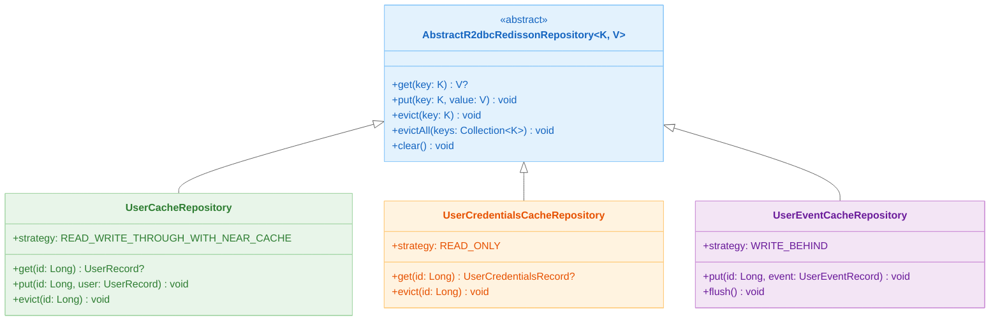
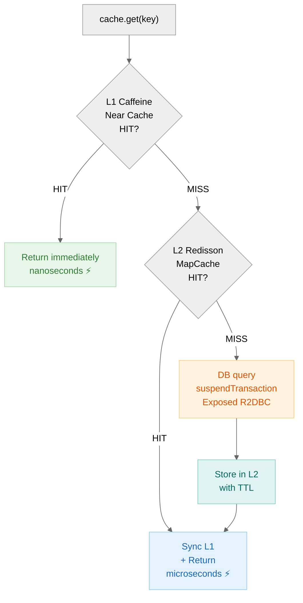
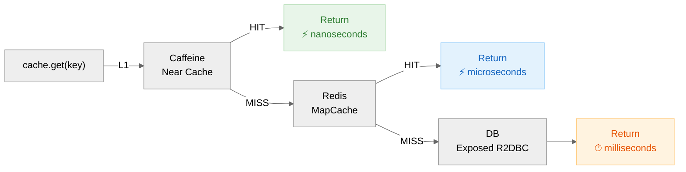

> 한국어 버전: [README.ko.md](README.ko.md)

# Cache Strategies - Coroutines (Caching Strategies for Coroutines)

This is the **Kotlin Coroutines-based asynchronous version** of the cache strategies using Redisson + Exposed.
It implements the same cache strategies (Read Through, Write Through, Write Behind) as the `01-cache-strategies` module,
but operates with **Non-Blocking I/O** in a Spring WebFlux + Netty + Coroutines environment.

## Differences from 01-cache-strategies

| Item             | 01-cache-strategies                  | 02-cache-strategies-coroutines            |
|----------------|--------------------------------------|-------------------------------------------|
| Web Framework  | Spring MVC (Tomcat + Virtual Thread) | Spring WebFlux (Netty)                    |
| Async Model    | Virtual Thread (blocking allowed)    | Kotlin Coroutines (`suspend` functions)   |
| Repository     | `AbstractExposedCacheRepository`     | `AbstractSuspendedExposedCacheRepository` |
| Controller     | Regular functions + `transaction {}` | `suspend` functions (auto transaction management) |
| Concurrency    | Thread-per-request (Virtual Thread)  | Event Loop (Netty) + Coroutine Dispatcher |
| Application Type | `WebApplicationType.SERVLET`       | `WebApplicationType.REACTIVE`             |

## Technology Stack

| Category   | Technology                                      |
|------------|-----------------------------------------------|
| Framework  | Spring Boot (WebFlux) + Netty                 |
| ORM        | Exposed (DAO + DSL)                           |
| Async      | Kotlin Coroutines + Reactor                   |
| Cache      | Redisson (`MapCache`, including Near Cache)   |
| Serializer | Fory / Kryo5                                  |
| Compressor | LZ4 / Snappy / Zstd                           |
| Near Cache | Caffeine                                      |
| DB         | H2 (default) / MySQL / PostgreSQL (Testcontainers) |
| Test       | JUnit 5, Kluent, Awaitility, Reactor Test     |

## Structure Diagram



> `UserCacheRepository`: Near Cache (Caffeine) + Redis (MapCache)
> `UserCredentialsCacheRepository`: Read-only cache (credentials, code tables)
> `UserEventCacheRepository`: Async batch writes (events, logs)

## Cache Lookup Flow



## Project Structure

```
src/main/kotlin/exposed/r2dbc/examples/cache/
├── CacheStrategyApplication.kt          # WebFlux Reactive application
├── config/
│   ├── ExposedR2dbcConfig.kt            # Exposed R2DBC Database configuration
│   ├── RedissonConfig.kt                # Redisson client configuration
│   ├── NettyConfig.kt                   # Netty Event Loop / Connection Pool configuration
│   └── SwaggerConfig.kt                 # Swagger/OpenAPI configuration
├── controller/
│   ├── IndexController.kt               # Health check and basic endpoints
│   ├── UserController.kt                # User CRUD - suspend functions (Read/Write Through)
│   ├── UserCredentialsController.kt     # UserCredentials retrieval - suspend functions (Read-Only)
│   └── UserEventController.kt           # UserEvent storage - suspend functions (Write Behind)
├── domain/
│   ├── model/
│   │   ├── User.kt                      # UserTable, UserEntity, UserRecord
│   │   ├── UserCredentials.kt           # UserCredentialsTable, UserCredentialsRecord
│   │   └── UserEvent.kt                 # UserEventTable, UserEventRecord
│   └── repository/
│       ├── UserCacheRepository.kt               # Read/Write Through + Near Cache repository
│       ├── UserCredentialsCacheRepository.kt     # Read-Only cache repository
│       └── UserEventCacheRepository.kt           # Write Behind cache repository
└── utils/
    ├── DataFakers.kt                    # Test data generation utility
    └── DataInitializer.kt               # DB table initialization on application startup
```

## Coroutines-based Cache Repository

### AbstractR2dbcRedissonRepository

Unlike `AbstractExposedCacheRepository` in `01-cache-strategies`, this module uses `AbstractR2dbcRedissonRepository`
which provides all cache read/write operations as `suspend` functions. This allows Redis I/O and DB I/O to be processed asynchronously on a **Coroutine Dispatcher**.

```kotlin
// Blocking version (01-cache-strategies)
fun get(id: Long): UserRecord? = transaction { repository.get(id) }

// Coroutines version (02-cache-strategies-coroutines)
suspend fun get(id: Long): UserRecord? = repository.get(id)  // suspend, no transaction block needed
```

### Controller Differences

```kotlin
// Blocking Controller (01-cache-strategies)
@GetMapping("/{id}")
fun get(@PathVariable id: Long): UserRecord? {
    return transaction { repository.get(id) }
}

// Coroutines Controller (02-cache-strategies-coroutines)
@GetMapping("/{id}")
suspend fun get(@PathVariable id: Long): UserRecord? {
    return repository.get(id)
}
```

## Netty Configuration

Fine-tune Netty's Event Loop and Connection Pool in the WebFlux environment.

```kotlin
@Configuration(proxyBeanMethods = false)
class NettyConfig {
    @Bean
    fun nettyReactiveWebServerFactory(): NettyReactiveWebServerFactory =
        NettyReactiveWebServerFactory().apply {
            addServerCustomizers(EventLoopNettyCustomizer())
        }

    @Bean
    fun reactorResourceFactory(): ReactorResourceFactory =
        ReactorResourceFactory().apply {
            isUseGlobalResources = false
            connectionProvider = ConnectionProvider.builder("http")
                .maxConnections(8_000)
                .maxIdleTime(30.seconds.toJavaDuration())
                .build()
            loopResources = LoopResources.create(
                "event-loop",
                maxOf(Runtimex.availableProcessors * 8, 64),
                true
            )
        }

    class EventLoopNettyCustomizer : NettyServerCustomizer {
        override fun apply(httpServer: HttpServer): HttpServer =
            httpServer
                .option(ChannelOption.SO_KEEPALIVE, true)
                .option(ChannelOption.SO_BACKLOG, 8_000)
                .option(ChannelOption.SO_LINGER, 0)
                .doOnConnection { conn ->
                    conn.addHandlerLast(ReadTimeoutHandler(30))
                    conn.addHandlerLast(WriteTimeoutHandler(30))
                }
    }
}
```

| Setting            | Value                 | Description             |
|--------------------|----------------------|-------------------------|
| `SO_KEEPALIVE`     | `true`               | Keep TCP connections alive |
| `SO_BACKLOG`       | `8,000`              | Pending connection queue size |
| `maxConnections`   | `8,000`              | Maximum concurrent connections |
| `maxIdleTime`      | `30s`                | Idle connection release time |
| Event Loop threads | `CPU * 8` (min `64`) | I/O processing thread count |
| Read/Write Timeout | `30s`                | Request/response timeout |

## Cache Strategies (same as 01-cache-strategies)

### Read Through

On cache miss, fetches from DB and loads into cache. Used by `UserCacheRepository` and `UserCredentialsCacheRepository`.

### Write Through

When stored in cache, synchronously reflects to DB immediately. Applied when `put()` is called on `UserCacheRepository`.

### Write Behind

Stores in cache immediately, then asynchronously writes to DB in batches. Used in `UserEventCacheRepository` for high-volume event processing.

### Read-Only Cache

Caches DB data as read-only. Used in `UserCredentialsCacheRepository` for credential caching.

## REST API Endpoints

Provides the same endpoints as `01-cache-strategies`, with all handlers as `suspend` functions.

### UserController (`/users`) - Read/Write Through

| Method   | Path                     | Description                         |
|----------|--------------------------|-------------------------------------|
| `GET`    | `/users`                 | List all users (limit supported)    |
| `GET`    | `/users/{id}`            | Get single user (Read Through)      |
| `GET`    | `/users/all?ids=1,2,3`   | Batch get multiple users            |
| `POST`   | `/users`                 | Save/update user (Write Through)    |
| `DELETE` | `/users/invalidate?ids=` | Invalidate cache for specified IDs  |
| `DELETE` | `/users/invalidate/all`  | Invalidate all cache                |

### UserCredentialsController (`/user-credentials`) - Read-Only

| Method   | Path                                            | Description                                   |
|----------|-------------------------------------------------|-----------------------------------------------|
| `GET`    | `/user-credentials/{id}`                        | Get single user credentials (Read-Only Cache) |
| `DELETE` | `/user-credentials/invalidate?ids=`             | Invalidate cache for specified IDs            |
| `DELETE` | `/user-credentials/invalidate/all`              | Invalidate all cache                          |
| `DELETE` | `/user-credentials/invalidate/pattern?pattern=` | Invalidate cache by pattern matching          |

### UserEventController (`/user-events`) - Write Behind

| Method | Path                | Description                        |
|--------|---------------------|------------------------------------|
| `POST` | `/user-events`      | Store single event (Write Behind)  |
| `POST` | `/user-events/bulk` | Batch store multiple events        |

## Testing

```bash
# Run all tests
./gradlew :02-cache-strategies-r2dbc:test
```

### Key Test Scenarios

- **Suspended Read Through**: Verify reading DB data from cache via `suspend` functions
- **Suspended Write Through**: Verify synchronous DB reflection on cache save in coroutine environment
- **Suspended Write Behind**: Verify asynchronous DB reflection of bulk events
- **WebFlux Integration Test**: Test reactive endpoints using `WebTestClient`

## Kotlin Benchmark

This module can run JVM benchmarks based on `kotlinx-benchmark`. Benchmarks start the Spring context with the `h2` profile and measure the following representative scenarios in a Redis + Exposed R2DBC environment.

- `userCacheHitReadThrough`: Near Cache/Redis hit lookup
- `userCacheMissReadThrough`: DB reload after cache invalidation
- `userCredentialsCacheHitReadOnly`: Read-Only cache hit lookup

### Run Commands

```bash
# Run quick smoke profile + save Markdown
./gradlew :02-cache-strategies-r2dbc:kotlinBenchmarkMarkdown

# Run full main profile + save Markdown
./gradlew :02-cache-strategies-r2dbc:saveMainBenchmarkMarkdown
```

### Generated Output

- JSON source: `build/reports/benchmarks/<profile>/<run-id>/*.json`
- Markdown summary: `build/reports/benchmarks/<profile>/benchmark-summary.md`

The Markdown report stores benchmark name, mode, score, error, unit, and parameter information in table format.

## Cache Strategy Comparison

### Strategy Flow by Type

```mermaid
%%{init: {"theme": "neutral"}}%%
flowchart TD
    subgraph RT["Read Through"]
        RT1["get(id)"] --> RT2{Cache<br/>HIT?}
        RT2 -->|YES| RT3["Return from<br/>Redis"]
        RT2 -->|NO| RT4["Query DB"]
        RT4 --> RT5["Store in Redis"]
        RT5 --> RT6["Return"]
    end

    subgraph WT["Write Through"]
        WT1["put(entity)"] --> WT2["Store in<br/>Redis"]
        WT2 --> WT3["Store in DB<br/>synchronous"]
        WT3 --> WT4["Done"]
    end

    subgraph WB["Write Behind"]
        WB1["put(entity)"] --> WB2["Store in<br/>Redis"]
        WB2 --> WB3["Return<br/>immediately"]
        WB2 -.->|async| WB4["Store in DB<br/>batch"]
    end

    subgraph RO["Read-Only Cache"]
        RO1["get(id)"] --> RO2{Cache<br/>HIT?}
        RO2 -->|YES| RO3["Return from<br/>Redis"]
        RO2 -->|NO| RO4["Query DB"]
        RO4 --> RO5["Store in Redis"]
        RO5 --> RO6["Return"]
    end

    classDef green  fill:#E8F5E9,stroke:#A5D6A7,color:#2E7D32
    classDef blue   fill:#E3F2FD,stroke:#90CAF9,color:#1565C0
    classDef yellow fill:#FFFDE7,stroke:#FFF176,color:#F57F17
    classDef orange fill:#FFF3E0,stroke:#FFCC80,color:#E65100

    class RT3,RT6,RO3,RO6 green
    class WT4 blue
    class WB3 yellow
    class WB4 orange
```



### Strategy Selection Criteria

| Cache Strategy  | Repository                        | Suitable Data Type                     | Consistency | Write Performance |
|-----------------|-----------------------------------|----------------------------------------|-------------|-------------------|
| Read Through    | `UserCacheRepository`             | Frequently-read user profiles          | High        | Medium            |
| Write Through   | `UserCacheRepository`             | Master data requiring read/write balance | High      | Low               |
| Write Behind    | `UserEventCacheRepository`        | Bulk logs/events, analytics data       | Low         | High              |
| Read-Only Cache | `UserCredentialsCacheRepository`  | Credentials, code tables (immutable)   | High        | N/A               |

### Near Cache Effect

Using the `READ_WRITE_THROUGH_WITH_NEAR_CACHE` setting activates a Caffeine local cache inside the application.



Repeated lookups within the same process respond without a Redis round-trip, **significantly reducing P99 latency**.

## Which Module Should You Choose?

| Situation                                    | Recommended Module                          |
|----------------------------------------------|---------------------------------------------|
| Adding cache to an existing Spring MVC project | `01-cache-strategies` in exposed-workshop  |
| Project using WebFlux / Reactive stack       | `02-cache-strategies-r2dbc`                 |
| Java 21+ Virtual Threads available           | `01-cache-strategies` in exposed-workshop   |
| High concurrent connections + low memory usage | `02-cache-strategies-r2dbc`               |

## References

- [Cache Strategies with Redisson, Exposed](https://speakerdeck.com/debop/cache-strategies-with-redisson-and-exposed)
- [Cache Strategies by Perplexity](https://www.perplexity.ai/search/kaesi-jeonryagdeulyi-teugjinge-JAF35te5SnWTUBsQg5JGSg)
- [Caching patterns](https://docs.aws.amazon.com/whitepapers/latest/database-caching-strategies-using-redis/caching-patterns.html)
- [A Hitchhiker's Guide to Caching](https://hazelcast.com/blog/a-hitchhikers-guide-to-caching-patterns/)
- [Understanding Cache Strategies](https://www.linkedin.com/pulse/decoding-cache-chronicles-understanding-strategies-aside-gopal-kb9kf/)
